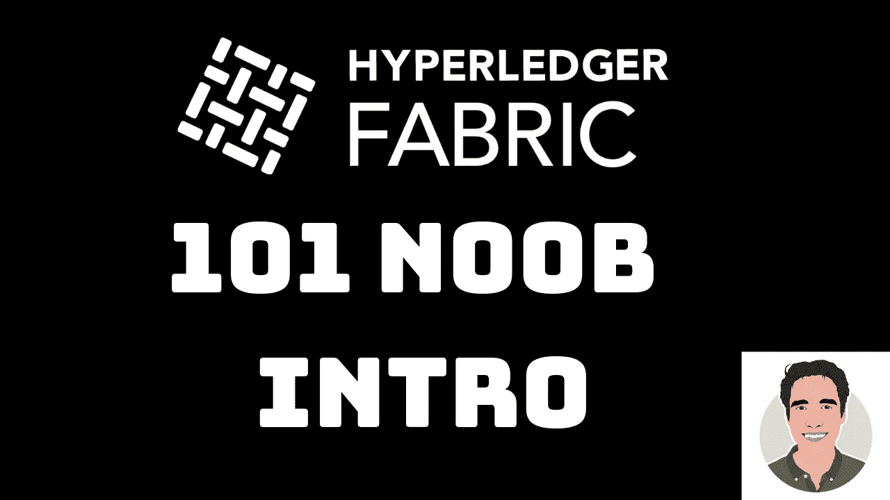

# 101 Noob 简介了解 Hyperledger Fabric 上的智能合约

> 原文：<https://medium.com/hackernoon/a-101-noob-intro-to-understanding-smart-contracts-on-hyperledger-fabric-2103b3821663>

> 如何在 Hyperledger Fabric 平台上开始 dapp(去中心化 app)开发？

这是我每次谈论 Hyperledger Fabric 时都会遇到的问题。因此，这篇文章将作为我对那些过去和将来会问这个问题的人的正式回答⏳。我将概述一下**我最喜欢的材料，这些材料帮助我很好地掌握了 Hyperledger Fabric** 和一般的[区块链](https://hackernoon.com/tagged/blockchain)。我将首先从由[比特币](https://hackernoon.com/tagged/bitcoin)实现的一般区块链概念开始，然后转向更具体的 Hyperledger 阅读材料。**深入了解比特币的工作原理，以及比特币用于安全交易而不重复花费的公钥加密技术，对于理解 Hypereledger 的工作原理至关重要。**

# 区块链 101

☕️+ 📖= understanding ⛓

1.  阅读《区块链圣经——Satoshi 的比特币白皮书:[https://bitcoin.org/bitcoin.pdf](https://bitcoin.org/bitcoin.pdf)
2.  阅读 Andreas M. Antonopoulos 的《掌握比特币》章节 [1](https://github.com/bitcoinbook/bitcoinbook/blob/develop/ch01.asciidoc) 、 [2](https://github.com/bitcoinbook/bitcoinbook/blob/develop/ch02.asciidoc) 、 [4](https://github.com/bitcoinbook/bitcoinbook/blob/develop/ch04.asciidoc) 。你可以在这里免费阅读这本书。第 4 章对理解尤其重要，因为它讲述了公钥加密的基础知识，以及如何应用于加密货币。
3.  阅读[傻瓜区块链](https://www-01.ibm.com/common/ssi/cgi-bin/ssialias?htmlfid=XIM12354USEN)——这是一本很好的入门书，可以帮助你了解加密货币领域之外更多特定行业的区块链用例。
4.  上[区块链精要](https://cognitiveclass.ai/courses/blockchain-course/)课程。这个 2 小时的课程讲述了使用 Hyperledger 为企业开发应用程序时需要理解的主要概念。
5.  参加 B9Lab 的[面向开发人员的 Hyperledger Fabric 简介](https://academy.b9lab.com/courses/course-v1:B9lab+HLF-101+2017-11/info)课程。他们很好地解释了区块链的所有主要概念，并通过代码示例来运行您的第一个智能合同。
6.  参加关于 Cognitive.ai 的[IBM block chain Foundation Developer](https://courses.cognitiveclass.ai/courses/course-v1:IBMDeveloperSkillsNetwork+BC0201EN+v1/info)课程。该课程非常棒，因为它介绍了 Hyperledger Composer，这是一个使用 Hyperledger 构建概念验证应用程序的伟大工具。
7.  在 Hyperledger Fabric 上观看[伊万·万科夫](https://www.youtube.com/channel/UC90Kw63c-FzGulDb_w2GFzw)的 YouTube 系列。他有最好的视频(除了我的😉)在 YouTube 的 Hyperledger Fabric 上。从这个[一个](https://www.youtube.com/watch?v=7EpPrSJtqZU&list=PLjsqymUqgpSRXC9ywNIVUUoGXelQa4olO)开始，然后看完所有的视频，了解一些 Ivan 在这个问题上的渊博知识。请特别注意视频 7(交易的基本工作流程)，因为这是使用 Hyperledger Fabric SDK 编写应用程序时需要了解的内容。

Learn by doing — program applications with Hyperledger Composer and Hyperledger Fabric SDK

# 超级分类帐编辑器

既然我们已经有了阅读材料/课程，让我们开始编写一些应用程序。让我们从 Composer 开始，因为它更容易理解，然后升级到 Hyperledger Fabric SDK，因为我们感觉更舒服。

1.  运行此 intro [代码模式](https://github.com/IBM/BlockchainNetwork-CompositeJourney#1-starting-hyperledger-fabric) —安装必要的 NPM 模块(composer)，运行您的第一个智能合约，并查看从您的 Composer 网络创建的 REST-API。
2.  **(可选)** —转到构建于第一个业务网络之上的更复杂的[代码模式](https://github.com/IBM/BlockchainSmartContractTrading-CompositeJourney)，看看如何在 Hyperledger Composer 上模拟拍卖应用程序。
3.  移动到完整的[网络应用代码模式](https://github.com/IBM/BlockchainEvents-CompositeJourney)。了解如何构建 web-UI，以及如何与 Hyperlegder Composer 后端进行交互，以便用分类帐中的资产和数据填充您的 web 前端。
4.  **(可选)—** [代码模式](https://github.com/IBM/blockchainbean)展示了如何使用 Hyperledger Composer 部署一个运行在 IBM Blockchain 平台上的咖啡零售商的供应网络。**注意**，要部署这个代码模式，你需要有一个 IBM Cloud 账户+ IBM Blockchain Platform Starter 计划。在这里注册一个免费的月试用[。](http://goo.gl/i9WZcH)

# Hyperledger Fabric SDK

现在我们更熟悉 Hyperledger Composer，我们可以更深入地了解 Hyperledger 架构，并直接使用 Hyperledger Fabric。

1.  在本地运行[弹珠演示](https://github.com/IBM-Blockchain/marbles)。这将让您很好地理解 Hyperledger Fabric 架构，尤其是客户端应用程序如何与对等方、订购方和认证机构通信。
2.  通过部署这个模拟区块链汽车拍卖的[代码模式](https://github.com/IBM/car-auction-network-fabric-node-sdk)来学习 Hyperledger Fabric SDK 的基础知识。注意，您需要有一个 IBM Cloud 帐户来运行这个。要获得一个月的免费账户，请在此注册[。](http://goo.gl/i9WZcH)
3.  浏览使用 VSCode + IBM Blockchain extension +最新 Hyperledger Fabric API 部署本地网络的教程[。(此处不需要 IBM Cloud 帐户)。](https://developer.ibm.com/tutorials/ibm-blockchain-platform-vscode-smart-contract/)
4.  **(可选)——**更复杂的[代码模式](https://github.com/IBM/monitoring_ui)，其特点是 IBM Cloud IoT 平台与 IBM Blockchain 平台协同工作来跟踪资产。**注意，你需要一个 IBM Cloud 账户。**

# 额外收获:EVM 智能合同集成到 Hyperledger 结构中

随着开源和互操作性开始主导科技行业，Hyperledger 也紧随其后，发布了接受与 EVM(以太坊虚拟机)兼容的合同的功能。这意味着，如果您使用 Solidity、Viper 或其他用于以太坊开发的语言编写了智能合约，您可以使用 Hyperledger Fabric 重用相同的智能合约。

1.  本[教程](https://github.com/hyperledger/fabric-chaincode-evm/blob/master/examples/EVM_Smart_Contracts.md)展示了如何开始在本地 Hyperledger 结构网络中使用 EVM 智能合约。
2.  这个[代码模式](https://github.com/IBM/loyalty-points-evm-fabric)在前一步的基础上更进一步，构建了一个 web 应用程序，该应用程序在本地运行的本地 Hyperledger 结构网络上安装 EVM 智能合约。

感谢阅读。不要害怕拿着它👏🏼按钮，如果你喜欢这篇文章。请在下面留下您的任何意见或担忧！