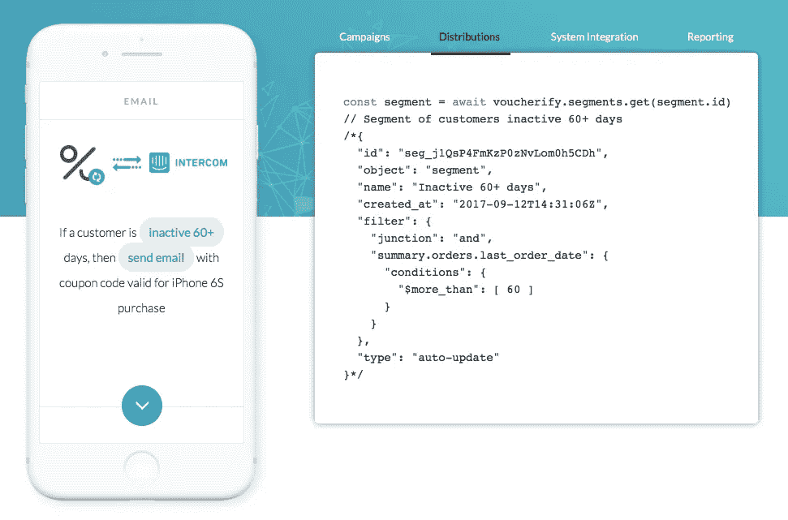

# 现代产品经理的 A/B 测试基础设施

> 原文：<https://medium.com/hackernoon/a-b-testing-infrastructure-for-a-modern-product-manager-53cb7ff94e67>

毫无疑问，A/B 测试是任何产品经理必备的工具。像网飞、T2、Pinterest 和 T3 这样的科技巨头投资了一大笔钱在高度定制化的用户实验平台上。较小的项目最终会集成功能有限但易于部署的 SaaS [工具](https://hackernoon.com/tagged/tools)，如 Optimizely 或 VWO。有中间立场吗？在本笔记中，我想介绍 3 款价格合理的云工具，它们可以在整个客户旅程中支持高级 A/B 测试，从而帮助您构建合适的产品。

# **测试 SEO**

让我们从收购部分开始；成功的在线产品在努力吸引新客户时不能跳过搜索引擎优化。搜索引擎优化监视器、页面优化、雇佣自由撰稿人、反向链接救援邮件活动——一些公司利用大量资源爬上谷歌的第一页阶梯。如果你的公司是这种情况，你应该考虑在你的策略中加入 Rankscience。

Rankscience (RS)是一家早期的初创公司，它希望自动进行有机交通的 A/B 测试。它是如何工作的？第一步和非可选步骤是通过 RS 的 [CDN](https://en.wikipedia.org/wiki/Content_delivery_network) 引导你的流量(他们承诺其标称延迟为快速<25 毫秒)。RS 声称，从技术上讲，对于大多数客户来说，这可能是 2 分钟的变化。有了这个地方，RS 可以推出内容实验，例如，他们可以把你的登陆页面和主机 2 变种，每一个不同的标题。给定时间后，RS 仪表板会显示哪个变体胜出，即在 SERP 中更高。所有这些都是自动完成的。不幸的是，RS 背后的团队没有公布他们可以自动化的实验的数量和类型，也没有公布他们如何决定先运行哪些实验。

*‍RankScience claims an average boost to organic search traffic of 37 percent within three months, arguing such gains are a substantial step up from the competition — albeit it only has “a couple of dozen” customers at this point.* (source [Techcrunch](https://techcrunch.com/2017/02/07/rankscience-wants-to-replace-your-seo-staff/))

# 测试用户体验

假设你已经说服你的访问者进入你的网站。现在，你需要克服同样困难的挑战——入职。对于各种类型的在线业务来说，入职涉及太多不同的事情，但有一点是共同的——一旦你构建了一个用户友好的应用程序，转换的几率就会变得更高。

但是，要实现一流的 UX，没有什么灵丹妙药。作为产品经理，你的工作就是不断迭代，直到找到为止。在软件中，迭代由 3 部分组成:设计、构建、度量。现在，你的任务是尽可能快地运行它。听起来很容易，但是当您想要并行迭代许多特性时，事情会变得非常复杂。这个问题由 launch darylly(LD)承担。

*‍A huge thing for us is risk. LaunchDarkly takes risk off the table* — so says a LaunchDarkly customer

LD 提供了一个 API 优先的平台来运行带有“特性标志”的实验。由于有了 LD，您可以在需要的时候向客户发布特性，减轻开发人员的负担。LD 显示了哪些变体表现更好并带来更好的整体用户体验的指标。最后，当特性/变体完全失败时，你可以通过点击一个按钮来杀死它。

# 测试报价

当你的客户对你直观的用户界面感到满意时，最后一步就是用你的产品说服他们。好处可能是多方面的，但通常一切都归结于成本。您可以做许多事情来改变对成本的看法，这些事情可以通过 Voucherify 进行测试。这是一个 API 优先的平台，可以更快地推出个性化的促销活动。

Voucherify 构建模块为您节省了开发时间和内部资源，并让您的营销团队专注于发展和保留您的客户群。该软件能够针对您的客户群测试多种优惠券、折扣、推荐和忠诚度活动。API 和编程构建块允许您在 CRM 数据的基础上创建高度个性化的激励。接下来，它通过与您的电子邮件、短信、登录页面、推送通知、移动应用程序和其他渠道集成，自动分发促销信息。最后，当促销活动正在进行时，Voucherify 的仪表板会显示其表现以及是否有任何兑换事件。

*‍Has Voucherify helped us to improve our sales performance? Definitely! It’s a little bit dependent on the target group and the product selection but most of the campaigns have a rate of 5% or higher!* — says a Voucherify user

# 摘要

基于 API 的编程平台帮助您在几天内而不是几个月内构建一个高级的 A/B 测试基础设施。实验可以更快地集成到您当前的生态系统中，几乎实时提供结果，并且减少了操作和开发人员的工作量。凭借其低廉的价格和从小处着手的能力，没有理由不为您的产品提供一个强大的实验环境。不过，要确保你考虑的软件供应商已经为企业做好了准备。

*原载于*[*www . voucherify . io*](https://www.voucherify.io/blog/a-b-testing-infrastructure-for-a-modern-product-manager)*。*