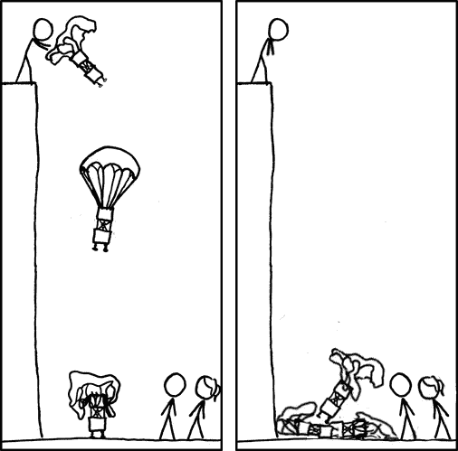
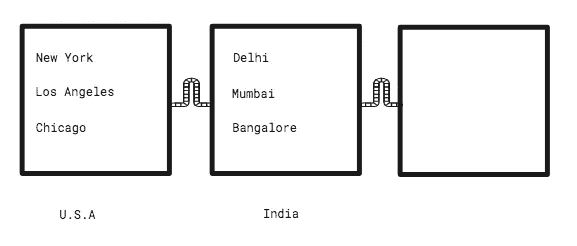
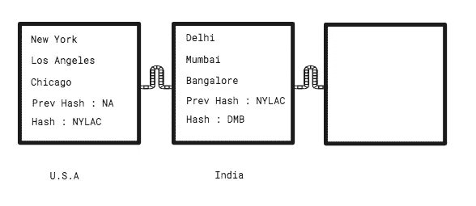
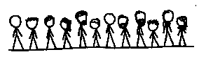
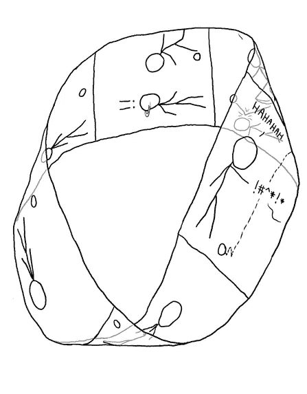

# 区块链初学者指南

> 原文：<https://medium.com/hackernoon/a-beginners-guide-to-blockchain-d04266844e7>


我不明白为什么人们觉得理解[区块链](http://amzn.to/2EtascE)很难。我想知道为什么我自己没有。我第一次听说比特币是在 2013 年(*是的，太晚了*)。我很穷，买不起，所以试着开采。如果我成功了，你就不会读到这篇文章了。后来我想到研究它的底层技术，[区块链](http://amzn.to/2EtascE)。但是，我太忙于我的创业了(*也没有成功*)。



Credits : [xkcd](https://xkcd.com/)

# ***那么这个“区块链”是什么呢？***

有两件事。一块积木和一条链子。在很高的层面上，它只是一个区块链。因为它在计算机内部，我们可以排除物理的东西。在这里，数字信息被分成块并链接在一起。例如，考虑下面的方块，每个方块代表一个国家。每个都包含各自国家的城市名称。



等等，还有别的。这些块中的每一个都有一个哈希。哈希是一组字符(例如“1hi515AHA5H”)。哈希是从块中包含的信息中导出的。美国的街区有城市纽约、洛杉矶和芝加哥。所以散列应该类似于“NYLAC”(*技术上来说不是这样，但是你可以理解*)。



每个后续块都将包含前一个块的哈希。这就是将他们结合在一起的力量。如果有人篡改第一个街区添加城市波士顿。新的散列变成了“NYLACB”。然而，印度的后继块已经将散列存储为“NYLAC”。这种错配会断链。所以散列的目的是确保没有人篡改它。

***如果有人改变了一个块的内容，更新了连续块的 hash 怎么办？*** 这是可能的但是有一件事我没有告诉你。区块链的数据不在一台电脑里。它被复制到网络中每个用户的计算机中。如果你加入一个区块链网络，你的电脑将下载这些块。如果有人篡改了他的版本，网络会考虑大多数人所说的是正确的。

还有一点，在区块链网络中，不仅数据，程序也是被复制的。计算机共同执行程序。大多数互联网应用都是集中式的。以脸书为例，它的数据和程序都在服务器上。你的电脑在需要知道的基础上向脸书的服务器请求信息。在区块链，没有中心的东西。它依靠用户的计算机来托管它的程序。是的，这意味着如果区块链网络中的每一台计算机都关闭，它就死了。

# 公共区块链


Credits : [xkcd](https://xkcd.com/)

***这是否意味着区块链是由一群出于善意让电脑保持运行的人组成的？这些防篡改块有什么用？***

区块链网络具有一种或多种功能。比特币是一种数字货币，也是一种支付系统。它的防篡改模块保存所有交易的分类账。牺牲电脑的人被称为矿工。他们获得比特币奖励。

以太坊还有一个额外的功能。它可以承载您的代码。从零开始开发一个区块链并建立你自己的社区将会非常困难(*还记得人们不得不为你牺牲他们的电脑吗？*)。以太坊负责搬运重物。你需要根据计算成本支付费用。

区块链应用不一定只是支付系统或加密货币。它可以是任何东西，比如一个社交网络，一个学习平台，比如 LiveEdu，等等。

# 二等兵区块链



Credits : [xkcd](https://xkcd.com/)

***比特币、以太坊等都是区块链的例子。任何人都可以成为它的一部分。如果我们想建立一个专用的区块链网络呢？为什么有人需要一个私人区块链？看看这些故事。***

***马克和萨拉***

马克已经五个月没付房租了。当 Sara 提问时，他答应以后再付钱。她很无助。她请不起律师。法院需要八个月到将近一年的时间来执行诉讼。唯一的选择是说服马克。

***乔氏企业***

乔是个商人。他经常和不同的公司做生意。几个月前，他与一家零售商签订了合同。尽管合同的条件已经满足。零售商拒绝付款。这些人利用法律制度，说服乔接受较低的工资。乔以前有过这样的经历。在某些情况下，他会去法院。他在那里花费的时间和金钱损失了他的利润。

我们如何帮助萨拉和乔？

我们在其他地方解决过这个问题吗？就莎拉而言，我们需要让马克每个月付房租。基于时间的触发器。您的日历应用程序使用这样的触发器来通知您预定义的事件。

在 Joe 的案例中，一旦协议条款得到满足，当事人就需要付款。这是一个基于条件的触发器。想想你最后一次从亚马逊购买电子书。亚马逊只有在确认付款后才会发货。

关键是计算机程序始终如一地执行这样的指令。当你点击这篇文章，向下滚动，等等的时候，它就出现了。为了帮助 Sara，我们需要将合同中的协议转换成代码。

***萨拉和马克之间智能契约的伪码***

```
If today’s date is 30th and rent is not paid thenTransfer $500 from Mark’s account to Sara’s account
```

但是我们在哪里部署这些代码呢？它应该部署在所有相关方的计算机上。萨拉和马克的银行将成为私有区块链网络的一部分。乔和莎拉将签署一份加密合同(*又名智能合同*)。然后部署在网络上。马克和莎拉的银行都会有一份副本。在每月 30 日时钟滴答 12.00 时。约定的金额从马克的账户转移到莎拉的账户。乔开始使用智能合同来迫使他的客户支付约定的金额。

> 莎拉很高兴，因为她不必相信马克同意转让租金。乔很高兴，因为他不必去法庭寻求公正。相反，他可以用这些努力来发展他的业务。

私人区块链将仅限于参与业务的各方。乔不会成为萨拉和马克区块链网络的一部分。

# 前进的道路



Credits : [xkcd](https://xkcd.com/)

现在你有了一些想法，你应该在 edX 上上这个[课程(是免费的)。它会教你在区块链上构建 app。](https://www.edx.org/course/blockchain-business-introduction-linuxfoundationx-lfs171x)

我不会把我的内容放在付费墙后面。如果你喜欢我的内容，可以通过 [*请我喝咖啡*](https://www.buymeacoffee.com/febin) *来支持我。*

[](https://www.buymeacoffee.com/febin)

> *关注*[*HackerNoon*](https://hackernoon.com)*和我(*[*Febin John James*](https://medium.com/u/75a616711f4e?source=post_page-----d04266844e7--------------------------------)*)了解更多故事。我正在写一本关于区块链的书。如果您希望获得预发布版本* [*，请在此处注册*](https://goo.gl/forms/jhkzLnsYm3yrLMlD2) *。我还推荐一本书，里面有我写的每一个故事。对于这个故事，它是* [区块链革命:比特币背后的技术如何改变货币、商业和世界。](http://amzn.to/2EtascE) *读书无价。(如果没有时间阅读 check out*[*Mentorbox*](https://mentorbox.com/partners?affiliate_id=898086)*)。*

我可以通过电子邮件回复您的比特币/区块链查询。让我们从 [***谈起***](mailto:febinjohnjames@gmail.com) ***。***