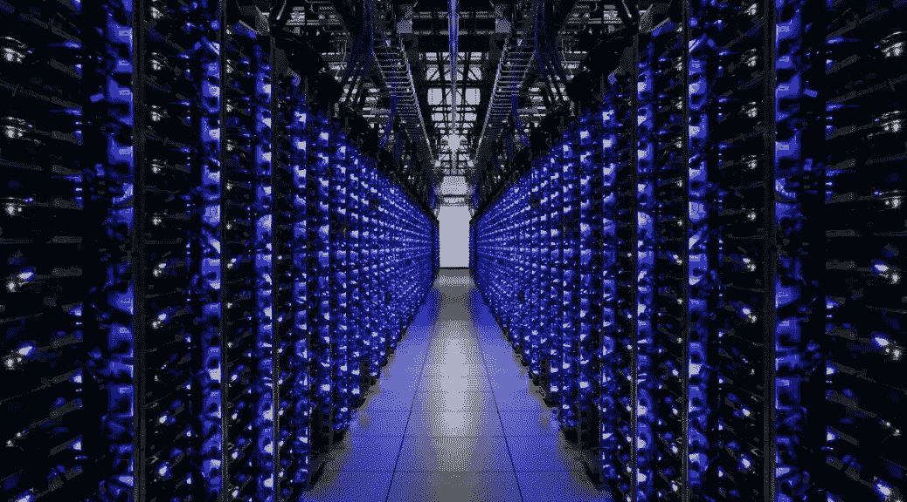

# 加密货币挖掘初学者指南

> 原文：<https://medium.com/hackernoon/a-beginners-guide-to-cryptocurrency-mining-fee20b18e36c>

在一个充满智能设备、智能车辆、机器人等不同现代技术的世界里。我们正面临着现代技术趋势的在线集资和加密货币提供的区块链项目。在过去的几年里，关于加密货币的讨论很多，如 ***比特币或以太坊、ICO、区块链、众筹等。***

**但是，什么是加密货币？这是一种数字货币，旨在实现在线购买和转账。加密货币允许用户在没有银行、政府或另一方的情况下进行支付，这些支付是安全的。**

这一趋势正在彻底改变我们生活的世界。几乎没有人没听说过比特币。当**中本聪**在 2009 年创立**比特币**时，科技世界的一个新领域就此诞生。今天，我们正在关注最大和最受欢迎的点对点去中心化网络和数字资产软件平台，称为**区块链**。区块链使得比特币这样的加密货币能够在不需要第三方的情况下在线交易。这是每一笔特定加密货币交易的公开记录。这些事务被创建成所谓的“**块**”。

看起来，加密货币在技术领域一直在快速增长，买卖加密货币的人数也在不断增加。越来越多的人期待加入这一革命性的趋势，并了解更多关于加密货币的知识，

## 你有没有想过比特币和其他加密货币实际上是如何制作的？

加密货币的生产与货币的生产完全不同。没有政府、银行或任何其他第三方必须发行产品。加密货币是通过一个叫做**“开采”的过程生产出来的。**

## 什么是加密货币挖矿？

这是制造加密货币的过程。它被称为“采矿”，因为它类似于“黄金开采”。一些特定的加密货币存在于协议中(就像黄金存在于地下一样)，而“矿工”将它带到光明中。矿工们创建大宗交易，将它们纳入区块链网络，并获得新的加密货币作为奖励。因此，加密货币挖掘有两个作用:1 .它向区块链网络添加交易；2.它发布了新的加密货币。

## 加密货币挖掘是如何工作的？

为了成功开采加密货币，你必须拥有一台拥有大量资源和特殊程序的计算机，让矿工们能够在解决数学问题方面进行竞争。有一个唯一标识数据的哈希值，矿工使用他们的计算机来锁定小于目标值的哈希值。第一个打破正确方块的矿工是开采该方块的人，他/她将获得奖励。

## 开采加密货币需要什么？

*   一个硬币钱包，私人数据库；
*   免费采矿软件包；
*   在线采矿池中的成员资格；
*   全时互联网连接(每秒 2 兆或更快)；
*   硬件安装位置；
*   设计用于采矿的台式计算机，配有强大的处理器；
*   一个室内风扇，让冷空气穿过你的电脑；
*   专用处理设备。

## 挖掘加密货币值得吗？

是啊！随着时间的推移，加密货币挖掘变得非常流行，比特币的价值变得巨大。今天，这种类型的采矿被认为是一种商业。有许多人和公司正在投资资源，以挖掘加密货币。

[Energy Premier](https://medium.com/u/e338af49a57a?source=post_page-----fee20b18e36c--------------------------------) 通过介绍其[预售和众筹销售加入了这个技术世界。](https://tokensale.energypremier.com/) Energy Premier 是一个位于区块链**的电力交易平台**，面向电力供应商和消费者。通过我们的平台，电力供应商可以直接和公平地进入能源市场，而电力消费者可以获得最优惠的电价。我们还发布了[奖励计划](https://bitcointalk.org/index.php?topic=3043285.0)来奖励我们的参与者。不要错过它，加入我们的能源革命！

> 感谢您的阅读。
> 
> [订阅最大的电力竞价平台](https://medium.com/energy-premier-blog)，随时关注我们的更新。也参与我们电报频道的讨论:[https://t.me/joinchat/Hq0j1hDxZ3eRKFNo5f7oTw](https://t.me/joinchat/Hq0j1hDxZ3eRKFNo5f7oTw)
> 
> 在这里加入预售和众筹:[https://tokensale.energypremier.com/](https://tokensale.energypremier.com/)

