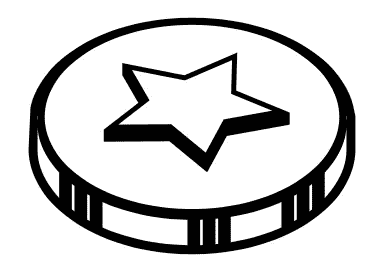
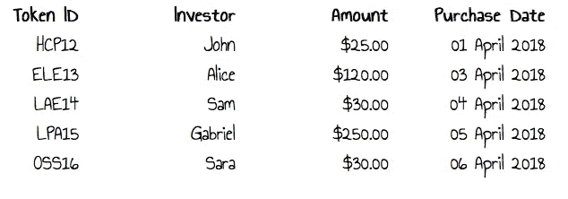
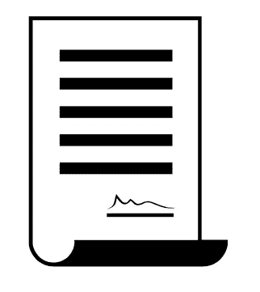
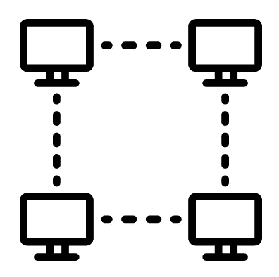
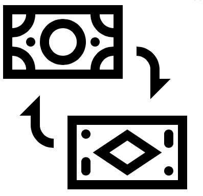

# ICO 初学者指南

> 原文：<https://medium.com/hackernoon/a-beginners-guide-to-ico-f5713f40db0c>


## ICO 初学者简明指南


Mary ( Credits : Peony Bloom from the Noun Project)

玛丽想在网上开一家服装店。她需要资金，大约 5000 美元。她很年轻，还在上大学。她和大投资者没有关系。她有一些密友，但他们只能做小额投资。

如果玛丽能提供一些好东西，她的朋友们准备说服他们的关系网投资。

玛丽认为这是个好主意。她可以用这些投资来建立自己的商店，并向投资者提供她的产品或服装折扣。

为了做到这一点，玛丽需要记下他们的贡献。给他们一张收据或一个象征，证明他们的贡献。投资者可以在晚些时候为服装或折扣提供代币。



Token (Credits : Dayan Yari from the Noun Project)

代币只是说玛丽欠代币持有者未来的价值。



这是 ICO(首次发行硬币)的基本理念。ICOs 有一些属性让它们不可思议。

## 解决了信任的问题

玛丽的朋友可能会委托她投资。但是他们的网络很难信任她。我们来看看 ICOs 是如何解决信任问题的。



Credits: Meaghan Hendricks from the Noun Project

ICO 是一种发行投资代币的计算机程序。计算机程序是一组指令。

```
If the buyers pay x coins then 
   Issue him y coins
```

就像玛丽和买家之间的协议。这种计算机化的协议被称为智能合同。

这份电脑化的协议一旦准备好就不能更改。这是因为与传统的互联网服务不同，计算机程序或智能合同并不存在于玛丽拥有的计算机中。

该程序在网络中的数千台计算机上复制。一旦该计划被部署，买家将能够购买代币。令牌交易数据也通过网络复制。



Credits : Priyanka from the Noun Project

这些信息以块的形式存储并链接在一起，因此被称为“区块链”。

[](https://hackernoon.com/a-beginners-guide-to-blockchain-d04266844e7) [## 区块链初学者指南

### 我不明白为什么人们觉得理解区块链很难。我想知道为什么我自己没有。那是在 2013 年我第一次…

hackernoon.com](https://hackernoon.com/a-beginners-guide-to-blockchain-d04266844e7) 

这里投资者不相信玛丽，而是相信计算机。玛丽不能处理交易数据。这并没有完全解决信任的问题。许多骗子推出 ICO，发行代币，然后消失。投资 ICO 时要小心。

## 代币交换

看到 Mary 的成功，Sara 为一个电子学习平台推出了她的 ICO。你可以用玛丽的代币换萨拉的代币。



Credits : Guillaume Berry from the Noun Project

# 前进的道路

未来的 ico 可能会被大量采用。因为 ico 让生活在任何地方的任何人都能投资他们相信的想法。如果你想学习智能合约编程，我推荐你看一看 [Zastrin](https://www.zastrin.com/?zref=febin) 。

[](https://www.zastrin.com/?zref=febin) [## Zastrin |通过做真实项目学习以太坊编程

### 通过构建真实世界的项目来学习以太坊和 IPFS 等去中心化技术。

www.zastrin.com](https://www.zastrin.com/?zref=febin) 

如果你对加密货币和区块链完全是初学者，我推荐你看一下 [CryptoManiaks](https://www.cryptomaniaks.com) 。

[](https://www.cryptomaniaks.com/) [## 神秘狂人

### 我们是密码狂热者！即将成为排名第一的加密货币和区块链教育平台。学习可能会很无聊。这是…

www.cryptomaniaks.com](https://www.cryptomaniaks.com/) 

> 请鼓掌👏，谢谢你😊。关注我们 [Hackernoon](http://hackernoon.com) 和我( [Febin John James](https://medium.com/u/75a616711f4e?source=post_page-----f5713f40db0c--------------------------------) )了解更多故事。