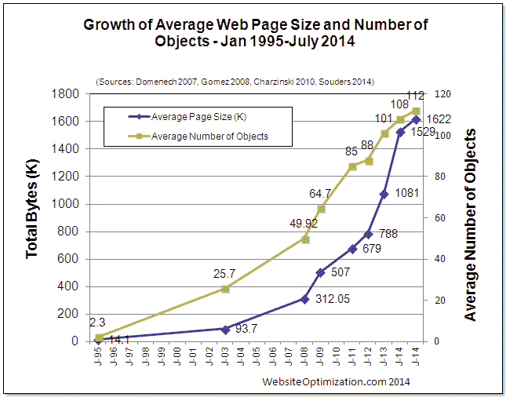
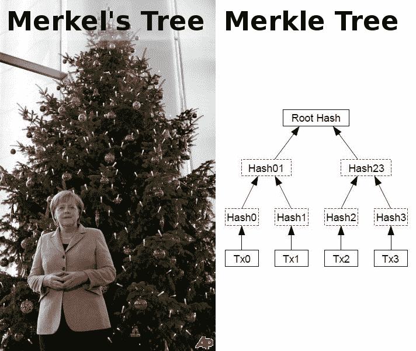
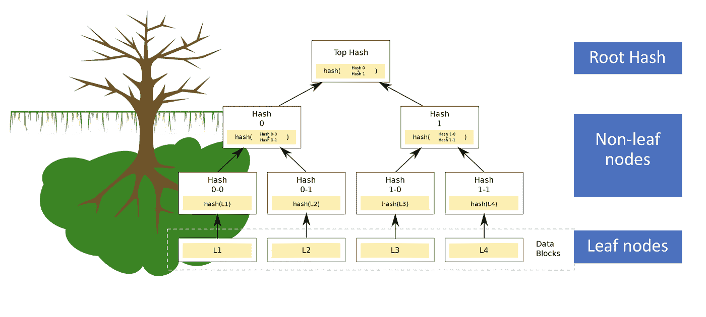
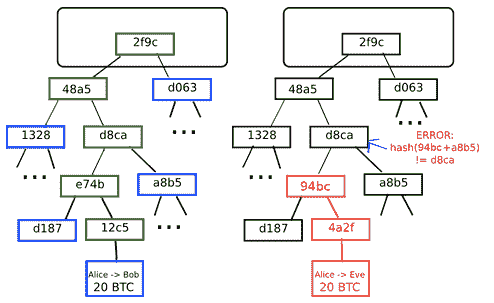
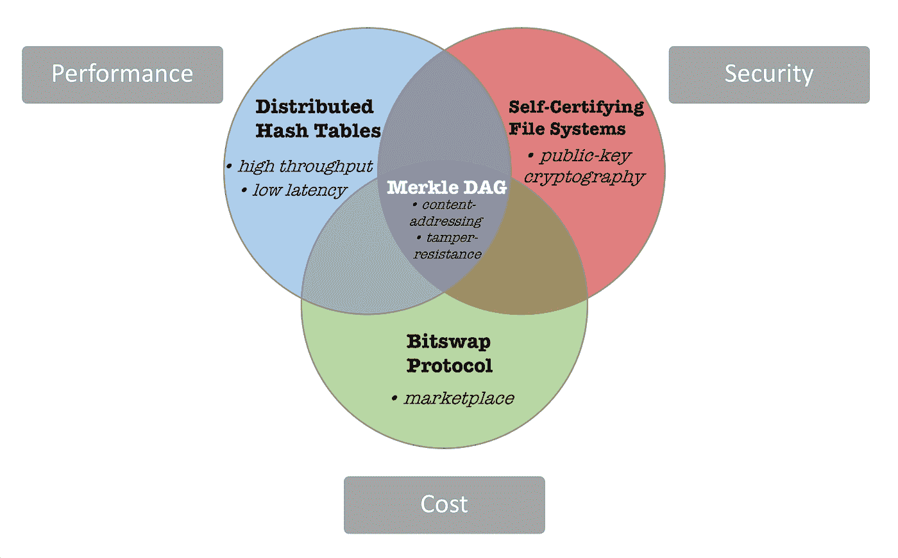

# IPFS 入门指南

> 原文：<https://medium.com/hackernoon/a-beginners-guide-to-ipfs-20673fedd3f>

在我之前的[帖子](/@kojoaddaquay/decentralizing-the-sharing-economy-a-review-of-the-origin-protocol-bf0003334233)中，我们讨论了共享经济的未来以及可能对其形成至关重要的激动人心的创新。提到的关键技术之一是星际文件系统(IPFS)。这是一个点对点(p2p)文件共享系统，旨在从根本上改变信息在全球范围内的传播方式。IPFS 由通信协议和分布式系统中的几项创新组成，这些创新结合起来产生了一个独一无二的文件系统。因此，要理解 IPFS 试图实现的全部广度和深度，理解使之成为可能的技术突破是很重要的。

# **通信协议&分布式系统**

为了让两个人交换信息，他们需要一套共同的规则来定义信息如何以及何时传输。这些规则被广泛地称为通信协议，但这相当拗口，所以我们简单地称之为语言。如果你曾经去过一个母语不是英语的国家，你可能经历过沟通协议的失败。计算机就是这种情况；它们无法相互通信，并且作为孤立的计算设备存在，直到 20 世纪 80 年代初发明了第一个计算通信协议。

> *“协议之于通信，犹如编程语言之于计算”*

在计算机中，通信协议通常存在于几层的包(称为协议组)中。例如[互联网协议](https://en.wikipedia.org/wiki/Internet_Protocol)套件由 4 层组成，每层负责特定的功能。除了通信协议之外，需要理解的一个重要关系是计算机之间互连的基本结构。这就是所谓的[系统架构](https://en.wikipedia.org/wiki/Distributed_computing)。有几种，但与我们相关的两种类型是**客户机-服务器**和**对等网络**。

互联网由客户端-服务器关系主导，客户端-服务器关系依赖于互联网协议组。其中，超文本传输协议( [HTTP](https://en.wikipedia.org/wiki/Hypertext_Transfer_Protocol) )是通信的基础。

数据存储在集中式服务器中，通过基于位置的寻址来访问。这使得分发、管理、保护数据以及扩展服务器和客户端的容量变得更加容易。然而，在安全、隐私和效率领域存在许多弱点:对服务器的控制转化为对数据的控制。这意味着你的数据可以被控制服务器的任何一方访问、修改和删除；这可能是对服务器拥有合法权限的实体或恶意黑客。在基于位置的寻址中，数据是通过其位置而不是其内容来标识的。这种限制意味着您必须一直走到特定的位置才能访问某个数据，即使该数据在更近的地方也是如此。也没有办法判断数据是否被修改过，因为客户端只需要知道数据在哪里，而不需要知道数据是什么。

但是客户机-服务器模式和 HTTP 在互联网历史的大部分时间里都相当可靠地服务于互联网。这是因为 HTTP 网络对于移动像文本和图像这样的小文件非常有效。在网络的前二十年里，普通网页的大小仅从大约 2 千字节增加到大约 2 兆字节。

[来源](http://www.websiteoptimization.com/speed/tweak/average-web-page/growth-average-web-page2014.png)

HTTP 非常适合加载网站，但它不是为传输大量数据(如音频和视频文件)而设计的。这些限制可能使替代文件共享系统的出现和主流成功成为可能，如 Napster(音乐)和 BitTorrent(电影和几乎任何东西)。

快进到 2018 年，点播高清视频流和大数据变得无处不在；我们继续着生产/消费越来越多的数据，同时开发越来越强大的计算机来处理这些数据。云计算的重大进步有助于维持这种转变，但是分发所有这些数据的基础架构基本上保持不变。

# **星际文件系统**

IPFS 试图通过一种新颖的 p2p 文件共享系统来解决客户机-服务器模型和 HTTP web 的缺陷。这个系统是几个新的和现有的创新的综合。IPFS 是一个开源项目，由网络协议研发实验室 [Protocol Labs](https://protocol.ai/) 和前 Y Combinator 初创公司创建。协议实验室还开发补充系统，如 [IPLD](https://ipld.io/) 和 [Filecoin](https://coincentral.com/filecoin-beginners-guide-largest-ever-ico/) ，这将在下面解释。世界各地的数百名开发人员为 IPFS 的开发做出了贡献，因此它的编排是一项巨大的任务。以下是主要组件:

**分布式哈希表**

[哈希表](https://www.hackerearth.com/practice/data-structures/hash-tables/basics-of-hash-tables/tutorial/)是一种将信息存储为键/值对的数据结构。在分布式哈希表(DHT)中，数据分布在计算机网络中，并被有效地协调以实现节点之间的高效访问和查找。

分布式哈希表的主要优势在于去中心化、容错和可伸缩性。节点不需要中央协调，即使在节点发生故障或离开网络时，系统也能可靠地运行，分布式哈希表可以扩展到容纳数百万个节点。这些特征共同导致系统通常比客户机-服务器结构更有弹性。

**大宗交易**

流行的文件共享系统 Bittorrent 能够依靠创新的数据交换协议成功地协调数百万个节点之间的数据传输，但是它仅限于 torrent 生态系统。IPFS 实现了这种协议的通用版本，称为 BitSwap，作为任何类型数据的市场。这个市场是 Filecoin 的基础:一个基于 IPFS 的 p2p 存储市场。

**默克尔达格**

merkle DAG 是一棵 [Merkle 树](https://hackernoon.com/merkle-trees-181cb4bc30b4)和一个有向无环图( [DAG](https://en.wikipedia.org/wiki/Directed_acyclic_graph) )的混合。Merkle 树确保在 p2p 网络上交换的数据块是正确的、未损坏的和未被更改的。这种验证是通过使用[加密哈希](https://simple.wikipedia.org/wiki/Cryptographic_hash_function)函数组织数据块来完成的。这是一个简单的函数，它接受一个输入，并计算与该输入相对应的唯一的字母数字字符串(哈希)。检查一个输入是否会产生一个给定的散列很容易，但是从一个散列中猜出输入却非常困难。

Don’t confuse these two. Source: [http://www.merkletrees.org/](http://www.merkletrees.org/)

单个数据块称为“叶节点”，经过哈希处理后形成“非叶节点”。这些非叶节点然后可以被组合和散列，直到所有数据块可以由单个根散列来表示。这里有一个更简单的概念化方法:

DAG 是一种对没有循环的信息拓扑序列进行建模的方法。DAG 的一个简单例子是家谱。merkle DAG 基本上是一种数据结构，其中散列用于引用 DAG 中的数据块和对象。这创造了几个有用的特性:IPFS 上的所有内容都可以被唯一地标识，因为每个数据块都有一个唯一的散列。此外，数据是防篡改的，因为更改数据会改变哈希，如下所示:

来源:[ethereum.org](https://blog.ethereum.org/2014/02/18/ethereum-scalability-and-decentralization-updates/)

IPFS 的中心原则是在广义 merkle DAG 上对所有数据建模。这个安全特性的重要性是很难夸大的。为了与客户机-服务器系统进行比较，看看这个家伙[如何在 7 分钟内黑掉 40 个网站](https://hackernoon.com/how-i-hacked-40-websites-in-7-minutes-5b4c28bc8824)。

**版本控制系统**

Merkle DAG 结构的另一个强大的特性是它允许你构建一个分布式版本控制系统( [VCS](https://en.wikipedia.org/wiki/Distributed_version_control) )。最受欢迎的例子是 Github，它允许开发人员轻松地同时进行项目协作。Github 上的文件使用 merkle DAG 进行存储和版本控制。它允许用户独立地复制和编辑一个文件的多个版本，存储这些版本，然后将编辑内容与原始文件合并。

IPFS 对数据对象使用类似的模型:只要对应于原始数据的对象以及任何新版本都是可访问的，就可以检索整个文件历史。假设数据块存储在网络本地，并且可以无限缓存，这意味着 IPFS 对象可以永久存储。

此外，IPFS 不依赖互联网协议。数据可以分布在[覆盖网络](https://en.wikipedia.org/wiki/Overlay_network)中，覆盖网络是建立在另一个网络上的简单网络。这些特点值得注意，因为它们是抵制审查的网络的核心元素。它可能是一个促进言论自由的有用工具，以对抗世界各地盛行的[互联网审查](http://www.visualcapitalist.com/internet-censorship-map/)，但我们也应该认识到被不良行为者滥用的可能性。

**自认证文件系统**

我们将介绍的 IPFS 的最后一个基本组件是自证明文件系统( [SFS](https://en.wikipedia.org/wiki/Self-certifying_File_System) )。它是一个分布式文件系统，不需要特殊的数据交换权限。它是“自我证明”的，因为提供给客户机的数据是通过文件名(由服务器签名)来验证的。结果呢？您可以通过透明的本地存储安全地访问远程内容。

IPFS 在这个概念的基础上创造了星际命名空间(IPNS)。它是一个使用[公钥加密](/@vrypan/explaining-public-key-cryptography-to-non-geeks-f0994b3c2d5)对网络用户发布的对象进行自我认证的 SFS。我们前面提到过，IPFS 上的所有对象都可以被唯一地标识，但这也扩展到了节点。网络上的每个节点都有一组公钥、私钥和节点 ID，节点 ID 是其公钥的散列。因此，节点可以使用它们的私钥来“签名”它们发布的任何数据对象，并且可以使用发送者的公钥来验证该数据的真实性。

**这里快速回顾一下 IPFS 的关键组件:**

*   使用分布式哈希表，节点可以存储和共享数据，而无需集中协调
*   IPNS 允许使用公钥加密技术对交换的数据进行即时预认证和验证。
*   Merkle DAG 支持唯一识别、防篡改和永久存储的数据
*   您可以通过版本控制系统访问已编辑数据的过去版本

Simple conceptual framework

**那么，为什么所有这些都很重要？**

IPFS 提供高吞吐量、低延迟的数据分发。它也是分散的和安全的。这打开了几个有趣和令人兴奋的用例。它可以用于向网站提供内容，通过自动版本控制和备份在全球范围内存储文件，促进安全的文件共享和加密通信。

以下是 IPFS 正在建设的几个有趣的项目:

[阿卡夏](https://akasha.world/)，*下一代社交网络*

[余额 3](https://www.balanc3.net/#/) ，*三联记账平台*

[BlockFreight](https://blockfreight.com/) ，*一个开放的全球货运网络*

[Digix](https://digix.global/) ，*实物黄金令牌化平台*

[Infura](https://infura.io/) ，*DApps 的基础设施提供商*

[Livepeer](https://livepeer.org/) ，*一个去中心化的视频直播平台*

[起源](https://www.originprotocol.com/en)，*共享经济的点对点市场*

[支持](https://www.uport.me/)，*自主身份系统*

这些应用的多样性展示了 IPFS 在几种不同使用情况下的多功能性。它还被用作公共区块链和其他 p2p 应用程序的补充文件系统。在撰写本文时，在以太坊智能合约中存储一千字节的数据可能需要几美元。这是一个主要的制约因素，目前正在推出的新的分散式应用程序(DApps)正在大幅增长。IPFS 可与智能合约和区块链数据互操作，因此它可以为以太坊生态系统增加可靠、低成本的存储容量。让以太坊区块链数据在 IPFS 本地可访问的尝试是一个被称为 [IPLD](https://ipld.io/) (星际链接数据)的独立协议。

**挑战**

尽管 IPFS 的表现令人印象深刻，但仍有一些问题尚未完全解决。首先，IPNS 上的内容寻址目前不太方便用户。典型的 IPNS 链接如下所示:

*ipfs . io/ipns/qmeqe 5 ftgms 8 pnspzt q 3 lrz 1 imhdq 9k 34 tqnscp 2 jqt 8 wv/*

可以使用域名系统(DNS)将这些链接缩短为更简单的名称，但是这为内容分发引入了外部故障点。然而，仍然可以通过原始的 IPNS 地址访问内容。一些用户还报告说，IPNS 解析域名的速度很慢，延迟时间长达几秒钟。目前还不清楚这个问题的根源是什么。

*更新*:*2018 年 3 月 26 日，IPNS 发布了一项升级，该升级具有一项实验性功能，可加快发布/解析速度。详情可用* [*此处*](https://blog.ipfs.io/34-go-ipfs-0.4.14#ipns-improvements)

在 IPFS，节点也没有动力在网络上维护长期数据备份。节点可以选择清除缓存数据以节省空间，这意味着理论上，如果没有剩余的节点托管数据，文件可能会随着时间的推移而“消失”。在目前的采用水平下，这不是一个重大问题，但从长远来看，备份大量数据需要强大的经济激励。

**存储市场**

Filecoin 是一个独立的协议，旨在为 IPFS 的文件存储增加经济激励，并培育一个与企业云存储(如亚马逊 S3 等)相竞争的分布式存储市场。IPFS + FileCoin 不是固定定价的集中式基础设施，而是在本地供应商的全球网络上提供存储，这些供应商可以根据供求关系自由定价。Filecoin 使用[存储证明](https://filecoin.io/filecoin.pdf)来确保安全性和可靠性，而不是像[比特币](https://hackernoon.com/tagged/bitcoin)那样的[工作证明](https://en.wikipedia.org/wiki/Proof-of-work_system)共识算法。因此，任何人都可以加入网络，在他们的计算设备上提供未使用的硬盘空间，并获得 Filecoin 令牌作为数据存储和检索服务的奖励。

该网络正在以太坊上开发，因此智能合同集成可以在存储市场上产生诸如托管、保险等高级功能。理论上，这种经济模式应该发展出一个高度竞争的自由市场，其成本可能低于大规模供应商。但 FileCoin 尚未推出，因此观察这些概念在现实中的表现将会很有趣。

**入门**

IPFS 是一项雄心勃勃的努力，很明显，系统如何运作的精确机制比本指南所描述的要复杂得多。我们将把这些细节留给密码学家和计算机科学家去享受。你不必成为使用 IPFS 的专家，所以如果任何优势或用例对你有用或有吸引力，请在这里下载 IPFS &开始使用。如果你有数千兆字节或数千兆字节的未使用存储空间，并想充分利用这些闲置容量，你可以在网络启动时[注册](https://docs.google.com/forms/d/e/1FAIpQLSfdFpWhJj8OIGA2iXrT3bnLgVK9bgR_1iLMPdAcXLxr_1d-pw/viewform?c=0&w=1)成为一名早期的 Filecoin 矿工。如果你有兴趣成为早期存储用户，你也可以[注册](https://docs.google.com/forms/d/e/1FAIpQLSdCOjMenUU7WtT54zeAivCS2nnaWYQIgaXh0eRdIdpi6Pwkew/viewform)。

使用 IPFS 是非常了不起的，理解使之成为可能的技术魔法更令人兴奋。如果成功，IPFS 及其补充协议可以为下一代网络提供弹性基础设施。承诺分布式、安全和透明的网络。

*来源*

卡莫，道格拉斯。*计算机网络和互联网*。皮尔森，2015。[goo.gl/AbM8st](http://goo.gl/AbM8st)

http://goo.gl/zwKD9J IPFS 白皮书(草案 3)

Filecoin 白皮书[https://goo.gl/RrxcvX](https://goo.gl/RrxcvX)