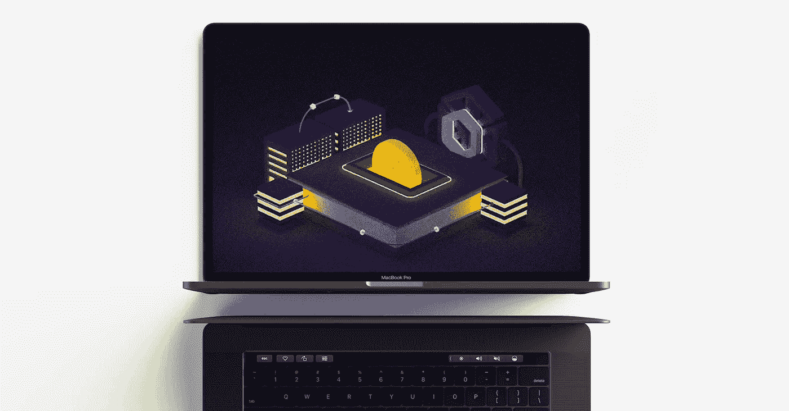
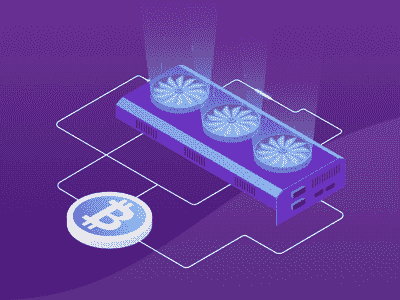
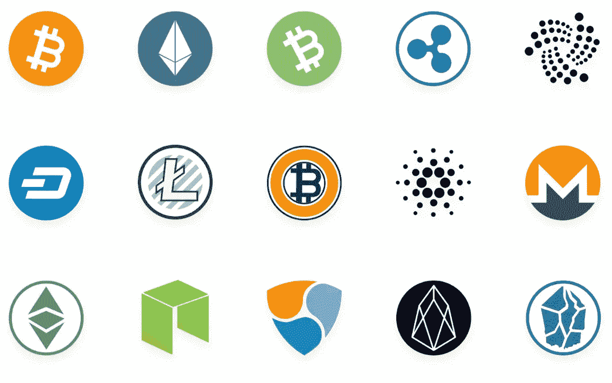
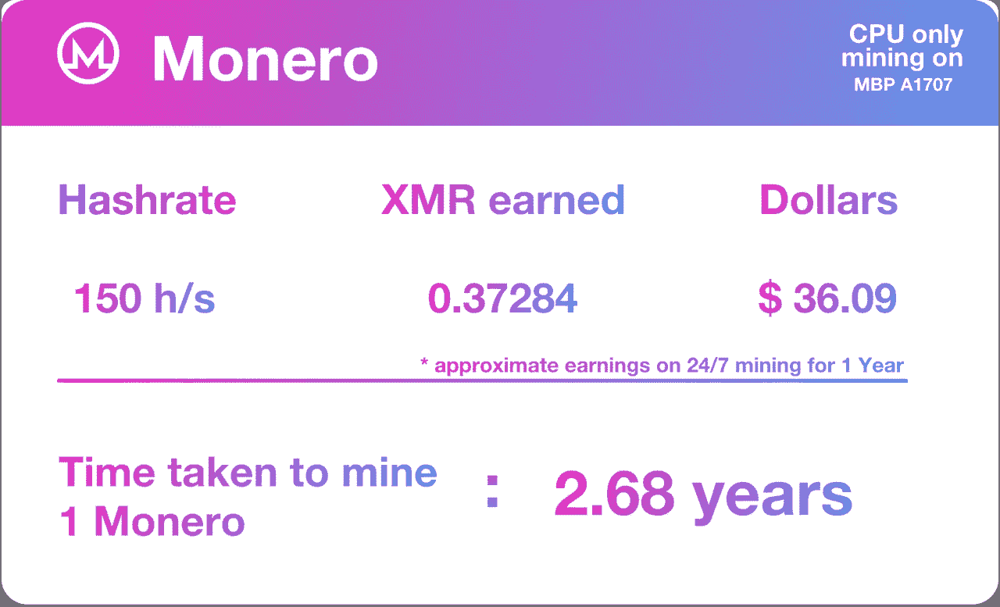
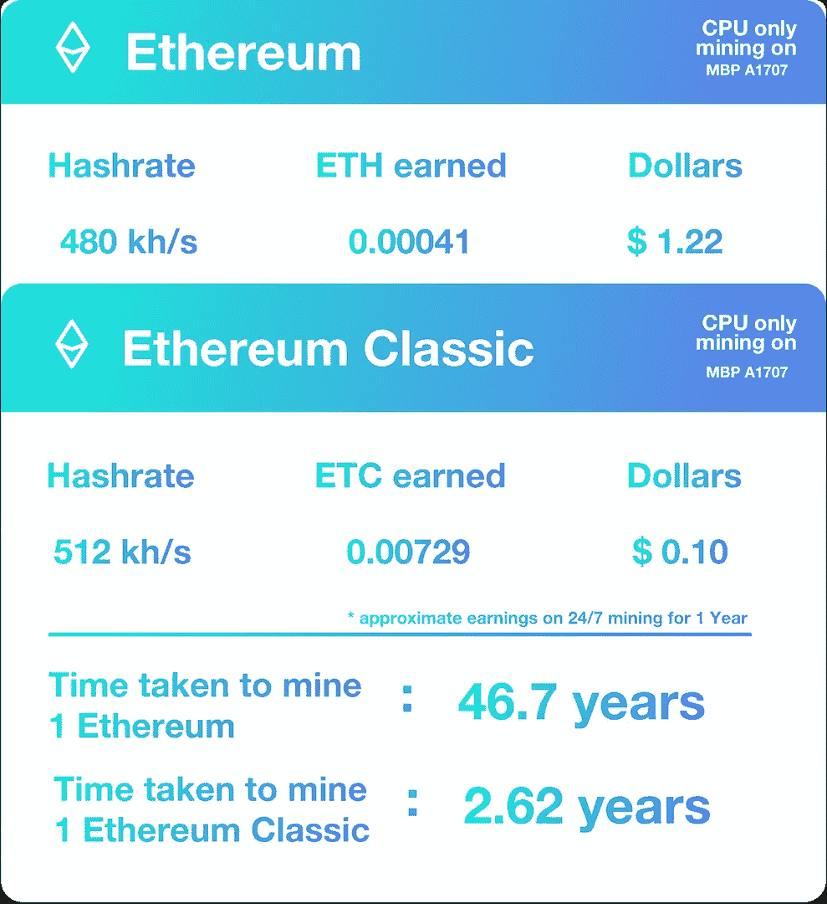
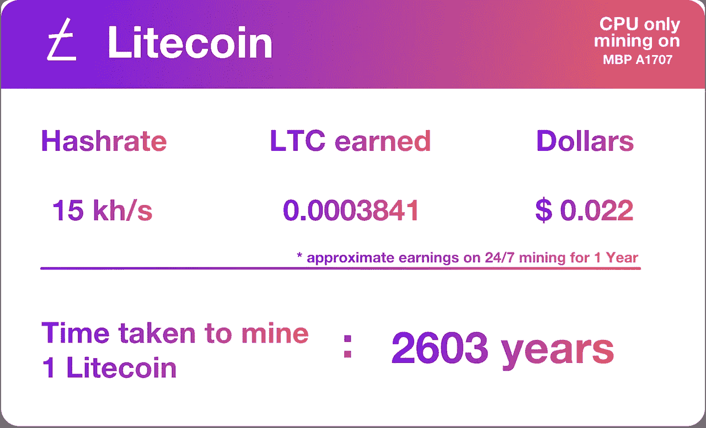
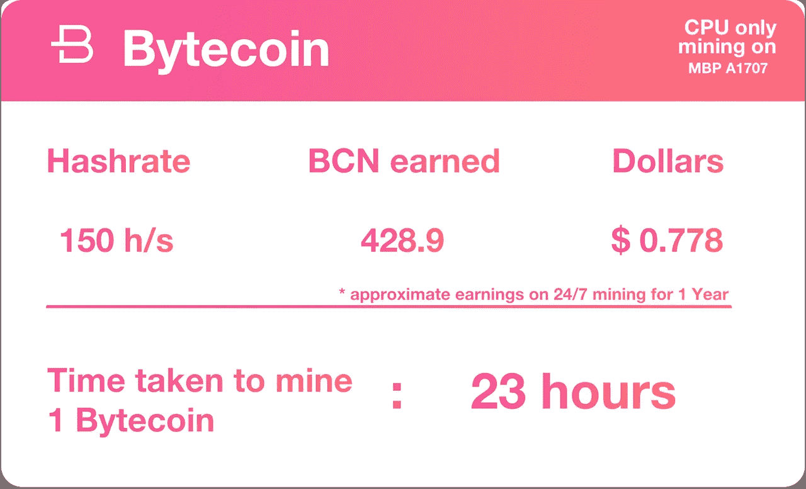
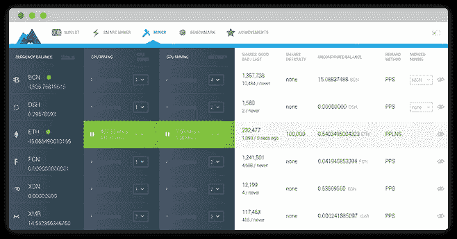

# 在 Mac 上挖掘加密货币的初学者指南

> 原文：<https://medium.com/hackernoon/a-beginners-guide-to-mining-cryptocurrencies-on-the-mac-2c823e10060a>

如果你想通过在 Mac 上挖掘加密货币来立即**获利**，就此打住。不要浪费你的时间。结束这篇文章，去给你自己买一个[采矿设备](https://www.techradar.com/news/best-mining-rig)/像样的游戏笔记本电脑或者[用你的信用卡](https://n.exchange/)购买密码。

**比特币(BTC)** 是最占优势的[加密货币](https://hackernoon.com/tagged/cryptocurrency)。它占据了超过 51%的市场份额。1 BTC = 6581 美元。想在那个 [Satoshi](https://en.bitcoin.it/wiki/Satoshi_(unit)) 里用 Mac 和现金挖矿比特币？别提了。随着比特币挖掘难度的增加，你需要专门的挖掘硬件(ASIC)。没有它，你可以用一个非常快的显卡，但是除非你有免费的电，否则它甚至不会自己还款。此外，大多数 MAC 和大多数挖掘软件都不支持 GPU 挖掘。纯 CPU 挖掘没有意义。

> 如果你在一台中档 MacBook Pro 上连续一个月 24 小时挖掘比特币，你只能赚到不到几美分的比特币。更不用说你的昂贵的机器的磨损和撕裂，你可能会烧你的显卡之前，你甚至矿 0.00001 BTC！**地狱** **你** **本世纪大概连一个比特币都不会开采了！**

# 首先，采矿究竟是什么？

那么，所有这些挖掘发生在哪里，比特币这样的加密货币来自哪里？嗯，你的电脑正在解决数学问题，以确保没有人在区块链网络上进行不真实的交易。如果你的计算机设法解决了这个问题，你就会得到奖励。挖矿还用来**释放新货币**到[区块链](https://hackernoon.com/tagged/blockchain)。这基本上就是采矿。每个人都有机会帮助解决这些问题，并要求奖励。所以简而言之，挖掘就是对一个交易的确认。

***(你可以跳过下面关于 ASIC 挖掘的部分。)***

# 围绕 ASIC 矿业的争议:

在比特币开始的时候，唯一的挖掘方式是利用 PC 上的中央处理器(CPU)和比特币核心钱包。当比特币发布的时候，你一天只能用一个 CPU 挖掘 100 个比特币。CPU 被设计成在不同的任务之间切换。哈希在数学计算中需要工作证明，而 CPU 的算术逻辑单元较少，因此在大型计算中，CPU 的性能相对较慢。

> GPU 挖矿的速度比 CPU 快很多。对于挖掘中涉及的重复数学运算，GPU 比 CPU 更快。他们在同样的时间内解决了更多的问题。CPU 有一个很大的带有几个内核的指令集。GPU 有时会有数千个着色器和一个更简单的数学指令集。因此，一千个着色器比几个挖矿币的内核要快得多。

但是现在不可能用 CPU 开采比特币，因为有 ASIC 矿商。ASIC 采矿钻机的推出一直在加密货币社区引发争议。ASIC 采矿设备给加密货币的生态系统带来了一系列好处和坏处。例如，它们为操作带来了规模经济，因为它们相对便宜并且在处理散列函数时更高效(与 GPU 装备相比)。反过来，这又转化为矿商更高的利润率。但是采矿效率是以分权为代价的。

> ASIC 矿工毁了普通人的采矿。

许多密码纯粹主义者对 ASIC 有问题的原因是，像你我这样使用相对缓慢的 PC 或更强大的显卡的个人，无法与 ASIC 采矿场进行工作证明共识测试并赢得比特币奖励的无情效率相竞争。他们认为，如果小人物不能参与，结果就是重新集权。例如，有一个安全论点，所有昂贵、高效的散列能力使得潜在的“[51%攻击者](https://www.investopedia.com/terms/1/51-attack.asp)”要克服更可怕的支出障碍。

# 那么我应该在 Mac 上挖掘哪些加密货币呢？

[山寨币](https://www.investopedia.com/terms/a/altcoin.asp)！除了比特币。比特币的流行使得比特币市场竞争异常激烈，对于新手来说，入门非常困难，成本也很高。另一方面，大多数代用币不太受欢迎，没有竞争力，也不太贵，甚至经常被 CPU 初学者使用。甚至还有一些 CPU 专用币！因此，对于那些想体验采矿乐趣或希望每月赚点外快的人来说，替代硬币是最好的加密货币。

# 在 mac 上有哪些可能的替代币可以挖掘？

> 有一千种不同的替代硬币。准确地说是 1854 年。包括比特币在内，共有 1855 种不同的加密货币。所有这些 1854 年的替代硬币都想成为下一个比特币或更好的东西。

但我们要看看最流行/先进/实用的硬币，以便在 Mac 上挖掘。接下来的所有测试挖掘结果都是在 2017 年年中的 MacBook Pro 15 英寸(A1701)上运行的。

# 莫内罗(XMR):

[**Monero**](https://getmonero.org/) 在其他加密货币中脱颖而出，被广泛认为是最先进的**匿名数字货币**。Monero 基于一种被称为 **CryptoNight** 的**工作验证算法**，这种算法的设计具有某些规格，使得 Monero mining 很难使用 ASICs 很好地工作。反过来，在你的 PC / Mac 上挖掘 Monero 其实也相对容易。

这意味着世界各地的人们将离开运行在他们的家庭或工作电脑上的采矿软件。这样做的人将获得 Monero，交换条件是运行处理和验证其他 Monero 交易的软件。因此，如果其他人支付电费(例如雇主或大学)，那么人们将有经济激励来利用他们已经可以使用的计算机的空闲容量开采 Monero。与需要购买和安装专用 ASIC 采矿硬件的情况相比，更多的人愿意随意使用现有的计算机来完成这项任务。因为不需要特殊的采矿设备，这意味着任何下载 Monero 钱包的人都可以轻松地在他们的电脑上点击一个按钮开始采矿。

> Monero 是 Mac 上最赚钱的硬币。或任何其他笔记本电脑。句号。Monero 是绝对初学者最好的硬币之一。你所需要做的就是打开 GUI，点击我的。就这么简单。但仍然有利可图。

因此，对 Monero 感兴趣的普通人将能够通过参与采矿过程赚取他们的第一点 Monero。这是一个重大的营销胜利，因为它将 Monero 分发给尽可能多的参与者，以激发他们的热情。Monero 目前是第十大加密货币。1 XMR = 96.7 美元。Monero 支持使用 CPU/GPU 或两者进行挖掘。

I Calculated the earnings based on the average hashrate I was getting on a MBP A1701 over a period of 24 hrs on Minergate.

因此，如果你有一个更强大的 Mac，如果你有一个受支持的 GPU，你可以在未来赚很多钱，如果不是立即。

# 以太坊/以太坊经典(ETH / ETC):

以太坊是在比特币的基础上发展和改进的，扩展了它的功能。重要的是，它被开发来突出“**智能合约**”:编码到区块链本身中的分散的、自动执行的协议，因此不需要认证第三方。

**以太坊是第二最有价值的加密货币**(市值)。**以太坊经典是以太坊**的一个分支。1 ETH = 302 美元。以太坊基于名为 **Ethash** 的工作证明算法奖励其矿工，该算法实际上鼓励个人分散开采，不支持 ASICs 开采。可以用 CPU/GPU 挖掘或者两者都用来挖掘以太坊。但是最近 ASIC 挖掘在以太坊区块链上成为可能。

I Calculated the earnings based on the average hashrate I was getting on a MBP A1701 over a period of 24 hrs on Minergate.

> 所以很遗憾，以太坊在 Mac 上也是一场不秀。但外部 GPU 将真正有助于提高你的收入。但是你最好的选择是买下它或者 ASIC 开采它。

# 莱特币:

Litecoin 是比特币核心客户端的一个分支，略有不同。它将块生成时间减少到 2.5 分钟；它有更多的硬币或代币和不同的哈希算法，使用 scrypt，而不是 SHA-256。1 莱特币约合 56.90 美元。截至 2018 年，它的市值排名第七。

> 莱特币的纯 CPU 采矿仍然是可能的。从这个意义上说，如果你以 15 千赫/秒的平均哈希速率全年 24/7 开采，你将开采 0.0003841 LTC。也就是大约**0.022 美元**！如果你继续以这种速度开采，你将在 45 年后赚 1 美元！

I Calculated the earnings based on the average hashrate I was getting on a MBP A1701 over a period of 24 hrs.

因此，让你的 Mac 运行采矿程序几乎肯定会让你在电力上花费更多，而不是让你在莱特币上获得更多，所以我不建议尝试这样做！永远不会。同样，如果你真的想采矿，就买一个采矿钻机吧！不过，这里有一个[链接](https://cryptocurrencyfacts.com/beginners-guide-to-mining-litecoin-mac/)到一个指南，你可以在 mac 上设置它。

# 字节币(BCN):

Bytecoin 是第一个基于 CryptoNote 技术的硬币。 *Bytecoin* 宣称自己是一个完全匿名的 altcoin，也是第一个企业级 Altcoin。免费的即时国际支付:字节币网络和互联网一样快。处理您的付款需要一点时间，因为付款需要加密确认。Bytecoin 索赔交易大约在 2 分钟内处理完毕。字节币的制造者声称，破解这种货币“需要大量昂贵的电力和超级计算机的计算能力”。

字节币是世界上第 27 大加密货币。1 BCN = $ **0.001816！**

I Calculated the earnings based on the average hashrate I was getting on a MBP A1701 over a period of 24 hrs on Minergate.

你想要挖掘字节码的唯一原因是为了[处理](https://coinsutra.com/hodl-popular-cryptocurrency-terms/)。1 字节币现在值几分，也许有一天会值几百分。这是一个巨大的可能。巨大的。呼呼吉。所以在 HODL 问题上保持冷静！

但是聪明人会这样做，而不是挖掘字节码:

> 与其去挖掘字节币，不如用同样的计算能力和时间去挖掘更有利可图的 Monero，用它去买字节币。

> *一周采 Monero 会给你约****0.00711 XMR****哪会给你约****378 Bytecoins****！所以挖掘字节币一整年只会让你多 50 个硬币。但是开采一整年的 monero 将会给你买 19，845 个字节数！好吧，让我们把它变得更简单。1 美元可以买到 551 个字节码。只是简单地用现金购买。您将节省时间和宝贵的机器！*

> 这适用于所有那些可以开采的便士加密货币和那些不能开采的便士加密货币，如 [XRP](https://coinmarketcap.com/currencies/ripple/) (涟漪)[EOS](https://coinmarketcap.com/currencies/eos/)[恒星](https://coinmarketcap.com/currencies/stellar/)[IOTA](https://coinmarketcap.com/currencies/iota/)[系绳](https://coinmarketcap.com/currencies/tether/)。在这些硬币中的任何一个上投资 5 美元都是一个安全的赌注，会让你买一桶这些硬币。5 块钱！

# 在 Mac 上挖掘密码最简单的方法是使用名为 Minergate 的挖掘软件。

你可以在这里下载 GUI(图形用户界面)版本[。](https://minergate.com/download/mac)

The GUI Version is simple and recommended.

用户界面再简单不过了。

1.  报名。
2.  退出应用程序。使用扩展模式登录。
3.  转到顶部的矿工选项卡。
4.  选择你喜欢的加密货币。
5.  点击开始挖掘按钮。
6.  选择您希望为挖掘过程分配的核心数量(核心数量越多，哈希值越高)。

就是这样。你已经开始挖掘加密货币了！它也有一个内置的钱包来存储你挖掘的密码。使用 waller 地址，您可以发送和接收各种加密货币。虽然在采矿后，我会建议你转移到另一个钱包为安全起见。

我用[米露钱包](https://lumiwallet.com/)存放我的密码。他们有一个 Web 应用程序、一个 iOS 应用程序和一个 Android 应用程序。他们使用记忆短语的方法来保护钱包。

您可以使用 [CoinMarketCap](https://coinmarketcap.com/) 来跟踪当前的汇率。他们也有手机应用程序。

# 还有一件事。

当你长时间采矿时，你的 Mac 无法处理产生的热量。它甚至可以关闭以避免损坏内部组件。为了避免这种情况，使用一个名为 [smcFanControl](https://smcfancontrol.en.softonic.com/mac) 的软件。它可以让你控制风扇速度，将 Mac 冷却到最佳温度(50–55°C)。15 英寸的默认风扇设置为 2155 rpm。你可以把它一直提高到每分钟 5927 转。当你把音量一直调高时，风扇会发出很大的声音。因此，理想情况下，您可以将其设置为 4000 转/分钟，以获得更好的风扇噪音。这样你的 Mac 会运行得更好，因为没有热量限制。硬币会源源不断的出现！

**如果你发现这个有用，考虑砸那个拍手按钮！它会显示你对内容的欣赏！谢谢大家！**

# 这就是我要说的。再见矿工！

## 参考资料:

在这篇文章发表时，这里是我们讨论过的加密汇率:

1 BTC = 6581 美元

1 XMR = 96.7 美元

1 ETH = 302.00 美元

1 ETC = 15.14 美元

1 莱特币= 56.90 美元

1 BCN = 0.001816 美元

 [## 加密货币列表-加密货币事实

### 虽然从技术上来说有 1000 多种加密货币，但只有少数几种是相关的。其中，更少有一个…

cryptocurrencyfacts.com](https://cryptocurrencyfacts.com/list-of-cryptocurrencies/)  [## 用电脑挖掘的最佳加密货币

### 用 PC 挖矿比特币的日子结束了。随着比特币挖矿难度随着时间的推移而增加，个人…

www.bitcoinmarketjournal.com](https://www.bitcoinmarketjournal.com/cryptocurrency-mining/)  [## 加密终止开关:Monero 向矿工开战

### 开发人员正准备竭尽全力保护世界上最大的加密货币之一免受侵蚀…

www.coindesk.com](https://www.coindesk.com/crypto-kill-switch-monero-going-war-big-miners/)  [## 密码需要更多的代码来击败 ASIC 挖掘威胁

### Michael J. Casey 是 CoinDesk 顾问委员会主席，也是麻省理工学院数字…

www.coindesk.com](https://www.coindesk.com/bitcoin-code-defend-against-asic-mining-threat/)  [## 加密货币市值| CoinMarketCap

### 加密货币市值排名、图表等

coinmarketcap.com](https://coinmarketcap.com/)  [## Monero 的优点:为什么 Monero vs 比特币

### 罗杰·弗，因早年对比特币的大力支持而被称为“比特币耶稣”...说他的…

如何](https://www.monero.how/why-monero-vs-bitcoin)  [## ZCash

### ZCash 是一种加密货币，具有分散的区块链，为用户及其交易提供匿名性…

www.investopedia.com](https://www.investopedia.com/terms/z/zcash.asp) 

**图片来源:**

 [## 秘密挖掘

### 各种主题的现代设计等距概念。你可以买这个模板…

dribbble.com](https://dribbble.com/shots/4938640-Crypto-Mining)  [## 比特币/区块链

### 希望你喜欢:)

dribbble.com](https://dribbble.com/shots/4961063-Bitcoin-Blockchain)