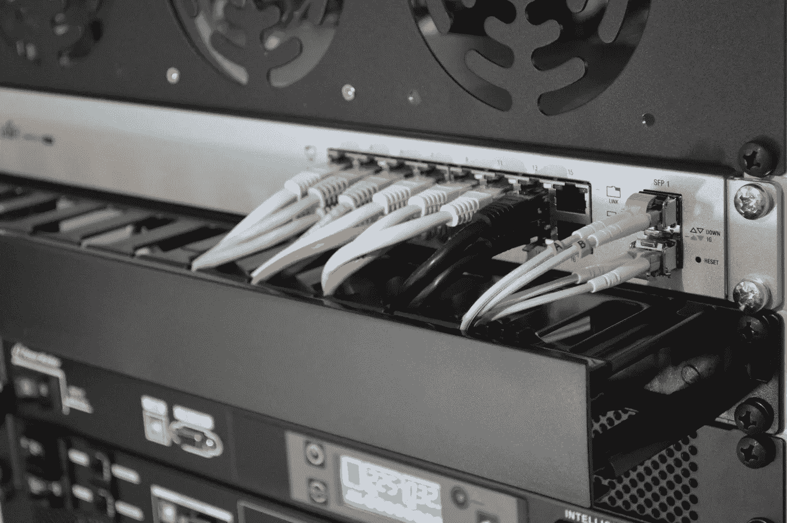

# 港口初学者指南。

> 原文：<https://medium.com/hackernoon/a-beginners-guide-to-ports-6b36cca00929>

我确信你们中的许多人以前听说过这个术语，“端口”，但是它在计算机世界中到底意味着什么呢？嗯，字典定义是一个连接的端点，但这并没有太大的帮助，所以让我们来分解它！

# 想象一下

当大多数人听到单词" *port* "时，许多人可能会想到港口，所以让我们用它来帮助我们想象。

所以说我们的港湾就是我们的路由器，连接进来，连接出去。现在想象进出我们港口的船只是互联网流量。

当一艘船进入我们的港口，它会寻找一个特定的地方停靠，这个特定的地方将代表我们的端口号。其中最常见的端口是*端口 80* ，这是用于 web 流量的端口。所以我们的船正在进入我们的港口寻找它被分配的停靠位置，80，如果那个港口是开放的，我们的船将会来并且停靠。太棒了，我们的连接成功了，但是如果我不想让船靠岸呢？嗯，在这种情况下，我们使用一种叫做*防火墙*的东西来阻止某些端口。我们的船将接近我们的港口，并寻找它的指定停靠位置，80，但港口被封锁；无法建立连接，可能会根据*协议*通知代表发送者的运输公司。

## 协议

在互联网领域有两种类型的协议，TCP 和 UDP。

TCP 代表传输控制协议，是互联网上最常用的协议。TCP 将通过对数据包进行编号并按顺序发送来保证所有数据包都发送到接收方，而接收方将确保所有数据包都在那里，如果不在，则接收方将向发送方发送响应，发送方将再次发送所有这些数据包以确保它们都被接收到。

另一方面，UDP 并不确保所有这些数据包都被发送，但它会一直发送它们。发送方只会发送数据包，而不会等待接收方发回响应，这意味着在传输过程中可能会丢失一些数据。那么为什么人们会选择这个协议呢？速度。在有些应用中，速度比可靠性更重要，比如在线游戏或直播。

现在我们知道了协议是什么，但是我们如何描绘它们以便更好地理解它们呢？好吧，假设我们的数据包是运输容器，整个运输就是正在传输的内容。

让我们想象一下，一艘船正在卸集装箱，每个集装箱都有编号，并按顺序卸下，每个集装箱卸下后，清点库存以确保集装箱按正确的顺序卸下。如果这些集装箱没有按照正确的顺序卸载，或者有一个集装箱丢失，船只将再次卸载，以确保没有错误。

至于 [UDP](https://hackernoon.com/tagged/udp) ，会以最快的速度卸载一船。如果一个集装箱没有被卸下并留在船上，船将离开，不会回来。

# 结论

感谢您花时间阅读我的文章，我希望您已经了解了一些关于港口的新知识。如果你对[学习](https://hackernoon.com/tagged/learning)哪个端口号对应哪个服务感兴趣，参考这个维基百科词条[这里](https://en.wikipedia.org/wiki/List_of_TCP_and_UDP_port_numbers)。

如果您喜欢这篇文章，请考虑在下面的其他社交媒体平台上关注我:

 [## Danny Tran (@hoogleyb) * Instagram 照片和视频

### 321 个关注者，124 个关注者，114 个帖子——见来自 Danny Tran (@hoogleyb)的 Instagram 照片和视频

www.instagram.com](https://www.instagram.com/hoogleyb/)  [## 丹尼·特兰(@HoogleyB) |推特

### Danny Tran 的最新推文(@HoogleyB)。青少年软件开发者。

twitter.com](https://twitter.com/hoogleyb) 

当然，我也是人，我也会犯错误，所以如果你在这篇文章中发现任何错误，请在评论中指出来。

编码快乐！