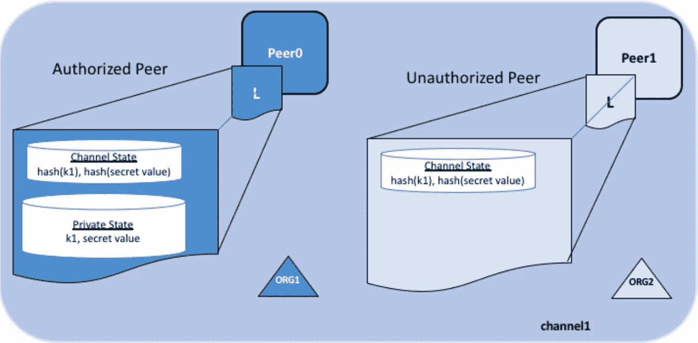

# Hyperledger Fabric Nodejs chain code 的 SideDBs 和私有数据初学者指南

> 原文：<https://medium.com/hackernoon/a-beginners-guide-to-sidedbs-and-private-data-for-hyperledger-fabric-nodejs-chaincode-ba20b2d8f95b>

Source: [Hyperledger Fabric 1.2 Docs](https://hyperledger-fabric.readthedocs.io/en/release-1.2/private-data/private-data.html)

最新的 Hyperledger Fabric 版引入了存储在 SideDBs 中的私有数据。该解决方案为您提供了构建“符合 GDPR 标准”的区块链解决方案的可能性。下面的文章将向您展示如何使用这些私有数据库。如果你还不熟悉 Hyperledger Fabric 上的私有数据的概念，请查看由 [Jonas Snellinckx](https://medium.com/u/6f64def299ee?source=post_page-----ba20b2d8f95b--------------------------------) 撰写的[之前的文章](/wearetheledger/private-db-a-built-in-gdpr-compliant-solution-for-hyperledger-fabric-1a082da1b301)。

*注意:这是一篇技术文章。我们将在*[*Github*](https://github.com/wearetheledger/fabric-network-boilerplate)*上使用我们的 Hyperledger Fabric 网络样板和我们的 chaincode 实用程序。*

# 私有数据用例

为了演示私有集合的使用，我们将使用老爷车的例子。`initLedger`功能将在我们的收藏中创建 10 款新车。网络中的任何人都可以访问和查看所有这些汽车。让我们创建一个私有存储库，我们只想与我们拥有的另一个车库共享。

# 集合配置

首先，我们需要一个集合配置文件`collections_config.json`，其中包含集合名称和策略。策略类似于背书，这允许我们使用已经存在的策略逻辑，如 OR、AND、…运算符。

# 写入链码

我们正在使用的 [Hyperledger 样板](https://github.com/wearetheledger/fabric-network-boilerplate)已经包含了创建和查询私有数据的功能。这就是最初的`createCar`功能。

对于向私有集合添加数据(`carCollection`)，我们只需要指定我们想要向哪个集合添加数据。

接下来，为了查询汽车，我们必须指定我们想要查询的私有集合。

对于删除和更新对象，您可以执行完全相同的操作。

## 链码最佳实践

当然，你的部分数据将被存储在网络中的任何人都可以看到的链上。但是，有些数据是私有的，将存储在私有集合中，由集合配置中定义的对等方访问。

我们建议在公共和私有集合中使用相同的键来存储对象，这使得以后检索数据更加容易。

*提示:我们的* `*stubHelper*` *实现了一个* `*generateUUID*` *，它为存储一个对象创建一个确定性的 ID。*

有兴趣开始自己的区块链项目，但不知道如何开始？您需要帮助开始代币销售或进行审计吗？与 [*取得联系*](https://theledger.be) *。*

# 结论

我们在这里演示了使用我们的包编写链代码是多么容易。你不需要这样做，但是这样可以加快速度。这些例子可以帮助你开始，如果你想阅读我们的文档，你可以查看我们的 [github](https://github.com/wearetheledger/fabric-node-chaincode-utils) 。我们也鼓励你做出贡献，使这个包更好。👌

## 接下来去哪里

**→** [**总分类帐面料资源列表**](https://github.com/wearetheledger/awesome-hyperledger-fabric)

→ [**我们的 Hyperledger Fabric REST 服务器 Typescript 样板文件**](/wearetheledger/hyperledger-fabric-typescript-boilerplate-455004d0c6c8)

**→** [**网络样板文件包括 Nodejs 链码示例**](https://github.com/wearetheledger/fabric-network-boilerplate)

→[**Github 上的节点链代码实用程序**](https://github.com/wearetheledger/fabric-node-chaincode-utils)