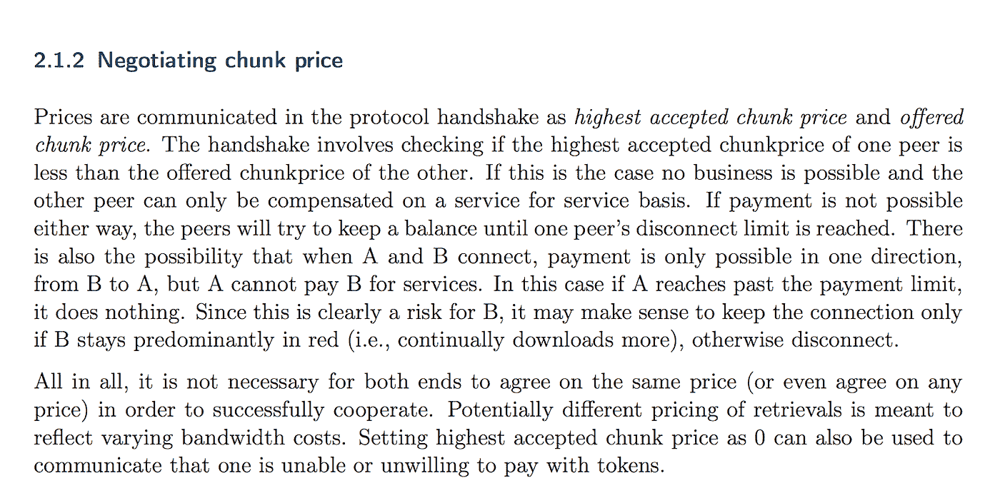
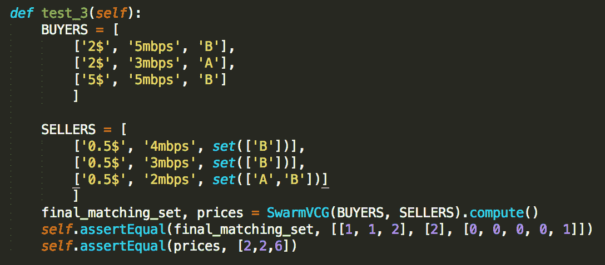

# 一个更好的群体激励机制

> 原文：<https://medium.com/hackernoon/a-better-incentivization-for-swarm-4d3481e28493>

Swarm 是一个 p2p 网络，内置了激励和支付功能。这是一个非常酷的项目，但我发现它在 orange 白皮书中的激励性讨论有点不足，即:

关于 Swarm 作为 p2p 网络的功能的讨论——而不是作为长期存储网络——过于简单，因为它没有考虑到拥塞的网络情况。当网络拥塞时，即 p2p 网络中的上传者没有足够的上传速度来满足所有的下载请求时，需要做出选择，并且需要以不能满足每个人的方式分配资源。幸运的是，有一个名为 VCG 的普通算法可以处理这些情况。VCG 基本上做的是首先最大化“社会福利”——也就是说，它找到最佳的资源配置，以最大化系统中的整体满意度。然后，它将一个参与者造成的[外部性](http://www2.econ.iastate.edu/classes/tsc220/hallam/Coase.pdf)强加于他的共同参与者，作为参与者需要支付的价格。假设我正在下载文件，而其他人不能这样做，因为我占用了所有上传者的资源，我将需要付费来适应我被优先考虑所带来的不适。费用永远不会超过我指定的我愿意支付的金额，VCG 的工作方式可以证明人们会“诚实”——也就是说，他们不会试图伪造他们愿意支付的金额。直觉上，他们不会为了更快地得到文件而出价高于它的价值，因为他们可能最终会支付他们所出价的。他们不会出价低于获得文件对他们来说的价值，因为通常你不会最终支付你出价的东西，如果你出价低，VCG 算法会优先考虑你的需求。VCG 算法的这些优良属性的正式证明可以在网上和最后的链接中找到。

P2P 网络总是遭受所谓的“吸血鬼”的不良现象，用 BitTorrent 或 KazAA 中的信誉系统来解决它从来没有真正起作用。我相信只有真正有钱的机制才有效，这是 Swarm 最终可以解决的巨大市场需求。你可以建立一个非常复杂的声誉系统，但它将永远是可玩的，因为在这样的系统中，最基本的罪恶是那些应该得到真正补偿的人——播种者——没有得到补偿。这可能是真的，该系统的一个普通用户最终会成为一个网络积极分子——他可以下载并被要求上传，因此他可以在使用他付费上传的网络连接时获得他想要的文件。但是，由于这些东西没有捆绑在一起，你很快就会看到公地悲剧。把钱牵扯进来，这些东西自然就量化了，不好的行为就惩罚了。

为用户提供的内容进行补偿的另一个好处是，某些用户最终会专门存储最需要的文件并分发它们，从而使网络变得更强大。对于最需要的文件，我指的是在给定需求的情况下服务最差的文件——当然，最明显的可疑文件是下载最多的文件，但如果有足够多的代理认识到这一点并开始播种它们，代理的最佳边际效用可能是播种其他不太受欢迎的文件，因此最终不应该缺少不太受欢迎的文件。

我建议将 VCG 用于 swarm 的分析模型如下:

*   资源分配的拍卖每隔一段时间进行一次，为简单起见，每 30 秒进行一次
*   每个下载代理分享他的网络下载速度，以及他愿意为他想要下载的特定文件支付的金额
*   每个上传者代理分享他的网络上传速度，他想要使用的最小量，以及他能够分享的文件
*   VCG 由 swarm 提供的第三方服务运营。VCG 事件不必发生在区块链的原因是，VCG 有意让特工们表现真实。从计算上来说，最好将 VCG 作为一个独立的服务。请注意，有些事情需要对区块链做出承诺——人们不应该违背自己的承诺，比如宣布拥有特定的文件或上传速度，然后不遵守承诺
*   上传者的带宽被分割成带宽块，它们专用于在下一个时间间隔将内容传递给它们被分配的不同的下载者

这是一个简单的模型，适用于行为类似于 BitTorrent 的 p2p 网络。Swarm 在存储方面投入了大量的注意力和精力——付钱给人们来存储你的文件，而不是在你下载时付钱给他们。该模型也可以与 VCG 机制结合在一起——事实上，它甚至比类似 BitTorrent 的情况更简单，这就是为什么我更喜欢在我看来讨论更复杂的场景。

我为 Swarm VCG 拍卖场景编写了一个模拟器，可以在:

[https://github.com/yotam-gafni/swarm_vcg](https://github.com/yotam-gafni/swarm_vcg)

README 文件应该可以让任何对运行它感兴趣的人继续下去。

运行测试，您可以看到该机制如何对不同的场景做出反应——上传者要求的不同价格以及网络是否拥塞。

我将分析一个场景来说明这种机制的好处。

在这个场景中，我们有 3 个下载者(“买家”)和 3 个上传者(“卖家”)。每个买家需要文件“B”或“A”。所有卖家都有“B”档，但只有一个卖家有“A”档。他们给出了下载和上传速度，以及买家愿意为每 1mbps 带宽块文件流支付的价格，以及卖家对 1mbps 带宽块所要求的最低保留价格。请注意，我们面临着一个拥挤的情况——买家的总下载速度是 13mbps，而卖家总共只能提供 9mbps。有人将不得不妥协。

最终的匹配集保存由 VCG 计算的分配。买方 0 将以 2mbps 的速度从卖方 1 下载他的文件，并以 1mbps 的速度从卖方 2 下载。买家 1 将以 1mbps 的速度从卖家 2 下载他的文件。并且购买者 2 将以 4mbps 的速率从销售者 0 和 1mbps 的速率从销售者 1 下载他的文件。愿意为他的文件流支付最多的买家 2，通过这种显示他最需要的机制，将获得他可以下载的最高速度。其他人将以低于其最大速度的速度下载。现在，补偿不仅来源于卖方要求的最低限度，还来源于买方 0 和买方 1 因网络拥塞而相互产生的外部性。请注意，他们仍然没有支付高于他们愿意支付的每 1mbps 的价格——买方 0 每 1mbps 的最终价格是 0.66 美元，买方 1 每 1mbps 的最终价格是 2 美元。

买方 2 以每 1 Mbps 1.2 美元的价格参与了他对买方 0 和买方 1 造成的外部性。

所有卖家得到的价格都高于他们要求的 0.5 美元。

最后，我要强调的是，随着规模的扩大，Swarm 将需要一种处理拥塞和外部性的机制。它目前的结构以一种非常有前途的方式将资金、底价、出价和 p2p 文件共享捆绑在一起，但这是它将需要的一个缺失的分配组件。

最好的是，我很乐意对 GitHub 项目的理论模型/参与发表评论。

延伸阅读-

[http://theory.stanford.edu/~tim/f16/l/l15.pdf](http://theory.stanford.edu/~tim/f16/l/l15.pdf)

[https://swarm-gateways . net/bzz:/thes warm . eth/ether sphere/orange-papers/1/SW % 5 E3 . pdf](https://swarm-gateways.net/bzz:/theswarm.eth/ethersphere/orange-papers/1/sw%5E3.pdf)

[https://www . cs . CMU . edu/~ sand holm/cs15-892 f13/algorithmic-game-theory . pdf](https://www.cs.cmu.edu/~sandholm/cs15-892F13/algorithmic-game-theory.pdf)—第二十三章 p2p 网络