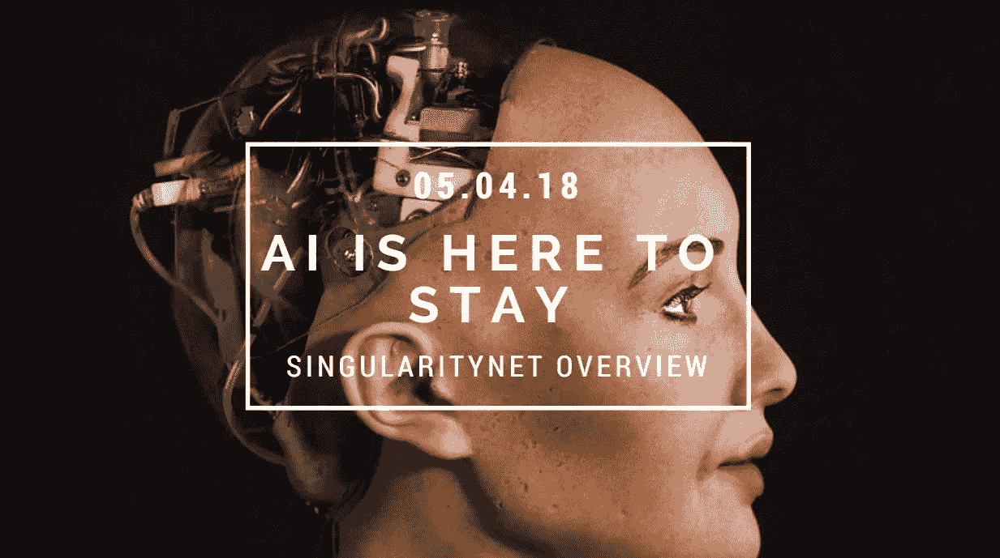
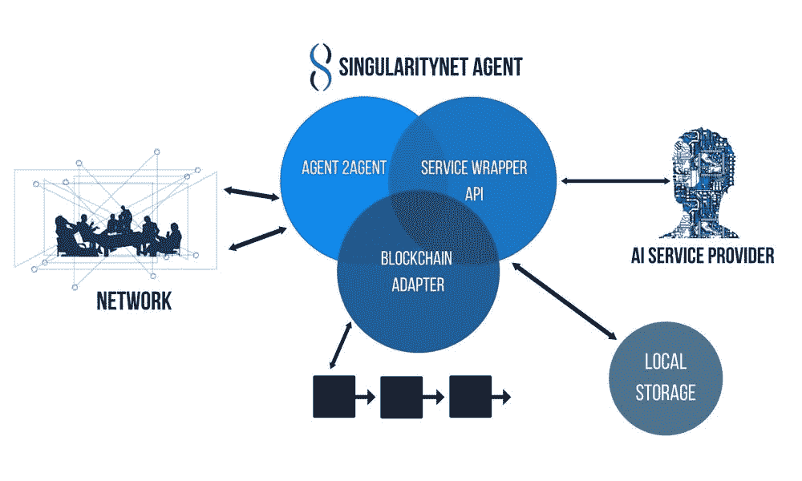
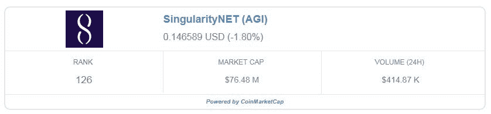
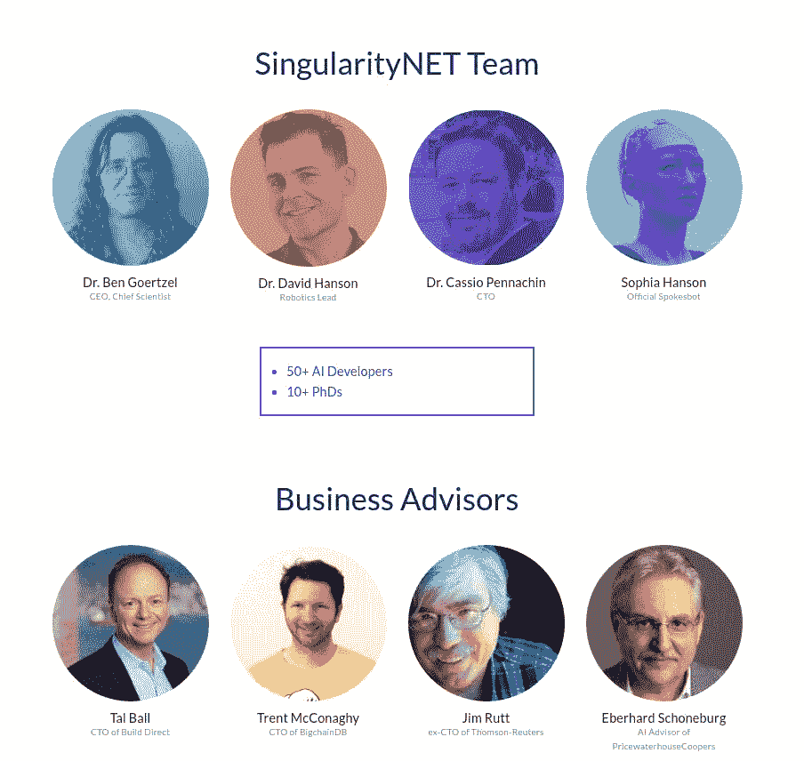

# SingularityNET:了解世界上第一个区块链公共人工智能网络

> 原文：<https://medium.com/hackernoon/a-better-insight-of-singularitynet-607fd64e18c4>

关于奇点网(AGI)你知道些什么？

区块链技术已经成为全球最受欢迎的技术之一。证明其先进性的创新之一是奇点网的推出。

**什么是奇点网？**

许多人会将其与典型的市场混淆，但 SingularityNet 是一个人工智能(AI)的去中心化市场。与人工智能相关的业务每天都在增加；然而，开发人工智能工具的人(研究人员和学者)和希望利用该技术满足特定需求的企业之间存在显著差异。

大多数组织需要比单个人工智能项目更定制的解决方案，研究项目通常难以访问大型数据集来构建强大的机器学习解决方案。奇点网将填补这些空白。

**本文将涵盖以下内容:**

*   *奇点网工作原理*
*   *交易所*
*   *获取 AGI*
*   *AGI 存储*
*   *奇点网团队*

**奇点网工作原理**

奇点网是一个复杂的项目——这是毫无疑问的。尽管它最初是一个人工智能即服务市场，但该团队的想法是将其发展成为一个完全自组织的人工智能网络。这个自治网络中的人工智能代理将利用人工智能将工作外包给彼此，并相互进化以进一步开发系统。

**人工智能服务市场**

为了让事情变得简单，SingularityNET 推出了一个人工智能服务市场。他们选择在头两年的发展中专注于人工智能的三个不同领域:

*   *云机器人*
*   *生物医学调查*
*   *网络安全*

在这个开放的市场中，人工智能开发者可以用他们的工具和解决方案交换奇点网的 AGI 令牌，或者其他资源和服务。为了使这些事务尽可能简单，SingularityNET 提供了用于合并常规服务的 API。智能合同中的图片和语言处理就是一个例子。

该平台同样使用智能合约来促进其他类型的服务。例如，SingularityNET 使用 DSOC 民主作为其治理模式。

在继续之前，我们都有必要定义奇点网络代理。代理是在平台上执行智能法律协议的实体。这些通常是网络上的节点。

为了保持网络的有效性，代理人的位置在每次交换后都用 0 或 1 来表示。离职不是必须的，也可以是自动的。如果代理将任务标记为完成并传输付款，则可以安全地假设评估是正确的。

存在现有的代理排名，其通过决定哪些代理评估更好并且对网络更有用来帮助网络改进。

代理排名是多方面的，有助于长期优化系统。确定代理总体排名的其他因素包括:

**AGI 令牌标桩**。如果代理的评估低于某个级别，他们将失去部分赌注。

**利益评级。**这是针对代理提供的有益任务的排名。这些是增强整个系统的任务，不一定具有货币价值。

**外部验证**。一旦代理通过“了解你的客户(KYC)”服务证明其所有权属于一家值得信赖的公司，他们将获得额外的排名奖金。

**自组织人工智能互联**

SingulairtyNET 工作人员的广泛愿景是建立一个涉及复杂人工智能代理通信的网络，主要使用 OpenCog 基金会的资源。为了观察这一点，让我们来看看现场建造的人形机器人索菲亚。

索菲娅使用了一系列代理，从处理语言到使用实际的运动技能来操作。一个人让索菲亚总结一部嵌入在网页中的电影。为此，Sophia 将请求发送给一个代理(代理 A)。通过它的 AI，A 智能体知道 W 智能体专门分析和转录视频，而 D 智能体专门总结文字。

代理 A 付钱给代理 W 和代理 D 完成这些任务，而索菲亚付钱给代理 A 帮助协调。与此同时，每个代理都用从这些任务接收到的网络信息更新他们自己的 AI，并将其与他们以前的经验和知识相结合。因此，与任何个体智能体相比，系统中的集体智能以更快的速度增长。

因此，人工智能代理最终将能够从他们超时获得的事实中产生全新的人工智能代理。这导致网络自动增长和自组织。

**AGI 令牌**

奇点网的 AGI 令牌目前是一个 ERC20 令牌。最终，投票(来自前面提到的治理模型)将决定系统是否/何时从以太坊转移到另一个平台/区块链

代理商主要使用 AGI 代币来支付人工智能服务。然而，使用这些特定的令牌也给予代理对影响平台的某些选择的投票权。

奇点网创世契约在 ICO 时创造了 1，000，000，000 AGI 代币。它们被相应地分配:

5 亿英镑:代币销售

200，000，000:奖励池

1.8 亿:创始人

8000 万:奇点网络基金会

4500 万:竞选粉丝(即。奖金)

该团队将在十年内发布奖励池令牌，并使用这些令牌奖励参与网络的代理。在此之后，他们将投票决定是创建一个全新的奖励池，还是选择其他类型的奖励机制。

**交易所**

SingularityNET 是一家相对较新的公司，AGI 令牌从 2018 年 1 月中旬才开始提供。它一直稳定地以每枚 20 美分的价格交易。

AGI 总市值为 68，462，443 美元，日交易量为 356，103 美元。大部分交易发生在库币交易所。你可以在 coinmarketcap 上看到关于奇点网的最新[统计数据。](https://coinmarketcap.com/currencies/singularitynet/)

**获得 AGI**

因为奇点网相对较新，你获得 AGI 令牌的选择是有限的。截至 2018 年 1 月 20 日，他们已经与最受欢迎的加密货币交易平台之一 **KuCoin** 合作。AGI 现已被列为库币的可交易代币之一，如果你愿意，今天就可以投资奇点网。

AGI 令牌获得了它的价值，因为它允许任何人在全球范围内访问人工智能服务，没有审查或排斥。其基于激励的网络参与帮助识别最佳人工智能服务并改进网络。

**AGI 存储**

因为 AGI 是一个 ERC20 令牌，所以您需要将令牌存储在支持 ERC20 的钱包中。推荐选择与 Ledger Nano S 非常相似的硬件钱包。

如果你选择不支付硬件钱包，你应该免费使用 MyEtherWallet。

**奇点网团队**

SingularityNET 团队拥有 50 多名人工智能开发人员和 10 多名博士。Ben Goertzel 博士以首席执行官和首席科学家的身份领导该小组。Goertzel 博士还是 OpenCog 基金会的主席，积极参与人工通用智能当代协会，并且是 Hanson Robotics 的首席科学家。Hanson Robotics 是帮助实现奇点网的合作公司。

汉森机器人公司的创始人大卫·汉森博士担任机器人负责人。最著名的是，汉森机器人公司建造了索菲亚。索菲亚是迄今为止最具创新性的人形机器人。Sophia 也是 SingularityNET 团队的骄傲成员。

该团队最近发布了该平台的 alpha 版本，并考虑在 2018 年第三季度的某个时候向公众推出。

**AI 与区块链**

奇点网在区块链世界是独一无二的。唯一一家与人工智能合作的著名公司是基于 NEO 的 DeepBrain Chain。这两个项目都有类似的长期愿景，也可以在 KuCoin exchage 买到。

DeepBrain Chain 将专注于共享计算能力，以执行机器学习相关任务；然而，奇点网正开始成为一个 AJAI 市场。

奇点网络是密码行业最具创新性和最大胆的项目之一，它汇集了技术最热门的两个工作领域:人工智能和区块链。

凭借 3600 万美元的 ICO 在几分钟内销售一空，以及由医生和工程师组成的全明星团队不断推动人工智能技术的边界，SingularityNet 肯定有一个光明的未来。