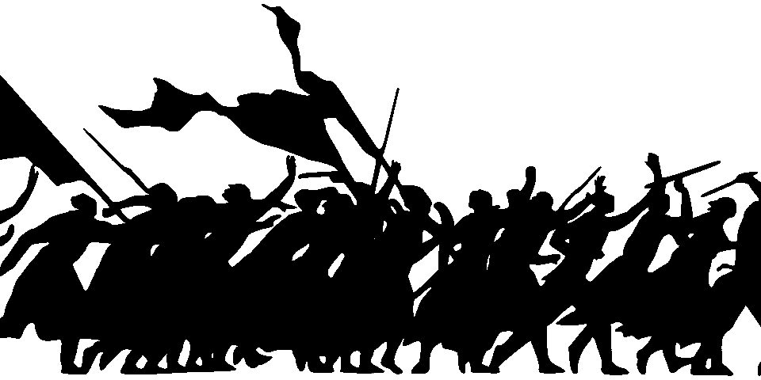

# 一点诗意

> 原文：<https://medium.com/hackernoon/a-bit-of-poetry-5cbb5137ef7c>

相关性不是因果关系

适度不是道德

认证不是能力

动员不是流动

受过教育的人并非无所不知

便秘根本不流动

投掷不是保龄球

马丁不是罗琳

免费午餐不能超大型化

革命不会是集中的

成年人可能不是成年人

并非所有的国家都是邪教

律师没有宣誓

皇帝*没有衣服*

伪造不是犯罪

*量化宽松*更崇高

加拉加斯不是摩加迪沙

块大小不是问题

免费的午餐不能定价过高

革命不会是集中的

你的观点不科学

做奴才不是蔑视

拥有杀毒软件并不意味着免疫

海盗党不能赢得太快

新闻上说的不是事实

你可以选择不反应

斯蒂维·旺德不是史蒂夫·沃兹尼亚克

选择捷径，而不是死胡同

免费的午餐可能会让你意识到

革命不会是集中的