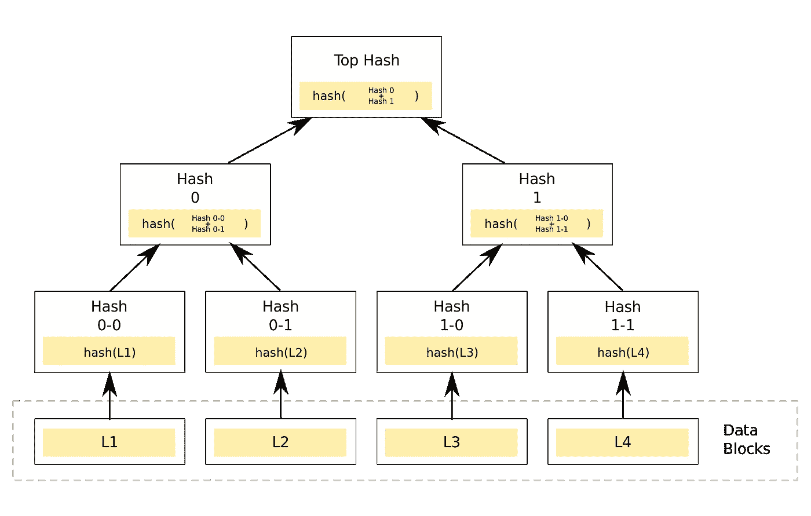

# 几条推特大小的区块链

> 原文：<https://medium.com/hackernoon/a-blockchain-the-size-of-a-few-tweets-9db820eb6b29>

对 Coda 的介绍。

*本文是我的系列文章之一🍌香蕉白皮书——区块链白皮书以一种易于理解的方式重新编写(比如香蕉！)风度。我的目标是帮助读者以最小的痛苦快速理解和评估复杂的区块链思想。*

Coda 是一个新的[加密货币](https://hackernoon.com/tagged/cryptocurrency)项目，由 [Evan Shapiro](https://medium.com/u/6839f69df6c3?source=post_page-----9db820eb6b29--------------------------------) 和 [Izaak Meckler](https://medium.com/u/aa2346b8631?source=post_page-----9db820eb6b29--------------------------------) 领导，由 [O(1) Labs](https://medium.com/u/b6d3ede7e247?source=post_page-----9db820eb6b29--------------------------------) 建造，并得到许多投资者的支持，包括[Ryan Zurrer](https://medium.com/u/709df4108839?source=post_page-----9db820eb6b29--------------------------------)/[Olaf Carlson-Wee](https://medium.com/u/8ca5a93ee80a?source=post_page-----9db820eb6b29--------------------------------)、 [Naval Ravikant](https://medium.com/u/67f5049293c7?source=post_page-----9db820eb6b29--------------------------------) 、 [Fred Ehrsam](https://medium.com/u/b947efe0a51a?source=post_page-----9db820eb6b29--------------------------------) 等等。该项目刚刚在五月宣布，目标是成为储存价值和保护数字生活的 [区块链](https://hackernoon.com/tagged/blockchain)。

# **结尾——简单的解释**

Coda 是一种新的加密货币，无论区块链上存储了多少交易，或者这些交易有多复杂，它都可以非常快速地处理交易，只需要很少的空间来验证区块链。

# **结尾——详细概述**

目前的加密货币速度很慢，需要大量数据来保持同步。例如，比特币每秒只能处理大约 3 或 4 笔交易，并且需要大约 175 GB 的 T2 下载才能与区块链保持同步。一个普通用户不能或不愿意存储这么大的区块链。正因为如此，连锁店正慢慢被集中到一小部分用户手中，他们*能够*处理空间需求。这可不好。

**Coda** 是一种新的加密货币，每秒钟可以处理*数千笔*交易，并且——无论在整个链条的历史中发生了多少笔交易——都可以保持验证链条所需的数据足够小，以便存储在智能手机上。

Coda 的用户只需要大约 20 千字节和 10 毫秒来验证他们的余额。正如 Coda 网站声称的那样，这是一个“几条推特那么大”的区块链

实际上，无论区块链有多少笔交易，Coda 都是快速且占地面积小的。Coda 称这些组合特征为简洁的区块链。

这个简洁的区块链是通过 zk-SNARKs 的递归组合创建的。理解前面的句子是一个密码学练习。因此，让我们从六个基本的加密定义开始，将它们放在一起，创建 Coda 背后的技术。

**加密哈希—** 一种数学算法，接受任意大小的输入，并输出不同的、(几乎)唯一的固定长度字符串。

因此，如果我们想要散列“这是一张香蕉纸”——我们通过算法发送该字符串，并获得以下输出:“dea3c 406 BC 9982 ad 485 BCD DD C4 CD 1e 7 b 7 a 6 C1 ce 819786 f 7520157743 cd93 ee5f”

(要获得关于散列如何工作的易读而详细的解释，请查看本页。在一个非常简单的层面上，该算法将文本转换为二进制，然后通过一系列定义好的简单函数来处理二进制，如添加零、将数字分成几部分、将步骤加在一起等等，直到有一个固定长度的结果，无法进行逆向工程。)

这里的关键是相同的输入每次都会生成完全相同的输出(哈希值)。但是，这是一个单向的过程——你无法通过某种方式从输出开始并对其进行逆向工程来计算出输入。找出原始输入的唯一方法是“强力攻击”，或者对输入值进行大量的试错，直到出现所需的输出哈希值。在大多数情况下，这几乎是不可能的。

虽然没有人能真正算出你的原始价值，但你可以利用输出值，提供知道输入值的证据，而不必透露它。任何知道(或后来知道)这个输入的人都可以证明你说的是实话。

**可忽略的函数** —一种加密哈希，其中有人通过暴力攻击(如上所述)破解哈希算法的机会非常非常小。这是好事！

**冲突** —如果在哈希算法中可能的输入多于输出，那么根据定义，有时不同的输入将具有相同的输出值。因此，如果我们使用 SHA-256(我在上面的例子中使用的一组流行的散列函数)散列一些东西，它使用任何长度的输入，但总是输出 256 位，不可避免地(但很少)不同的输入会有相同的输出，或“冲突”

**防冲突哈希函数** —一种很少出现上述冲突的哈希函数。这是件好事。创建一个抗冲突的散列函数是很困难的，但是现代散列函数中的算法做得很好。

**ZK-SNARK**——“零知识简洁的非交互式知识论证。”zk-SNARKS 是一种方法，可以让某人非常快速地证明他们拥有一些信息(如密钥),而无需透露实际信息，也无需与验证信息的人来回交互。这很复杂，很难用类比来解释，因为这确实是一种独特的能力，只有通过加密才有可能。

但是让我们试试。想象一下，你正坐在某个闹市区警察局的一个小而空的房间里的木制办公椅上，房间里有荧光灯照明。直接从电影里出来的。警察会把你和这个全新的测谎仪联系起来，这个测谎仪 100%正确。侦探走进来说，“我们盯上你了。我们知道你杀了鲍勃。承认吧！”

你没有杀鲍勃。你可以证明这一点。但问题是，你不想让侦探知道*你如何*能证明这一点，因为在鲍勃被杀的那个晚上*你确实在那个侦探的家里和他的妻子睡觉！*

但是冷静下来，没事的。因为这个测谎仪很特别，它允许你对着麦克风小声说话，这样只有机器能听到你。于是你对测谎仪耳语:“我没有杀鲍勃；我可以证明这一点，因为那天晚上我在侦探的房子里。”测谎仪向侦探揭示你是无辜的，但永远不必向侦探揭示你说了什么。你安全了，正在回家的路上。但是下次要聪明点，不要和警察的妻子乱搞。

I’m telling the truth officer. But don’t ask me what I said!

这是一个很好的类比。不完美。但关键是:zk-SNARKS 是一种快速证明你说的是真的方法，而不必透露你说了什么。

zk-SNARKS 在区块链世界的一个流行用法是 zCash 实现。在 zCash 中，zk-SNARKS 用于保持交易的私密性——你可以证明你给别人送了一定数量的硬币，而无需透露交易的细节。

到底*ZK-SNARKs 的工作有多复杂。[你可以从这里开始](https://z.cash/technology/zksnarks.html)了解更多详情。*

**Merkle Tree** —哈希值树(上述加密哈希的输出)，其中没有孩子的每个节点(叶子)都是系统中实际数据的哈希值。所有其他节点(*有*的子节点)没有*数据*的哈希值，但是它们的值是通过组合然后哈希其直接子节点的哈希值而创建的。

By Azaghal — [https://commons.wikimedia.org/w/index.php?curid=18157888](https://commons.wikimedia.org/w/index.php?curid=18157888)

例如，上面是一个来自维基百科的二进制散列树的例子。在此示例中，哈希 0–0 和 0–1 分别是数据 L1 和 L2 的哈希值，哈希 0 是 0–0 和 0–1 中哈希值组合的哈希值。

Merkle 树非常有用，因为它允许我们只使用一个散列来验证整个数据树，或者只是数据的某个分支或叶子，而不必遍历整个树。基本上，如果你知道一个节点为真，你就知道它下面的所有节点都为真。一棵 Merkle 树说——嘿，你可以信任这个 A，因为你信任这个 A，你可以信任他所有的孩子，因为他信任他们。

所以把所有这些放在一起，Coda 背后的技术是:

*   一个**可忽略的**，**防冲突哈希函数**
*   结合一对 **zk-SNARK** s(称为 Tick 和 Tock)
*   递归散列和验证区块链中的所有数据块(或数据块之间的变化)
*   并创建 zk-SNARKS 的 Merkle 树，将多个孩子散列成单个父散列
*   从而产生代表整个区块链的证据的单个根散列值

有了 Coda 简洁的区块链，我们现在有了一个区块链，其中“验证区块链有多难”与“链的长度”无关——因为不管有多少节点，你需要验证的链总是根哈希值的长度。用户只需存储链的相关当前状态，以及证明在幕后存在包含所有数据的区块链的标记。与该用户相关的内容可能是证明整个链的最顶层根节点，或者只是证明其平衡所需的中间节点的路径。

正如 Coda 网站所述:

> “Coda 将整个区块链压缩到一个微小的快照中…这意味着无论执行多少交易，验证区块链仍然是廉价的，每个人都可以访问。”

用简单易懂的术语来说:

SNARKS 就像一个微小的、不可破解的证书，它是计算的结果，可以用来证明计算是正确的。把它想象成一个数独。数独真的很难解决，但是验证起来却很简单。如果你有 SNARK，你可以很快验证它说的是实话。

因此，由于 SNARK 验证计算，而对区块链上的块的更改只是一个计算，所以当处理器更新块时，它会产生一个 SNARK。任何有这种能力的人都可以很快检查计算结果，知道结果是正确的。

有了 Coda，你不需要了解区块链的全部历史就可以知道，毫无疑问，你的硬币余额。您只需要知道足够多的信息，即 SNARK(证明数据是真实的)加上您天平数据的树路径。

Coda 打算重新思考区块链的工作方式，并希望通过其简洁的区块链，将区块链的控制权交还给普通用户。他们有更广阔的视野，最终将他们的概念不仅仅局限于货币，还包括智能合约平台。关于 Coda 如何工作的更多细节，[查看完整的白皮书](https://codaprotocol.com/static/coda-whitepaper-05-10-2018-0.pdf)。

## 资源

[hack.summit 演讲](https://www.youtube.com/watch?v=eWVGATxEB6M)

[Coda 网站](https://codaprotocol.com/)

看看我的另一篇香蕉论文

[马克尔道/戴](/coinmonks/maker-and-dai-the-banana-paper-6c68eb59fc62)

[TrueBit](/@michael.bogan/blockchain-startup-truebit-the-banana-paper-fca77ebcad0f)

[反事实与国家渠道的演变](/coinmonks/understanding-counterfactual-and-the-evolution-of-payment-channels-and-state-channels-9e939d7c6f34)

# 给点掌声怎么样？

*如果你喜欢这篇文章，* ***随时鼓掌多次或与朋友分享*** *。这让我知道我的工作是有帮助的，并鼓励我写更多。*

Michael Bogan 是一名技术爱好者，拥有 25 年的技术架构、创业、产品发布和研究区块链项目的经验。

跟随我在灵媒。

在 Twitter 上关注我。