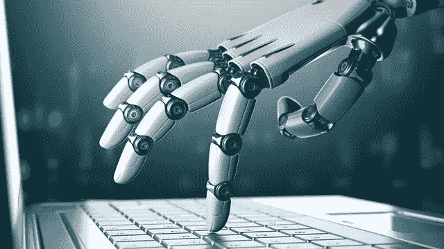

# (教育的)美好新世界

> 原文：<https://medium.com/hackernoon/a-brave-new-world-of-education-2427fa954af5>

无论是埃隆·马斯克(Elon Musk)的可怕预测“机器人将能够做得比我们更好”，还是略显乏味的麦肯锡全球研究所报告，你可能都已经听说过自动化和人工智能(AI)时代的到来，以及数亿个工作岗位可能因此被淘汰。那么，我们该怎么办呢？

末日预言家(比如马斯克)提出的一个更受欢迎的解决方案是普遍基本收入，以补偿被淘汰的工人。这在理论上听起来不错，但除非我们看到绝对最坏的自动化场景(即实际上没有工作)，否则它可能会破坏工作的激励，弊大于利。

改革教育体系的想法还没有被广泛讨论。虽然相对数量还不确定，但我们相当肯定自动化和人工智能将取代许多工作，但也创造了许多新的工作——挑战将是确保被取代的工人有能力完成这些新工作，其中许多将成为*补充*机器的角色。今天似乎显而易见的是，我们当前的教育系统，无论是在美国还是其他地方，都没有做好应对这一挑战的准备。

看起来可能的[未来](https://hackernoon.com/tagged/future)场景是:1)大量工作岗位不断被破坏，2)大量工作岗位不断被创造，以及 3)大多数其他工作岗位经历职责和所需技能的快速变化。在这种情况下，布鲁金斯学会的 Harry Holzer 说我们的教育系统应该关注一般的技能培训，而不是基于职业的培训。我们不需要有特定行业技能的工人。相反，我们需要能够批判性思考、沟通的员工，最重要的是*能够适应不断变化的工作性质*。

我们现在可以想象我们勇敢新世界的第一部分，在这个世界里，我们的正规教育系统，不是为特定的行业和职业培养学生，而是非常注重 21 世纪的技能。这就把我们带到了第二部分，也就是终身学习的理念。

我们目前对教育和工作的想法遵循一个一般模式:你上学是为了学习，在某一阶段(有些人获得两年学位，有些人获得四年学位，有些人获得研究生学位)离开学校进入劳动力市场，然后你将在学校获得的技能和能力运用到工作中。当你被提升到新的工作岗位时，你可能会继续[学习](https://hackernoon.com/tagged/learning)一些东西。但本质上，你的生活被分为“学习”的初始阶段和更长的“工作”的第二阶段

然而，霍尔泽表示，未来“鉴于潜在可替代工人的范围更广……我们需要开发范围更广的高质量再培训方案。”这就是**终身学习**的用武之地——我们需要允许员工在其职业生涯中不断学习新技能的机构。这既适用于缺乏新岗位所需技能的下岗工人，也适用于保住工作但发现工作性质发生变化、需要新技能和知识的工人。

换句话说，由于工作机会的快速创造和破坏，劳动力市场将需要变得更加灵活。为了实现更大的灵活性，我们可以采取的一些潜在措施是:1)使我们的教育系统更多地面向 21 世纪的技能，以便工人变得更具适应性，更有能力转换职业；2)发展促进工人终身学习的机构。

我们可以从 Coursera 和 Udacity 等在线课程提供商那里看到，除了公共政策措施之外，第二步可能还需要私人部门的广泛参与。