# 中国科技行业企业家指南。剧透:这太不可思议了

> 原文：<https://medium.com/hackernoon/a-brief-glimpse-into-chinas-tech-ecosystem-and-its-everyday-technologies-part-1-eaa46a36157b>

## 短暂的中国之旅揭示了令人难以置信的日常技术和现代淘金热

和任何寻找下一次淘金热的 T2 企业家一样，我一直怀着极大的兴趣关注着中国市场。应中国政府的邀请，我花了两周时间在中国广东了解其科技生态系统，并探索合作机会。

在那里的两周时间里，我看到了[技术](https://hackernoon.com/tagged/technology)错综复杂地融入人们的生活，这是我在世界其他地方从未见过的。要了解中国的商业，首先需要了解技术在人们的日常生活中有多么根深蒂固。

以下是我在那里的一些观察和轶事，希望能给其他想拓展中国市场的企业家一点小小的(也许是肤浅的！)一瞥这片无限可能的土地。下一次淘金热已经来临。

# 1.微信不仅仅是支付，它是一切

A visit to WeChat’s offices in Guangzhou

现在大多数人应该听说过微信。在速度上，这是中国版的脸书+ Whatapp + Venmo。那就是低估了微信的力量。

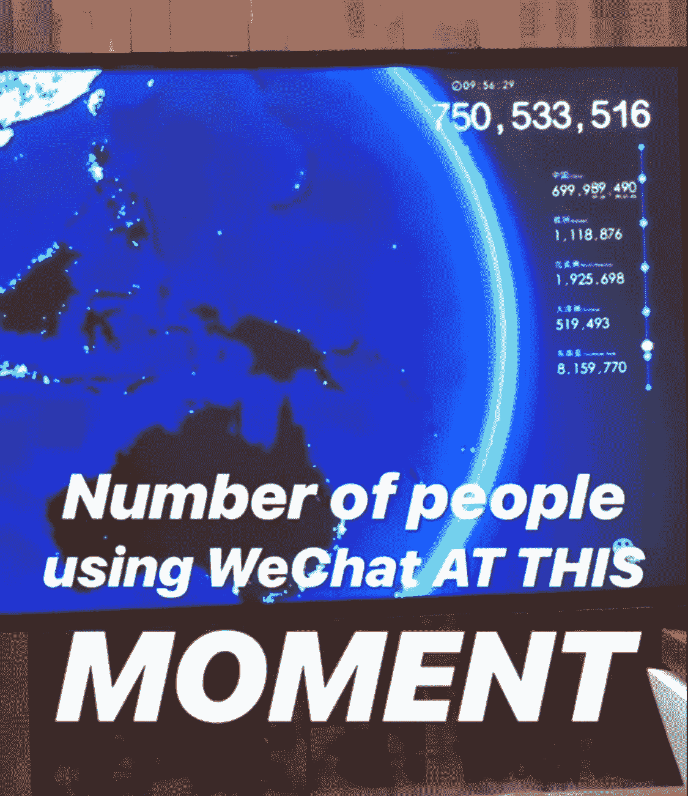

At 9am during our visit, there are 750 million people using WeChat

有人刚刚给了你他们的名片？扫描二维码在微信上添加他们。

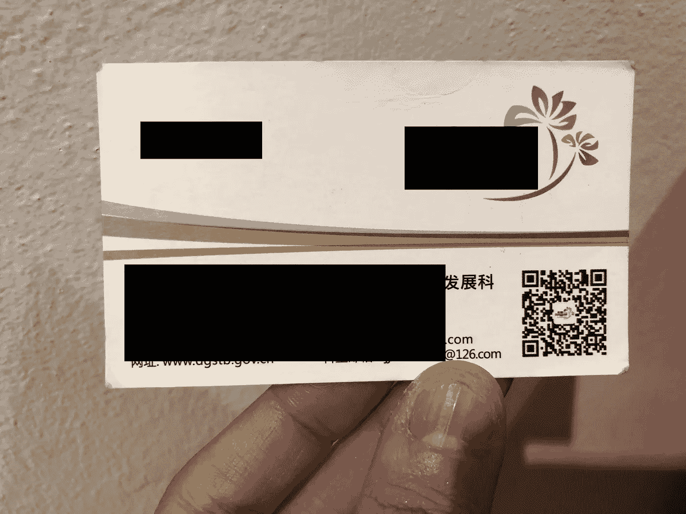

Most business cards now come with a QR code so that people can easily add them on WeChat

在某个小村庄，需要小吃？通过扫描他们的二维码，在微信上支付街头摊贩。

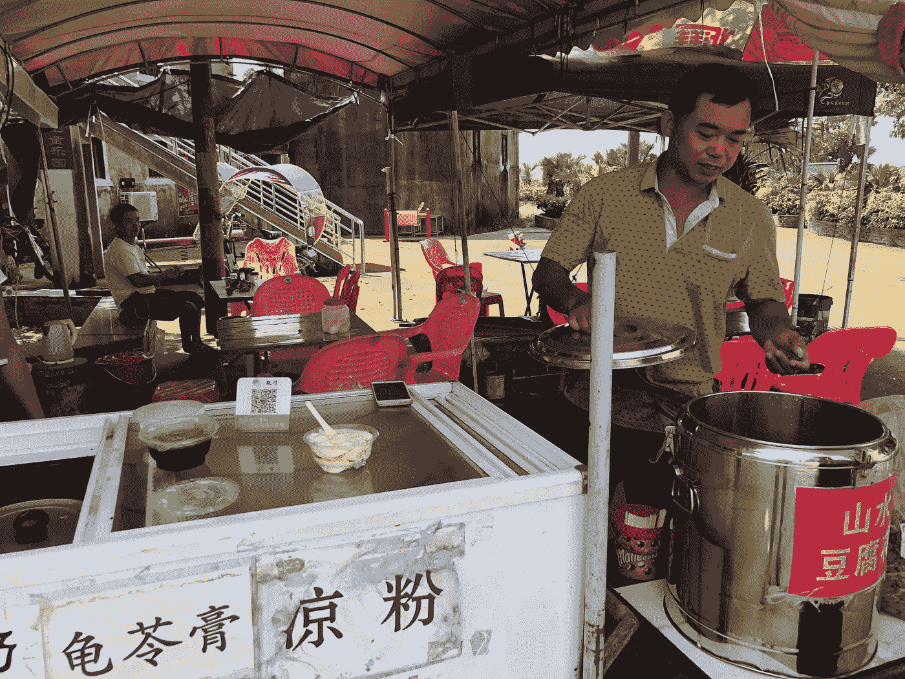

A street vendor in a tiny village with his WeChat QR code displayed prominently.

游览全国，并想了解更多关于你所看到的？扫描二维码，从微信弹出一个音频旅游和中英文描述的地方。

At a heritage building in a little village. Scan the QR code on WeChat to find out the history of the building!

想从自动售货机里喝一杯吗？只需扫描二维码，拿走你的饮料，微信就会自动检测并扣除你所拿走的任何东西的价格。这就像 Amazon Go，只不过这项技术在中国已经存在太久了，没有人再重视它。

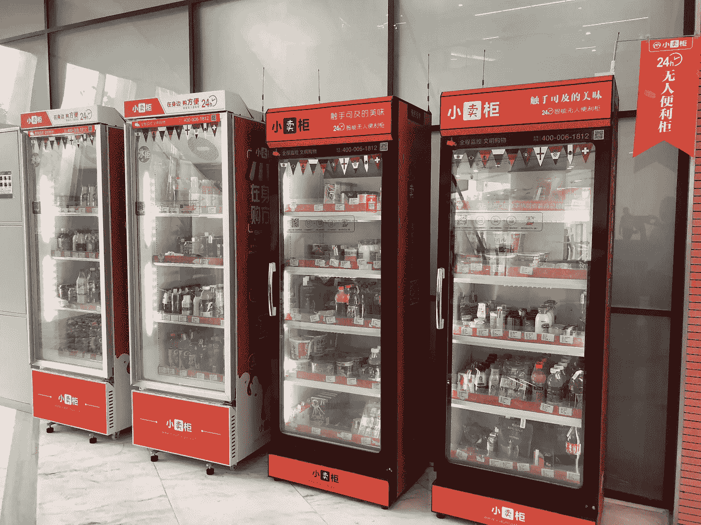

Cashless, automatic vending machines

想在 KTV 上选首歌？扫描屏幕上的二维码，通过微信挑选歌曲。(哦，顺便说一句，他们还可以实时给你的歌唱水平打分！)

Just scan the QR code on your phone to see the song list, choose a song, or send an emoticon to the screen!

你的手机没电了？每小时 1 元人民币，你就可以租一个充电器，当然都可以用微信支付。

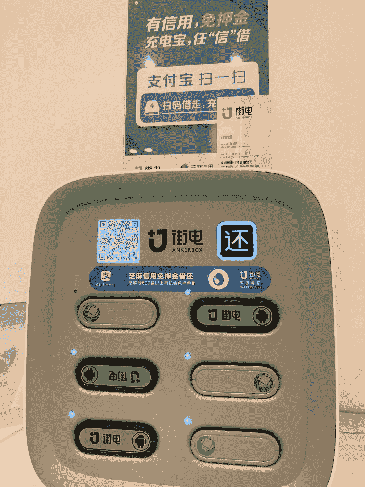

These charger rentals are seen everywhere — such is the reliance of the Chinese on their phones

这还只是皮毛。

***外卖？*** *任何迎合中国市场的商家都需要了解微信及其所有潜在用途。它可以是支付渠道、社交网络、分销渠道、店面等等。它是一个工具。*

【没有中国银行账户，无法将钱转入你的微信支付账户。以前，整个旅行团都会来中国，花几天时间专门设立一个中国银行账户，这样他们就可以使用微信支付了。然而，从 2018 年起，中国政府开始取缔在中国拥有银行账户的外国人，除非他们在中国有商业利益或者是学生。很多银行账户都被关闭了。对于一个没有中国银行账户的外国人来说，向你的微信支付账户注资的唯一方法是请一位中国朋友向其中转账。尽管现金仍然被广泛接受，但微信被认为是更安全的支付方式，因为人们仍然担心假钞的流通。]

# 2.糟糕的服务还没有成为过去，但它在数字世界中很快就会过时

我不知道有多少人会说中国人是优质服务的代名词。中国人一向很有效率——大声喊倒满茶，你可能会得到一个茫然的眼神或者根本没有回应，但你会很快得到你的茶。高效，是的。有礼貌，有服务意识，没那么多。

而且被骗还是有风险的。一个朋友晚上外出后上了一辆出租车，在车启动后，出租车司机告诉他，由于时间已晚，他必须支付 100 元人民币的统一费用。当时是凌晨 4 点，我的朋友累了，所以他同意了。我坐的是下一辆出租车，也许是一辆更诚实的出租车，所以我只需支付 45 元的计价器价格。

对于任何访问过中国的人来说，这些都不足为奇。然而，令我惊讶的是，我发现技术平台上的服务提供商的行为与线下的服务提供商的行为明显不同。

科技平台上的服务提供商表现得更像我在伦敦或新加坡所期待的那样。滴滴出行(中国优步)的司机格外礼貌，我的一个司机甚至特意开了 20 分钟来接我，因为我输入了错误的地址。在任何一次滴滴出行的终点，我都会听到熟悉的副歌:“五星？”

淘宝(中国的亚马逊)上的商家经常在每次购物时放入小礼物来给顾客惊喜。当你得到额外的东西时，购买肯定是一种享受。

我发现技术平台上的用户体验远远好于我已经习惯的平台。比优步好，比亚马逊好。

需要给你的滴滴司机发信息但是你很着急？别担心，你可以点击预设的信息。

你不会说中文？别担心，信息已经为你翻译好了。

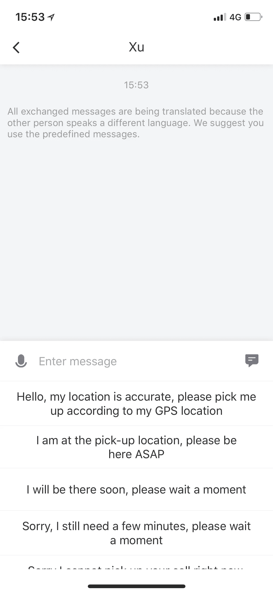

Pre-defined messages that are translated in Didi Chuxing App — so that you can communicate with the driver even if you don’t speak the same language. It also allows for voice messages which is much easier!

你的朋友与你分享了淘宝应用上的一件物品？你需要做的就是复制链接，打开淘宝 app。淘宝会自动检测到你复制了一个链接，会把你转到该商品的页面。

需要在网上买东西吗？没问题，不管商品在中国的哪个地方，平均 1-3 天就能送到你手里。

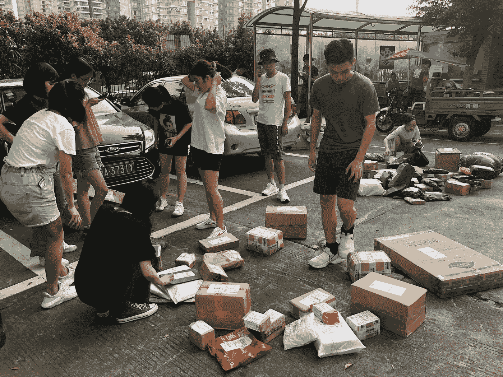

Every day, people wait for their online deliveries that arrive like clockwork

***外卖:*** *糟糕的服务和信任问题仍然严重困扰着线下世界，尽管程度不如以前。然而，在数字世界中，糟糕的服务和信任问题远远落在了尘埃中，因为中国科技巨头们付出了额外的努力来获得客户的信任，并提供无缝的、真正按需的客户体验。事实上，服务水平如此之高，以至于在数字世界满足中国消费者的期望有点令人生畏！*

# **3。你不能夸大政府在中国的作用**

One of the many tech R&D institutes that we visited

在两周的时间里，我们走访了各种新旧行业:科技孵化器、手机制造商、家居巨头、车轴制造商和微信。

每次参观时，带我们参观的人都会首先介绍他们所在地区的政府政策，以及他们的业务如何受到政府政策的影响。政府在推动商业发展方面的作用是不可否认的。

Dongguan was not the industrial city I expected — it had wide tree-lined streets and reminded me of cities in Europe

东莞是一个工业城市，也被称为“世界工厂”，负责生产世界上许多商品(例如，一度，世界上 95%的羊毛制品估计都是在这里生产的)。当中国出口受到 2008 年金融危机的严重打击时，东莞受到的冲击最大。

近年来，东莞将自己重新定位为机器人基地，在这一改造过程中，政府的痕迹随处可见。

我们参观了由政府拨款建立的大型 R&D 中心，这些中心的唯一目的是提高东莞工业的技术水平，使它们能够赶上其技术更先进的邻居——中国的硅谷。

R&D 中心的任务是逐个走访东莞的工厂，评估东莞需要哪些新技术，并帮助东莞工厂弥补技能和技术差距。

这导致了机器人技术的进步，使整个工厂生产线自动化，并提高了工人的技能，使他们能够操作新技术。这样，东莞就不会在深圳繁荣的时候被淘汰，它们会一起繁荣。

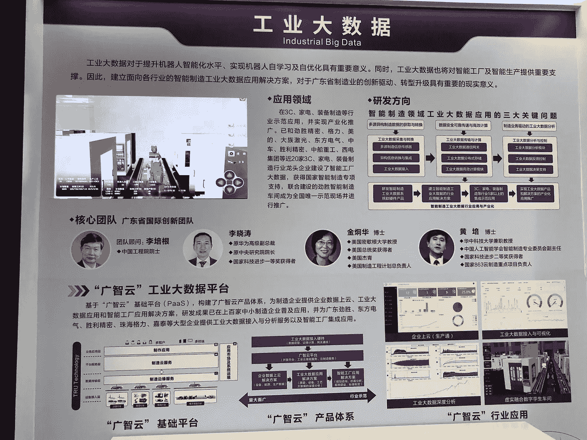

Introduction to some of the technologies they were focusing on

目睹这一切，我不禁想知道，如果英国政府在 20 世纪 80 年代工厂、造船厂和矿山关闭时介入，帮助提升这些行业和工人的技能，而不是让他们变得过时，英国退出欧盟是否会发生。我知道英国退出欧盟不仅仅是关于工作，但是。

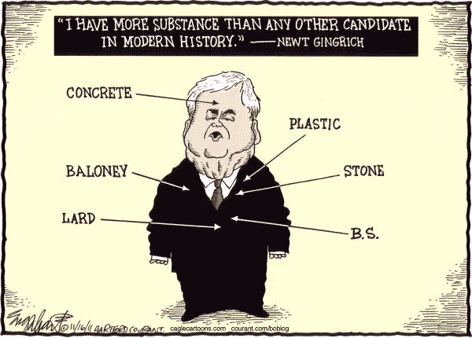

在我们小组中，有一位来自马来西亚的企业家出身的政府官员，她后来评论说，这是她一生中第一次理解政府的目的。在她的整个职业生涯中，她一直怀疑政府的唯一目的是否是政治，只有在中国，她才明白政府在推动经济和实现变革方面的巨大力量。

如果你想知道，这不仅仅是因为我们的访问是由政府组织的。去年，我参加了 INSEAD 商学院组织的另一次中国之旅——参观阿里巴巴、迪士尼、阿斯利康、康宁等公司。主题是相似的:政府政策驱动着中国的一切，因此企业非常关注与政府保持密切联系，并根据政府政策调整自己的商业模式。

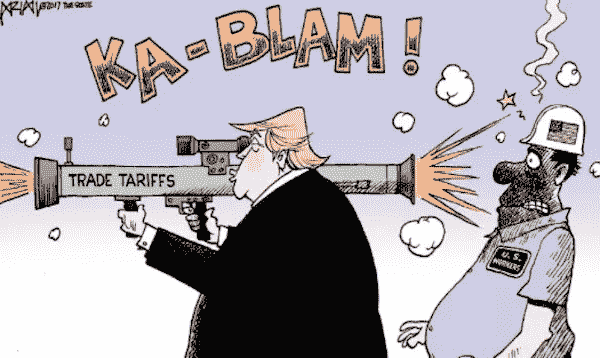

另一端是寻求在美国扩张的中国公司。我们被告知，由于最近的美中贸易战，一些在美国有利益的中国公司现在非常小心，以免被视为与中国政府走得太近。政府赠款已经归还，与政府的接触有所减少。在公司的要求下，我们旅行中最初计划的一些公司参观也被取消了。当政府如此庞大时，企业就需要进行微妙的平衡。

***外卖？*** *在中国，商业的成功与政府的风向有着强烈而直接的关联，这一点或许比世界上任何其他地方都更明显。*

# **4。中国对商业是开放的，希望你知道这一点**

这次旅行是由广东省政府为东南亚企业家组织的，旨在加强华裔与中国的联系。这是我第一次听说这种旅行，但团队中的其他人多年来参加了多次这样的旅行。所有费用已付。这凸显了中国人正在发挥的软实力的程度。

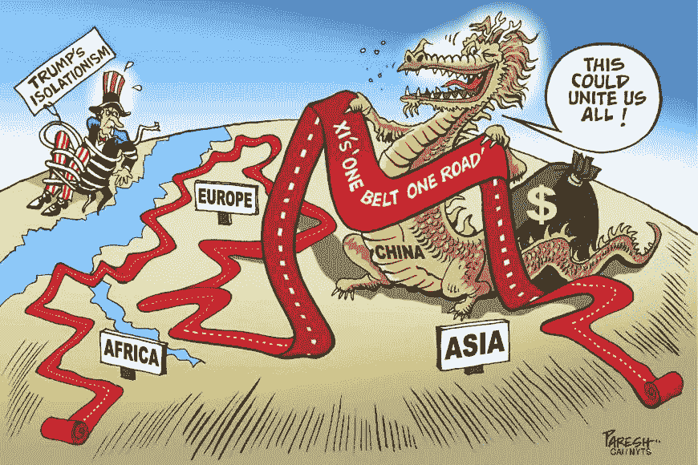

2008 年的金融危机重创了中国的出口，我们被告知，这让中国意识到，美国作为一个贸易伙伴，并不像它最初认为的那样可靠。自那以后，中国加倍努力增加与世界其他地区的贸易。

无论我们去哪里，人们都渴望联系。他们想了解我们国家的机会以及我们如何合作。广州的中国人喜欢榴莲。我们可以做榴莲出口生意吗？食品安全问题困扰着他们中的许多人。我们能通过高速铁路从哈萨克斯坦向中国出口小麦吗？医疗旅游怎么样？只要潜在业务保持足够小，不会威胁到任何国内行业巨头，任何机会都可以讨论。

每次会议结束后，不管和我们见面的人级别有多高，他们都会在微信上加我们为联系人。我们一再得到保证，如果我们想到可以合作的方式，我们应该直接给他们发信息。

***外卖？*** *我们遇到的中国人传达的信息响亮而明确:我们是开放的，让我们一起赚钱。关键是一起。中国政府对国内产业的保护是出了名的，我不认为这种保护会很快消失。*

希望这些观察对像我一样对中国市场感兴趣的创业者有用。我带着满满的想法回来了，对中国所有潜在的商业机会充满了难以置信的希望——对于那些敢于冒险的人来说，这真的是现代的淘金热。