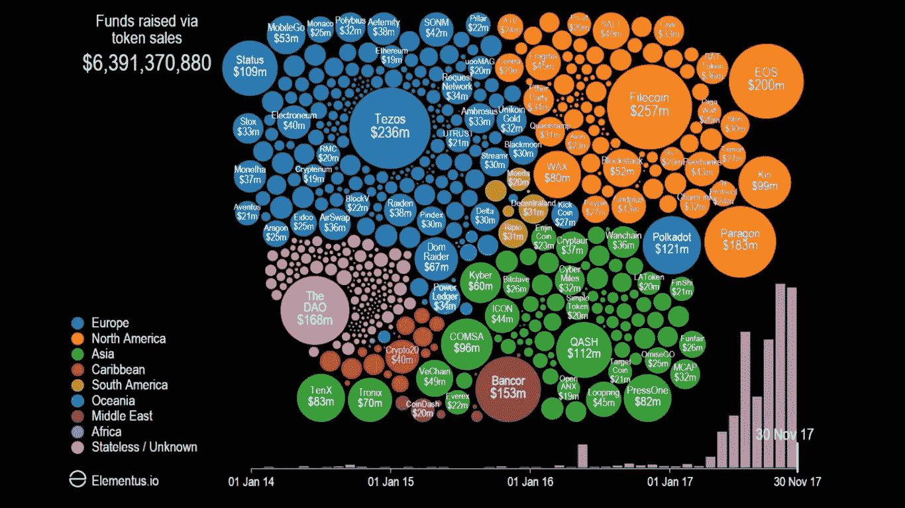
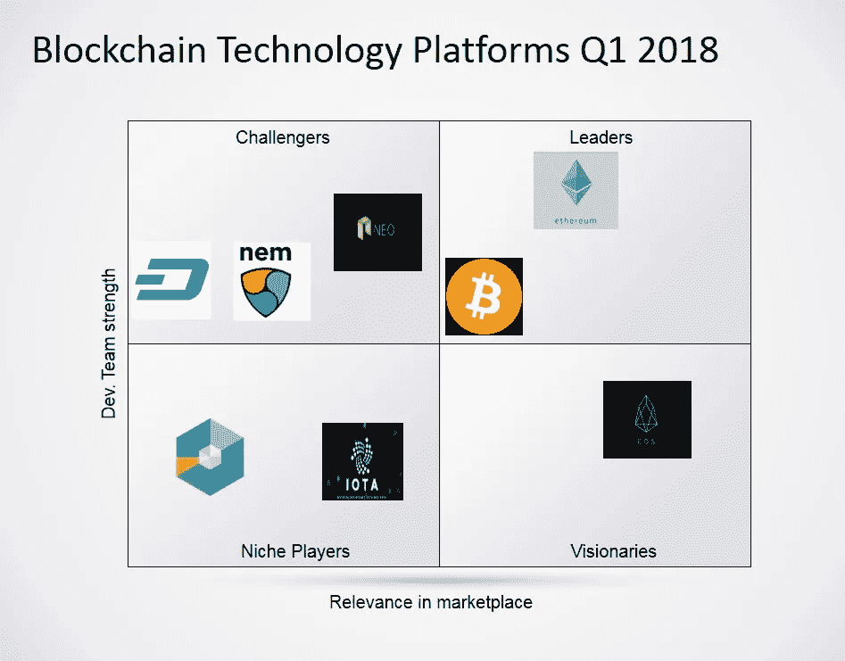

# 区块链技术平台发展简史

> 原文：<https://medium.com/hackernoon/a-brief-history-in-the-evolution-of-blockchain-technology-platforms-1bb2bad8960a>

最近主流媒体上流行的讨论往往是把[区块链](https://hackernoon.com/tagged/blockchain)技术和[比特币](https://hackernoon.com/tagged/bitcoin)分开。像杰米·戴蒙这样在金融领域有影响力的个人以及像高盛这样的机构都在说，区块链会留在这里，也许不只是硬币和代币。这种分离到底意味着什么？我将尝试捕捉过去十年在这个快速发展的空间中发生的关键概念和事件。

**区块链 1.0，比特币爷爷**

戴伟是最早提出 b-money 提案的著名研究人员之一，该提案引入了通过解决计算难题和分散共识来创造货币的想法，但该提案本身在实施细节方面很低。2005 年，Hal Finney 引入了“可重复使用的工作证明”的概念，这是一个使用 b-money 的想法和 Adam Back 的计算困难的 Hashcash 谜题来创建加密货币概念的系统，但也运行在集中式可信后端系统上。区块链最终在 2009 年由远见卓识的中本聪撰写的比特币白皮书中扎根。白皮书概述了建立去中心化货币的协议所需的细节，并在不受对特定国家、州或管理机构有偏见的个人控制的不可信网络上操作该货币。

在最初的几年里，cypherphunk 社区之外的人认为这是一项经济实验。比特币的市场上限代表着足够聪明的黑客们战胜它的奖金。在 2017 年加密货币运行的高峰期，该网络的价值从几千美元上升到超过 3000 亿美元。多年来，这项实验显然变得规模庞大，验证了这项技术，现在是区块链本身的象征。这项技术最终确实展示了它在人和技术方面的一系列缺陷。比特币产生的过程——采矿，开始在内蒙古腹地占据主导地位，就在廉价水电资源的旁边。此外，由于 Satoshi 选择匿名消失，而他藏起来的比特币未被动过，出现了一些人(特别是克雷格·赖特)谎称自己是 Satoshi。几个 rebel 社区开发人员试图管理社区，并通过微小的代码更改创建他们自己的网络，这些代码更改被称为 forks(莱特币和比特币现金在交易量排名前 10 位的硬币中值得注意)。比特币对社区的意义是深远的，并受到大多数后续技术先驱的崇敬。

**区块链 2.0，神童以太坊**

2012 年初，比特币杂志的作者之一 Vitalik Buterin 试图推广这项技术。他亲眼目睹了比特币实施中的问题，如浪费的采矿硬件、集中化的采矿社区和缺乏网络可扩展性。2013 年，当时 19 岁的 Vitalik 描述了他对以太坊的愿景，将比特币的概念扩展到了货币之外。他提出了一个平台，开发者社区和企业家可以在这个平台上为区块链网络构建分布式应用(Dapps)。他将这种超越货币的信任概念称为“智能合约”，甚至是总部位于区块链的“去中心化自治组织”。

以太坊成功地聚集了一个强大的开发者社区，通过企业以太坊联盟(EEA)获得企业支持，并在极短的时间内建立了一个真正的生态系统。迄今为止，它在公共网络上处理的日常事务数量最多。然而，到 2017 年年中，预期显然超过了现实。以太坊市值在市场存在的 3 年内迅速增长到 1000 多亿。这是一个以太价值将超过比特币的事件。在公众关注下，网络无法按照预期发展。像分片、打桩和等离子这样的项目需要研究来改善以太坊网络，并且距离主网络的完成至少还有几个月甚至几年的时间。

以太坊 Dapps 使用新的不受监管的风险资本路线筹集了数百万美元，该路线被称为首次发行硬币(ICO)。创造 DAO 的以太坊 ICO 遭到黑客攻击，价值超过 7000 万美元的代币在几小时内被盗。修复黑客攻击的网络回滚意味着与以太坊不变合同相关的“代码即法律”口号不再正确。有一个以太坊叉子来制作新的以太坊经典(等)。像“状态”这样的 Dapps 在 3 小时内筹集了 1 亿英镑，“蝙蝠”在 24 秒内筹集了 3500 万英镑。巨大的市场潜力加上较低的准入门槛被证明是竞争对手的绝佳选择。没过多久，市场就意识到，如果以太坊网络上只有白皮书而没有工作产品的应用程序可以筹集数百万美元，那么竞争对手的平台肯定会被估价数十亿美元。

*代币销售募集资金，来源—*[*http://www . visual capitalist . com/video-ico-explosion-one-animated-timeline/*](http://www.visualcapitalist.com/video-ico-explosion-one-animated-timeline/)

**区块链 3.0，杀手们**

较新的技术显然有能力提高比特币和以太坊网络的能力，同时克服它们的局限性。我们应该看到他们在 2018 年实现他们的愿景和差异化能力，至少在交易时间和规模方面。对我来说，很难公正地对待这一领域的每一个竞争者。下面是他们的一些主要竞争优势和有争议的时刻的简短总结-

*   NEO 是中国推出的第一个去中心化、开源的加密货币和区块链平台。它被宣传为中国以太坊，并得到马云阿里巴巴集团的支持，绝对有可能成为下一个百度(在一个由谷歌搜索主导的世界里)。此外，NEO 持有人获得免费汽油代币，谁不喜欢免费红利呢？
*   无块链 IOTA 是作为一个加密货币平台推出的，针对要求苛刻的物联网(IoT)生态系统进行了优化。IOTA 对该公司称为 Tangle 的传统区块链进行了改造，声称可以提供零费用交易，以及解决许多与比特币相关的可扩展性问题的独特验证过程。当麻省理工学院技术评论的迈克·奥克特发表了一篇题为“[一种没有区块链的加密货币已经被建立起来，其表现优于比特币](https://www.technologyreview.com/s/609771/a-cryptocurrency-without-a-blockchain-has-been-built-to-outperform-bitcoin/)”的文章时，他们迎来了他们的 DAO 黑客时刻在文章发表的同一周，麻省理工学院媒体、DCI 和伊藤约伊发表了一篇专栏文章，反驳《麻省理工学院技术评论》的报道。他们
*   为期一年的资金筹集，EOS-这是一个强大的和有方法的团队，其愿景是建立一个全面的平台，解决 bu 的大多数问题。他们的筹款活动本身是经过一年精心策划的，他们的白皮书也很值得一读。到目前为止，实际的网络、开发人员和产品发布都很有限。绝对要小心！
*   专注于商业的区块链公司 QTUM——Quantum 声称将比特币的核心基础设施与以太坊的虚拟机版本相结合，通过智能合约提供充满可能性的区块链，并针对业务成果进行优化！
*   没有象征性的出售，Radix-一个没有资金筹集的秘密团队，7 年来一直埋头开发。他们为 2018 年准备了什么？
*   更名后，Nano- RaiBlocks 现在是 Nano，该团队使用了一种类似于 IOTA 团队描述的 tangle 方法的块晶格结构。Nano 希望在比特币失败的地方取得成功。加密货币承诺实时交付零费用交易，而没有比特币那样的劳动密集型开销和能源消耗。一个月之内，它在一个欧洲交易所的市值达到了 40 亿，然后这个交易所(BitGrail)最近被黑了！

此外，还有其他小众的第二代平台，如 Monero、Zcash、Dash，它们与以太坊几乎同时推出，侧重于安全性和规模等方面，但没有产生同样的影响。他们绝对有潜力在当前的市场中成长并产生影响。下面是一些会成为头条新闻的-

*   NEM，日本以太坊——强烈的愿景和团队建设，核心关注安全性和规模。NEM 的方法是让开发者使用广泛的功能，基于一组封闭的原子操作构建强大的应用程序。最近，他们在日本最大的外汇硬币支票遭到黑客攻击，价值 3 . 73 亿美元的代币被盗。
*   支付代币，Ripple & Stellar——在我看来，这些是使用代币的支付网络，而不是区块链技术的进步！
*   基于区块链的传销，bit connect——还需要我多说吗？你应该从监管者那里听到更多！

在我个人看来，下图代表了平台目前所处的位置-

我上面讨论的所有平台都是公共区块链网络。大型企业正在雇佣员工，并在公司内部试验这项技术。这些公司实验的目标和结果还没有公布。像 IBM 和微软这样的公司也使得在一个许可的操场上快速推出云版本的技术变得非常容易。

在区块链技术受到如此多主流关注的情况下，婴儿潮一代不断提醒我 VHS 是如何杀死 VCR 和 Betamax 的。千禧一代非常清楚，谷歌粉碎了他们之前创建的众多搜索引擎。区块链技术发展的速度 Z 世代和 Aplha 世代可能没有听说过这篇博客中描述的大多数平台。

我个人可以打赌，当今市场上最好的人工智能或量子技术都无法预测 2018 年区块链短跑的结果！

请分享您的意见和反馈。如果你觉得这值得一个拥抱，考虑 100 次鼓掌！