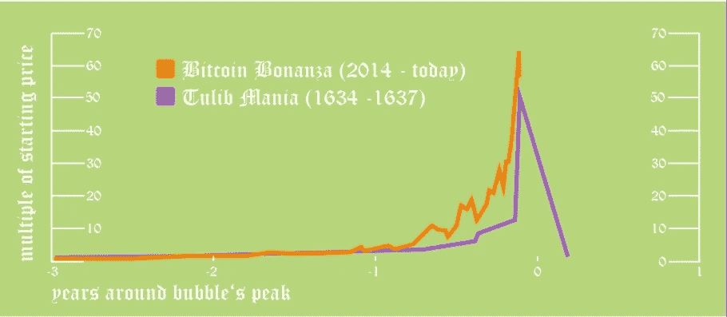
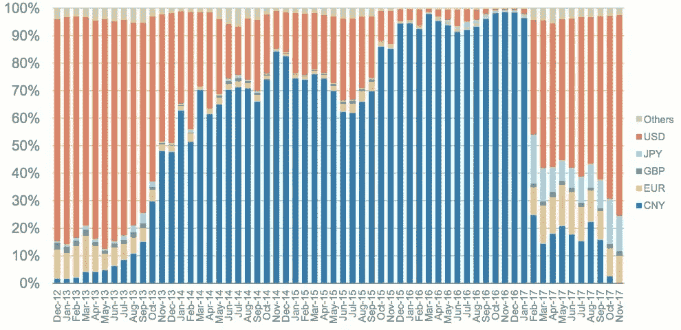

# BitCon 简史

> 原文：<https://medium.com/hackernoon/a-brief-history-of-bitcon-cf358da30bf0>

从一开始，这就是一个谜。2008 年，一个化名中本聪的人向一个加密邮件列表发表了一篇论文。它被称为[比特币:一种点对点的电子现金系统](https://bitcoin.org/bitcoin.pdf)。

很少有人知道，在其鼎盛时期，它将建立一个价值 8000 亿美元的整个市场(T2 密码市场)。这比可口可乐、麦当劳、福特、卡特彼勒、耐克、任天堂和高盛的总和还要多。现在，在巨额财富的支持下，一些人认为这个 PDF 有可能颠覆整个全球银行业。

这场战斗的一方是一群不知名的 cyrptographers，他们试图打破现状。另一边是美国政府、欧盟、摩根大通和德意志银行。

全球创造货币的政府如果受到严重挑战，将会不择手段保持对本国货币体系的控制。他们可能会在 50 万亿美元的银行业中找到一个资金雄厚的盟友。货币战争可能是当代最关键的战争，因为胜利者将决定发展中经济体、税收、通货膨胀、恐怖主义以及——很有可能——民主本身的命运。

你可能会认为，在如此危急的情况下，这篇臭名昭著的论文的作者会走到聚光灯下。在比特币迅速崛起的过程中，当创造者的个人财富超过 10 亿美元时，你会想象有人会发现他。当他的财富达到约 194 亿美元时，你会以为国税局会来敲门。

但是没有人能够找到神秘的中本聪。这也是比特币吸引力之一。对于那些不知道的人来说，[比特币](https://hackernoon.com/tagged/bitcoin)就像一个数字美元。2009 年价值不到[十分之一美分](http://newlibertystandard.wikifoundry.com/page/2009+Exchange+Rate)，2017 年价值[两万美元](https://coinmarketcap.com/currencies/bitcoin/historical-data/?start=20130428&end=20180122)。几天之内，它的价值可能会翻倍。它的价值波动很快。这是它的问题之一。但比特币最棒的部分是唯一不变的。如果你知道自己在做什么，就很难找到。大部分是匿名的。

从洗钱者到贩毒者到诈骗犯，每个人都对匿名信息感兴趣。就其本质而言，比特币很难监管。一些很难监管的东西使得欺骗很多法律来赚很多钱变得很容易。

如果你在 2009 年购买了价值 10 美元的比特币，你现在会坐拥整整 2 亿美元。这就是一般人关注的新闻标题类型。所以新闻网开始报道这件事。你的朋友开始买了。似乎任何在比特币上投入几块钱的人都在用一桶桶黄金套现。因此，疯狂开始于 2017 年，当时比特币从技术专家的玩具和有组织犯罪的推动者变成了几乎每个人的祖母都持有的普通投资。

我不是来告诉你比特币是泡沫的，因为我根本没有资格证明这一点。专家们仍在争论[比特币是一种商品、一种证券、一种价值储存手段、一种货币](https://www.forbes.com/sites/jeffreydorfman/2017/05/17/bitcoin-is-an-asset-not-a-currency/)，还是某种全新的资产类别。因此，我甚至不会开始估算比特币的真实*价值*。我甚至不确定这是否有意义。此外，如果我能以某种方式知道，如果我有一些秘密的，透视能力知道比特币的价格走向，我会投资，而不是写这篇文章。

我在这里要做的是:告诉你关于骗子。因为他们无处不在。这太明显了。如果你有一些比特币，或者你正在考虑购买一些(或任何其他[加密货币](https://hackernoon.com/tagged/cryptocurrency))，你最好知道骗子有多坏。因为当你是交易所里消息最不灵通的人时，你会被带到银行。

## 兔子洞有多深？

2009 年 1 月 3 日，中本聪建立了[创世纪区块](https://en.bitcoin.it/wiki/Genesis_block)。这是他“开采”第一枚比特币的一种奇特说法。

他不会带着鹤嘴锄去马达加斯加的某个山洞，然后带着闪亮的贵重金属回来。他在电脑上运行了一段时间哈希算法，并将结果存储在一个账本中。我们称这个分类账为“区块链”。是[公开信息](https://blockchain.info/block/000000000000000000727986daa00511da13e5d8a911ee0a0348cef6cd8d88e2)。它之所以公开是因为它是分布式的。分散的原因是，与美元不同，如果你得罪了某个政府官员，你的资产几乎没有被冻结(或被盗)的风险。

区块链是一项相当革命性的技术。神秘的中本聪向公众发布创世纪区块后，密码发烧友们注意到了。他们中的一些人开始“挖掘”比特币。他们中的一些人做这件事是出于好心。但是，他们中的许多人可能是受到了奖励的驱使，这给了“采矿”一个名字。当您对交易块运行此哈希算法并将结果存储到公共分类账中时，[将获得比特币](https://www.bitcoinmining.com/what-is-the-bitcoin-block-reward/)的奖励。在巅峰时期，这一奖励可能会超过 25 万美元。

当第一批矿工注意到的时候，比特币已经没有任何价值了。但矿工们希望，在未来，它会。在 10 个月内，他们被证明是正确的。2009 年 10 月，[新自由标准设定了比特币](http://newlibertystandard.wikifoundry.com/page/2009+Exchange+Rate)的汇率。这是密码货币早期不为人知的日子。价值被设定在 1 美元兑 1，309.03 BTC 的低价，即约 0.0007 美元。这不是一个快速致富的骗局。新自由标准从计算机产生的电力成本中得出价格，或称“我的”，货币。

快进 10 个月，第一笔比特币交易就出现了。此前，数十名用户相互购买了比特币，但在 2010 年 5 月 22 日，一位名叫拉兹洛的比特币聊天用户用比特币购买了一些东西*。具体来说，拉兹洛用 1 万 BTC 从另一个用户那里买了一个比萨饼(比特币高峰期为 2 亿美元)。*

几个月后，也就是 7 月，Slashdot 拿起了这个故事。比特币的价值在 5 天内从 0.008 美元升至 0.08 美元。这是 10 倍的增长！这是一种受到关注的增长类型。

随着关注而来的是丑闻。整整一周后，事情开始变得不明朗。总部位于东京的万智牌扑克牌交易公司 Gox mt .开始运营比特币交易所。需求飙升，2011 年 3 月 6 日，杰德·麦卡勒把 mtgox.com 卖给了马克·卡普莱斯。

马克·卡佩斯是那种让华尔街之狼看起来像圣人的人。在他接管 Mt. Gox 的一个月前，比特币的价格达到 1 美元。这比 7 个月前 Slashdot 事件发生时的价格上涨了 125 倍。比原值增加了 1，309.03 倍。你在华尔街找不到这样的回报。你也找不到这种类型的狼…

当理智的人看到这样的价格上涨时，他们开始怀疑资产是否被夸大了。马克.卡佩斯不认为。实际上，他赌上了一切，认为价格会继续攀升。对你来说，这听起来很冒险。但是有了手中的交易，马克·卡普莱斯可以保证价格上涨。既然担保并不是真正的风险，马克·卡佩斯接受担保也就不足为奇了。

几周之内，他发现自己面临一些竞争。[另外三家比特币交易所开业](https://web.archive.org/web/20120331084706/https://bitcointalk.org/index.php?topic=5441.0)，允许用法定货币购买比特币。英国币将 BTC 兑换成英镑，比特币巴西将 BTC 兑换成美元和 BRL，最后， [BitMarket.eu](http://bitmarket.eu/) 将比特币兑换成欧元。

随着比特币现在可以很容易地与几乎所有主要货币兑换，只需要两个月，到 6 月 1 日，价格就会再次上涨 10 倍。同一天， [Gawker 发表了一篇关于丝绸之路的文章](http://gawker.com/the-underground-website-where-you-can-buy-any-drug-imag-30818160)，这个网站允许你购买从海洛因到暗杀你丈夫的任何东西。用户可以用比特币购买这些东西，而且只能用比特币。购买是匿名的。

可以预见的是，当公众发现这一切有多么容易时，对比特币的需求就会飙升。它不再是技术专家的玩具。它在促进毒品转移方面具有真正的、切实的价值。每个人都想通过邮购的方式买到高质量的娱乐性药物。因此，比特币的价格在发布后一周内攀升至 31 美元。

撇开购买的谋杀不谈，比特币世界的前景并不乐观。2011 年 6 月 19 日 [Mt. Gox 被黑](http://www.zdnet.com/blog/security/bitcoin-market-flash-crash-and-database-leak-from-mt-gox/8811)。攻击者获得了对数据库的访问权。有了所有的用户名和密码，攻击者从随机账户出售比特币，直到比特币的价格暴跌至 0.01 美元。

不过，这个攻击者并不是最锋利的工具。Mt. Gox 很容易解决这个问题。交易所关闭，撤销交易，一切正常，至少在 Mt. Gox 上是这样。比特币的价格重新稳定。但是攻击者使用相同的用户名和密码来入侵 600 多个用户的钱包。他总共拿走了大约 5 万美元。

就金融犯罪而言，这一个相当微不足道。华尔街的普通银行家在午休时偷的钱比这还多。但这是一个先例。这表明分布式账本并不都是有利的。它有它的缺点。随着这种活动变得越来越普遍，弊开始看起来不值得进行权衡，被盗金额将持续增加，直到 2018 年 1 月 26 日——[一次黑客攻击中被盗 5.3 亿美元](https://www.reuters.com/article/us-japan-cryptocurrency/tokyo-based-cryptocurrency-exchange-hacked-losing-530-million-nhk-idUSKBN1FF29C)。

第一次被黑几周后，[比特币基地/ GDAX 在美国开始运营](https://en.wikipedia.org/wiki/Coinbase)。不久之后，Bitstamp 在卢森堡上映。并且在 2011 年 10 月 7 日，全球第二种加密货币发布:[莱特币](https://en.wikipedia.org/wiki/Litecoin)。

在接下来的一年里， [Linode 将被黑客攻击](https://arstechnica.com/business/2012/03/bitcoins-worth-228000-stolen-from-customers-of-hacked-webhost/)，导致价值 15 万+美元的比特币被盗。[比特币代码库首次分叉](https://bitcoin.org/en/alert/2013-03-11-chain-fork)，投资者担心矿工们会运行哪个版本的比特币(如果有的话)。最后，[比特币经历了第一个“减半日”](https://blockchain.info/block/000000000000048b95347e83192f69cf0366076336c639f9b7228e9ba171342e)——开采一个区块的奖励减半。随着回报下降，投资者担心矿商会退出，一些实体将成为“51%矿商”。

供参考，[一个 51%的矿工可以控制比特币的历史](https://www.investopedia.com/terms/1/51-attack.asp)。这意味着，矿商可以说，它想要的任何人都可以拥有它想要的任何比特币。因此，如果你拥有 100 万美元的比特币，矿商可以说你没有——如果它愿意的话。如果它愿意，它可以说它拥有世界上所有的比特币。你没有发言权。

组织开始尝试实现这一点。毕竟，比特币目前价值约 8200 万美元。如果这不是一个好的激励，我不知道什么是。

但在 2013 年 3 月 25 日，比特币取得了关键性的胜利，缓解了这些担忧，并开启了第一个比特币泡沫。欧洲中央银行和国际货币基金组织对塞浦路斯的救助达到了€10B 的规模。救助的条件之一是对持有超过€10 万欧元的塞浦路斯银行账户征收高额税款。

由于塞浦路斯在当时是[一个受欢迎的全球避税天堂](https://www.investopedia.com/ask/answers/060616/cyprus-considered-tax-haven.asp)，尤其是对俄罗斯人来说，恐慌随之而来，人们匆忙将资金转移出塞浦路斯。据说，*塞浦路斯持有的数十亿欧元中有一部分通过在塞浦路斯购买比特币并将其出售给另一个国家的账户而被清洗。就洗钱而言，这是革命性的。由于比特币是一种新技术，并且由于其密码性质，洗钱从未如此容易，但追踪起来却如此棘手。十天之内，比特币的价值翻了一倍。在 20 年内，它几乎翻了三倍，交易量的增加打破了 Mt. Gox 的记录，这是当时最受欢迎的交易所。*

而这才是比特币真正的神秘之处。

比特币的价格是由它洗钱的效用决定的吗？还是说几乎完全是个骗局？我曾经认为，中国的资本外逃和洗钱(主要是为了避免对俄罗斯的国际制裁)是比特币价格上涨的主要原因。但证据确凿，2013 年的价格上涨几乎完全是 Mt. Gox 欺诈的结果。

资本逃离塞浦路斯只是一个方便的说法，让人们相信价格上涨。正如金融泡沫中经常发生的那样，真实的故事是欺诈。

## 如何凭空制造 6.5 亿美元

如果纽约证券交易所没有受到严格监管，你会疯狂地把钱投入股市。[华尔街的交易员们可以使出几十种伎俩来窃取你的血汗钱。值得庆幸的是，随着这些把戏被揭露出来，其中大部分都变成了非法的。这使得像你我这样的普通人参与市场相对安全。](https://en.wikipedia.org/wiki/Market_manipulation)

不过，Mt. Gox 不是证券交易所，因此不受监管。因此，当所有比特币的价值超过 2.5 亿美元时，华尔街被禁止的把戏很快就会进入 Mt. Gox。

其中一个技巧叫做“[画胶带](https://www.investopedia.com/terms/p/paintingthetape.asp)”。超级好理解。

在 Mt. Gox 这种原始交易所的比特币这种原始市场，所有比特币的价值都是由比特币的最后一笔交易决定的。

不管比特币的总价值是 2.5 亿美元，你买的只是价值 5 美元的东西。如果在你购买之前，一个比特币的价值为 4.95 美元，那么你以高于要价 5 美分的价格购买一个比特币的行为，会影响其他 1500 多万个比特币的价值。这意味着，通过向比特币添加非常少量的钱(5 美元)，你可以将整个“市值”增加 75 万美元。

你为什么要这么做？好吧，如果你拥有 10 万个比特币，通过以略高于要价的价格购买一个比特币，你就赚了 5000 美元。我不知道你怎么想，但如果我能每天花 5 美元，赚 5000 美元，我会这么做。人们开始在 Mt. Gox 上这样做。

到 2013 年 9 月 27 日，[几乎无可争议的证据表明，马克·卡普莱斯](https://willyreport.wordpress.com/2014/05/25/the-willy-report-proof-of-massive-fraudulent-trading-activity-at-mt-gox-and-how-it-has-affected-the-price-of-bitcoin/)——或 Mt. Gox 内部的某人——在画带子。如果一些普通投资者这样做，可能只会遭到反对。这里的真实情况是，因为 Mt. Gox 正在这样做，因为他们拥有交易所，他们能够购买 5 美元的比特币，而无需在系统中添加 5 美元。

在接下来的五个月里，每隔 5-10 分钟，一组账户中的一个账户就会在 Mt. Gox 上购买 10-20 个比特币。两个月后，到 2013 年 11 月 29 日，比特币的价格将从 128 美元上涨到 1132 美元的峰值。

有了资本外逃的说法——富人成群结队地购买比特币来洗钱——大多数人认为需求是合法的，即使比特币的市值飙升至数十亿美元。但是一个巨大的问题随之而来。故事开始溜走。

2013 年是缩减恐慌年。债券市场是巨大的。[它让股票市场看起来像是穷人和傻瓜的市场。因此，当债券价格开始上涨，人们开始担心中国政府正在走上一条与 90 年代早期](https://www.fool.com/knowledge-center/5-bond-market-facts-you-need-to-know.aspx)[日本](https://en.wikipedia.org/wiki/Japanese_asset_price_bubble)惊人相似的道路时，富裕的中国公民开始[将他们的钱撤出中国](https://www.forbes.com/sites/kenrapoza/2013/08/31/imf-warns-china-on-capital-flight/#3b044f5a69a2)。在顶峰时期，他们一年拿出一万亿美元。

一万亿美元是一大笔钱。但是中国人得到了它。和美国的前 1%一样，中国的前 1%也过得相当不错。但是中国的人口太多了，最富有的 1%人口达到了惊人的 1400 万。他们中的很多人都是百万富翁。事实上，他们都想把钱投到别处。他们中的大多数人开始在世界各地购买房地产。[加拿大](https://www.bloomberg.com/view/articles/2017-06-21/canada-s-housing-bubble-will-burst)澳大利亚房价达到疯狂。我的意思是，全加拿大只有 700 万套独立的家庭住宅。1400 万中国人想在那里买房会怎么样？价格飞涨。

因此，一些中国人注意到了俄罗斯人在塞浦路斯的所作所为。他们开始购买比特币，而不是房子。一些中国交易所的开业为此提供了便利。但在 2013 年 12 月 5 日，[中国政府禁止金融机构使用比特币](https://www.nytimes.com/2013/12/06/business/international/china-bars-banks-from-using-bitcoin.html)。

尽管 Mt. Gox 的内部人士试图将泡沫化为乌有，但股价还是暴跌了 40%以上。随着故事的结束，每个人都在抛售。基本上，唯一还在购买比特币的人就是 Mt. Gox 的那群可疑账户。

你会问，这些账户有什么可疑之处？一些事情。根据 Mt. Gox 自己发布的[公开日志](http://thepiratebay.se/torrent/9732163/2014_Mt._Gox_Leak)，所有这些账户的 id 对于普通用户来说都太高了。看，数据库的工作方式是，当一个新的条目被添加时，它得到一个 ID。[ID 是连续的](https://stackoverflow.com/questions/1649102/what-is-a-sequence-database-when-would-we-need-it)，所以第一个用户的 ID 是 1，第二个是 2，依此类推。普通用户的最高 ID 是 10，000。所有这些磁带绘画账户都有超过 600，000 个 id。此外，所有常规用户帐户都有一个“用户国家”和“用户州”条目。但是这些高 ID 账号没有。他们的价值观都是“！!"。这意味着它们很可能是由某个人手动添加的——很可能是 Mt. Gox 内部的某个人。

第二，在 Mt. Gox 因“维护”而多次关闭期间，这些账户能够进行交易。这些“维护”期通常是未经宣布的，而且往往与比特币价格的大幅下跌同时发生。关于需求问题的一个有趣的事情是，只有一次当价格上涨时，它导致了停电。然而，几乎每次价格下跌，都会出现需求问题。

但最后，也是最可疑的是，尽管这些账户不断从普通用户那里购买比特币，但它们只卖给其他身份可疑的账户。这些销售的真正奇怪之处在于，它们根本不是销售，因为它们是免费出售的。本质上，这些交易是礼物。

那么 Mt. Gox 哪里来的钱不断购买比特币，然后免费赠送呢？2014 年 2 月 7 日，纸牌屋开始分崩离析。[DDoS 攻击袭击了所有主要交易所](https://www.forbes.com/sites/leoking/2014/02/12/bitcoin-hit-by-massive-ddos-attack-as-tensions-rise/)。其他交易所迅速重新开放，但 Mt. Gox 停止了撤资。他们停止撤军，直到 2 月 24 日。如果没有 Mt. Gox 绘制磁带，在短短 17 天内，比特币的价格将暴跌近 25%。

早在一年前的五月，富国银行在 Mt. Gox 发现了一些奇怪的东西。马克·卡普莱斯对这些问题的回答是“不”，“你是否为你的客户交易或兑换货币？”以及“您的企业是否接受客户的资金，并根据客户的指示发送资金(转账)”？富国银行不这么认为，并向国土安全部通风报信，国土安全部随后从 Mt. Gox 手中没收了近 300 万美元。

从被查获到现在，Mt. Gox 花了大约 3 个月的时间开始给胶带上漆。目前还不清楚国土安全部缴获的资金中有多少是 Mt. Gox 公司的，有多少是他们的客户的。也许 Mt. Gox 是出于不得已而操纵市场，为客户挽回一些损失。但有一点很清楚，那就是他们没有 300 万美元在 5 个月内每 5-10 分钟购买 10-20 个比特币。

Mt. Gox 的这些收购实际上是在伪造货币。对美国政府来说，伪造美元比强奸婴儿更构成犯罪。它不会掉以轻心。

2014 年 2 月 24 日，Mt. Gox 无法继续维持这项计划。它永远关闭了。交易所里还有比特币的人损失了一切，确切地说是 74.4 万枚左右。你知道这个数字有什么奇怪的吗？这群 id 可疑的账户其实是在白买比特币，从而将比特币价格推高了 10 倍——你知道他们 5 个月里买了多少比特币吗？大约 72 万。非常接近损失的金额…

如果让你大胆猜测一下马克卡佩勒斯到底怎么了，你可能会认为他最终还是进了监狱。你错了。Mt. Gox 通过破产程序偿还给日本日元客户的款项相当于每枚比特币 400 美元。这对于他们来说是相当糟糕的，因为大多数比特币都是以大约 1200 美元的虚高价格购买的。[马克卡佩勒斯把剩下的留给了 T4，现在这笔资金大约有 20 亿美元。](https://news.bitcoin.com/winner-mt-gox-trial-mark-karpeles/)[他确实被“逮捕”了](https://en.wikipedia.org/wiki/Mark_Karpel%C3%A8s)，但只是手腕上挨了一下。

如果你认为别人没有注意到你，那你就是疯了。BitFinex 的兄弟们像崇拜偶像一样崇拜马克卡佩勒斯。但他们现在的做法让马克卡佩勒斯看起来像罗宾汉。

## 比特币和文克莱沃斯兄弟

接下来的两年，比特币笼罩在丑闻之中。如果没有一大群井然有序的账户，比特币的交易量就会枯竭。2015 年 10 月 18 日，金价小幅波动，大多在 600 美元左右至 245 美元的低点之间。但从那以后，比特币的价格就开始一涨再涨，再也没有跌破过。实际上，如果第二天不立即(而且神秘地)回升，比特币价格就不会再次大幅下跌。

2015 年 10 月 18 日，文克莱沃斯兄弟开设了双子座交易所。该交易所仅处理所有加密货币交易量的 1-2%。这在某些方面是革命性的，但也是相当微不足道的。它真的是创造 7000 亿美元财富的驱动力吗？我表示怀疑。但比特币的价格在交易所开业的当天触底，并从此开始上涨，这是巧合吗？我也很怀疑。

你可能听说过文克莱沃斯兄弟。据说他们发明了脸书，并起诉马克·扎克伯格索赔几亿美元。他们在阿伦·索尔金讲述的《社交网络》中扮演邪恶的反派兄弟。他们可能会在比特币上做同样的事情。

就像任何好的神秘事件一样，他们从一开始就显得天真无邪。Gemini 在交易所中是独一无二的，因为它获得了在美国 26 个州运营的许可。[交易所完全符合美国法律](http://www.dfs.ny.gov/about/press/pr1701172.htm)。此外，[多亏了一家纽约银行，Gemini 的客户存款得到了联邦存款保险公司的保险](https://gemini.com/security/)。老实说，这是当时最有声望的交易所(可能直到今天也是)。

但人们不需要花几分钟探索区块链，就能挖掘出文克莱沃斯兄弟的一些丑闻。他们最初在比特币基地开始交易的当天购买了大约 40，954 BTC。这似乎是一个可怕的投资，因为他们的硬币价值在几个月内损失了 85%,或超过 55 万美元。但是随着价格的下跌，文克莱沃斯兄弟仍然充满信心，在此期间，他们又以大约 36.8 万美元的价格购买了 70，160 辆 BTC。当然，这是一个非常好的决定。当年晚些时候，由于 Mt. Gox 抬高了比特币的价格，他们的比特币价值达到了 1.26 亿美元。2014 年 3 月 9 日，也就是 Gox 山崩塌整整 13 天后，[文克莱沃斯兄弟试图通过“混合”他们的硬币来掩盖他们的踪迹](https://blockchain.info/address/15ihHoGs3onQBNnEH8afDFGvou9nD62Hm7)。然后，他们在 2013 年 5 月向 Charlie Shrem 的 BitInstant 注入了 150 万美元，从而将投资翻倍。BitInstant 会被判洗钱罪，Charlie Shrem 会因与丝绸之路的联系而入狱，但那是两年后的事了。最好不要跳过前面…

在 Mt. Gox 关闭前几天，一个独立的交易所 BitFinex 开始交易。BitFinex 是双子座的对立面。双子座看似有声望，BitFinex 几乎是明目张胆的黑幕。那么这两个交易所有什么共同点呢？

嗯，大约在文克莱沃斯兄弟开设双子座交易所的六个月前，BitFinex 推出了一种叫做 Tether 的新型加密货币。Tether 是一种有趣的加密货币，因为它是由美元支持的。如果你看一下历史数据，看看系绳的价格历史，在任何交易所，它总是说价格是 1 美元。

你不知道的话，美元以前是有黄金做后盾的。你可以把美元交给政府，他们会从你手中拿走，给你一些黄金——如果你想要的话。美国政府不再这么做了。不需要。但这是系绳背后的想法。BitFinex 声称它是由美元支持的。但是还没有人将一个系绳重新兑换成美元。

在引入后的几个月里，Tether 仍然微不足道，就像一条等待的蛇。但是大约在文克莱沃斯兄弟开设双子座交易所的时候，Tether 露出了它丑陋的一面。

在此之前，每天只交换几百美元的系绳。这些*可能*代表系绳的合法用途。但是奇怪的事情发生了。突然，随着双子座交易所的出现，更多的系绳开始被交易。在几个月内，到 2016 年 2 月 3 日，超过 100，000 美元的系绳被交易，并且该价值再也没有跌破 10，000 美元。

这些系绳突然从哪里来的？BitFinex 是不是和 Mt. Gox 一样，什么都没有就买比特币？在这种情况下——至少——BitFinex 是用某种东西来购买它们的:具体来说就是系绳。但是这些系绳有真实的美元做后盾吗？Gemini 交易所开业后不久，BitFinex 修改了 Tether 的服务条款，明确声明它是由美元支持的**而不是**。在任何情况下，系绳公司都没有义务用一美元赎回一根系绳。

几天后，在 2015 年 12 月 1 日，[用代币](https://omniexplorer.info/default.aspx?filter=grant)授予了 50 万美元。突然间，每天有 10 万美元以上的比特币通过 Tether 进行交易，在这一点上，这基本上是垄断资金。如果 Tether 的运行方式与 Mt. Gox 的账户绘制磁带的方式相同，如果它每 5-10 分钟购买 10-20 个比特币，它每天将购买约 2160 个比特币。这相当于价值 90 万美元的比特币。

到 2016 年 2 月 3 日，Tether 的销量远低于 90 万美元。但同样，价格的上涨远远落后于 Mt. Gox 的日子。Mt. Gox 只用了两个月就把比特币的价格膨胀了 10 倍。双子座开市后的两个月系绳交易中，比特币价格上涨，但甚至没有翻倍。因此，注入比特币的虚拟货币量的 1/9 显然影响较小。

或许 BitFinex 在这一点上只是在试水。也许他们在等待合适的时机，在市场上全力释放系绳。也许他们和文克莱沃斯是一伙的。也许任何事。上一次价格爆炸中缺少的一件事是叙述。

但故事开始成型后，文克莱沃斯兄弟打开双子座。仅仅 14 天后，似乎没有任何理由，欧盟宣布不对比特币交易征收增值税。然后，某个拥有大量资金的聪明人开始了比特币的宣传活动。

欧盟做出决定九天之后，[比特币首次出现在《经济学人》的头版](http://www.economist.com/news/leaders/21677198-technology-behind-bitcoin-could-transform-how-economy-works-trust-machine)。你知道那些日子，当你在 Time.com 时，你会看到一个关于某人如何看到[耶稣在烤奶酪三明治](http://content.time.com/time/specials/packages/article/0,28804,1918340_1918344_1918341,00.html)里的头条新闻？四天后，轮到比特币成为那篇文章了。比特币因其符号被接受为 Unicode 符号而再次成为头条新闻。不久之后，像《连线》和 Gwern 这样的主要出版物都在头版刊登了关于中本聪身份的文章。4 月，OpenBazaar，一个出售比特币商品的分散市场，获得了 100 万美元的资金。23 天后， [Steam 开始接受比特币付款](https://www.coindesk.com/video-game-platform-steam-now-accepting-bitcoin/)。两周后，克雷格·赖特成为全世界的头条新闻，声称自己是神秘的中本聪。然后[文克莱沃斯兄弟在 Reddit 上做了一个“问我任何事”](https://www.reddit.com/r/IAmA/comments/1swnnl/i_am_cameron_winklevoss_and_i_love_me_some/?st=jcvhgggs&sh=facf6c57)，在那里他们谈论他们如何在比特币上投入了大量资金，并期望它达到 4000 亿美元的“市值”(剧透:它几乎达到了)。

他们的帖子登上了头版。他们的预测引发了歇斯底里。公众现在经常谈论比特币。价格大幅上涨的基础已经奠定。公众没有关注的是，Tether 的交易量稳步上升，不再受到美元的支持。

截至 2016 年 5 月 10 日，Tether 已授予 150 万美元代币，其交易量达到 600 万美元以上。它只会在另外两种情况下跌破 10 万美元。2016 年 6 月 1 日，Tether 将在一天内授予 100 万美元代币(据称由美元支持)。13 天后，它将再次拨款 100 万美元。它只需要 19 秒钟，系绳打印另一个$2M。在六个月内，到 2016 年 12 月 30 日，Tether 将授予总计 950 万美元的代币，其交易量只会在 3 个交易日内降至 100 万美元以下。

请记住，100 万美元可以买到非常接近 Mt. Gox 将比特币价值提升 10 倍所需的硬币数量。从双子座开业到 2016 年 12 月 22 日，比特币的价格稳步上涨，但也只是涨了三倍。

第二年，Tether 开始像垄断资金一样以每天 1 亿美元的间隔涌入市场，华尔街的把戏卷土重来，价格欺骗和清洗交易猖獗，推动比特币价格上涨 20 倍。

## 恶搞出现了

直到 2017 年 4 月，比特币在每枚 1000 美元左右徘徊，没有太大的波动。然后出现了 Spoofy，[一个开始在 BitFinex daily](https://hackernoon.com/meet-spoofy-how-a-single-entity-dominates-the-price-of-bitcoin-39c711d28eb4) 上伪造价格的机器人，成功操纵比特币的价格。

欺骗得名于一种叫做“[欺骗](https://en.wikipedia.org/wiki/Spoofing_(finance))的市场操纵。欺骗很容易理解，就像给磁带涂色一样。它是这样工作的:

假设 Spoofy 有 10，000 个比特币，市场估价为每个 1000 美元。Spoofy 想卖掉他的比特币，但他想知道是否可以让它们变得更值钱。在不受监管的市场中，这很容易做到。Spoofy 所做的是:他在 BitFinex 上下单以 1100 美元购买 100 万个比特币。同时，他在 Gemini 或比特币基地(或任何知名交易所)下单，以 1050 美元的价格卖出他的 10000 个比特币。一些交易员会在 BitFinex 上看到 Spoofy 的订单，注意到套利机会——在 Gemini 上以 1050 美元买入他的真实股票，然后在 BitFinex 上以 1100 美元卖出。该交易员将以更高的价格购买股票，但一旦该交易员这样做，Spoofy 就会取消他在 BitFinex 上的订单。套利者完蛋了。他认为他有机会赚 50 万美元。事实上，Spoofy 通过在 BitFinex 上向套利者多收了 50 万美元。

比特币交易所的工作方式是欺诈者的白日梦。在股票市场上，所有的交易所都必须完全合规。他们都在同一个赛场上。他们也交易法定货币，法定货币主要是由像美国和中国政府以及欧洲中央银行这样有声望的实体发行的。

但对于加密货币，只有少数几家交易所符合要求。这创造了一个重要的优势:不知情的交易者的安全感。你可能会认为，因为双子座完全顺从，你在某种程度上对欺骗之类的事情免疫。你不是。双子座无法控制 BitFinex 内部发生的事情。

据我所知，Gemini 仍然是唯一一家完全符合规范、完全受监管的证券交易所。在好的一天，它占 BTC 交易量的 6%。这相当于所有加密量的 2%。即使加上比特币基地、北海巨妖和 BitStamp——充其量也只有 30%的加密市场在某种程度上是兼容的。

恶搞看到了这个机会，撒野了。从 4 月到 8 月中旬，当 Spoofy 被@ Bitfinexed 曝光时，比特币的价格从 1080 美元到 4376 美元。在价格上涨期间，欺骗每天都在欺骗市场。

但是后来发生了一些事情，文章发表后，恶搞停止了。由于没有明显的市场操纵，比特币在 10 月 5 日之前的两个月里一直徘徊在 4300 美元。然后，一个更新的，更积极的，更好的欺骗版本出现了:毕加索。

## 一路向下的绳索

毕加索是个圆滑的罪犯。

这就好像这个机器人读了迈克尔·刘易斯的闪光男孩，并为自己创造了一个理想的市场来操纵。

回到闪电侠时代，高频交易者自己在市场上增加交易。每天都有新类型的订单添加进来，这些订单非常复杂，没有人能够完全理解。

比特币交易所排队。当毕加索进入场景时，[已经有几十个加密货币交易所存在。这些交易所的交易时间比普通证券交易所更长。其中只有一个——双子座——是完全受管制的，这是一个巨大的胜利。最重要的是，用于购买的基础资产(替代硬币)是如此复杂，其价值与现实相去甚远，没有人可能了解全貌。](https://coinmarketcap.com/exchanges/volume/24-hour/all/)

你看，所有的证券交易所都交易法定货币。我们用法定货币买东西，所以本质上我们理解它。它是由像联邦政府这样的知名机构发行的。但是大多数密码交易所根本不处理法定货币。他们专门交易加密货币——这种货币没有任何支持，几乎从不用于购物。对它们的估价完全由市场来完成。在缺乏基本监管的情况下，市场比一只温顺的小狗更容易操纵。

但是与系绳相比，所有这些问题都相形见绌。Tether 是一种自我识别的“加密令牌”。交易所将它视为由美元支持。这意味着，就像美国政府过去给你一美元的黄金一样，系绳公司应该给你一美元的系绳。但是这有一些问题。有限公司缺少基本的东西，比如地址和电话号码。但是好吧。关键的问题是，系绳公司每天印刷数百万条系绳。32 个地址拥有 82%的网络份额。根据该公司自己的法律页面，[系绳没有任何后盾](https://tether.to/legal/):

> 系绳不是货币，也不是货币工具。我们没有合同权利或其他权利或法律权利来赎回或交换您的绳索。我们不保证任何赎回权或交换我们的系绳的钱。

在一些极端情况下，比如在 2018 年 1 月 16 日的比特币崩盘期间， [Tether 在 36 小时内](https://omniexplorer.info/default.aspx?filter=grant)印制了 3 亿美元的代币。即使有 3 亿美元的假钞，也不足以阻止比特币在一天内下跌 32%。

同样，与 2013 年的 Mt. Gox 一样，Tether 能够在没有任何传统美国银行业务的情况下接收大笔美元。2018 年 1 月 23 日，假冒行为曝光后，泰瑟停止印刷 USDT。但随着比特币价格暴跌 70%，跌破 6000 美元，Tether 开始印刷 EURT，或据称由欧元支持的 Tether。2 月 6 日，泰瑟印刷了 8000 万欧元。价格是 5951 美元，而且非常准确——24 小时内价格上涨了 27%,达到 8212 美元。神奇的是，[比特币停止了自由落体](https://coinmarketcap.com/currencies/bitcoin/historical-data/?start=20171221&end=20180208)。事实证明，价格持续回升并不神秘。著名的推特标签#BTFD“买他妈的蘸酱”，其实应该是:“买他妈的拨款。”每次有限制拨款，加密市场就会上涨。

但是——不知何故——有一些东西比蒂勒公司的印钞习惯更可怕。不仅是[泰瑟被纳入天堂文件](https://en.wikipedia.org/wiki/Tether_(cryptocurrency)#Bitfinex)。**它链接到 BitFinex，**一个怪异的交易所！所以，就像 2013 年的 Mt. Gox 一样，我们有一家公司伪造了十亿多美元来绘制胶带。

从 10 月 5 日到 12 月 17 日，带着被限制的垄断资金，[毕加索像一个操他妈的大师](/@bitfinexed/meet-picasso-the-painter-on-gdax-c478ff8f50e5)一样画着带子。仅仅 73 天，毕加索就把比特币的价格从 4229 美元一路画到了 20089 美元。

并非巧合的是，在同一时期，Tether 的日交易量从 1.19 亿美元飙升至 225 亿美元。2017 年 10 月 5 日，Tether 的交易量占比特币交易量的比例为 10%。但到 2018 年 1 月 19 日，达到惊人的 26.7%。那有什么影响？ [48.8%的比特币价格上涨可以在 BitFinex](http://www.tetherreport.com/) 的 91 次系绳授权的 2 小时内挂钩。

Bitcoin Price Compared to Tether Cap

当 Mt. Gox 每天用假币购买约 2160 个比特币时，那就糟了。Tether 每天购买价值约 508076 比特币的加密货币。这大约是比特币交易量的 26.7%。Mt. Gox 仅购买了约 2.3%的股份。

鉴于这一切都是非法的，你会认为运行毕加索机器人的人会试图保守秘密，对吗？我的意思是，特别是如果那个人也在运营最大的比特币交易所……但在 2014 年 6 月 22 日，[gian Carlo devas ini——BitFinex 的创始人——承认正在开发 Mt. Gox 机器人的改进版本](https://bitcointalk.org/index.php?topic=660948.msg7450573#msg7450573)。

一位 BitcoinTalk 用户问 Giancarlo，“你能不能已经有一个像 Karpeles 一样的威利机器人，带我们到 10，000？”

吉安卡洛回答道:“目前正在努力。”

这真的令人惊讶吗？1996 年，吉安卡洛·德瓦西尼因出售盗版微软视窗系统而被捕。2012 年，他发表了长篇文章[，操纵比特币](https://bitcointalk.org/index.php?topic=129080.msg1379928#msg1379928)这样一个流动性差的市场是多么容易。这是在要求用户加入一个真实的[比特币庞氏骗局](https://web.archive.org/web/20160225205131/https://bitcointalk.org/index.php?topic=109285.0;all)之后，他试图[删除](https://bitcointalk.org/index.php?topic=109285.msg1188723#msg1188723)。像他这样的人经营金融交易所会出什么问题？

最糟糕的是:毕加索不仅表现出与 BitFinex 和 Tether 的联系，还表现出与比特币基地的联系。[毕加索最大也是最糟糕的价格标尺出现在比特币基地](/@bitfinexed/meet-picasso-the-painter-on-gdax-c478ff8f50e5)推出比特币现金的那一天。在几分钟内，毕加索将比特币现金的价格推高了 200%以上(每枚比特币数千美元)。这至少说明，毕加索在比特币基地有内线。最坏的情况是，这表明比特币基地与 BitFinex 勾结，操纵价格上涨。

## ICOs 和假新闻

像恶搞一样，毕加索在 12 月下旬被曝光后，他似乎消失了。在他消失后，由于没有人能过分操纵市场，价格上涨也是如此。

但是秘密牛仔们仍然看到了最后一次大捞一笔的机会:硬币市场。随着期货交易在 CBOE 和芝加哥商业交易所开放，比特币市场变得越来越大，越来越聪明，也越来越难骗。然而，替代硬币市场开始类似于早期比特币市场的轻松获利。

这些人注意到，用更少的系绳，他们可以在 26 天内将 Ripple 这样的东西的价格提高 17.7 倍。客观地说，这不是一笔小数目。将近 1200 亿美元——很可能足够买下整个该死的塞浦路斯。这太疯狂了，在巅峰时期，克里斯·拉尔森——一个你从未听说过，或许永远也不应该听说的家伙——每小时赚十亿多美元，这足以买下一个该死的[迪斯尼世界](http://moneyinc.com/disney-world-worth/)。[简而言之，他是世界第八大富豪](http://fortune.com/2018/01/04/ripple-price-google-bitcoin-cryptocurrency-rich/)，排在发明谷歌的谢尔盖·布林之前...

但是加密牛仔们并不满足于一枚替代硬币每天 40 亿美元的微薄利润。仅 2017 年就有 [235+初始币优惠](https://coinmarketcap.com/charts/) (ICO)发生。对于脸书这样的公司来说，ICO 就像是首次公开募股。IPO 是公众购买一家公司股票的第一次机会，因此 ICO 是购买一枚硬币的第一次机会。然而，像脸书这样的公司和 altcoin 之间有一个重要的区别:脸书每年赚几十亿美元。替代硬币——通常——什么也赚不到。很多时候，他们缺乏基本的东西，如可识别的创始人，甚至地址或电话号码。令人惊讶的是，一名 HackerNews 用户报告说，几乎没有任何替代硬币能够工作。他发现，只有比特币(及其衍生品)、以太坊(Ethereum)、Monero 和方舟(ARK)在技术上具有加密货币的功能。他发现，即使像 Ripple 这样的“市值”超过 1000 亿美元的硬币，也无法通过最基本的工作加密硬币测试。

如果你认为华尔街之狼正在用细价股欺骗人们，这是下一个层次。秘密牛仔开始成群结队地向毫无防备的公众发布假新闻。

2017 年 11 月 8 日，有传言称[微软将使用 IOTA 进行“微支付”](https://thenextweb.com/hardfork/2017/12/12/iota-partnership-microsoft-marketplace/)。在 IOTA 被揭穿之前，这个谣言将 IOTA 的价格从 1.04 美元推高到 5.55 美元。

不到一个月后，有传言称“中国网飞”正在用创作为支付手段。创的价格分分钟翻倍。在谣言被揭穿之前，[价格几天内暴涨 100 多倍](https://coinmarketcap.com/currencies/tron/historical-data/?start=20171019&end=20180119)。这可不是零花钱。传言之前 TRON 的总价值是 1 . 4 亿美元。但在任何人意识到根本就没有“中国网飞”之前，这一数字将飙升至 147.5 亿美元。

为了庆祝新年，谣言将在 2018 年 1 月 1 日流传，即[大地云将建立在 RaiBlocks](http://veekyforums.com/thread/5719779/business/what-s-the-next-raiblocks-aka-a-coin-around-100-or.html) 上。在迪达宣布它将在以太坊运行之前，RaiBlock 的市值将在 3 天内翻三番。

同样，传言称 [Stellar 正在与 Visa](https://oracletimes.com/stellar-lumens-xlm-may-be-headed-to-the-moon-december-7th/) 合作。在 1 月 3 日和 4 日的一个交易日内，它的市值几乎翻了一番。连续几天！还有同样的谣言！关于恒星的有趣事实——还记得那个没有资格用交易万智牌卡的代码经营金融交易所的家伙吗——那个创立 Mt. Gox 的家伙？他的名字是杰德·麦卡勒。猜猜他还创立了什么？[恒星](https://en.wikipedia.org/wiki/Stellar_(payment_network))。还有[涟漪](https://www.coindesk.com/ripple-jed-mccaleb-settle-suit-over-1-million-in-disputed-funds/)！就像他们说的，愚弄我一次，是你的耻辱——但是愚弄我三次，是全人类的耻辱…

这听起来像是任何一个相信这个的人都是十足的白痴。但所有这些谣言都是精心策划的。他们首先在网上发布几个帖子，暗示与某家公司的合作正在进行中。随着大量虚假账户的加入，谣言在未来几天愈演愈烈。这种情况持续了几个星期，直到最后以一个证实谣言的帖子达到高潮。鉴于在重要的新闻网站上购买选票是如此容易，这些谣言能够迅速传播也就不足为奇了。

此外，它们带来的奇异回报引发了一股热潮。在 12 月下旬，随着比特币达到 2 万美元，随着几个替代币在几天内上涨 10-100 倍，不知情的公众开始投资加密货币指数基金，即使它们是本土的，他们只是购买谷歌搜索发现的任何替代币，无论他们可以在任何可疑的交易所购买它们。

随着人们对密码的兴趣，故事回归了。这为市场操纵者创造了绝佳的机会，将他们的低价值[密码猫](https://www.cryptokitties.co/)出售给不知情的公众，以获取巨额利润。就在公众变得疯狂并开始购买他们能得到的每一枚比特币时，操纵者套现了。

2018 年 1 月 16 日的股灾，[单日抹去 2500 亿美元](https://coinmarketcap.com/charts/)。不到一周，这个数字就达到了近 3600 亿美元。即使 Tether 在 36 小时内向市场注入了 3 亿美元的垄断资金，也无法阻止比特币暴跌 40%。

## 金融泡沫的简史

你知道画胶带的名字是从哪里来的吗？回到股票行情自动收录器游行的时代，人们的想法是，这种特殊类型的交易允许华尔街人士获取股票行情自动收录器吐出的任何合法价值，并在上面涂上他们想要的任何数字。这种交易方式发明于 20 世纪 20 年代。它引发了一场泡沫，你可能听说过，叫做大萧条。

泡沫破灭后，普通人在街上饿死，市场萎靡了几十年，没有太多的彩带游行。这就是为什么今天画胶带是非法的。

疯狂的是，1929 年，[股市连一倍](http://www.macrotrends.net/1319/dow-jones-100-year-historical-chart)都没有。2017 年，比特币涨了 20 倍。[唯一的泡沫是郁金香狂热](https://www.statista.com/chart/12352/price-developments-during-the-tulip-mania-and-the-bitcoin-bonanza/)。在郁金香狂热的顶峰时期，1637 年 2 月，[一些单个郁金香球茎的售价是一个熟练工匠年收入的 10 倍以上。众所周知，现在郁金香球茎的售价已经不是 50 万美元一个了。它们的售价约为 0.25 美元。](https://en.wikipedia.org/wiki/Tulip_mania)

Bitcoin Prices Compared to Tulip Prices

比特币可能只达到一个熟练技工年薪的一半左右。但是比特币实际上甚至不是有形的。

如果你认为比特币是货币的未来，你可能需要再想想。

## 比特币缺点的候选名单

比特币并不像看起来那样是洗钱的梦想。

图表可以显示，2017 年 1 月 23 日中国一打击比特币，[人民币从占销售额的 93%到几乎为零](https://www.bloomberg.com/graphics/2017-bitcoin-volume/)。它们还可以显示总音量并没有真正改变。分布也是如此。日元的交易量仍然约为美元的 3 倍。

Bitcoin Volume by Fiats 2013–2018

人们可以想象，如果 93%的市场消失，交易量可能会下降一点点。但交易量在几个月内保持稳定，直到 3 月中旬 Tether 购买比特币的比例开始上升。

正如中国不应受到指责一样，俄罗斯也不应受到指责。价格上涨不太可能是因为西伯利亚的邪恶洗钱。在 2015 年和 2016 年俄罗斯实施制裁期间，数量和价格保持平稳。这是在比特币的死区期间，价格多年徘徊在 300 美元左右。如果俄罗斯人在洗钱，他们起步很慢。

尽管比特币很可能为大量洗钱活动提供了便利，但俄罗斯的制裁和中国的资本外逃似乎都没有影响交易量或价格。

加密货币是一个新事物。你在投资口袋妖怪卡片、豆豆娃、郁金香球根——等等。希望这不是你的全部财产。如果你在最高点附近买入，并且你仍然坚持从这一点快速致富，出售你的想象力，而不是你的比特币。对于加密市场来说，再增长 10 倍，[它将大致相当于日本经济的规模](https://fred.stlouisfed.org/series/MYAGM3JPM189N)。如果你认为国家会袖手旁观，看着他们的资产被像比特币这样容易消灭的东西抹去，那你就大错特错了。坦率地说，他们这么长时间无所事事令人震惊。即使他们这样做了，[比特币采矿已经消耗了比整个国家还要多的电力，比如丹麦。这几乎是美国和中国总和的 10 倍。](https://arstechnica.com/tech-policy/2017/12/bitcoins-insane-energy-consumption-explained/)

所有这些电力，甚至在其理论最大值下，[比特币每秒只能处理 7 笔交易](https://en.wikipedia.org/wiki/Bitcoin_scalability_problem)。仅 Visa 一家就能每秒处理[24000 笔交易](https://usa.visa.com/dam/VCOM/global/about-visa/documents/visa-facts-figures-jan-2017.pdf)。这是一个相当大的区别。如果有必要的话，Visa 可以处理更多。最重要的是，Visa 几乎可以即时处理这些交易。比特币只能分块处理它们，[十分钟一次](https://en.bitcoin.it/wiki/Confirmation)。

如果你每次买东西都要在商店等十分钟，你可能就不会经常去商店了。我的意思是，你上次看到一家**不便**的店是什么时候？

但无论如何，比特币不是一个糟糕的签证。这是一个坏美元。看，美元有两个优势。第一，你知道当你去克罗格的时候，每天，你可以用一美元换一个苹果。有了比特币，有时候你可以买下整个农产品区，而第二天，你可能连一张餐巾纸都买不到。

美元的另一个优势是，美国政府要求你用美元纳税。如果你不这样做，你将会流落街头。美国政府可能不太关心其他任何货币。因此，它的 3 亿公民最好他妈的关心美元。这就是为什么它不再需要将美元兑换成黄金。由于没有人需要拥有比特币，它只有在很多人认为比特币有价值时才有价值。尽管思想会改变，但是——正如他们所说——生活中有两件事是确定的:死亡和税收。

碰巧的是，加密货币是本月快速致富的热门。所以现在确实有很多人关心这个问题。

但比特币的价值不会从这里上涨 100 倍。当人们开始意识到这一点时，这很有可能成为下一个人人都希望避免的快速致富计划。这是因为比特币的一个优势——匿名位——就是它本身就是一个骗局。

## 欺诈的简要历史

在原始市场中，没有欺诈这回事。这只是偷窃。欺诈喜欢复杂。

金钱本身对欺诈来说太简单了。在任何欺诈活动之前，货币已经存在了几千年。但是当大约 3000 年前[保险被引入](https://en.wikipedia.org/wiki/History_of_insurance)时，人类很快发现有机会欺骗系统。

希腊是保险业的真正先驱。罗德斯岛的居民创造了“共同海损”，允许一群商人为他们运送的货物投保。收取的保险费用于补偿任何在运输过程中被丢弃货物的商人，无论是风暴还是沉船。

“共同海损”引入后不久，[第一例欺诈案发生](https://www.investopedia.com/articles/financial-theory/09/history-of-fraud.asp)。一位名叫 Hegestratos 的希腊商人购买了一份名为 bottomry 的大额保险单。基本上，他借钱，并同意在他的玉米发货时连本带利偿还。

但是黑格尔发现了一个可以利用的漏洞。他心想，我可以有我的玉米，也可以吃！他要做的就是把他的空船弄沉。然后，他可以保留贷款并出售玉米。

但是计划没有成功。正如人们所说，船长随船而沉，黑格尔也不例外。他在弄沉他的空船时意外淹死了自己。欺诈者有时会赚很多钱，但最终，事情很少对他们有利。

这让我想起了文克莱沃斯兄弟。通过“混合”他们的硬币试图掩盖他们的踪迹，他们暴露了他们的钱包。通过暴露他们的钱包，他们强调了他们行动的可疑时机。通过这样做，他们展示了比特币的一个优势——匿名功能——并不像人们所吹捧的那样。因为区块链是分布式的，它是公共的，因为它是公共的，所以实施欺诈和洗钱毕竟不是那么容易的。

比特币天文数字般的价格上涨是在文克莱沃斯兄弟开设双子座交易所的同一天开始的吗？这纯粹是巧合吗？也许吧。

但这里有另一种选择:

他们是来自斯坦福大学的两个聪明的、资本雄厚的商业兄弟，理解营销、销售和战略的重要性。他们知道好的技术本身什么也做不了。他们通过在脸书的股份与硅谷联系在一起。一旦他们进入这个游戏，Steam 和其他科技公司突然开始接受比特币(收入极少)。突然间，人们开始谈论比特币期货交易和指数基金，两者都成为现实。突然间，全世界的新闻出版物都在头版谈论比特币。突然间，政府开始通过极端支持比特币的法律，比如欧盟规定(没有任何理由)比特币销售将不会被征税。如果这不是 lobbyism 主义的标志，我不知道什么是。

像文克莱沃斯兄弟这样的人最终都会有罪，这种情况经常会有一个术语来形容。太古老了，这个短语是拉丁语。是[崔波诺](https://en.wikipedia.org/wiki/Cui_bono)。字面意思是:“为了谁的利益？”但是人们常说:谁获益最多，谁就可能有罪。文克莱沃斯兄弟肯定受益匪浅，[是比特币](http://time.com/money/5002207/richest-people-with-bitcoin/)的最大持有者。在顶峰时期，他们持有的金额估计高达 32 亿美元。他们获益匪浅，尤其是一年内的 3B。

他们有罪吗？大概不会。是 BitFinex？大概吧。但 8000 亿美元岌岌可危，需要有人对此进行更彻底的调查，以弄清楚一切。因为有一点是肯定的:肯定有人在作弊，大众开始被耍了。

[一位 HackerNews 成员写道](https://news.ycombinator.com/item?id=15872601):

2016:“比特币是什么？”

2017:“以太坊是什么？”

2018:“什么是洗盘交易？”

2019:“我能吃松鼠吗？”

BTC:19 qk 13 cpnwnuzvclghxjqrwzgtawv 7 swwr