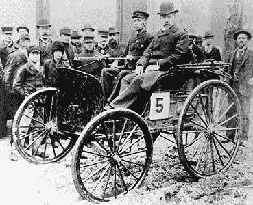
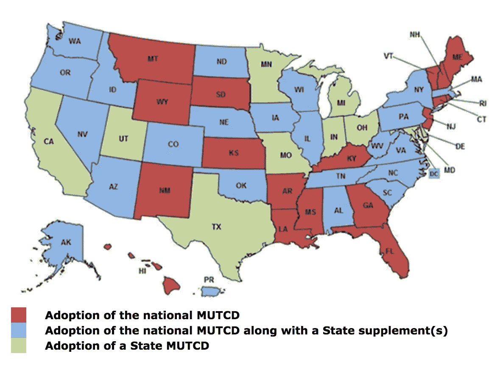
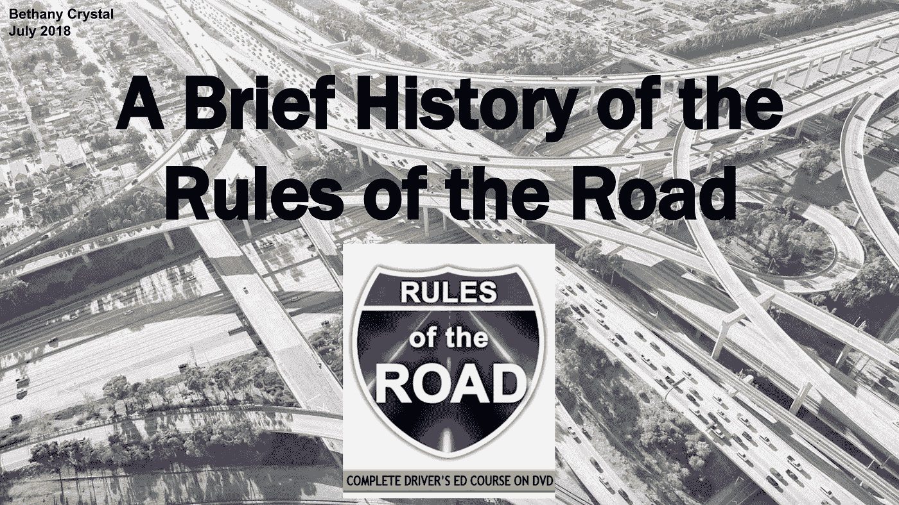

# 《拘押规则》通过的简史

> 原文：<https://medium.com/hackernoon/a-brief-history-of-the-adoption-of-the-rules-of-the-road-c90964a885fc>

## (我们能从中学到什么来管理今天的新技术)

在科技行业工作，最让我着迷的事情之一是观察创新如何淘汰旧系统和引入新系统的过程。虽然很多时候实时观看会感觉非常慢(你曾经尝试过不止一次地在多个地方访问你自己的健康记录吗？)，我不得不提醒自己[任何改变的过程都需要时间](https://dashboard.healthit.gov/evaluations/data-briefs/non-federal-acute-care-hospital-ehr-adoption-2008-2015.php)。

即使当一项创新远远超过任何现有的规范(就像 T2、区块链、T4 和 T5 的技术一样)，世界似乎也无法快速决定何时以及如何监管这个新系统。

这是一种微妙的平衡。如果任何新的创新从一开始就受到过度监管，你就面临着阻碍创新和驱逐企业家的风险，否则他们可能会打造下一个大东西。如果监管不足，至少在加密的情况下，数百万人可能会被骗，并消除这个领域的任何潜在可信度。

虽然我肯定不知道这将如何在 crypto 中发挥作用，但我上周花了一些时间自学了另一个复杂的、基本上被认可的系统的推出——道路驾驶规则。我很好奇，想看看我们是否可以从汽车行业的变革性创新如何影响我们对我们今天仍在使用的基本标志、规则和协议的认同中收集到任何东西。

以下是我学到的:

Here’s a peek at the [first “motor wagon”](https://www.britannica.com/biography/Charles-E-Duryea-and-J-Frank-Duryea) in the U.S., invented by Charles and Frank Duryea back in 1893.

*   当 1893 年第一辆“汽车”出现在美国时，没有市场出售它们。
    [查尔斯和弗兰克·德利亚](https://www.britannica.com/biography/Charles-E-Duryea-and-J-Frank-Duryea)、(没错，也是莱特兄弟的同时代人)两兄弟于 1893 年在美国发明了第一辆机动车。然而，只制作了 13 份来销售，公司最终失败了。我不得不怀疑这是否部分是由于道路基础设施不够强大来支持它，更不用说营销问题了。你看…
*   虽然最早的道路可以追溯到公元前 4000 年的美索不达米亚，但我们直到 19 世纪才开始对它们进行现代化改造和铺设。
    又来了，这个很有道理。没有汽车技术的进步，就不需要任何额外的基础设施成本来支持强健的现代铺面公路。18 世纪晚期，两位来自苏格兰的工程师重复使用了一种铺设 T4 的技术，将不同类型的石头分层，同时考虑到街道交通模式和道路坡度等因素。在整个 19 世纪早期，巴黎的香榭丽舍大街可以自夸为第一条现代道路，它于 1824 年铺就。
*   20 世纪初，公众的强烈抗议迫使政府进行干预，在美国铺设更多的道路。是什么突然激发了公众对更好的街道基础设施的兴趣和关注？1908 年福特[T 型车](https://en.wikipedia.org/wiki/Ford_Model_T)的发明。与德利亚兄弟不同，福特在大众市场营销和销售他们的汽车方面做得更好，这意味着在泥路上行驶的机动车数量增加。口号，*“让农民脱离泥淖！”来自农村的农民希望说服政府官员走上铺设好的道路。最终，随着 1916 年联邦高速公路系统的引入，这种方法在美国奏效了。*
*   **优化道路的速度和规模是我们在 1956 年建立美国州际公路系统的原因。** 花了 [*17 年*来创造和资助这个想法](http://mentalfloss.com/article/67990/10-things-you-might-not-know-about-us-interstate-system)。事实上，最终促使艾森豪威尔总统将这一倡议付诸实施的主要因素之一是出于对公民安全的担忧。随着冷战时期对核攻击的恐惧在 20 世纪 50 年代中期盛行，美国州际系统将成为允许公民快速逃离主要大都市地区的一种方式。

That’s right. The original stop signs of the world…[were yellow](http://www.trafficsign.us/yellowstop.html).

*   **铺路只是基础设施成本的一部分——街道标识有其独立的创新曲线。** 从 1914 年[第一个已知的电子交通信号](https://www.history.com/this-day-in-history/first-electric-traffic-signal-installed)开始，街道标志的采用过程一直是缓慢而反复的。在 20 世纪 50 年代发明耐用、不易褪色的油漆之前，近 40 年来，美国的[停车标志都被涂成黄色](http://www.trafficsign.us/yellowstop.html)(而非红色)，以便司机在夜间能更好地看到这些标志。
*   **尽管看起来像是 100%的一致意见，但即使在今天，在路牌协议上也没有单方面的一致意见。事实上，在 1968 年参加《维也纳道路交通公约》的 74 个国家名单中，美国明显缺席。相反，我们选择了自己的道路标志标准化，称为统一交通控制设备手册(MUTCD)，但即使是这些规则也可能是模糊的，因州而异。**

[Even as of 2009](https://mutcd.fhwa.dot.gov/resources/state_info/index.htm), there are differences state by state as to how street signs are regulated.

## **所以，简单回顾一下:**

*   自公元前 4000 年以来，我们就有了道路和公共基础设施，但直到 19 世纪晚期，几乎不需要推进这些街道背后的技术。
*   即使在 19 世纪 50 年代对现代铺路技术进行标准化后，美国政府也是在 100 多年后才介入并监管国家州际系统标准的制定。
*   在这个复杂的系统中，仍然有很多你可能意识不到的移动部分，包括我们如何看待全球范围内的街道标志。

**那么，从研究交通规则的演变和最终采用中能学到什么吗？虽然这种漫长的采用和监管过程看起来可能会令人沮丧，但我个人发现，至少这似乎是意料之中的事情，这让我感到些许安慰。相比之下，我们今天在科技领域看到的任何创新和监管似乎都在以极快的速度发生。**

[My original slides](https://docs.google.com/presentation/d/e/2PACX-1vRquRZmxG38uUDnIFCxBgNit89U50vd3p9QlCDz6yiGA099X_bo6z5WiXzHOFjSxiuSW_ZrnfOk7Wjt/pub?start=false&loop=false&delayms=3000&slide=id.p)

*附:我最初把这个话题想成幻灯片，所以如果你也想通读一下，这里有“***”的道路规则简史以谷歌幻灯片的形式。**