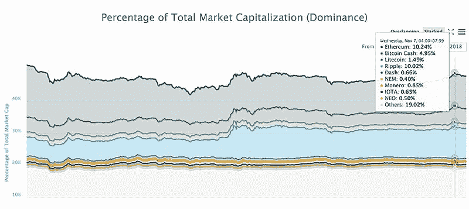
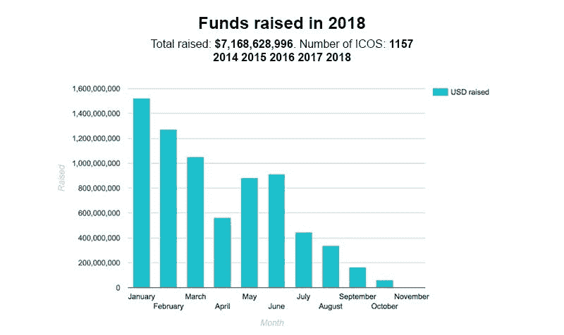
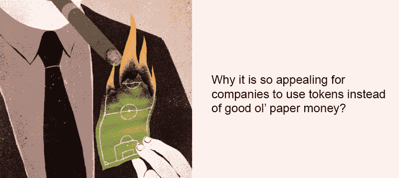
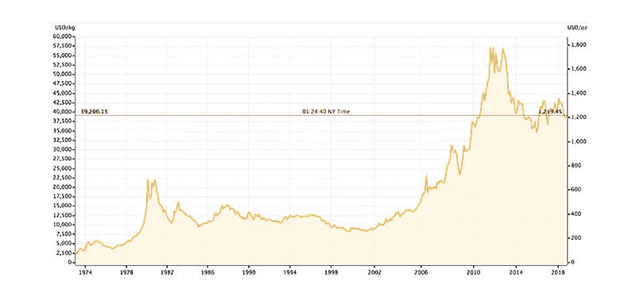
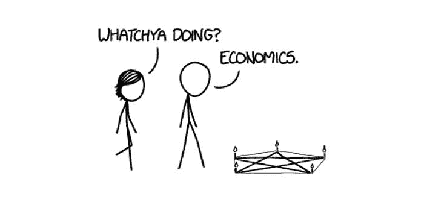

# 代币简史:从过去到遥远未来的旅程

> 原文：<https://medium.com/hackernoon/a-brief-history-of-tokens-a-journey-from-the-past-to-the-distant-future-95f33d3534c9>

[https://radikal.ru/lfp/s018.radikal.ru/i525/1202/d8/78a73615128b.jpg/htm](https://radikal.ru/lfp/s018.radikal.ru/i525/1202/d8/78a73615128b.jpg/htm)

代币已经走过了漫长的道路，从梦想完全去中心化的计算机极客开发的一个花哨概念，到涉及世界领先公司如宝马、T2、乐天和包括 T4、印度、T5 在内的各国政府的十亿美元产业。最近，出现了一系列关于各种资产的令牌化的发展，从股票到艺术品以及介于两者之间的一切。公司用这些代币作为奖金和忠诚度积分，将他们的股票进行代币化，或者一些公司更进一步，将它们在各种交易所上市。这是否正在成为一种趋势？如果是，我们是如何走到这一步的，下一步是什么？

# 代币是用来做什么的？

不管他们在什么平台上工作，概念基本上是相同的:令牌是其生态系统中某种东西的表示。代币可以用来做什么？为了投票，为了转移价值，或者为了获得某物。许多项目现在实现了各种类型的令牌；其中超过 2000 人。

[https://coinmarketcap.com/charts/](https://coinmarketcap.com/charts/)

我们甚至可以将所有令牌分成几个[类](https://blockgeeks.com/guides/erc20-tokens/):

*   **价值交换** —这是我们如今能看到的最常见的应用。代币作为一种价值载体，为用户创造使用系统的动机，成为错综复杂的代币经济的一部分。
*   **投票权** —代币可以充当选票，赋予其所有者参与系统内决策过程的权利(设定交易费用、选择代表节点处理区块、同意对网络应用各种升级——这些话题都需要投票)。在各种区块链中，如以太坊或 EOS，投票的工作方式不同，但共同点是它们都涉及令牌，作为分散环境中所有者的主要表现形式。
*   **Toll** —在各种分散式应用中，令牌用于访问各种功能。例如， [REQ](https://request.network/) 为每笔交易烧录令牌。
*   **另一种资产**的代表——美元、[房地产](https://www.forbes.com/sites/rachelwolfson/2018/10/03/a-first-for-manhattan-30m-real-estate-property-tokenized-with-blockchain/#70eb80094895)、[贵金属](https://kinesis.money/en/)，甚至是另一个区块链上的[比特币](https://cryptodaily.co.uk/2018/11/the-potential-wrapped-bitcoin-has-on-ethereum-bitcoin/)——一切都可以被代币化和交易。在这种情况下，令牌代表拥有该令牌化资产的权利。

所以代币种类繁多，对吧？所有这些类型的令牌都存在于当前的区块链网络中。但最初并不是这样。根本没有基础设施。

# 第一个令牌，ERC20

最初，以太币没有任何共同的标准。在整个以太坊生态系统中，很难成功地发行或构建任何令牌。互操作性和交换需要统一，在以太坊的早期，每个发行者必须为每个功能开发自己的版本，并符合自己的规范，包括转移令牌的功能。因此，每个令牌都必须以自己独特的方式来处理，将一个令牌换成另一个令牌需要复杂的编码。与此同时，在代码中犯一个小错误可能会在合同中留下漏洞，并允许恶意的个人使用它，例如，[侵入或冻结](/solidified/the-biggest-smart-contract-hacks-in-history-or-how-to-endanger-up-to-us-2-2-billion-d5a72961d15d)用户的资金。

2015 年 11 月 19 日，Fabian Vogelsteller [提出了](https://en.wikipedia.org/wiki/ERC-20)一个包含一组[功能](https://theethereum.wiki/w/index.php/ERC20_Token_Standard)的规范，受到以太坊社区的好评。从那时起，发行和交易代币变得更容易了，因为现在可以创建适当的基础设施了。对于任何交易所来说，实现一个框架来支持新的 ERC20 令牌以添加来自新项目的数千个令牌就足够了。这给无数的 ico 开了绿灯，这个行业开始蓬勃发展。

*   2016 年，ICOs 融资 9000 万美元。
*   2017 年，ICOs 融资 62 亿美元。
*   2018 年，ICOs 融资 72 亿美元。

[https://www.icodata.io/stats/2016](https://www.icodata.io/stats/2016)

如我们所见，从 2016 年到 2017 年增长了 68 倍。这成了无数初创企业融资的首选方式。ICOs 成为热门话题，吸引了人们对区块链的关注，展示了它的实现和潜力。

# Stablecoins 进入场景

随着市场的发展，很明显有必要拥有用所有这些代币兑换法定货币的能力。但是为什么呢？嗯，有几个原因。

*   最初，代币(或替代币)与比特币交易，这是唯一可用的配对。然而，比特币也非常不稳定，所以在交易时有必要考虑两个价格。这对许多交易者来说是不切实际的。
*   最终，比特币无论如何都应该被兑换成法定货币，因此任何交易者或投资者的目标都是增加其对美元或欧元的投资组合。
*   在极度波动的时期，同时持有替代硬币和 BTC 是很危险的；那可能会导致巨大的损失。
*   很难立即将 BTC 交易到菲亚特，然后在市场条件改善时重新进入。

[https://www.pinterest.ru/pin/429530883183496834/](https://www.pinterest.ru/pin/429530883183496834/)

因此，一个稳定的资产，存在于与所有其他令牌相同的加密空间中，同时解决了许多问题。Tether (USDT)是第一个加入 Bitrex 和 Bitfinex 等主要交易所的 stablecoin。一年后，新的 stablecoins ( [TUSD](https://gemini.com/dollar/) 、 [GUSD](https://www.trusttoken.com/trueusd/) 和 [USDC](https://support.usdc.circle.com/hc/en-us) )作为美元的替代品推出，它们都由发行其 stablecoins 的公司的银行账户中的真实审计资金完全支持。

许多其他资产仍有足够的空间——所有 stablecoins 的当前市值只有[26 亿美元](https://www.coingecko.com/en?category_id=36&view=market)，而在撰写本文时，整个市场的市值为 2220 亿美元，因此，如果需要，不会有足够的 stablecoins 来平仓市场上的每个未平仓头寸。

# 金银背马币

在菲亚特支持的 stablecoins 之后，新项目开始代表现实世界中其他稳定的东西。当你想到市场上的“稳定”时，你会想到什么？黄金和白银。

[https://goldprice.org/](https://goldprice.org/)

贵金属是令牌化、持有和交易的良好候选，因为它们的历史延续了成千上万年，并享有防御性资产的声誉。

黄金和白银都由 [Kinesis](https://kinesis.money/en/) stablecoins 赠送。两种硬币，KAU(金质)和 KAG(银质)以 1:1 的比例与黄金或白银[挂钩。如果硬币的价格下降，就有可能以金条的价格出售，从而获利。或者你可以在任何接受 Visa 的地方用 Kinesis 借记卡支付。这个项目得到了](https://en.wikipedia.org/wiki/Bullion)[指定黄金交易所](https://abx.com)的支持，该交易所是近十年来领先的实物贵金属交易平台。

# 令牌化股票

股票的发行和交易目前涉及多方——组织首次公开募股的承销银行、证券交易所本身、客户经纪人、存储股票的存管机构，当然还有允许首次公开募股进行的监管机构。通过区块链发行股票的过程大致相同，但它将允许使用智能合约，例如，限制大型初始买家在预定时间内出售任何东西。它也不会依赖于在各自辖区内运营的交易所和托管机构，如果没有适当的基础设施，就无法将外国公民加入其交易股票的持有人名单。不过，在全球范围内，通过区块链的解决方案进行股票交易将是可能的。

所有者的注册将是不必要的，因为令牌本身就是一种所有权，它不能被伪造——否则就有可能创建一个全球数据库，其中的数字身份与某些区块链地址相关联。任何人都可以看到任何公司的股东名单，因为股东的身份在股票被收购的那一刻就被共享了。

马耳他证券交易所[与](https://www.coindesk.com/malta-stock-exchange-partners-to-build-global-token-exchange/) [Neufund](https://neufund.org/) 签署了合作协议，对其股票进行令牌化。随着越来越多的交易所开始了解这一过程的好处，它们加入进来只是时间问题。虽然这并不意味着交流的死亡，因为对于大多数用户来说，使用的便利性永远是最重要的。

# 下一步是什么？

令牌用于访问分散的应用程序。它们被用作转移法定货币、黄金、白银、股东权、财产权、投票权或其他人们认为有价值的东西的工具。它们被用作加分。为什么对公司来说使用代币而不是好的纸币如此有吸引力？因为发行代币很容易，所以交易很快，而且破解区块链地址并窃取存储的代币几乎是不可能的。所有写入区块链的信息都不能被重写或删除，也不能被篡改。在这种情况下，例如，所有令牌化的股票都可以安全地存储在所有者的账户上，不需要任何存管机构来管理它们。

随着一切都被令牌化并存储在区块链上，使用 Kinesis 货币系统立即购买房地产、汽车、艺术品或黄金将成为可能。Kinesis 货币不仅将在它们既定的框架内流通，类似于纽约证券交易所，还将在自由市场上流通。

今天，如果你想卖公寓买股票，你不能一步到位。你必须把它卖出去换成法定货币，把钱存入交易所，然后你才能买股票。在未来的世界里，你可以用一个代表你公寓所有权的代币，换一堆代表某家公司股份的代币。对谁有好处？肯定！没有任何控制的即时价值交换将创造新的商业模式，节省时间，并允许人们支付更少的费用。这一切都可以在透明的环境下发生。这不就是你想要生活的未来吗？我们认为是的。

## 关于作者:

基里尔·希洛夫——geek forge . io 和 Howtotoken.com 的创始人[。采访全球 10，000 名顶尖专家，他们揭示了通往技术奇点的道路上最大的问题。加入我的**# 10k QA challenge:**](http://twitter.com/kirills4ilov)[geek forge 公式](https://formula.geekforge.io/)。