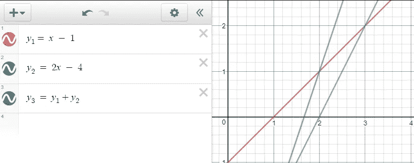

# 比特币 Schnorr 多重签名简介

> 原文：<https://medium.com/hackernoon/a-brief-intro-to-bitcoin-schnorr-multi-signatures-b9ef052374c5>

*TL；DR: Schnorr 签名是比特币里最火的学科；我们发布了一个 Rust MultiSig schn orr 的开源实现。*

似乎 Schnorr 签名在加密货币社区风靡一时，并被宣布为自切片面包(或至少是 *SegWit* )以来最大的事情。

在这篇博文中，我们将解释 Schnorr 签名的主要优势之一:它对多重签名(MultiSig)的本地支持。由于 MultiSig 是用户保护其帐户免受其私钥被盗的最重要机制之一，鉴于此类黑客攻击的数量之多，很明显为什么这个主题会受到加密货币社区的如此关注。

我们将深入浅出地描述 Schnorr MultiSig 背后的数学原理。除此之外，我们将分享一个 Schnorr MultiSig 的开源实现。

# MultiSig

> “多重签名(通常称为 **multisig** )是一种用于为加密货币交易增加额外安全性的技术形式。多签名地址要求另一个或多个用户在交易上签名，然后才能在区块链上广播。”[https://en.wikipedia.org/wiki/Multisignature](https://en.wikipedia.org/wiki/Multisignature)

目前，大多数区块链使用实际的多重签名和一些脚本或智能契约来实现这种多重锁定机制，以验证所有内容都被签名。然而，这种设计有一些缺点:

*   **安全性**:脚本容易出错。在*以太坊*中，奇偶校验的 MultiSig 联系人遭遇[两个](https://www.coindesk.com/30-million-ether-reported-stolen-parity-wallet-breach/) [不同](https://motherboard.vice.com/en_us/article/ywbqmg/parity-multi-signature-wallet-vulnerability-300-million-hard-fork)的漏洞，造成超过 1 亿美元的损失。
*   **效率**:拥有多个显式签名增加了交易的规模和与之相关的费用。
*   **隐私**:明确的多重签名泄露了这个地址是多重签名的事实，并可能引起不必要的关注。

Schnorr 签名(以 Claus Schnorr 命名，他的数学工作为该签名奠定了基础)解决了所有这些问题，因为它们允许将多个签名及其对应的密钥聚合到单个签名中。因此，Schnorr MultiSig 交易与常规(“MonoSig”)交易无法区分，因此不会影响隐私或交易规模和费用。多重签名验证是在加密层而不是在脚本层完成的，这消除了安全问题脚本错误。

Schnorr 签名和比特币当前签名(ECDSA)的主要区别在于，Schnorr 签名是 ***线性*** *，*而 ECDSA 签名不是。

***线性*** 与我们的目的最相关的属性是，当您将两个(或更多)Schnorr 签名加在一起时，结果也是一个有效的 Schnorr 签名！

当将两条直线方程加在一起， ***y1=a1*X + b1，y2=a2*X + b2*** 结果是另一条直线方程***y3 = y1+y2 =(a1+a2)* X+(B1+B2)***，其中新的斜率 ***a3= (a1 + a2)*** 而新的 y 轴截距是***B3 =(B1+1)这对于 Schnorr 签名实际上是相同的。***

Adding the red and blue lines creates the green line (created with [Desmos](https://www.desmos.com/))

我们将用斯捷潘的[优岗](/@snigirev.stepan/how-schnorr-signatures-may-improve-bitcoin-91655bcb4744)公式来解释:

Schnorr 签名使用一个点 ***R*** 和一个标量 ***s*** 。与 ECDSA 类似， ***R*** 是椭圆曲线上的随机点( ***R = k×G*** )。签名的第二部分计算略有不同: ***s = k + hash(P，r，m) ⋅ x*** 。这里 ***x*** 是你的私钥， ***P = x×G*** 是你的公钥， ***m*** 是消息。然后可以通过检查 ***s×G = R + hash(P，R，m)×P*** 来验证这个签名。

在基本的 MultiSig 场景中，我们有两方，每一方都有自己的密钥对。

利用 Schnorr 签名，我们可以使用一对私钥 ***(x1，x2)*** 并生成对应于共享公钥***P = P1+P2 = x1×G+x2×G***的共享签名。为了生成这个签名，每一方需要选择一个随机数 ***(k1，k2)*** ，生成一个随机点 ***Ri=ki×G*** ，将它们加起来计算一个公共的 ***hash(P，R1+R2，m)*** ，然后从每一方得到***【S1***和 ***s2*** (通过将这些签名相加，并使用一对 ***(R，s) = (R1+R2，s1+s2)*** 作为共享公钥 ***P*** 的(多)签名。

提醒一句:上面描述的算法太天真了，它需要被强化以承受真实世界的攻击。

幸运的是，一些密码学专家做到了这一点。关于这个问题的最新论文之一是由 Blockstream 团队领导的一项工作，名为“[简单的 Schnorr 多重签名及其对比特币的应用](https://eprint.iacr.org/2018/068.pdf)”。

这项工作的作者之一 Pieter Wuillie 创建了一个比特币改进提案(BIP)，[【bip-schnorr](https://github.com/sipa/bips/blob/bip-schnorr/bip-schnorr.mediawiki)，这是一个关于如何标准化 schn orr 签名作为比特币一部分的相当技术性的提案。

# Schnorr MultiSig 开源项目

为了支持社区并鼓励采用 Schnorr MultiSig，我们(主要是[Omer Shlomovits](https://medium.com/u/366ee75f554?source=post_page-----b9ef052374c5--------------------------------)&[Gary Ben attar](https://medium.com/u/75194a16b25a?source=post_page-----b9ef052374c5--------------------------------))基于上述文章和 BIP 创建了一个 schn orr multi SIG 试验项目。

 [## KZen-networks/multisig-schnorr

### 这个项目是椭圆曲线上多方 schnorr 签名的 Rust 实现。

github.com](https://github.com/KZen-networks/multisig-schnorr) 

为了性能和安全性，该项目在 Rust 中实现。目前支持比特币的椭圆曲线( *secp256k1* )，可用于:

1.  密钥生成
2.  基于 BIP 规范的简单 schnorr 签名。
3.  为 n 个参与者创建多重签名。
4.  基于 BIP 规范验证签名，该规范对于一个或多个签名者是相同的。

以上所有的例子都可以在[测试](https://github.com/KZen-networks/multisig-schnorr/blob/master/src/protocols/multi_sig/test.rs)文件中找到。我们还包括了一个[维基页面](https://github.com/KZen-networks/multisig-schnorr/wiki/Multi-party-Schnorr-Signatures)，以一步一步的方式解释协议。

我们希望你能尝试这个项目，甚至考虑为它做出贡献。毕竟，它可以通过帮助用户更好地保护他们账户的密钥来帮助升级加密货币的安全性，这是加密货币的最大问题之一，并限制了它们的广泛采用。