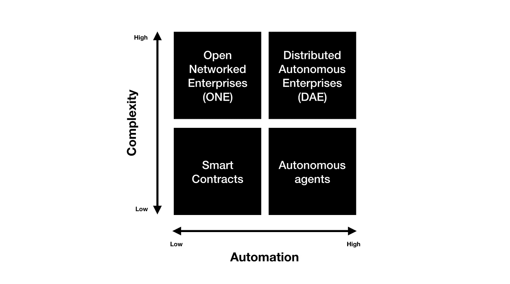

# 区块链共识机制、智能合约和分布式应用简介

> 原文：<https://medium.com/hackernoon/a-brief-introduction-to-consensus-mechanisms-smart-contracts-and-distributed-apps-on-the-a94453d16c3a>

第一个区块链是在 2008 年由一个名叫中本聪的匿名人士或团体构思的。它于 2009 年作为比特币的核心组件实现。就像我们的[水果电子表格](/zenturtle/blockchain-for-dummies-ae786c6a5fe7)的例子一样，*块*和*链*这两个词在中本聪的原始论文中是分开使用的，但最终被推广为一个词，*区块链*。
比特币或任何其他数字货币都不是保存在某个地方的文件。它代表了比特币区块链上发生的交易，其中每笔交易都由一个大型点对点网络进行验证和批准。除了数字货币，区块链还可以被编程来安全地记录任何对人类有价值和重要的东西，如土地记录、出生证明、身份、医疗记录等。

很多人都在谈论这项技术在金融领域的机遇和可能性，即。微支付、货币兑换、汇款、保险、区块链 IPO、替代硬币等。我将尽可能远离这些话题。部分原因是经济学专家已经写了足够多的书，部分原因是人们感觉到的直接转变很可能不在这个领域。我真的相信，要采用这项技术，它必须像互联网一样融入金融世界，而不是作为一个神秘人的礼物来改变金融的面貌。再说一次，如果被证明是错的，我会是最开心的。
虽然是革命性的，但如果我们停止将区块链视为这种革命性的技术(确实如此),而开始将它视为一种在系统中保护和嵌入信任的工具，我们会受益更多。“任何融合轻薄的设计都会给人一种更小、更轻、更卑微的印象。约翰·梅达在他的书《简单法则》中写道:“当交付的价值远远超过最初的预期时，怜悯就会让位于尊重。”。如果这项尚未成熟的技术行为不端，如果我们不再认为它是大卫用来战胜世界上所有邪恶的，我们会更加宽容。如果我们不再认为它是通向新世界秩序的大门。

## 从小处着手

区块链需要被视为一种用于确保系统信任的工具，而不是解决世界所有问题的解决方案。虽然这个想法是革命性的，但它的价值在于执行。区块链的杀手级应用可能不会来自大公司。它来自边缘，也许是某个车库里的几个孩子在摆弄它。我们需要从小规模开始。简单的应用。也许是一个小房子，也许是房子里的一个房间。

*嘿！他们称区块链为新互联网。这到底是什么意思？*

互联网开启了企业家和行业的新时代。尽管有些人认为，它未能实现其民主的承诺，为所有利益相关者提供平等的机会。与之前的时代非常相似，互联网已经变成了垄断，少数几家公司控制了大部分流量，从而控制了大部分财富。所有这些都是以这些公司从中创造财富的人的隐私为代价的。杰伦·拉尼尔在他的书《谁拥有未来》中认为，中产阶级越来越被剥夺了网络经济的权利。通过说服用户放弃关于他们自己的有价值的信息来换取免费服务，公司可以在几乎没有成本的情况下积累大量的数据。许多人认为区块链可能会成为这些公司开始承担责任的一种方式。这是一个很长的镜头，但我们需要得到正确的。

互联网不是用来分配价值的，而是用来分享信息的。它使复制数据变得更容易，但却无法实现价值转移..钱，不像自拍，推特或其他任何信息好。你可以把同样的自拍发给你所有的朋友，但不是同样的一块钱。你汇的钱需要离开你的银行账户。同一美元不能用于两笔交易。这被称为双重花费问题。为了让人们能够在互联网上做生意，需要人们可以信任的中介。银行和许多科技公司抓住了这个机会。他们通过一个或多个第三方的中央数据库来清算每一笔交易，从而解决了重复花费的问题。每个第三方都从交易中抽取一定比例的费用。在许多情况下，和解可能需要几天时间。区块链承诺在不需要中央机构的情况下大幅降低交易成本和结算时间。

Satoshi 设计的系统可以在互联网上工作，但如果有必要，它也可以在没有互联网的情况下运行。独裁政府可以关闭互联网，而区块链仍然可以作为一个交易机制。你可以通过短波无线电、莫尔斯电码甚至是短信中的一系列表情符号进行交易。与互联网不同，区块链是一个更加包容的系统。

*区块链需要回答两个主要问题。当人们达成共识时，谁来做这项工作？
2。我们如何利用这一交易链来构建除货币之外的其他东西呢？*

区块链允许创建和使用其他达成共识的方式，并让用户构建利用网络的应用程序。在区块链的设计中有两个基本要素可以实现这一点；共识算法和智能合约。

# 共识机制

通过计算链的所有副本的散列值来实现一致性。这就需要网络中的人们花费大量的计算能力来维护区块链。[水果电子表格集团](/zenturtle/blockchain-for-dummies-ae786c6a5fe7)不是跨国公司。那么，我们如何奖励那些为维护网络贡献资源的人呢？

Satoshi 利用现有的点对点网络和智能加密技术创建了一个共识机制，可以解决双重花费问题，如果不是比可信的第三方更好的话。为了实现这一点，比特币网络使用了一种**工作证明(PoW)** 机制。运行比特币节点的矿工或网络参与者将最近的交易收集为一个数据块，其中每个数据块都必须引用前一个数据块。这个过程每 10 分钟重复一次。问题是，有多个矿工试图解决同一个区块。为了选择将被分配来解决一组交易的矿工，我们创建了一个很难解决的数学难题，即需要大量工作。难题通常是找到一个非常长的数字(哈希值),计算机试图猜测每个数字。谁先解决了这个难题，谁就可以开采这块石头。作为开采该区块的交换，矿工将获得比特币作为奖励。在每一次成功的交易之后，难题的复杂性开始增加，即挖掘者需要寻找甚至更大的散列值。谜题的复杂程度还取决于网络中矿工的数量。从统计角度来看，查找散列大约需要 10 分钟。以太坊区块链的第一个版本也使用了工作证明。然而，还存在其他共识机制。

**利益证明**是一种机制，要求矿商使用本币进行交易，即用户需要在正在进行的交易中拥有利益。对于以太坊区块链，本地硬币是以太。为了达成共识，网络参与者花费很少的乙醚来行使他们的投票权。

**活动证明**结合了工作证明和利益证明。随机抽取的矿工必须完成工作(解决难题)并使用密码(货币)在区块上签字，以使区块成为官方区块。

**容量证明**要求采矿者分配相当大容量的硬盘用于采矿，而**存储证明**要求采矿者在分布式云中分配和共享磁盘空间。

还有其他类似 Ripple (XRP)使用的机制，它依靠社会网络来达成共识。社交网络中成员的价值取决于它所连接的独特成员/节点的数量。这种类型的机制是有偏见的，因为新来者需要社会智慧和声誉来参与。只有授权的成员团体才能达成共识。这种模式允许公司风格的结构与区块链的问责制共存。

Satoshi 选择拥有计算能力的人作为经济背景。以太坊选择以太的所有者，而瑞波选择社会资本的所有者作为经济背景。

# 智能合同

这些是计算机程序，用于保护、实施和执行组织、人和物之间的合同结算。智能合约这个术语是由尼克萨伯在 1994 年创造的，当时它还是一个没有出路的想法。区块链改变了这一切。它使人们能够编写可执行的程序。交易可以在具有内置结算系统的分散技术平台上执行。这意味着，当你购买股票或共同基金时，它会立即出现，而无需等待中介。这挺酷的。

通过启用多重签名协议，区块链使您能够实施需要多人批准交易的复杂智能合同。它也被称为多重签名。把它想象成一把需要多把钥匙才能打开的锁。每个成员都有一个密钥或签名。多重签名可用于仲裁或远程股东会议，以决定公司的战略。一组智能合同可以捆绑在一起执行复杂的交易，称为分布式应用程序。

## 分布式应用程序

分布式应用程序(dApp)是一组智能合约，用于存储数据并在区块链上实施多个智能合约。这些 dApps 可以开始相互操作以在网络上执行特定的功能。例如，任何人都可以使用通用验证 dApp 来请求和验证一个人的身份。在这种情况下，验证 dApp 可以决定执行交易需要多少关于身份的信息。在约翰的出租车服务的情况下，Seema 只需要向约翰的出租车提供她的钱包信息，这是验证 dApp 提供的。如果 John 请求任何其他信息，dApp 会标记该请求，并询问 Seema 是否希望提供相同的信息。

简单的智能合同需要人们在交易上签字，但是对于简单的重复动作，如每天早上送牛奶和实时付款，人们可能会选择将任务自动化到程序中。我们称这些为自主代理。一些**自主代理**可能是智能的，它们可以适应系统的状态并相应地行动。例如，系统知道您正在度假，因此会暂时停止牛奶订购。另一方面，dApps 的集合可以让公司制定巧妙的、自我强化的协议。一个简单的新设备申请不应该通过多个批准电子邮件，智能合同可以简化这一过程。另一种情况是，当生产一种产品时，货物可以从供应商处直接到达工厂车间。不需要仓库。

The X-axis indicates the degree to which humans participate in the model. Y-axis shows the functional complexity of the model.

现在想象一下，一整个公司在没有任何人工干预的情况下运行在区块链网络上。这是区块链能够完成的圣杯，我们称之为**分布式自治企业(DAE)** 。区块链让科幻电影真正成为可能，让人类有时间去做其他(希望是更好的)事情。

和平！

# 参考

1.  [**区块链革命**亚历克斯·泰普斯科特和唐·塔斯考特](https://amzn.to/2KYdZpE)
2.  [**谁拥有未来？**作者杰伦·拉尼尔](https://amzn.to/2KP3qpy)
3.  [**智慧城市:大数据、公民黑客和对新乌托邦的追求**作者安东尼·m·汤森](https://amzn.to/2L0n0hS)
4.  [**简单性法则**约翰·梅达](https://amzn.to/2ujywut)
5.  [**区块链如何改变货币和商业**](https://www.youtube.com/watch?v=Pl8OlkkwRpc) 作者唐·塔斯考特(TED Talk)
6.  [**区块链将如何彻底改造经济**](https://www.youtube.com/watch?v=RplnSVTzvnU&t=89s) 贝蒂娜·沃伯格(TED Talk)

注:我故意不涉及 IOTA，它在不同的协议上工作。很多人都在谈论这项技术在金融领域的机遇和可能性，即。微支付、货币兑换、汇款、保险、区块链 IPO、替代硬币等。我已经尽可能远离这些话题。
所有观点都是个人观点。

## 喜欢吗？点击阅读本文[的更长版本。](/zenturtle/blockchain-for-the-internet-of-things-71a06afce81)

**如果你喜欢这篇文章，请点击👏按钮(一次、两次或更多次)。
分享帮别人找！**