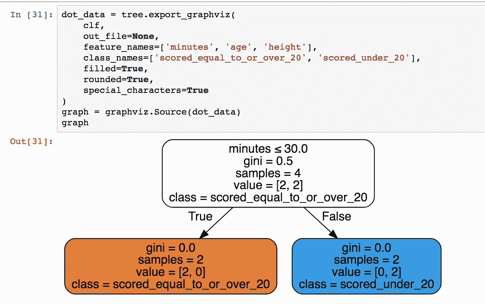

# sk learn . tree . decision tree classifier 简介

> 原文：<https://medium.com/hackernoon/a-brief-look-at-sklearn-tree-decisiontreeclassifier-c2ee262eab9a>

在我继续尝试[尽可能多地自动创建我的日常幻想运动阵容](https://medium.com/draftfast)的过程中，我一直在探索[决策树](https://hackernoon.com/tagged/decision-trees)。在听了我的思考过程后，我意识到这种[技术](https://hackernoon.com/tagged/technique)可能是有价值的，因为它与幻想运动有关。一般来说，我会问自己一些问题，比如“这个球员在过去的两场比赛中抢了 10 个篮板吗？”或者“这个球员每场比赛持续超过 25 分钟吗？”。除了消除偏见，决策树还应该提出更好的问题，根据更多的数据进行改进，并对数据中的关键特征产生洞察力。

我想从我能想到的关于决策树的最简单的例子开始。我将利用这个例子作为探索 sklearn.tree 模块的机会。在以后的文章中，我将深入回顾我是如何构建我的 DFS 篮球决策树的，[但是如果你感兴趣的话，你可以在这里查看一下](https://github.com/BenBrostoff/draft-kings-learn/blob/master/recipes/classifier.py)。

在我的 ML 博客系列的第三部分中，我回顾了如何使用神经网络对一些只有一个特征重要的数据进行分类。我认为这里有一个类似的例子可以说明问题。我经常发现让示例尽可能接近真实会更容易，所以让我们假设我们有一组篮球运动员的数据，如果他们在一场比赛中得分低于 20 分，我们希望将他们标记为 0，如果他们在一场比赛中得分超过 20 分，我们希望将他们标记为 1。数据集中的三个特征是分钟、年龄和身高；让我们假设只有几分钟很重要。下面是一个带有假数据集的简单决策树:

你可以在那棵树上面的代码片段中看到。DecisionTreeClassifier 附带了一个 feature_importances_ 特性，它列出了每个特性的权重。因为分钟是唯一重要的特征，所以它的权重为 1.0，而无意义的年龄和身高特征的权重为 0.0。

决策树正确地识别出，如果玩家玩一场游戏超过 30 分钟，那么他们应该得到 20 分以上(免责声明:这是一个不切实际和过于简单的例子)。graphviz 包允许您可视化这些数据:

视觉化证实了我们所知道的事实；如果一个球员打了超过 30 分钟，他们会得到超过 20 分。可视化也提供了一个很好的方法来复习一些术语。决策树中的*叶节点*是将玩家放置在>或< 20 分篮中的两个子节点；*内部节点*是划分数据的任何非叶节点，不包括树中最顶层的节点，即*根节点*(注意，这个例子有点牵强，因为只有一个根节点、两个叶节点，没有内部节点)。

决策树分类器实际上是如何工作的？如果您要手动构建自己的决策树，您必须选择自己的根节点和内部节点。这些选择将基于您认为数据集中最有价值的特征；如果你知道分钟是球员统计中最重要的，分钟将是你的根使用的特征。在一个真实的篮球数据集中，一个自然的开始问题会是“球员打了超过 0 分钟吗？”用谷歌乔什·戈登的话说，最好的问题是最能减少不确定性的问题。如果知道球员没有上场，我可以笃定地宣称他们得了 0 分。

决策树算法基于*标准*做出这样的特征选择，用于计算每个属性的重要性，然后得出要问的正确问题。虽然一个人可能知道优秀的 NBA 球员每场比赛能打 30 多分钟，但决策树会通过标准从统计上推断出来。这里我将使用 *Gini 杂质*作为我的选择标准，因为这是 DecisionTreeClassifier 默认使用的标准。这实际上可通过 sklearn 中的[标准参数进行配置:](http://scikit-learn.org/stable/modules/generated/sklearn.tree.DecisionTreeClassifier.html)

> criterion : string，可选(default= "gini")
> 衡量拆分质量的函数。支持的标准是基尼杂质的“基尼”和信息增益的“熵”。

基尼不纯，顾名思义，不是一个可取的量，每个节点都寻求最小化。[通过维基百科](https://en.wikipedia.org/wiki/Decision_tree_learning#Gini_impurity):

> Gini 杂质是一种度量，用于衡量从集合中随机选择的元素被错误标记的频率，前提是根据子集中的标签分布对其进行随机标记。

这很长，所以一个例子和一些代码应该会有所帮助。正如维基定义中提到的，基尼系数是一个概率，所以它的值必须在 0 到 1 之间。如果我们的数据集中有六个得分都超过 20 分的球员，那么数据集中只存在一个标签，所以随机猜测这个标签将是 100%正确的。基尼系数等于 0，因为我们从来不会错。然而，如果三个玩家得分低于 20，三个得分高于 20，那么猜测> 20 将有一半是正确的，一半是错误的(就像< 20). Gini impurity is 0.5 since we’re wrong half the time with a random guess.

Josh Gordon implements gini in the following way, and the two examples are illustrated below:

A decision tree algorithm will construct the tree such that Gini impurity is most minimized based on the questions asked. You can actually see in the visualization about that impurity is minimized at each node in the tree using exactly the examples in the previous paragraph; in the first node, randomly guessing is wrong 50% of the time; in the leaf nodes, guessing is never wrong. When the data makes perfect sense, so does the tree.

Unfortunately, data is inherently messy, and configuring the tree to work based on the data will be a subject of a future post.

[*一样。注意，这里的 sklearn 源代码很难解析*](https://github.com/scikit-learn/scikit-learn/blob/master/sklearn/tree/tree.py#L75) *。(有趣的是，基类 BaseDecisionTree 也是 DecisionTreeRegressor 的父类，可用于预测浮点数，可能是未来博客文章的主题)，所以我转向文档和其他文章来了解这篇博客文章中的解释。下面是我找到的最有用的几个总结:*

-[sk learn docs](http://scikit-learn.org/stable/modules/tree.html)
[-Victor Lavrenko 讲座](https://www.youtube.com/watch?v=eKD5gxPPeY0)
- [乔什·戈登，决策树分类器从零开始](https://www.youtube.com/watch?v=LDRbO9a6XPU)
- [乔什·戈登 Jupyter 笔记本用树从零开始](https://github.com/random-forests/tutorials/blob/master/decision_tree.ipynb)

*你可以在* [*这个 Jupyter 笔记本*](https://github.com/BenBrostoff/ml-series-source/blob/master/src/4_decision_tree_intro.ipynb) 里找到这个帖子的所有代码