# 自动机器学习解决方案(AutoML)概述

> 原文：<https://medium.com/hackernoon/a-brief-overview-of-automatic-machine-learning-solutions-automl-2826c7807a2a>

## 从数学形式到可用解决方案的描述(+ Kaggle 基准)

*由* [*朱利安·茹甘诺斯*](https://www.linkedin.com/in/julien-jouganous-647993124)*[*罗曼·萨维丹*](https://www.linkedin.com/in/romainsavidan/) *和* [*阿克塞尔·贝勒克*](https://www.linkedin.com/in/axelbellec/) *(数据科学家在* [***计算***](http://cdiscount.com) *)**

**

***the hyperparameters jungle** — Photo by [chuttersnap](https://unsplash.com/photos/QA2clzv9E8c?utm_source=unsplash&utm_medium=referral&utm_content=creditCopyText) on [Unsplash](https://unsplash.com/search/photos/pipeline?utm_source=unsplash&utm_medium=referral&utm_content=creditCopyText)*

# *什么是 AutoML，我们为什么需要它？*

*Auto ML 是通过自动化机器学习任务来简化数据科学项目的事实。下面的*图 1* 展示了用于监督学习任务的经典机器学习管道。*

*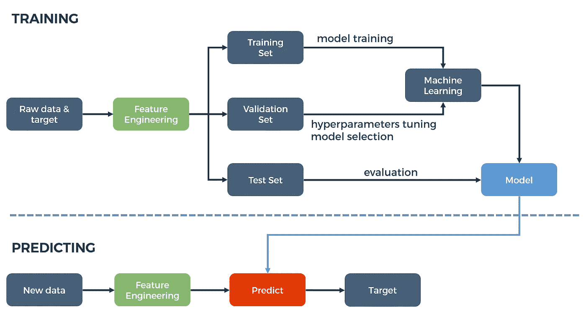*

*Figure 1: A machine learning process.*

*在上述过程中，必须调整几个模块，以提取数据的大部分预测能力:*

*首先，你必须选择相关数据，潜在地解释你想要预测的目标。一旦这些原始数据被提取出来，您通常需要处理它们。*

*下面给出了预处理步骤的非详尽列表:*

*   *文本矢量化*
*   *分类数据编码(*，例如*，一个热点)*
*   *缺失值和异常值处理*
*   *重新缩放(*例如*，规范化、标准化、最小-最大缩放)*
*   *变量离散化*
*   *降维*

*最后但同样重要的是，你必须根据你面临的任务类型选择一种机器学习算法:监督与否，分类或回归，在线或批量学习…*

*大多数机器学习算法都需要参数化，即使一些经验策略可以有所帮助( [*本文*](https://www.analyticsvidhya.com/blog/2016/03/complete-guide-parameter-tuning-xgboost-with-codes-python/) 为 [*XGBoost*](http://xgboost.readthedocs.io/en/latest/) 提供指导)，但这种优化是复杂的，一般没有确定性的方法来找到最优解。但这只是冰山一角，因为整个过程涉及选择和人工干预，这将影响机器学习管道的效率。*

# *欢迎来到超参数丛林！*

*为了说明这一点，考虑经典的**垃圾邮件检测问题**:使用电子邮件的内容，您想要预测一封电子邮件是否是垃圾邮件。为了做到这一点，我们有一个数据库，其中的电子邮件被标记为垃圾邮件或非垃圾邮件，所以这是一个有监督的二进制分类问题。*

*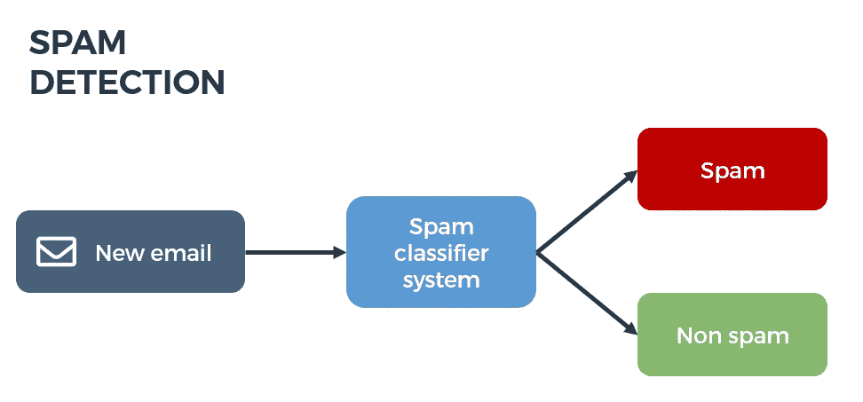*

*Figure 2: Spam detection*

*由于机器学习算法通常处理数字向量，所以第一步是对我们的电子邮件进行矢量化。我们可以使用 [tf-idf](http://scikit-learn.org/stable/modules/feature_extraction.html#tfidf-term-weighting) 方法。但在此之前，我们必须对邮件进行标记(把句子变成单词列表)。我们可能还想应用更高级的文本预处理，比如小写、[词干、词汇化](https://nlp.stanford.edu/IR-book/html/htmledition/stemming-and-lemmatization-1.html)或拼写纠正。*

*现在，电子邮件经过了标记化和预处理，我们可以通过计算 tf-idf 权重来对它们进行矢量化，但这里再次需要对算法进行参数化。事实上，我们通常希望指定停用词，截断文档频率范围(*即*从词典中删除不常用和/或常用的词)，或者甚至将*n-grams*(n 个 *n 个*连续词的序列)包含到词典中。*

*我们的电子邮件有一个矢量化的表示。我们可能希望也可能不希望应用 PCA 等降维技术。我们可能还想添加其他功能，如邮件中的字数，平均单词长度等。*

*现在是时候训练我们的机器学习模型了，但是我们将使用哪一个呢？*

*对于这种批量监督的二进制分类任务，我们有太多的选择:逻辑回归、朴素贝叶斯分类器、随机森林、梯度推进、神经网络……我们可能想尝试并比较其中一些算法，但这里假设我们选择了**随机森林**。我们需要多少决策树？最佳树深是多少？我们如何控制树叶的粒度？我们希望在每棵树中包含多少样本和特征？*

*只要看一下 [scikit 学习文档](http://scikit-learn.org/stable/modules/generated/sklearn.ensemble.RandomForestClassifier.html)就可以对您可以调整的超参数的数量有一个大致的了解。*

*最后，流水线的每个组件都涉及到可能影响算法性能的选择和参数。Auto ML 简单地包括自动化所有这些步骤和优化数据预处理、算法选择和超参数调整。*

# *超参数优化策略*

## *数学形式主义*

*考虑𝚨可能的策略空间。这听起来可能有点抽象，但我们只能说，每个元素*∈𝚨都是从数据处理到模型超参数调整的机器学习管道的参数化。自动 ML 过程旨在找到 *A* *使得:**

**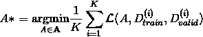**

**在哪里**

**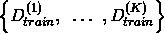**

**和**

**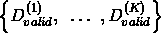**

**训练集和验证集是通过 *K-fold* 交叉验证获得的吗**

**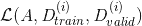**

**管道*的损失是在训练数据集 *i* 上训练并在验证数据集 *i* 上评估的*吗？**

## *随机搜索，网格搜索*

*可能想到的第一个也是最简单的调优方法是随机挑选几个管道参数化，并保留最好的一个。一种称为网格搜索的变体包括测试𝚨.离散化网格的节点更多细节，这些算法在 scikit learn 中实现，[这里的](http://scikit-learn.org/stable/modules/grid_search.html)是文档。*

*对于低维问题，这些类似蒙特卡罗的算法可能是一个很好的起点，但是，正如我们之前看到的，我们通常需要调整大量的参数，因此它们会收敛得非常慢。此外，在网格搜索的情况下，如果最优策略远离您定义的节点，您就没有机会发现它们。*

## ***元试探法***

*为了克服随机搜索的不良收敛特性，人们可能希望实现更“聪明”的算法。元试探法是一类基于开发/探索权衡的通用优化技术，通常模仿生物或物理现象。它们可以有效地解决凸和非凸问题。*

*在大量的元启发式方法中，我们可以提到如下例子:*

*   ***模拟退火**是一种受冶金学退火启发的方法，包括交替冷却和加热阶段，通过改变材料的微观结构和物理特性，最大限度地减少材料消耗。类似地，我们探索参数空间以尝试最小化系统能量(我们的目标函数)。我们还介绍了材料的温度 *T* 。在每一步，我们都在前一步的邻域中测试一个配置。温度越高，原子自由移动越多，邻域越大。因此，在这个过程的开始，当 *T* 很高时，我们探索几乎所有的搜索空间，随着这个温度的降低，我们越来越关注被认为有前景的领域。更详细的描述见[这里的](http://katrinaeg.com/simulated-annealing.html)。*
*   ***粒子群**使用一群候选解(或粒子)来探索空间𝚨.每个粒子在𝚨的移动取决于它当前的位置、它过去最著名的位置和整个群体的最佳位置。开发和勘探之间的权衡可以通过发挥这些不同因素的相对重要性来调整。[本文](http://bee22.com/resources/Poli%202007.pdf)给出了更多关于算法和一些变种的细节。*
*   ***进化算法**是一个受生物进化启发的算法家族。我们考虑一群候选解决方案(或个体),并应用简化的进化法则来优化目标函数，称为**适应度**。在每一步或每一代，我们选择最好的(这里指最适合的)个体。下一代是通过这些被选中的个体的繁殖而建立起来的。在这一步骤中，我们应用遗传操作:**重组**(利用)是将双亲特征组合起来形成子代解决方案的过程，而**突变**引入随机(探索)扰动。这样，平均群体的适应度应该从一代提高到下一代，最适合的个体收敛到你的优化问题的一个好的解决方案。*

## *贝叶斯方法*

*我们试图最小化的目标函数的每次评估都可能非常昂贵，因为我们必须训练和评估机器学习流水线。贝叶斯优化提供了一种有效的方法来探索参数集并快速收敛到一个方便的解决方案。简而言之:它有助于将参数空间𝚨的探索集中在有希望的领域。下面的*图 3*([来源](http://haikufactory.com/files/bayopt.pdf))给出了一个一维的简单例子(在这种情况下，我们要最大化函数):*

*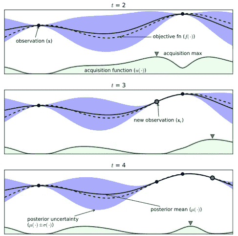*

*Figure 3: Bayesian optimization.*

*在该示例中，目标函数 *f* 通过[高斯过程回归](http://mlg.eng.cam.ac.uk/zoubin/papers/aistats07localGP.pdf)模型来近似。这种建模技术基于先验(函数值已知的点)为 *f* 的值提供了概率密度函数。该密度由蓝色区域表示，平均值用实线绘制。该分布非常接近观察值(小方差),而我们对未抽样区域的 *f* 的估计值没有信心(高方差)。*

*在每一步，新的探索点被选为一个叫做**激活函数**的函数的最大值(绿色的那个)。该函数综合了*先验*知识和关于要优化的函数的不确定性。在预测的目标函数高(或者如果我们想要最小化 *f* 则低)并且不确定性也高的地方，它是高的。换句话说，我们找到优化问题的更好解决方案的可能性很高。*

# *对立的力量*

*在本节中，我们提供了当前可用的自动 ML 解决方案的非详尽列表。我们随意选了几个总结特性来对比:是开源包吗？使用了哪些后端模型实现和超参数调优算法？有多少贡献者？*

*这些功能(如果有的话)汇总在下表中。请注意，这是撰写本文时这些库的快照。*

*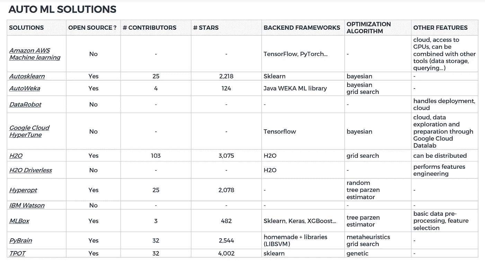*

*Figure 4: AutoML solutions snapshot (05/2018)*

*我们可以尝试一些自动 ML 解决方案。我们的测试总结在下面的部分。*

# *基准*

## *草案*

*我们选择了四个框架进行测试。涉及多样性和社区的主要选择标准(贡献者数量、最近一次提交的时间)。*

*   *AWS 机器学习(版本于 2017 年 12 月 5 日推出)*
*   *自动学习*
*   *H2O 3.16*
*   *TPOT*

*这些软件包在三个经典数据集上进行了基准测试，这三个数据集在 [Kaggle](https://www.kaggle.com/) 上提供:*

*   *一个**二元分类**问题:[泰坦尼克号生存预测](https://www.kaggle.com/c/titanic)*
*   *一个**多类分类**挑战:[基于 MNIST 数据集的数字识别器](https://www.kaggle.com/c/digit-recognizer)*
*   *一个**回归**的问题:[房价](https://www.kaggle.com/c/house-prices-advanced-regression-techniques)*

*通过这种方式，我们可以将结果与不同类型的监督学习问题的一般排行榜(以及一群有才华的数据科学家)进行比较。*

*我们在 **1 小时**内在 **32 核— 256Go RAM** 服务器上对训练集上的每个解决方案进行训练，然后在 Kaggle 上的测试集上提交预测。结果如下图所示。*

## *结果*

*对于每个挑战，我们根据解决方案在整个排行榜中的排名绘制了指标值，并在这些图上定位了我们测试的库。还提供了基本的基线解决方案。*

***泰坦尼克号挑战赛(二进制分类):***

*   *度量:*准确性*(正确预测标签的百分比)*
*   *挑战者数量:11164 支队伍(11700 名选手)*
*   *特征数量:9*
*   *样本数:训练集 891，测试集 418*
*   *基线:基于性别的预测(男性死亡，女性存活)*

*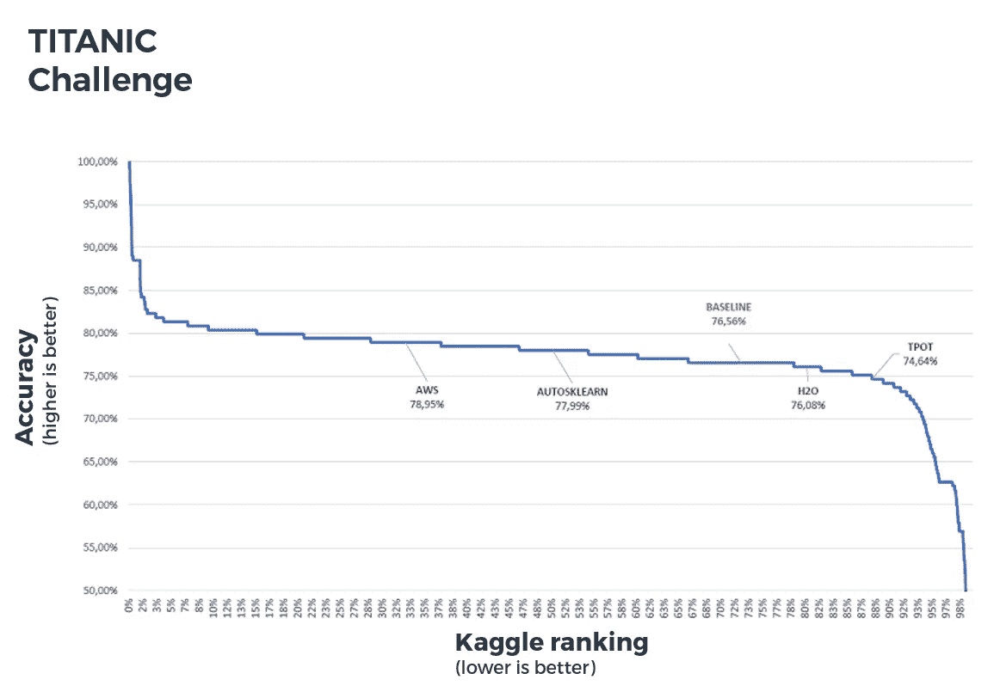*

*Figure 5: Titanic challenge benchmark*

*例如，该曲线显示前 20%的解决方案达到了 80%以上的准确率。*

***MNIST(多级分类):***

*   *度量:*精度**
*   *挑战者数量:2288 个团队(2345 个贡献者)*
*   *特征数量:784*
*   *样本数量:训练集 42000，测试集 28000*
*   *基线:k 个最近的邻居，k=1*

*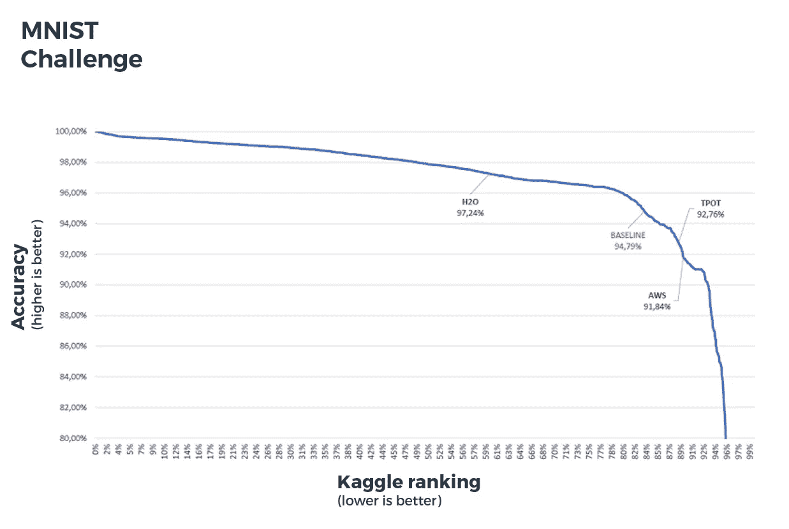*

*Figure 6: MNIST challenge benchmark*

***房价(回归):***

*   *度量:*均方根误差(RMSE)**
*   *挑战者数量:5123 支队伍(5397 名选手)*
*   *特征数量:268*
*   *样本数:训练集 1460，测试集 1459*
*   *基线:线性回归(面积、卧室数量、销售年份和月份)*

*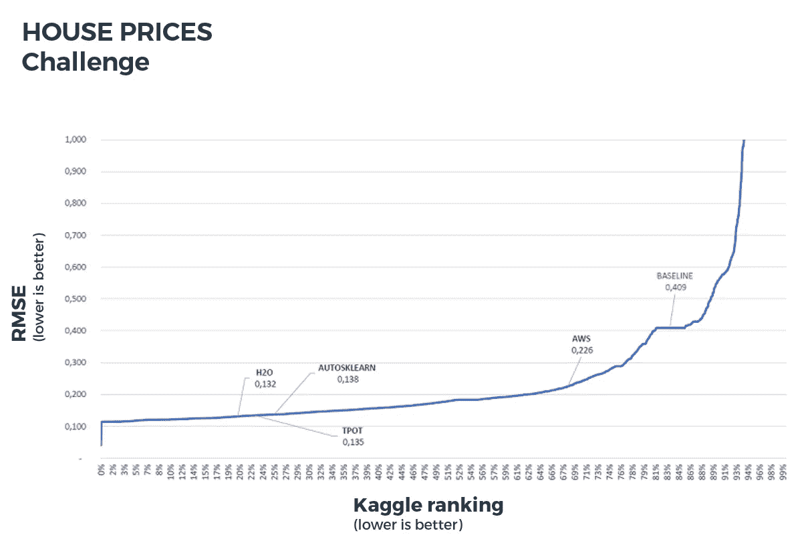*

*Figure 7: House prices challenge benchmark*

# *结论*

*实际上，[开源](https://hackernoon.com/tagged/open-source)框架需要一些**数据准备**和**清理**(二进制化、空值处理……)。只有商业解决方案提供完整的管道，从功能工程到模型部署。*

*此外，超参数调整算法有时需要**参数化**。例如，TPOT 使用的遗传算法就是这种情况。*

*开源自动 ML 解决方案**并不比人类**数据科学家表现得更好(排行榜上的前 20-80%取决于挑战)，但可以帮助以最少的努力和时间获得适当的准确性水平。*

*记住**特征工程是关键:***

> *“机器学习的圣杯之一是自动化越来越多的特征工程过程”——[**佩德罗·多明戈** s，*关于机器学习要知道的一些有用的事情*](https://bit.ly/things_to_know_ml)*

*这是机器学习项目中大部分努力的方向，因为这是一项非常耗时的任务。*

# *进一步阅读*

*   *[关于粒子群优化](http://bee22.com/resources/Poli%202007.pdf)*
*   *[关于模拟退火](http://katrinaeg.com/simulated-annealing.html)*
*   *[关于贝叶斯优化](http://haikufactory.com/files/bayopt.pdf)*

> *这篇文章最初发表在[**Cdiscount Techblog**](https://techblog.cdiscount.com/)上。*