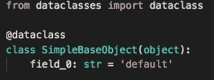

# Python 3.7 数据类简介

> 原文：<https://medium.com/hackernoon/a-brief-tour-of-python-3-7-data-classes-22ee5e046517>

Python 3.7 中的一个全新特性是“数据类”。数据类是为存储多个属性的类自动生成模板代码的一种方式。

它们还带来了使用 Python 3 的新类型提示的好处。

在 Python 3.7 中，数据类出现在标准库中新的`dataclasses`模块中，你需要两个重要的东西。

1.  `dataclass`装饰器，用于装饰数据类
2.  用于配置字段的`field`方法

# 默认魔术方法

在默认设置中，任何数据类都会为您实现`__init__`、`__repr__`、`__str__`和`__eq__`。

`__init__`方法将有**关键字参数**，它们具有在类上指定的相同类型的注释。

`__eq__`方法将按顺序比较所有数据类属性。

所有字段都在类的顶部声明，类型提示是**必需的**。

这个`__init__`方法将有一个`(field_a: int, field_b: str) -> None`的签名。您只需输入`print(inspect.signature(example.__init__))`就可以看到这一点

# 类型提示

非常重要的是，类型提示仅仅是提示。因此给出错误的类型不会发出警告或尝试转换。

因为类型提示是**必需的**(否则该字段将被忽略)，如果您没有特定的类型，请使用来自`typing`模块的`Any`类型。

# 易变性

dataclass decorator 有一个`frozen`参数，默认为 False。如果指定，字段将被"*冻结*"，即只读，如果`eq`被设置为 True，这是默认设置，那么`__hash__`魔术将被实现，对象实例将是可散列的，因此您可以将它们用作字典键或在集合中使用。

# 自定义字段

数据类中的核心类型是`Field`类型，它属于一个数据类。

默认情况下，只需设置一个 class 属性就会在类中实例化一个字段，如前面的示例所示。

如果您需要定制行为，您可以使用`dataclasses`模块内的现场工厂。

字段()的参数是:

*   `default`:如果提供，这将是该字段的默认值。这是必需的，因为字段调用本身替换了缺省值的正常位置。
*   `default_factory`:0 参数 callable，当该字段需要默认值时调用。
*   `init`:作为参数包含在生成的 __init__ 方法中。
*   `repr`:包含在生成的 __repr__ 方法返回的字符串中。
*   `compare`:包含在生成的等式和比较方法中(__eq__，__gt__，等)。
*   `hash`:包含在生成的 __hash__ 方法中。

*还有一个说法，元数据还没有使用。*

与关键字参数类似，具有默认值的字段必须最后声明。

演示默认工厂参数，

# 初始化后处理

您可以声明一个`__post_init__` 方法，它将在自动生成的`__init__`之后运行。

# 遗产

继承正如你所期望的那样工作。对于继承的**和**基类定义，您需要在`dataclass`中包装类。

但是，因为不能在默认字段之后声明非默认字段，所以不能在基类和子类之间混合默认和非默认字段。

这个例子引出了`TypeError: non-default argument ‘field_a’ follows default argument`

这很烦人，可能会阻止人们过多地使用继承或默认字段。

总而言之，这是一个很棒的特性，一旦 Python 3.7 发布，我可能会停止使用 attrs。

## 还卡在 Python 2 上？

[查看我在 Pluralsight 上关于从 Python 2 迁移到 3 的新课程。](https://www.pluralsight.com/courses/python-2-to-python-3)