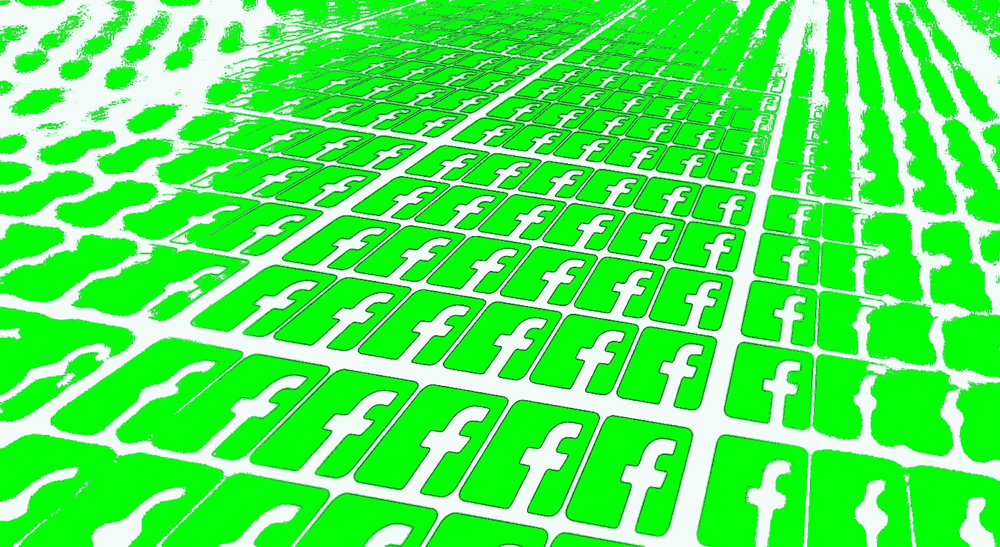

# 今天来自脸书的脸书新闻的简要翻译请说英语

> 原文：<https://medium.com/hackernoon/a-brief-translation-of-todays-facebook-news-from-facebook-speak-to-english-69fdf195e47>

[脸书](https://hackernoon.com/tagged/facebook)已经就其新闻源的[未来，特别是其与新闻出版商](https://newsroom.fb.com/news/2018/01/news-feed-fyi-bringing-people-closer-together/)的[关系做出了重大宣布。当然，它是以那种毫不留情的乐观模糊的方式发布的，这是硅谷目前事实上的公关语言。下面是对它的简单翻译:](https://www.nytimes.com/2018/01/11/technology/facebook-news-feed.html)

> 脸书的建立是为了拉近人们的距离，建立人际关系。我们做到这一点的方法之一是将人们与他们的朋友和家人在新闻提要中的有意义的帖子联系起来。在接下来的几个月里，我们将更新排名，以便人们有更多的机会与他们关心的人互动。马克今天在一篇文章中概述了这一点。

我们赚不到钱，除非你不断告诉我们你的事情，我们可以卖给广告商。请不要再说新闻了。

> 如今，我们使用诸如有多少人对帖子做出反应、评论或分享等信号来确定这些帖子在新闻订阅中的排名。

确保我们能把你的关系货币化。

> 在这次更新中，我们还将优先考虑引发人们之间对话和有意义互动的帖子。

我们已经受够了成为“假新闻”问题的替罪羊，所以我们正在摆脱新闻。

> 为此，我们将预测您可能希望与您的朋友进行互动的帖子，并在 feed 中显示这些帖子。这些帖子在评论和帖子中激发了你可能想要分享和回应的来回讨论——无论是朋友寻求建议的帖子，朋友寻求旅行建议的帖子，还是引发大量讨论的新闻文章或视频。

嘿，谁在乎两极分化？对我们来说，这是一个很好的盈利策略。

> 我们还将优先考虑朋友和家人的帖子，而不是公开内容，这与我们的新闻订阅价值观一致。

感谢您花费时间和精力建立您的网页:现在他妈的你，并支付给我们。

> 由于新闻订阅源的空间有限，显示更多来自朋友和家人的帖子以及引发对话的更新意味着我们将显示更少的公共内容，包括视频和来自出版商或企业的其他帖子。

新闻出版商:去你的，付钱给我们。

> 随着我们进行这些更新，页面可能会看到他们的影响范围，视频观看时间和推荐流量减少。

除非你付钱。

> 这种影响会因页面而异，受各种因素的影响，包括他们制作的内容类型以及人们如何与之互动。发布人们通常不会回应或评论的帖子的页面可能会出现最大的分发量下降。帖子能促进朋友间对话的页面效果会更差。

但是你仍然会看到效果。

除非你付钱。

> 产生人们之间对话的页面帖子将在新闻提要中显示得更高。例如，直播视频经常会在脸书的观众中引发讨论——事实上，直播视频的平均互动次数是普通视频的六倍。

直播视频仍然不工作，但我们会继续打你，直到它可以。

> 许多在脸书上发布视频的创作者会在他们的追随者中引发讨论，名人的帖子也是如此。在群体中，人们经常围绕公共内容进行互动。当地企业通过发布相关更新和举办活动来联系他们的社区。新闻有助于就重要问题展开对话。

不是我们，是你:你不像那些可爱的有影响力的人(他们付钱给我们)，你在联系方面很糟糕。

> 使用“参与诱饵”来刺激人们评论帖子不是一种有意义的互动，我们将继续在新闻提要中降级这些帖子。

付钱给我们。

## 进一步阅读

下面是 [Twitter 如何回应](https://www.onemanandhisblog.com/archives/2018/01/one-man-and-his-buzzfeed.html) …

*首发于* [*一人&他的博客*](https://www.onemanandhisblog.com/archives/2018/01/facebook-newsfeed-changes.html)