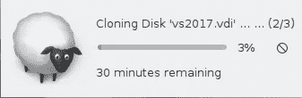
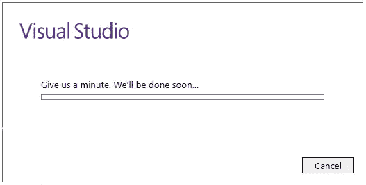
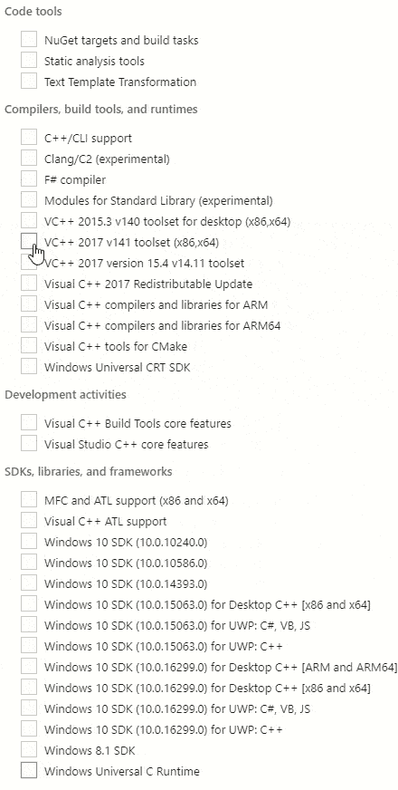
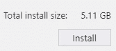
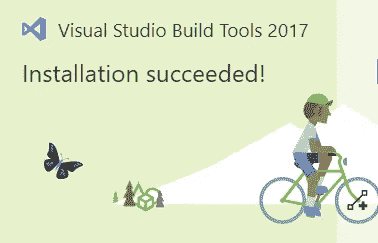
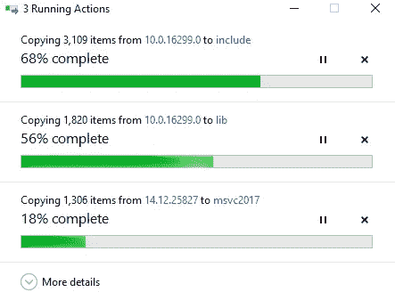
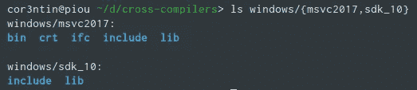
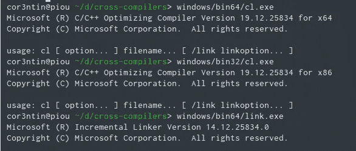
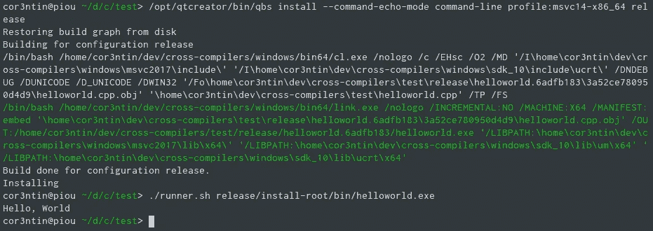

# 一个 C++ Hello World 和一杯葡萄酒，天啊！

> 原文：<https://medium.com/hackernoon/a-c-hello-world-and-a-glass-of-wine-oh-my-263434c0b8ad>

Nothing to remove, nothing to add.

这是 C++中合适的“ ***Hello World*** ”。其他所有*你好世界*都是[***不对***](https://www.youtube.com/watch?v=6WeEMlmrfOI) *。但是这并不是我抱怨`using namespace std;` 如何将 C++教学中的混乱变得清晰的地方。也许下次吧。*

今天我们将编译那个 *hello world* ，以便它可以在**目标系统上执行。**

但是首先，让我告诉你一些关于我的事情。我使用 Linux 是为了乐趣和利益。我碰巧认为这是最好的系统。对我来说。作为一个开发者。有时候，我看不起使用 Windows 的开发人员，想知道他们是如何通过点击来完成任何事情的。而且很可能是 Arch 上的一个 vim 用户看不起我用 Ubuntu。没有人是完美的。

无论如何，让我们启动一个终端

```
# sudo apt-get install g++
# g++ -o helloworld helloworld.cpp
# ./helloworld
Hello, World!
#
```

很好，那很简单，我们回家喝杯啤酒吧🍻！

但是，我的老板进来了。他们的业务是向使用 Windows 的人出售软件。我试图向他们展示我可以让一头牛说话，我可以调整我的终端大小，所以我们显然应该将我们的所有业务一次转移到 Linux，他们说了一些关于市场份额的难以理解的事情，显然，他们也可以调整他们的命令提示符。


在我们像被困在埃舍尔画作中一样俯视对方一会儿后，我勉强记起我的工作是让我的客户开心，因此我们将把我们的 *hello world* 应用程序移植到 Windows 上。我们的老板不在乎我们用什么样的环境来创建那个突破性的应用程序，他们也不反对我同时继续开发 Linux 版本，所以我决定在 Linux 上为 Windows 开发那个应用程序。会出什么问题呢？

此外，建立一个构建场和持续集成会容易得多。您甚至可以让您的 CI 动态提供新的 docker 容器，以便在受控的全新环境中构建 windows 应用程序。虽然我倾向于认为 Docker 有点像货物崇拜，但是将 Docker 与 Jenkins 一起使用实际上是很有意义的。如果你喜欢你的系统管理员，不要强迫他们处理 Windows 服务器。

我们应该努力使你的应用程序尽可能的可移植和平台无关，所以拥有一个 windows 版本的应用程序实际上可以使我们的代码更好。我也是这么告诉自己的。

事实证明，微软很好地为 windows 提供了一个名为`msvc`的编译器，我觉得在 windows 上`msvc`比`g++`更好，因为这是整个生态系统设计的编译器。希望微软最了解他们自己的工具、格式和呼叫惯例。不过，我从来没有特意去测试过，你可以在网上找到这两种方法的支持者。但是，[MSVC 团队同意我的观点。](https://blogs.msdn.microsoft.com/vcblog/2017/03/07/msvc-the-best-choice-for-windows/)修卡。

不管怎样，现在，让我们坚持下去。

```
# apt-get install msvc
E: Unable to locate package msvc
```

令人惊讶的是，这不起作用。你不能责怪一个尝试的人。但是为了解释为什么，让我告诉你编译器是如何工作的。

编译器打开一个文件，将该文件的内容转换成可执行的内容，并将其写入其他文件。有时你有不止一个源文件，所以你需要一个链接器，它是一个打开一堆文件并写下可执行文件的程序。可执行文件就是一个文件，没什么神奇的。有时候你需要图书馆。库是一个文件。你很可能需要大量的头文件…你懂的，文件。普通的旧的无聊文件。然后，可执行文件被另一个可执行文件加载，这个可执行文件也是一个文件，它的文件一直向下。好吧，也许不是，计划 9 有更多的文件。

明确地说，编译器是非常复杂的工程，尤其是 C++编译器，你应该给你遇到的所有编译器作者提供一个 cookie。然而，从系统集成的角度来看，它们是微不足道的。大多数编译器甚至不关心线程。他们让构建系统来处理这个问题。这是不幸，因为大多数建筑系统还没有学会如何系鞋带。

不管怎样……下面是编写编译器所需的内核工具列表:

*   打开、读取和写入文件
*   正在读取目录内容
*   分配内存

因此，您可能认为这是一个足够合理的列表，因此，您想知道为什么 msvc 在 Linux 上不可用。当然，让 msvc 构建 Linux/ELF 应用程序将是一项巨大且可能毫无意义的任务，但我们想要的只是为 Windows 构建一个应用程序*,微软肯定会让我尽可能容易地做到这一点，对吗？*

但是有这个东西。Windows 是一个*的“生态系统”。这意味着他们想把他们的操作系统卖给他们的用户和开发人员，把他们的工具卖给开发人员，并确保没有人知道其他操作系统传奇人物所说的。所以如果你想构建一个 windows 应用，你需要 Windows。废话。*

*幸运的是，有人在 Linux 上重写了 Windows，并将其命名为 wine。可能是因为他们必须喝得酩酊大醉才能想到这么做。葡萄酒只用了 15 年就达到了。但是现在在`3.0`里，所以也许我们可以用？开源社区中有一些小奇迹，WINE 当然是其中之一。*

*在很长一段时间里，MSVC 与 Visual Studio 捆绑在一起。这意味着如果你想用 Qt creator、CLion、Eclipse 或 notepad++在 windows 上编译一个 C++应用程序，你还必须有 Visual Studio。生态系统等等。*

*现在情况好多了，你可以安装“构建工具”,这样你只需要安装大约 5GB 的东西。就这么办吧。*

*哦，显然编译器是作为一个可执行文件分发的，它可以下载你没有在网上要求的东西。也许比 40GB 的 zip 好？*

```
*# wine vs_BuildTools.exe 
The entry point method could not be loaded*
```

*你惊讶吗？我的梦想破灭了。我们**确实**需要一个 windows 来做一些 windows 开发(剧透:变得更好)。*

*让我们启动一个虚拟机。如果你想跟进，我建议你使用一个新的或克隆的 Windows 10 虚拟机。我们将会安装很多奇怪的东西，这几乎是不可能的。之后你可以[摆脱虚拟机](https://www.youtube.com/watch?v=z0wK6s-6cbo)。*

**

*Isn’t he cute ? Maybe I should send my resume to Oracle.*

*一旦完成，我们就可以去下载 VS 构建工具了。*

*[](https://www.visualstudio.com/downloads/#build-tools-for-visual-studio-2017) [## 下载| IDE、代码和 Team Foundation Server | Visual Studio

### Visual Studio 免费下载面向学生、开源和个人开发者的全功能 IDE

www.visualstudio.com](https://www.visualstudio.com/downloads/#build-tools-for-visual-studio-2017) 

向下滚动，直到你得到腕管。构建工具是倒数第二项。下载那个。

我在启动安装程序时遇到了一些问题。我认为他们试图联系一个服务器，该服务器设法将自己加入广告服务器列表，因此我的 DNS 阻止了它。别问了。



That took way more than a minute.

安装程序加载屏幕，这是完全正常的。一旦完成，它加载主用户界面，缓慢而痛苦，但然后我们得到复选框。我玩得很开心。



Shopping list.

你不需要静态分析工具，但是当你安装一个编译器时，无论如何它们都会被检查。那很好。

我们需要一个 C++工具集——其他人都称之为工具链的东西。我不确定哪个更新，`v141`还是`15.4 v14.11`。用模具？

我们还需要一个 C 运行时，这很方便。我不确定我们是否需要`CRT`或者`URT`，所以我们将两个都安装。不过，URT/CRT 还是不错的。在它出现之前，一切都要困难得多。

最后，我们可能需要使用一些 windows 特性，所以我们应该获得 Windows SDK。显然，这取决于一些 C#组件。还有一些 JS 库，*很明显。*需要明确的是，没有 Windows SDK 你做不了任何有用的事情，最好现在就下载。



WIN32_LEAN_AND_MEAN

当 Visual Studio 进入硬盘的每个角落时，是时候喝一杯咖啡了。不过在某些时候，它已经完成了，所以你可以和蝴蝶一起骑自行车了。很好。



Improving my editorial line with pretty pictures, courtesy of Microsoft.

一只蝴蝶不足以让我想放弃 Linux，所以让我们看看我们刚刚安装的东西是否可以在没有 Windows box 的情况下使用。

在虚拟机外部复制以下内容:

*   `C:\Program Files (x86)\Windows Kits\10\Include`
*   `C:\Program Files (x86)\Windows Kits\10\Lib`
*   `C:\Program Files (x86)\Microsoft Visual Studio\2017\BuildTools\VC\Tools\MSVC`

前两个路径是 Windows SDK，最后一个是工具链，包含编译器、链接器、STL 和 VC 运行时库，适用于所有架构。

在我的安装中，我到处都有 URT 文件，所以我想如果你安装了 Windows 10 SDK，你实际上获得了 CRT，所以当你选择要安装的组件时，你不需要单独激活它。与几年前相比，情况要好得多。微软一直很忙。



Copy all the things !

我把所有东西都放在一个名为 windows 的文件夹中，我有 msvc 编译器和运行时，STL 和 redistribuables 放在一边，windows 10 SDK 放在一个单独的文件夹中。我没有保留任何关于我正在使用的 SDK 或工具链版本的信息，您可能希望更恰当地这样做。

在 Windows Sdk 中有一些有用的二进制文件&像`rc.exe`这样的 dll 放在工具链二进制文件所在的`msvc2017/bin/Hostx64/x64`中，包括`cl.exe.`

如果您不熟悉 windows 开发:

*   `cl.exe`是编译器
*   `link.exe`是链接器
*   `rc.exe`是一个处理资源文件的工具，包括图标和清单

如果您必须处理驱动程序、cab 文件、MSI 安装程序等，您可能需要各种其他工具。

整件事就是关于 **2.9GB** 。大约是我们必须在 windows 虚拟机上安装的一半。



The road so far

我们再喝点酒吧🍷。访问[https://wiki.winehq.org/Ubuntu](https://wiki.winehq.org/Ubuntu)和[https://github.com/Winetricks/winetricks](https://github.com/Winetricks/winetricks)以确保您的葡萄酒设置是最新的。我将使用`wine-3.0`。

然后，安装适用于 VC 2017 的 redistribuable。这个过程基本上是自动的。我们将使用专用的葡萄酒前缀，以保持一切洁食。这意味着在 wine 下安装多个 msvc 实际上比在 windows 上更容易。

```
WINEPREFIX=windows/vs-buildtools2017-wine64 WINEARCH=win64 winetricks vcrun2017
```

然后在您的 windows 文件夹中，创建一个`bin64`文件夹，您可以在其中编写一个包含以下内容的小型 bash 脚本。

Setup a wine environment for the cl.compiler

该脚本将首先设置 wine 使用我们的前缀。然后，在将参数转发到 wine 上运行的实际 windows PE 二进制文件之前，我们进行 Linux -> windows 路径分隔符转换(`/`到`\`)。

我们将使用一个名为`[shc](https://github.com/neurobin/shc)`的工具将这个包装器转换成一个合适的`elf`可执行文件。否则我们以后可能会有问题。另一个解决方案是编写一个 C++包装器来代替 bash。`shc`有一些缺点，首先是需要硬编码的安装路径。

```
shc -f cl-wine.sh -o cl.exe
shc -f cl-wine.sh -o link.exe
```

您可以用同样的方式创建一个 bin32 文件夹，只需将最后一行改为 wine "$DIR"/../msvc 2017/bin/hostx 64/**x86**/$ PROGRAM

拥有 x86 目标编译器。我不确定为什么你需要两套独立的二进制文件来支持另一个架构，但是我们确实需要。最后，x86 链接器可能会抱怨缺少库，所以我们要创建一些符号链接。

```
cd windows/msvc2017/bin/Hostx64/x86/
for x in $(ls ../x64/ms*.dll); do ln -s $x .; done
```



We are going places !

在我们开始认真工作之前，还有最后一件事。我们需要删除`vctip.exe`，因为它不起作用。这是一个遥测工具，所以我们不需要它。它位于`windows/msvc2017/bin/Hostx*/**`。如果您不遵循这一步骤，您将会遇到奇怪的堆栈跟踪。

是时候构建我们的 Hello World 应用程序了！这其实很简单

我们正在构建一个可执行文件，它依赖于编译器头文件(包括 STL)、C 运行时和一些 windows 库，比如 kernel32.lib。


🎉 😎 🍻

为了完整起见，下面是 x86 版本

事实是，整个努力相当简单，也许比正确使用 windows 更简单。不要再摆弄`vcvarsall.bat`了，所有你喜欢的工具比如`perl, git, python, sed, the terminal, zsh…`都在那里并且正常工作。* 

# *🔨构建系统*

*我们让`cl.exe`在 linux 上工作，耶！在我们更进一步之前，我们应该将这个外来工具链添加到一个漂亮的现代构建系统中。由于我没有心情处理 cmake 的混乱，我们将使用 **QBS** ，我最喜欢的构建系统。*

*设置 qbs 来使用我们的 wine/msvc 编译器应该很容易…*

*QBS 可以自动检测工具链，但是有几个问题。首先，这些工具假设 MSVC 只存在于 windows 上，所以一些代码路径被禁用了。我认为这可以在几个小时内修复，只需要以可移植的方式实现`CommandLineToArgv`函数。*

*但是，工具太聪明就有话说了。QBS 试图在一个假定的位置解析`vcvars.bat`。这是我们很高兴摆脱的一个文件。*

*现实检查，我们不会得到任何形式的自动检测。我们真的不需要。我们可以手动设置工具链，并把它作为一个独立于 msvc-on-windows-proper 的东西。检测并不是一个真正的问题，因为我们只有几个包含目录和库路径。*

*我已经开始向 GitHub 推送一些文件，这是一项正在进行的工作。调试版本目前完全中断。这是一个让我们对葡萄酒工具链有所了解的模块。它通常禁用所有探测，并假设一切都已正确配置。*

*[](https://github.com/cor3ntin/qbs-wine-toolchain) [## cor3ntin/qbs-wine-toolchain

### 在 GitHub 上创建一个帐户，为 qbs-wine-toolchain 的发展做出贡献。

github.com](https://github.com/cor3ntin/qbs-wine-toolchain) 

因此，我们必须手动完成设置配置文件的所有工作。但是如果我们的努力证明了什么的话，那就是即使像 VC++这样复杂的工具链也可以简化为一些变量(编译器、链接器、工具路径、包含、定义、库路径)。所以，[这里是我的 QBS 配置文件配置](https://gist.githubusercontent.com/cor3ntin/85eda9db218bd194f235b8098226d185/raw/4f0f951c5c8b78c77152acfb54dfe0e36c15d9de/qbs_config_x64.conf)。

最后，我们可以编写一个小的`qbs`构建脚本

我们可以运行它，然后*瞧！*



Bonsoir Eliot.

`runner.sh`是一个[小脚本](https://gist.github.com/cor3ntin/ecd136ad792f54dd7feb89cb094dcf75)，在启动新构建的 windows 可执行文件之前设置 wine 前缀。不要太花哨。

所以现在你有了。一个微软编译器，包装在编译成 ELF 的 bash 脚本中，构建 64 位 PE 可执行文件，由运行在 Linux 上的现代构建系统驱动。这很令人满意。

我们假想的老板正在敲门。第 2 部分见。

[](/@corentin.jabot/a-c-hello-world-and-the-cute-heartless-rainbow-3cc9695f4142) [## 一个 C++ Hello World 和可爱无情的彩虹

### 其中我们用几个外来的工具链和 rainbow 的能力交叉编译了 Windows 的 Qt 应用程序。

medium.com](/@corentin.jabot/a-c-hello-world-and-the-cute-heartless-rainbow-3cc9695f4142)*