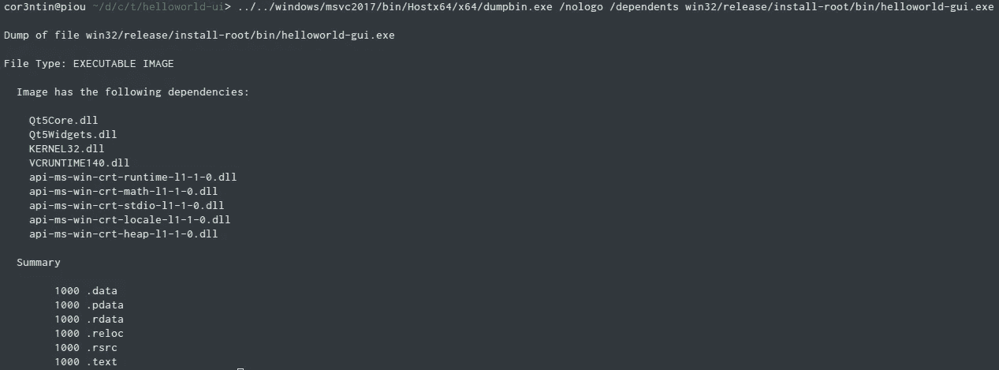

# 一个 C++ Hello World 和可爱无情的彩虹

> 原文：<https://medium.com/hackernoon/a-c-hello-world-and-the-cute-heartless-rainbow-3cc9695f4142>

这是我们构建“Hello World”应用程序系列的第二部分。如果你参加聚会迟到了，我鼓励你先看看第一部分。

[](https://hackernoon.com/a-c-hello-world-and-a-glass-of-wine-oh-my-263434c0b8ad) [## 一个 C++ Hello World 和一杯葡萄酒，天啊！

### 其中我们尝试在 Linux 上使用 Microsoft Visual C++编译器

hackernoon.com](https://hackernoon.com/a-c-hello-world-and-a-glass-of-wine-oh-my-263434c0b8ad) 

Hic Sunt Arcūs

所以，我们的老板进来检查我们的进展。他们开始想知道为什么要花一整天的时间将一个 3 行应用程序移植到一个新系统上。但他们此行的真正原因是想要一个新功能。虽然我们的“Hello world”业务蒸蒸日上，但市场部认为缺乏图形用户界面影响了销售。

看，没有人能逃脱软件膨胀。

还是。急于让老板忘记在 Linux 上设置 MSVC 所花的时间，我做了更多的工作，完成了我们应用程序的全部重写。

当然，我们还提供了一个小巧的构建文件。

QBS is love, QBS is life. CMake is definitively Shrek 👹

Linux 版本仍然运行良好。咄


The author likes to pretend all Linux machines are born with Qt And QBS installed. Just play along.


In case of nuclear disaster, click “no”

让我们热情地打造 Windows 版本


Not so Qt.

是的，事实证明，我们需要一个与我们的编译器兼容的 Qt 版本。现在，甚至 QBS 都不知道 Qt。

我去 https://www.qt.io/download 的[上下载 Qt。那个网站一天比一天差。Qt 公司试图劝阻人们使用开源版本。但是如果你去](https://www.qt.io/download)[https://download.qt.io/](https://download.qt.io/)你有所有的 tarballs 和安装程序。

说到安装程序，他们没有为 Windows 提供 64 位版本。2018 年。我们可能不得不把自己限制在 32 位，然后用葡萄酒提取。除了它不起作用，因为 Qt 安装程序框架没有静默模式(显然，你可以用 100 行 JavaScript 编写一个静默模式)，并且使用了一些 WINE 不支持的 Windows 方法。

没关系。我将自己建立 Qt 来证明我的葡萄酒工具链有多棒。它将是 64 位。我会被提升，有 4 个博士学位的实习生会给我带来卡布奇诺。也许人们甚至会把我的名字当作一个动词(如果你还不知道的话，你一定要去看看！).

除了。Qt 还是用`qmake`来自建。而`qmake`的存在只是为了让`cmake`看起来更酷更现代。有一个[正在努力](http://code.qt.io/cgit/qt/qtbase.git/log/?h=wip/qbs2)用`qbs`构建 Qt，虽然这非常令人兴奋，但它可能有点太前沿了，即使对这个博客来说也是如此。

所以，我们被`qmake`困住了。`qmake`是一个构建系统生成器，不幸的是它合并了工具链和构建系统。我确实尝试过为我的 wine 工具链创建配置，它实际上相当简单，并且确实用适当的命令生成了一些 Makefiles。但它们是`nmake`的 Makefiles，这是一个类似 make 的 windows 工具，尽管其格式与最初的 make 不太兼容。我试着使用`nmake`(这很好)，但是所有后续的`cl.exe` / `link.exe`调用都发生在 wine 环境中，这意味着它执行实际的 crude 而不是我们的包装器，所以我们粗糙的斜杠到反斜杠的转换脚本永远不会运行，编译失败，因为`cl.exe`假设任何以`/`开头的都是选项。我们不能让 nmake 调用我们的假包装器，因为 nmake 是一个 windows 进程，windows 不知道 ELF。

这是留给读者的一个练习，让他们计算使用`\`作为路径分隔符的 Windows 花费了多少亿美元，以及这个行业的成本。

解决方案是给`qmake`打补丁。这是连`qmake`的维护者都极力避免的。所以我们不要那么做。

非常抱歉，但是我们将返回到我们的 Windows VM 并从那里构建 Qt。

> 那应该很简单吧？

当然，VC 构建工具无法正确设置它们的环境。

建立一个构建环境需要多少名微软工程师？当然有不少，因为我能够在 20 个左右的文件中找到大约 1900 行批处理脚本。可能还有更多。

我设法把我的环境分成三行。请记住，无论您的构建系统有多复杂，它都可以归结为一些变量。编译器不需要太多。

```
set "INCLUDE=C:\Program Files (x86)\Microsoft Visual       Studio\2017\BuildTools\VC\Tools\MSVC\14.12.25827\include;
 %INCLUDE%"
set "LIB=C:\Program Files (x86)\Microsoft Visual Studio\2017\BuildTools\VC\Tools\MSVC\14.12.25827\lib\x64\;%LIB%"
set "PATH=%PATH%;C:\Users\cor3ntin\Documents\qtbase-everywhere-src-5.10.0\gnuwin32"
```

之后就是下载 Qt 5.10 设置 x64 构建环境的问题了(我用的是`vcvars64.bat` +上面那三行，不过你可以手动设置`PATH`，根本不用`vcvars.bat`费心)。

确保`perl`已安装并在`PATH`中。

出于本文的目的，我只需要 Qt Base(核心、Gui、网络…)所以这就是我正在构建的。构建使用 chromium 的 QtWebEngine 要复杂一些。

```
configure -release -opensource -confirm-license -platform win32-msvc -nomake examples -nomake tests
nmake
nmake install
```

一旦 Qt 完成构建，将文件夹复制回您的 linux 主机。你至少需要`bin, include, lib, plugins`。把它们放在一个新的目录里。我把我的叫做`qt5_10base-x64`。

我对引用`src`有疑问。所以你可以从 windows 上的 Qt 目录运行`perl bin\syncqt.pl -copy -windows -version 5.10.0 -outdir cpy`，并使用在`cpy`中生成的 include 文件夹。即使这样，我也不得不手动将一些文件(qconfig.h，q{core，gui，widgets，network，xml}-config.h)从 src 文件夹复制到它们各自的 include 文件夹中。确实有点复杂，但最终你会到达那里。


My Linux is slowly morphing into a Windows Box. I expect Clippy to appear at any moment now.

所以现在我们有 Qt。但是我们怎么能告诉 QBS 实际使用它呢？

QBS 的个人资料系统是它伟大的原因之一。您可以全局设置编译器工具链，并毫不费力地从一个工具链切换到另一个工具链。

然而，为了与 Qt 一起工作，qbs 需要每个概要文件有一套完整的模块。我们前面使用的 gcc 概要文件由 160 个 qbs 文件组成，设置每个 Qt 库和组件。

幸运的是，你需要做的就是调用这个方便的工具。

```
qbs-setup-qt -h                                             
This tool creates qbs profiles from Qt versions.

Usage:

    qbs-setup-qt [--settings-dir <settings directory>] --detect

    qbs-setup-qt [--settings-dir <settings directory>] <path to qmake> <profile name>

    qbs-setup-qt -h|--help

The first form tries to auto-detect all known Qt versions, looking them up via the PATH environment variable.

The second form creates one profile for one Qt version.
```

只是我们不能从 linux 中调用这个工具，因为构建的 qmake 是一个 windows 应用程序，预计将在 Windows 上运行。希望有一天我们能完全摆脱 qmake，但是现在，回到我们的 Windows 机器上。

我们首先[安装 qbs 的 windows 版本](https://doc.qt.io/qbs/installing.html)并运行该工具。

```
qbs-windows-x86_64-1.10.0\bin\qbs-setup-qt.exe --settings-dir . bin\qmake.exe msvc14-x64-qt
```

这应该会创建一个带有适当 Qt 配置的`qbs`文件夹。将该文件夹移动到您的 linux 机器上之前创建的`qt5_10base-x64`文件夹中。

如果你打开一个`.qbs`文件，比如说`1.10.0/profiles/msvc14-x64-qt/modules/Qt/gui/gui.qbs`，你会注意到一个路径的引用。出于某种原因，在我这里是`/usr/local/Qt-5.10.0`。我想我在某个地方搞砸了，因为我们应该有一个窗口路径。在任何情况下，我们都需要将该路径转换为 Qt 在 Linux 机器上的实际位置，这很容易做到，只需使用`sed`。

```
find -name "*.qbs" -exec sed -i -e 's\#/usr/local/Qt-5.10.0\#/home/cor3ntin/dev/cross-compilers/windows/qt-5.10-msvc-x64\#g' {} \;
```

然后我们需要修改我们的`qbs.conf`来使用那些 qt 模块。编辑在第一部分中创建的 QBS 文件以引用它们:

```
qt-project\qbs\profiles\msvc14-x86_64\preferences\qbsSearchPaths=/home/cor3ntin/dev/Qt/qbs-wine-toolchain,/home/cor3ntin/dev/cross-compilers/windows/qt5_10base-x64/qbs/1.10.0/profiles/msvc14-x64-qt
```

我知道这有点棘手。不过，最终我们可以运行`qbs`，它会为 Windows 编译我们基于 Qt 的 hello world。


它不会运行，因为它找不到 Qt dll。你可以将 dll 复制到构建目录，或者确保它们在`PATH.`窗口/wine `PATH`中。

我发现这样做的唯一方法是运行`regedit`——确保从适当的`WINEPREFIX`开始，并将 Qt 的 bin 目录的位置添加到`HKEY_LOCAL_MACHINE\SYSTEM\CurrentControlSet\Control\Session Manager\Environment`下的`Path`中。

如果你知道如何把它写下来，请告诉我。


Using regedit on Linux. What would I not do for my readers ?

我们还需要在我们构建的 helloworld.exe 二进制文件旁边放一个`qt.conf`文件，告诉 Qt 从哪里加载插件。就我而言

```
[Paths]
Prefix = /home/cor3ntin/dev/cross-compilers/windows/qt5_10base-x64/
Plugins = plugins
```

就是这样！这并不太难，是吗？


I made a clicky thing !

## 因此，Microsoft Studio Visual C++编译器是有史以来最伟大的东西！

最近对两名学龄前儿童进行的一项研究表明，千禧一代喜欢彩虹。我立即被要求使我们的应用程序更加彩虹 y。含糊不清的标签按钮显然是假装天启的骑士，所以我们也将摆脱他们。

我们需要做的是迭代我们的字符串，并在每个字符周围注入一些 html 标记，以便它们以不同的颜色呈现。

遍历某个容器需要我们使用`range-v3`。字面上的没有别的办法。


Making WordArt Great Again.

这不是很好吗？

但是，我敢肯定，当你得知`msvc`无法编译`range-v3`时，你会大吃一惊。我知道，这是一个彻底的打击，彻底的失望。

## Microsoft Studio Visual C++编译器失败。

我们绝对无能为力。它不像是存在一个兼容 msvc 的端口 `[range-v3](https://github.com/Microsoft/Range-V3-VS2015)`或来转换我们的字符串。请不要再说我故意编造了一个虚构的故事，这样我就可以使用范围和用彩虹打败 msvc。那就是*的意思*。

唯一合理的就是抛弃`msvc`，用别的东西代替。但是什么？`Mingw`不懂 MSVC 头文件和 libs，`icc`相当贵，`Cfront`不再维护。

现在，你肯定知道我的意思了，不是吗？`clang-cl`！如果你不知道`clang-cl`，它是`cl.exe`的替代品，除了它实际上是铿锵的，所以它会让你内心温暖而模糊。

Clang 设计合理，它是一个了不起的工具，原因有很多，但最重要的是:

*   它可以在所有主流操作系统上运行
*   它不在编译时激活特定于操作系统的特性，而是在运行时激活。
*   这意味着你可以从任何地方瞄准任何东西。
*   它提供了一个与`msvc`兼容的驱动程序(如果你喜欢，也可以是命令行界面)
*   它很容易构建(如果您曾经尝试过构建 GCC，您就会知道构建一个编译器有多难。)
*   它是开源的，它的设计不受政治动机的约束。

## 所以，还是用铿锵吧！

如果您没有遵循 Linux 发行版的文档，那么默认情况下它应该附带 clang-cl(这只是 clang 的一个符号链接)。

或者如果你像我一样，结帐并建立主干，[它充满了善良](https://clang.llvm.org/cxx_status.html)！

除了作为替代品，我们还需要做一些事情。我们为 wine 编写的`QBS`工具链模块并不完全有效，因为它将斜杠转换为反斜杠。

我复制了工具链模块并修复了一些其他细节。很快就会出现在 GitHub 上。

为 clang-cl 创建一个 QBS 概要文件非常简单，从 wine 复制一个，并将工具链名称从`msvc`更改为`clang-cl`，并将`toolchainInstallPath`指向包含`clang-cl`和`lld-link`的某个地方。

哦，我没提到`lld-link`吗？是对`link.exe`的替代下降。`lld` 也是 unix 上`ld`的替代品，它比`ld`和`gold`快得多，所以你应该[检查一下并使用它](https://lld.llvm.org/)！

我们还没有完成。


Case consistency at Microsoft is a serious matter.

Microsoft Windows 是围绕不区分大小写的文件系统设计的。我确信这在当时看起来是个好主意。

然而，除非你自虐到在`FAT`上运行你的 Linux 机器，否则你的文件系统很可能是区分大小写的。这对我们来说是个问题。

有多糟糕，真的吗？嗯…

```
**A**cl**UI**.**L**ib
ahadmin.lib
wdsClientAPI.**LIB
P**sapi.**L**ib
sensorsapi.lib
**S**etup**API**.**L**ib
```

这只是一小部分文件。我不认为他们现在能做什么来解决这个问题，太晚了。

我们可以尝试通过改变每个库和头文件的文件名来解决大小写问题。但这可能行不通，因为第三方库也不一致。因此，即使我们试图修复我们的构建文件，我们迟早会遇到案例问题。

因此，“适当的”(对于适当的一些定义)解决方案是欺骗 Linux 内核不区分大小写。为此，我们需要使用不区分大小写的系统。幸运的是，一个文件可以是一个文件系统，所以我们将创建一个足够大的文件来保存 windows SDK，用不区分大小写的文件系统(比如 EXFAT)对其进行格式化，并将 SDK 放在那里。请注意，NTFS 是区分大小写的，即使 Windows 内核不是。

```
dd if=/dev/zero of=win_sdk_10.fs bs=1024 count=$((1024 * 100 * 3))
mkfs.exfat win_sdk_10.fs
mv sdk_10 sdk_10.bak
mkdir sdk_10
sudo mount win_sdk_10.fs
mv sdk_10.bak/* sdk_10
```

你会爱上 Linux 的。

而现在，用 clang-cl 编译工作。但是，运行该程序会暴露一个错误。


Our program compiles with clang and runs but it exhibits a nasty bug.

然而，复制到虚拟机的同一个可执行文件运行良好。


Such greetings.

我还是不确定窃听器到底在哪里。它看起来要么在-v3 范围内，要么在我的使用范围内，但奇怪的是，它会公开不同的运行时行为。

但是这就是拥有一个更大的开发环境的好处，如果你有 bug，它们更有可能被暴露。首先，这个讨厌的图形故障让我意识到我应该把空白作为特例来处理。

哦，如果你想检查 clang 实际上在做什么，你可以使用微软在`msvc2017/bin/Hostx64/x64/`中找到的`dumpbin.exe`。这个工具相当于 unix 的`ldd`和`nm`。


有趣的是，这个 clang 工件看起来和 msvc 制作的一模一样，只是多了几个部分。包括 CRT 和 vcruntime！

这是 MSVC 建立的二进制。



目前`ldd-link`仍处于实验阶段[并且不支持调试信息。`clang-cl`除了一些异常处理，](https://lld.llvm.org/windows_support.html)[是否大部分完成](https://clang.llvm.org/docs/MSVCCompatibility.html)。可以混搭`cl.exe``clang-cl``link.exe``lld-link`。

我不能建议你在生产中使用`clang-cl`(但是，它正在实现),但是它是添加到你的 CI 和开发环境中的一个令人惊奇的工具。

这是我今天给你的全部，我希望你已经学到了一些东西！

# …还有一件事…

## 第 3 部分再见！

[](/@corentin.jabot/a-c-hello-world-and-the-rose-gold-walled-garden-of-doom-4ac3c92385ed) [## 一个 C++ Hello World 和玫瑰金围墙的毁灭花园

### 这是我的交叉编译系列文章的第 3 部分。你可以先看看第一部分和第二部分！

medium.com](/@corentin.jabot/a-c-hello-world-and-the-rose-gold-walled-garden-of-doom-4ac3c92385ed)