# 一个 C++ Hello World 和玫瑰金围墙的毁灭花园

> 原文：<https://medium.com/hackernoon/a-c-hello-world-and-the-rose-gold-walled-garden-of-doom-4ac3c92385ed>

这是我的交叉编译系列文章的第 3 部分。你可以先看看第一部分和第二部分！

[](https://hackernoon.com/a-c-hello-world-and-a-glass-of-wine-oh-my-263434c0b8ad) [## 一个 C++ Hello World 和一杯葡萄酒，天啊！

### 其中我们尝试在 Linux 上使用 Microsoft Visual C++编译器

hackernoon.com](https://hackernoon.com/a-c-hello-world-and-a-glass-of-wine-oh-my-263434c0b8ad) [](https://hackernoon.com/a-c-hello-world-and-the-cute-heartless-rainbow-3cc9695f4142) [## 一个 C++ Hello World 和可爱无情的彩虹

### 其中我们用几个外来的工具链和 rainbow 的能力交叉编译了 Windows 的 Qt 应用程序。

hackernoon.com](https://hackernoon.com/a-c-hello-world-and-the-cute-heartless-rainbow-3cc9695f4142) 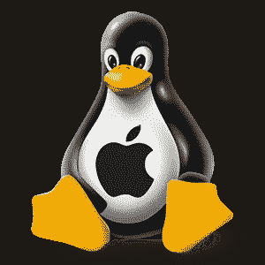

© [https://linuxnewbieguide.org](https://linuxnewbieguide.org)

你不能一边迎合 Windows 和 Linux 用户的需求，一边忽视第三个主要的，实际上是第二个，桌面操作系统。

我所说的操作系统当然是由一家公司开发和商业化的，该公司最出名的是给世界带来 Clang 的公司，主要负责维护 WebKit(在大多数行业转向 Chromium 之后)，并创建了一些其他令人惊叹的开源软件，如 CUPS。

为此我们应该心存感激。

你可能会认为，一家公司不辞辛苦地启动一个全新的编译器来提供更好的用户体验，会使交叉编译到他们的平台变得容易。

然而。

那家公司就是苹果。

像在 Linux 和 Windows 上一样，我们将需要获取和设置 3 个部分。一个编译器，一些系统头文件和库，比如`libc++`和一个用于桌面集成的 Sdk。

如果你以前做过 OS X 开发，你就会知道 XCode 中提供了所有这些功能，这是一个 5GB 的捆绑工具包，其中大部分我们都不需要。

XCode 是自由软件。比如啤酒。我们需要很多。然而 XCode 是专有的，这很好。

问题是，如果你阅读 XCode 附带的[条款和条件，你会发现以下条款。](https://www.apple.com/legal/sla/docs/xcode.pdf)

> **2.7 限制条件；无其他许可用途**本协议中规定的授权不允许您，并且您同意不在任何非苹果品牌的计算机或设备上安装、使用或运行苹果软件或苹果服务，或者允许他人这样做。

我不是律师。然而，在我看来，苹果正在积极禁止使用他们的库进行交叉编译，不管技术上是否可行。

**因此，本文其余部分讨论的一些想法，如果被应用，可能会使你与苹果达成的任何协议无效。**

你需要一个苹果 ID，所以你需要在 apple.com 上创建一个账户。我不记得有过比这更糟糕的账户创建经历了。最大的问题当然是他们过时的安全政策。

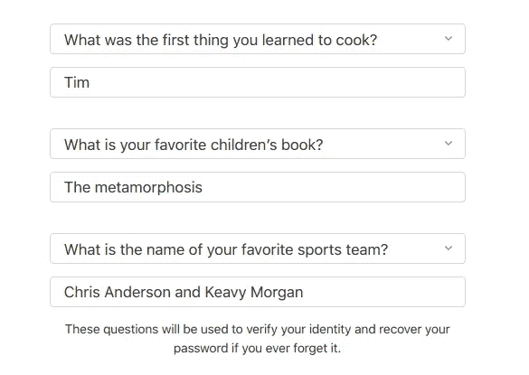

How not to do account creation and security, courtesy of Apple.

然后他们会给你发一封电子邮件进行核实，这太好了。但是你得到的不是邮件中的链接，而是一个你甚至不能粘贴的代码，你必须手动输入。

然后您将搜索 XCode。幸运的是，自 2012 年以来，一些好心人在 Stackoverflow 上维护[有效下载链接](https://stackoverflow.com/a/10335943)。

这又变成了“所有软件都很糟糕”的咆哮。对不起

从更积极的方面来说，有人已经建立了一个很好的脚本集合，让您开始在 Unix 上构建一个 OsX 工具链。也和 Cygwin 一起工作！

您需要克隆它。

[](https://github.com/cor3ntin/osxcross/) [## cor3ntin/osxcross

### 用于 Linux *、BSD 和 Windows 的 osxcross - OS X 交叉工具链(Cygwin)

github.com](https://github.com/cor3ntin/osxcross/) 

这是托马斯·普希特拉格作品中的一把叉子，我必须把它修补一下。

XCode 7.3 是作为 DMG 发布的，虽然这是一种特定于 osx 的文件格式，但 osxcross 附带了一个脚本来提取它，很好地利用了 **Darling** 。稍后会详细介绍。

```
osxcross/tools/gen_sdk_package.sh Xcode_xxx.dmg
```

不幸的是，开源社区仍然在等待苹果发布一个支持 TBD 文件 v2 的 ld64 链接器，该链接器在 osx 的更高版本中使用，而不必发布。sdk 里的 dylib。

TBD 文件非常酷，它们是动态库中包含的符号的 YAML 表示，减轻了运送实际库的需要。它们在概念上非常类似于 MSVC 在构建 DLL 时生成的`.lib`文件。我认为 TBD 文件可以跨平台使用，但是现在 LLVM 还不能处理它们？)而且开源的 ld64 处理不了新版本。

所以我们必须坚持使用 10.11 版本的 SDK。很合理！我不厌其烦地支持用于打包 XCode 更高版本的`xip`文件。这是一种受 babushka 玩偶启发的格式，但使用的是压缩档案。不幸的是，我们不能使用比 XCode 7.3 更新的版本。希望很快改变！

然后你可以运行移动生成的`MacOSX10.11.sdk.tar.xz`到`osxcross/tarballs`然后启动`SDK_VERSION=10.11 ./osxcross/build.sh`

您还需要运行`osxcross/build_llvm_dsymutil.sh`

很快，你将拥有一个完整的 OSX 工具链，包括`i386`和`x86_64`(即使当你瞄准 OSX 时，你完全没有理由用 32 位构建任何东西)。

它甚至建立了我个人的最爱:`otool`和`install_name_tool`。如果你曾经在 OSX 建造过什么东西，你就会知道这些工具有多可怕。或者说 OSX 装载机有多可怕。

我对进入 **osxcross** 的工作印象深刻。

配置 QBS 相当简单，尽管有一些事情需要注意。

在`osxcross/target/bin`中，运行:

```
ln -s x86_64-apple-darwin15-ld ld
cp osxcross-llvm-dsymutil x86_64-apple-darwin15-dsymutil
```

这将有助于 clang 找到合适的工具。如果你想支持多个工具链，把`ld`放在一个子文件夹中

这是我的配置文件，你可以适应

Clearly not designed for manual modifications

`-prefix`选项告诉 clang 在哪里可以找到合适的`ld` (ld64)，因为系统链接器不适合链接 Mach-O 应用程序。

剩下的只是给 qbs 适当的搜索路径。

不幸的是，支持。qbs 中的 plist 是不可移植的，所以您会遇到错误

```
ERROR: TypeError: Result of expression 'PropertyList' [[object Object]] is not a constructor.
         at JavaScriptCommand.sourceCode
         at Rule.prepare in /opt/qtcreator/share/qbs/modules/cpp/DarwinGCC.qbs:262:18
```

注释掉 DarwinGCC.qbs 中的规则以修复该问题。

当然，不能创建`info.plist`文件将是非常有限的，如果 QBS 能以平台无关的方式处理这些文件就太好了。

目前，在我们所有的。qbs 项目文件，我们将使用以下内容来禁用绑定，从而禁用 Info.plist 生成

```
Depends {
    name: "bundle"
}
bundle.isBundle: false
```

在这一点上，我们能够建立一个简单的控制台 Hello World，见第一部分

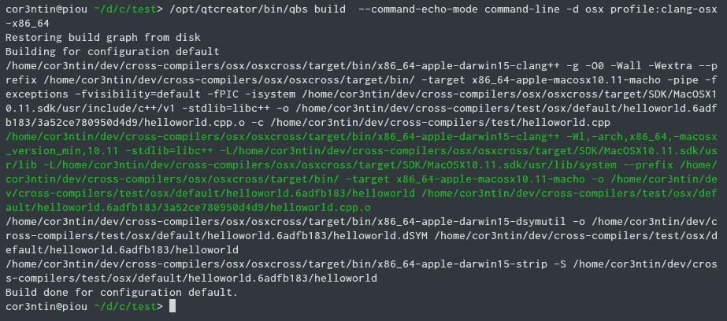

```
# file helloworld
Mach-O 64-bit x86_64 executable, flags:<NOUNDEFS|DYLDLINK|TWOLEVEL|WEAK_DEFINES|BINDS_TO_WEAK|PIE>
```

但是它能跑吗？

## 哦，亲爱的！

为了运行我们的 windows 应用程序，我们使用 wine。这是一项相当近期的努力——它始于 2012 年，而葡萄酒始于 1993 年；Windows 3.1 刚刚发布！—提供一个翻译层，叫做 ***darling。这个项目远未成熟，似乎也没有任何形式的资金支持。我希望它会流行起来。***

[](https://darlinghq.org/) [## darling | Linux 的 macOS 转换层

### Linux 的 Darling - macOS 转换层

darlinghq.org](https://darlinghq.org/) 

如果按照 github 上的说明操作，你可以克隆并构建 darling。在我的机器上，整个过程用了不到一个小时。一旦安装，大约 800MB。这并不奇怪，因为它是一个完整的系统，带有所有常用的工具，包括 g++、ruby、python、Perl、git、bash、swift、ssh…

但是，构建完成，没有错误，令人惊讶的是，它的工作，似乎非常被动。比葡萄酒更现代，它是集装箱化的！

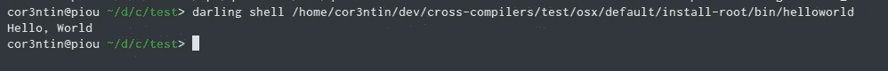

Oh, Hi Mac

## 用 binfmt 增加魔力

所以现在我们可以运行 mac 命令，但是如果我们可以隐藏魔法呢？

使用一个[内核工具](https://www.kernel.org/doc/html/latest/admin-guide/binfmt-misc.html)和一个 [systemd 服务](https://www.freedesktop.org/software/systemd/man/binfmt.d.html)，我能够创建一个文件`/etc/binfmt.d/darling.conf`，以便内核能够处理 Mach-O 文件的启动。

```
:Mach-O 64b:M::\xcf\xfa\xed\xfe::/usr/bin/darling_interpreter:
:Mach-O 32b:M::\xce\xfa\xed\xfe::/usr/bin/darling_interpreter:
:Mach-O FAT:M::\xca\xfe\xba\xbe::/usr/bin/darling_interpreter:
```

/usr/bin/darling_interpreter 是一个启动 *darling shell* 的脚本——应该是可执行的。

```
#!/bin/bash
/usr/local/bin/darling shell "$1"
```

darling 文档建议`darling <binary>`应该可以工作，但是它不能。

重启 binfmt 服务(`systemctl restart systemd-binfmt`)后，我们能够透明地启动 OSX 应用程序。

这意味着我们可以做到

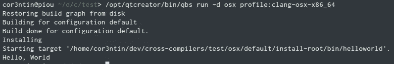

Any sufficiently advanced technology is indistinguishable from magic

哦，顺便说一下，你可以对 windows 可执行文件和 WINE 做同样的事情。一些发行版开箱即用。

在第 2 部分中，我试图在 Linux 上安装 Qt 框架的 win32 版本，而不使用 windows。我失败了。

## 我们能在没有 mac 的情况下获得 Qt for mac 吗？

我下载了安装程序。这是一个. dmg。这将是一个问题，但[凭借 darling 的力量](https://github.com/darlinghq/darling-dmg)我们可以在 Linux 上挂载 dmg。完全没问题。这是我们在这里做的事情。

但是安装 Qt 安装程序 dmg 会发现它包含一个二进制文件和一个`.dat`文件，而不是一个简单的文件夹或一些可管理的东西。

据推测，二进制文件就是安装程序。也许它运行在亲爱的？没有。对 OpenGL 框架的硬依赖。

打包在蹩脚的无用软件包中的优秀软件似乎是一个反复出现的主题。

是不是所有的希望都再次落空了？这次不会。

我们可以为 mac 构建 Qt，就像我们为 Windows 所做的尝试一样。但是会有用的。麦克有`make`。它知道 clang 和 gcc，在很多方面都很像 Linux。毕竟下面有一个 UNIX(但我总觉得 OSX 内部很糟糕，隐藏在漂亮的用户界面下。对于 starter 来说，[10 年前上游版本搬到 GPLv3](https://robservatory.com/behind-os-xs-modern-face-lies-an-aging-collection-of-unix-tools/) 后，大量工具没有维护。

唉，这意味着要处理 Qt 复杂的构建系统。破解`qmake`构建文件花了一些时间。看，Qt 做了一个可怕的假设，认为 osx 上的所有工具链都包含 xcode。我们没有 xcode。

但是一旦你绕过所有的自动探测和关于系统上安装了什么的假设…

….你可以让它工作！

```
#configure -release -opensource -confirm-license -xplatform macx-cross-clang -skip qtwebengine -nomake examples -nomake tests    -prefix /home/cor3ntin/dev/cross-compilers/osx/qt5_10
```

Output of configure. I removed some irrelevant lines.

这还不是路的尽头。由于缺少依赖项，Qt 小部件构建失败。QtLocation 构建失败，因为 libc++头文件太旧或损坏(我通过在 OSX SDK 中复制最新的 libc++版本修复了这个问题。成功了)。然后 QtLocation 抱怨因为`std::auto_ptr`没有定义所以我黑了几个头。

我试图让`qwebengine` (chromium)来构建，但是它仍然使用另一个构建系统，我一晚上已经做了足够多的构建系统黑客工作。

但最终大多数 Qt 都建成了。

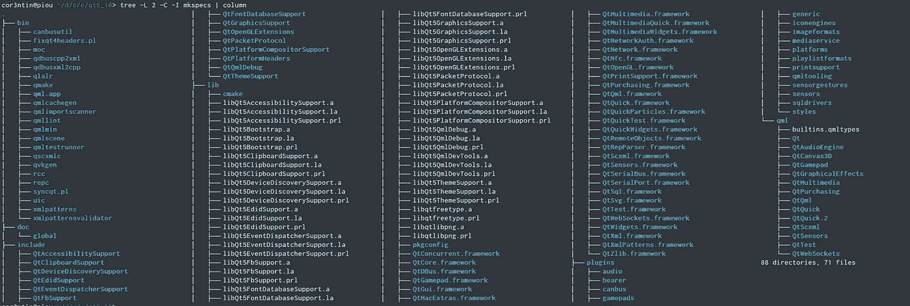

It took me a few hours but I got Qt !

我们现在看到的是非常有趣的东西。二进制文件是原生的 Linux ELF，而框架和库是 Macho-O。这很快就能派上用场。

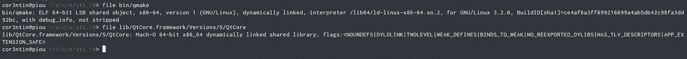

Hello, I’m a Mac — And I’m a PC. And I am a Mac too. — What ?

就操作系统集成而言，Qt 是一款充分利用底层系统功能的大型软件。如果我们能造出那样的东西，我们几乎可以造出任何东西。

我最初将我的 mkspec 文件命名为`darling-clang`。我是个坏名声。这也使得 qbs 无法理解这是一个 mac 版本。我没有重命名 mkspec 并重新构建 Qt，而是修改了 qbs。`qbs-setup-qt`的代码实际上是用正则表达式解析 mkspec 的`.conf`文件。不知何故，它起作用了。别对着它呼吸。

最终，一旦我给了 qbs 它所期望的东西，让它明白我们在和 mac 打交道，我就可以跟注了

```
qbs-setup-qt osx/qt5_10/bin/qmake osx-x64-qt510
```

它创建了正确的概要文件和模块。我手动清理了我的档案，合并了`clang-osx`和`osx-x64-qt510`

然后我们就可以编译或者华丽的***Hello World***app 了！

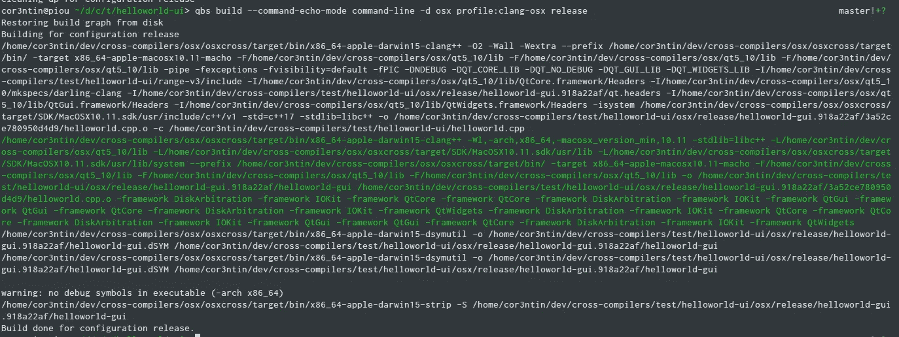

Compiling an OSX application based on Qt on Linux, using qbs : check

现在怎么办？

嗯，我们有一个完整的工具链，也许我们可以检查一些东西？

使用`otool -L`，osx 中相当于`ldd`的东西，我们可以断言我们确实链接到了一些库

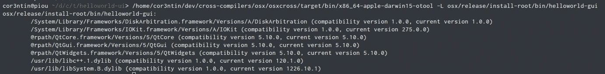

我们可以使用其他工具。比如`nm`或者`strings`或者可怕的`install_name_tool`

不幸的是，达林还不能处理任何远程图形，所以我们需要一台 Mac 来启动我们的应用程序。

一台真正的 mac 想象麦克·OSX 是违法的，除非是在苹果电脑上。想起了一些词。想象一下我的法语。

再来说说 mac。*Mac。你可能知道那一个。大部分公司都有。*


This Is A True Story.

它曾经属于鲍勃。这是鲍勃的苹果电脑。但是，5 年前，鲍勃去世了，所以他的 Mac 被送给了爱丽丝。爱丽丝很快就离开了公司——可能纯属巧合。

然而，苹果电脑一直都是苹果电脑。它没有主人。它也没有木偶。可以在`ssh bob@mac.yourcompany.com`连接。密码简单来说就是`pass`。它与其他运行在虚拟机上的服务器不在同一个局域网中。无论如何，它都没有被管理，在一个安全严密的网络中提供了一个方便的后门。

当它运行时。有时一停就是几天。这不仅仅是因为人们不关心，他们也不知道它的物理位置。mac mini 很容易松脱。在某人的书桌下，楔入一把旧椅子，用作茶几。

上次它坠毁的时候，你不得不连续三天追踪它，就像在山里追一只大猫一样。你甚至试图打电话给鲍勃的遗孀。

你终于发现了夹在卡罗尔的屏幕和牛津词典之间的苹果电脑。“这是完美的高度！”当你拿回卡罗尔 800 美元的显示器支架时，她反对道。你用苹果电脑*换了一本旧的宜家目录，卡罗尔发现这本书甚至比苹果迷你电脑还实用。*

你插上 mac 电脑的电源，努力将它升级到 OSX 的最新版本“美洲狮”(或者别的什么，很难记清)。

几天后，当你的同事买了一辆新车，而你失去了自己的家时，我不禁在想:要求用信用卡来申请免费的安全补丁合适吗？

但事实是，mac 正在做一项重要的工作。运行所有只能在*MAC*上运行的任务。签安装程序，做 mac 包，iOS 的东西，跑纽交所……你不太确定，毕竟是 Bob 的。

如果我们能够虚拟化 OSX，或许生活会有所不同。

我正好有一台 2011 款 mac-mini，是前雇主送的。它的生活和苹果电脑有点不同。它从未被爱过，在盒子里度过了最后两年。为了这篇文章的需要，它只能看到一天的生活。这也是我的出版计划晚了 4 天的原因。我试着安装高灰色屏幕；我不得不重新格式化，安装狮子，然后安装埃尔船长。所以埃尔上尉是我们将要使用的。它拥有惊人的 2GB 内存，系统只使用了其中的 3/4。

您应该在 mac 的系统参数中启用 VNC、远程共享和 SSH。

这篇文章开始有点长了。这里是迄今为止所取得的成果的一个快速的视觉总结:

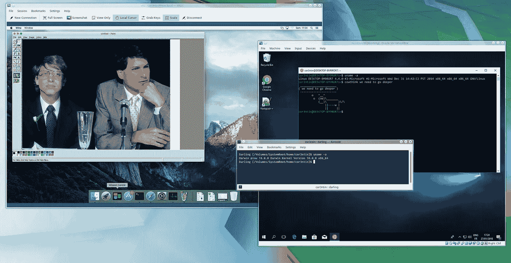

Definitively improving our productivity.

我们应该停止鬼混。

*   在 OSX 机器上复制你的 OSX 版 Qt。你可以使用`scp -r`、`rsync`或者一个共享文件夹(通过 samba)
*   再次使用`scp -r`，将你的`helloworld-gui`复制到机器上。
*   我们交叉编译的 Qt 版本不包含`macdeployqt`。你可以直接在 mac 上安装正式版的 Qt。为了避免这样做，也为了不必处理[中的](http://doc.qt.io/qt-5/osx-deployment.html) `[install_name_tool](http://doc.qt.io/qt-5/osx-deployment.html)`的混乱，我们可以设置`DYLD_FALLBACK_FRAMEWORK_PATH`指向包含所有`Qt*.framework`的文件夹。DYLD_FALLBACK_FRAMEWORK_PATH 在某种程度上是合理的，但可能不起作用，并且有一些相关的安全风险。请不要在已发布的应用中使用它。

```
export DYLD_FALLBACK_FRAMEWORK_PATH=/Users/cor3ntin/dev/cross-compilation/qt5_10/lib
```

*   像在 windows 上一样，我们需要在我们的`helloworld-gui`旁边提供一个`qt.conf`文件，告诉 Qt 从哪里加载插件(否则应用程序将无法运行)。我的看起来像那样

```
[Paths]
Prefix=/Users/cor3ntin/dev/cross-compilation/qt5_10/
Plugins=plugins
```

现在，通过`ssh`连接到 mac，您可以执行您的应用程序，它将出现在 mac 屏幕和远程显示/ VNC 会话上

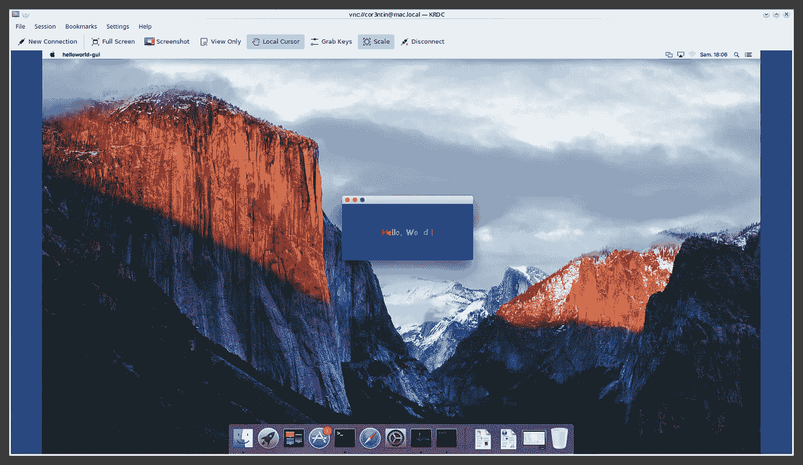

It feels like we climbed a mountain !

# 我们能让这一切合法化吗？

Clang、LLVM、ld64 和相关工具都是开源项目。这并不意味着开源版本与苹果正在使用的版本相匹配。

事实上，苹果的 Clang 是 Clang proper 的修改版本，他们落后上游几个版本。讽刺的是他们启动了这个项目。

LD64 和“cctools”是在“苹果开源许可”下发布的，XCode 使用的工具版本也比开源社区使用的版本提前了 2 年。

框架本身不是开源的，正如我在开始提到的，不是可再发行的。

而现在只由`Darling`人维护的开源替代方案`cocotron`是不够的。

它有几个问题

*   他们没有构建脚本来实际构建 SDK，只安装了`.dylib`。这个问题可能很容易解决。
*   他们有一套有限的框架，而这套框架不足以构建 Qt。Qt 使用下面的框架，那些前缀为`!!!!`的在 Darling 中是没有的

```
* AppKit
* ApplicationServices
!!!! AssetsLibrary
* AudioToolbox
!!!! AudioUnit
!!!! AVFoundation
!!!! Carbon
* Cocoa
!!!! CoreAudio
!!!! CoreBluetooth
* CoreFoundation
* CoreGraphics
!!!! CoreLocation
!!!! CoreMedia
!!!! CoreMotion
* CoreServices
* CoreText
* CoreVideo
!!!! fftreal
* Foundation
* ImageIO
!!!! IOBluetooth
* IOKit
!!!! OpenCL
* QuartzCore
* Security
!!!! SystemConfiguration
```

*   你可以在 OSX 上编译 Qt 框架，然后把它们复制到你的 Linux 机器上，这在大多数情况下都是可行的。
*   利用一个不是官方 SDK 的 SDK 有点违背了交叉编译在 mac 上测试你的软件的目的。你只是在测试它对亲爱的起作用。不能保证 Darling SDK 头与官方的一致。Mingw 也受到这个问题的困扰。

因此，在 Linux 上为 Mac 交叉编译复杂的应用程序(包括 Qt 和基于 Qt 的应用程序)在技术上是可能的。甚至可以直接无缝地运行非图形应用程序和单元测试。

但是使用 SDK 是非法的，根据你的法律，这让整个练习变得有点无意义。存在开源替代方案，但可能不够充分和可靠。

虽然我们可以满怀希望，但苹果是否会有更多对开发者友好的政策值得怀疑。

在那可怕的失望中，是时候结束了！