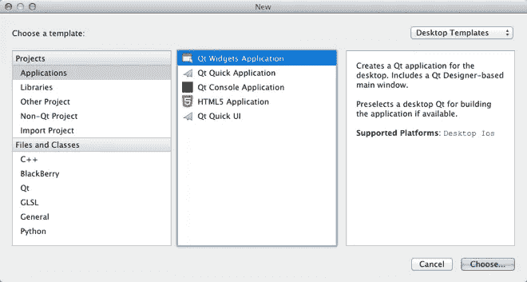

# 樱桃蛋糕:C++标准库中应该放什么？

> 原文：<https://medium.com/hackernoon/a-cake-for-your-cherry-what-should-go-in-the-c-standard-library-804fcecccef8>

这是对 Guy Davidson 的文章《不包括电池:C++标准库中应该包含什么？”。

在过去的几年里，一直在推动将图形库纳入 C++标准。这有点像开罗。或者 SDL。目前形式的提案在这里是。

在其当前状态下，库提案可以在预先分配的表面上绘制一些形状，对图像有一些支持，并且有一些课程项目可以添加文本，可能还有一些鼠标/键盘处理形式的输入。

图书馆的首要目标似乎是教学。提出的论点是，让孩子们在屏幕上看到漂亮的闪闪发光的小精灵很酷，也很滑稽。当然，已经有库可以做到这一点，但是你看，C++没有像样的、惯用的包管理器，所以，一些著名的委员会成员得出的结论是，C++标准应该提供一个开箱即用的 2D 图形库。

我确实认为这是一条不应该走的路，这样做充其量是浪费时间。让我告诉你为什么。

## 但是，首先，有些问题需要澄清。

从各方面来看，盖伊·戴维森和其他人在这个提案上投入了大量工作、时间和精力。推动这项提案尽快通过标准化的人比我更专业。

我没有对 C++做出任何贡献，所以接下来的只是一个人的观点。

我还想说明，我对那个特定的图书馆并没有负面的看法。我的问题是包括一个 2D 绘画库，任何 C++标准的绘画库，在这个时候。

希望不会被误解！

不管怎样，让我们开始吧。

# C++标准库不是一个库。

C++标准就是这样的:一个明确的文档，以最详细和明确的方式描述了 C++是什么，以及它是如何工作的。目标是任何人都可以通过实现该规范来为自己实现 C++编译器。然而，规范可能不够具体，或者实现得不太恰当，或者实现得过于武断，因此各种 C++编译器最终会在不同的实现之间存在一些细微的行为差异。有时它根本无法实现，因为做实现的人和做规范的人忘记了互相交流。

现在，该规范的很大一部分描述了标准模板库，这是每个符合规范的编译器都附带的一个库。

该规范至少有 5 个实现，由尽可能多的实体维护。有些是开源的，有些不是。他们每个人都在平台和系统的一个选择的子集中工作。即使它们位于任何 C++程序的最底层，它们也像任何其他库一样，容易出现错误。

在这种情况下，C++标准库中应该包含什么，或者不应该包含什么，这是一个非常重要的问题。编译器附带的标准应该是什么？大多数人需要什么来提高 C++的工作效率？

盖伊的文章描述了一个人可以拥有的职位。也许我们什么都不需要？也许我们需要一些词汇类型？可能是集装箱？也许不是？我们需要文件系统支持吗？插座？json？xml？rpg 制作工具？sql？html？javascript vm？2d 图形？3d 图形？肥皂？IPC？开窗？是否应该定义`pi`？websockets 呢？ftp？宋承宪？VR？AR？密码？ssl？我们需要 ssl 而不需要其他加密吗？深度学习？声音？3d 音效？视频解码？gif？

显然我们需要划清界限。

某处？

在哪里？

我们来看看. Net .或者 Java。当提到 STL 时，比较 C++和 Java 是惯例。Java 很酷吧？基本上，它有套接字、HTTP、加密和所有的东西。

但是 Java 大部分是由单个实体维护的。所以 Oracle 的一些人决定 Java 应该有套接字，他们实现了它，有内部审查，现在 Java 有了套接字。有时后来，谷歌想让套接字使用相同的 API，在他们可以说“提前”之前，他们被起诉了 90 亿美元。

与此同时，C++规范经历了一个漫长而痛苦的过程，直到进行投票，并且对每一个特性、每一个方法都达成了多数人的一致意见。那应该叫`data`吗？`get`？“在彭博，我们有在 200 万行代码库上使用`data`的经验，”在彭博工作的家伙会说。“我们注意到在 EBCDIC 键盘上使用`get`更快”，IBM 的那个家伙会反对。“我们有 300 万行代码库”。

我不认为哪种模式是最好的。仁慈的独裁显然只有在独裁者仁慈的情况下才会起作用。

然而，我认为民主不适合一个好的图形库的诞生。

# 委员会的资源有限。

即使睡眠不足的提案作者拼命工作，但很大一部分工作和投票是在为期一周的季度会议上进行的，人们在会上审阅越来越多的提案。随着委员会变得越来越透明，越来越多的人参与进来，从而为与会者带来更多的工作。那项工作几乎没有钱。最好的情况是，你可以希望有人支付你去佛罗里达海滩、瑞士青山或夏威夷泳池的机票，在那里开会。据说你将永远看不到海滩、山丘和池塘。

由于资源和时间有限，因此需要对提案进行分类、优先排序，甚至放弃提案。[ISO c++](http://www.open-std.org/jtc1/sc22/wg21/docs/papers/2018/p0939r0.pdf)试图描述排序和优先级排序应该如何发生。

那么问题就变成了:委员会能抽出时间来建立一个 2D 图形图书馆吗？这是一个优先事项吗？

在目前的形式下，该提案仅限于绘制形状，大约有 150 页长。这是提交下次会议的最大提案之一。

它只会变得更大。“小而简单的图形库”的复杂性是没有止境的。花在提案上的每一秒钟都不会花在其他工作上。当然，人们会讨论他们感兴趣的提议，而且讨论是同时进行的。还是。每 200，000 个 c++开发人员中可能就有一个人参加这些会议。

# 让我们画一个三角形

2D 图形与标准化过程所擅长的完全相反。标准化是关于形式主义的，所以它最适合描述正式的东西，数学，算法。现实变得越混乱，就越难以描述，把它写在纸上，让这张纸成为几十年的真理来源。

一个人需要做的第一件事就是得到一个“表面”。画像素的画布。

所以希望你有一个`surface`类，你给它维度，它给你一个画布来画画。

但是等等。在大多数桌面系统中，如果你想要一个表面，你需要把它放在一个窗口中。windows 习惯上有标题，所以图形 API 应该可以处理，对吗？

您可能还希望窗口有一个图标。图标是大多数系统中的一个文件，其格式是系统特定的。但有时它不是路径，而是对应于路径的名称。

在一些桌面操作系统上，在程序执行期间，窗口的大小可以改变。

有时，窗口可以移动到另一个具有不同分辨率的屏幕上。还有这种奇怪的新屏幕，虚拟像素比真实像素大？除非你正在渲染一个图像或其他东西，否则你应该确保你使用了所有小的脆像素的能力，因为客户因为吹嘘他的屏幕有多脆而支付了额外的费用。

那边的那个女人很嫉妒，所以她买了一台 40 像素的电视。你真的看不出区别，但是你会告诉她她浪费了 5000 美元吗？

然后在你的口袋里有一个屏幕，它向各个方向旋转，现在表面都是不稳定的。但是它没有窗口，所以没有标题或图标。

现在几点了？哦，天哪，那个东西也有屏幕，但它是如此之小…最好去读一本书 WTF 电子墨水，你应该尽可能少刷新，只有黑色？

世界很疯狂，对吧？让我们坚持 Linux，好吗？所以在 Linux 上有一个叫 X11 的东西，你需要一个 surface 来…哦，不好意思，当你在写论文的时候，X11 已经被弃用了，现在你应该使用 Wayland…除非你有一个帧缓冲区？可以用 opengl 加速。或者嵌入式 opengl。完全不同的事情。但是真的，Vulkan 比这两个东西都快。哦，在这个系统上，我们更喜欢你自己画窗口，有一场关于 CSD 和 SSD 的战争已经持续了多年，你不能偏袒任何一方。

如果您有 CSD，请确保我可以正确拖动窗口，并且我已经设置了粘角，以便窗口可以很好地对齐。一定要处理好。完全正确。当你拖动窗口时，它应该有点透明，你知道窗口合成吧？

好吧，所以，你开始告诉自己，也许画东西是复杂的。让实现者、编译器、编写者和库供应商来处理这些垃圾吧。所以你提供了一个可以在任何地方工作的 API，所以它完全不处理任何东西，也就是说它在任何地方都不能工作。

现在编译器的作者有点生气了。他们生活中想要的就是写编译器，他们在那里，试图理解 GDI 是如何工作的。另外，微软可能对提供一个绘图框架并不感兴趣，他们宁愿让他们的用户使用基于 WinRT xml 的工具。与此同时，GCC 的人仍在努力让 windows 工作。

Clang 人得到的 bug 报告是“不工作”。人们期望 STL 能够完美、一致地工作，*在任何地方*

没问题。我们将使图形库成为可选的。所以现在标准库中有一些不是标准的。如果实现了它们，它们在每个平台上的行为并不完全相同。所以现在用标准工具写的代码是不可移植的。所以我们需要在存储库中有一个 STL 的副本，以及混乱的构建脚本。回到起点。

也许我们在什么地方搞砸了？让我们看看互联网上有什么。人们有显示器，所以他们肯定会为显示器写库，对吗？

原来 Qt 挺受欢迎的。虽然它不仅仅是显示三角形。它于 1995 年发行。它有线，线，很多东西。人们真的没有想出更好的办法吗？

wxWidgets 甚至更老。它也有字符串和线程，还有很多图形库中没有的东西。GTK 是完全一样的东西。

但是 C++的目标更符合像 SDL 这样的东西。1995 年发行，有线绳和奇怪的东西。快板，1990 年发行。同样的事情

你看看其他语言。Rust 社区肯定有一个很棒的绘画框架，对吧？还是去的人？原来他们围绕 Qt 或 SDL 或其他东西编写包装器，就像他们认为从零开始很复杂一样。

所以 20 年后，你可以在所有的平台上画一个三角形。对于所有的一些定义。

这是相当大的成就，所以你想与世界分享你的快乐。人们大多使用语言交流[需要引用],所以你要在屏幕上显示一些单词，从三角形到三角形有多难？

## void draw_text(std::point2d，STD::string)；

您了解到有一种称为“Unicode”的标准，它描述了世界各地人们使用的所有字母。这么多信。Unicode 标准的规模大约是你做了 5 年的提案的 10 倍。幸运的是，大多数编程语言至少支持部分 Unicode。除了 C++。好吧，好吧，让我们暂时把它放在一边。

所以文本是用字体呈现的。字体通常安装在系统上。有一个叫做字体数据库的东西可以告诉你字体是什么。除非系统没有字体数据库。或者没有字体。或者没有系统。人们也喜欢使用自己的字体。

字体是一种文件，其格式是标准的。大约有 5 个相互竞争的标准。

字体文件可以包含字形表、png、SVG、在虚拟机中执行的脚本，以及所有这些的混合。有些字体是有颜色的，但不是所有人都喜欢颜色。你的孩子喜欢颜色。他们给你发了一封🐈。你会增加对猫的支持吧？

你学习子像素着色。你因为专利侵权在监狱呆了几个月。你认为你可以利用这段时间在百科全书中学习连字。你开始后悔成为一名开发人员，并考虑一个新的职业作为修道院的抄写员。

字体渲染涉及到很多数学，所以你拿起一本数学书，是一个叫阿尔-赫瓦里兹米的死人写的。你意识到所有东西都是从右向左写的。这是怎么回事？

所以也许可选的 2D 图形库应该有可选的文本支持？

在多伦多举行的下一次委员会会议上(夏威夷很久以前就沉入了海洋)，有人试图编写一个复杂的图形应用程序，其中包含网络和大量输入，为了避免意大利面条式的代码，他们喜欢用一些线程实现某种事件循环。这显然是一个理论问题，因为没有输入支持。如何命名键盘按键从来没有达成共识。

回想一下所有现有的框架，比如 Qt，现在是 8.0 版本，它提供了事件循环、消息传递系统和 Unicode 字符串类型。也许他们在策划什么。

在这段时间里，人们继续使用 Qt。人们因为知道 Qt 而被雇佣。他们在学校项目中使用它。当然，Qt 仍然很糟糕，因为标准中增加的 C++反射特性还不足以取代它们的代码生成器。但是人们不在乎这有多糟糕。使用 QML 的人。或者电子。

没有显示🐅，让我们回到 2018 年。

# 委员会还有什么更好的事可做吗？

要被考虑，一个提议必须被写出来并被提出，而图书馆的提议之所以存在，是因为有人在里面投入了大量的工作。

然而，目前 C++已经

*   较差的线程支持(没有使用协程的执行器或工具)
*   不支持启动流程
*   不支持 Unicode
*   较差的输入/输出设施
*   恶劣的现场设施
*   不支持动态加载的库
*   不支持 HTTP
*   与密码无关

当然，这个清单还在继续。我不知道什么是 C++库的好候选，但是，根据委员会本身，一个库提案应该

*   对大多数人有用
*   有一个稳定的 API，不要经常改变
*   有真实世界的经验和反馈。这就是为什么大多数 C++库都是从 boost 库开始。

提案经常因为不够有用或者没有经过足够的实战检验而被拒绝。考虑到人们对 STL 稳定性的期望，这是合理的，但是这些标准应该始终如一地适用。

当然，经过多年的努力，仍有许多语言特性在开发中，它们应该优先于库特性，因为纯粹的库添加可以通过 boost 或其他方式来填充。

# 教学论证

支持包含该库的一个论点是，它将使 C++更容易教，并且人们对基于图形的项目更感兴趣。我同情并完全赞同让 C++更可教的目标。然而，确保一个给定的特征是可教的和添加一个主要特征到语言中，主要目标是在课堂上使用，这是有区别的。

可教性意味着易于使用，难以误用，以及概念和实现之间的合理映射，并且通常表现得符合大多数用户的期望。任何新特性都应该具备的品质。

还可以预期，一些特性是针对高级用户、库作者和专家的。

然而，C++的“教学友好部分”应该是专业设置中使用的功能的子集，而不是不同的设置。

我更希望人们学会使用 Qt(举例来说),因为这是一种他们可以在职业生涯中使用的技能，而不是专门用于教学目的的东西。

我还认为，一个范围过于有限的库可能会给语言带来不好的形象。如果人们被告知他们不能绘制表情符号或 gif 或使用游戏手柄，他们可能最终会认为 C++不够强大，并转向另一种语言，如 C#，java，javascript，swift……但如果他们开始使用现有的，经过战斗测试的框架，这种框架足够强大，即使代码不是“现代的”，他们也可以实现他们的设计(Qt，SDL ),他们会更好地理解 c++可以做什么。

换句话说，恐怕如果把人介绍给一个玩具库，他们会认为 C++是一种玩具语言。

此外，“教学”需要更好地界定。

我们是在谈论中学生吗？如果是的话，教他们 C++是个好主意吗？有些情况下 Python、Javascript、Lua 更适合，更容易把握选择。我觉得没关系。

我们说的是大学 CS 101 吗？在这种情况下，可能需要向学生介绍构建系统、库和包管理。工具很重要。根据我的经验，许多初级开发人员不知道如何使用他们的工具，这和懂语言一样重要。同样重要的是，人们知道并被教导生态系统。Qt，boost，wxwidgets，SDL…

# “我们需要一个标准库，因为使用第三方库很难”的论点

我想大多数人都同意这一点。在一个 C++项目中包含一个库是一种糟糕的、经常是痛苦的经历。在 2d 图形库上投入大量资源并不能解决这个问题。除非每一个已经存在或将要存在的库都被纳入标准，那么，我们在哪里停下来呢？

我很抱歉地说，事情不会自己改善，这是不可能的。对于任何类型的包管理器来说，首要的要求就是要有权威性。甚至不一定要好。但是，直到个别实体被留下来处理这个问题，我们将继续有无数不兼容的，半途而废的工具。我理解委员会的特权不一定延伸到语言定义之外，因此包管理的问题可能无法解决。但是工具，而不是 UI，是 C++必须解决的最大挑战。

请注意，委员会可以在不扩大其特权的情况下帮助改进工具，特别是:

*   寻找替代所有合理使用预处理器的方法(反射/代码注入方面的工作对此非常重要)
*   定义可移植的 C++ ABI (N4028)
*   定义可移植模块表示

当然，这些工作可能不像 2D API 那样迷人，但它们更基本，更重要的是，它们不能独立于委员会之外发生。

# 不管怎样，事情应该向前发展。

在看了 P0939 和 P0267 之后，我想分享我对相关领域工作的希望。当然，除了希望之外，我不能做更多的事情，我只能希望能激励一些人！但是我感兴趣的是你认为在那些领域什么是重要的！

## 抓住 Unicode 公牛的角

我不建议这样做，因为我理解为什么 C++缺少 Unicode，但是如果我们认真考虑 2D 图形，那么我们绝对需要适当的 Unicode 支持。

*   第一步是`char8_t`论文[http://www . open-STD . org/JT C1/sc22/wg21/docs/papers/2018/p 0482 r 1 . html](http://www.open-std.org/jtc1/sc22/wg21/docs/papers/2018/p0482r1.html)。当然，这还不够，但却是必要的。
*   我们需要一套算法来规范，比较，净化和转换 Unicode 字符串，计算字符。基于范围的东西可能会很好地工作
*   字符类，正则表达式…我们可能不需要 ICU 那么多的特性，但我们确实需要一些。这可能是一个`<unicode>`标题。我不确定正确的 Unicode 支持是否与 P0939 中概述的约束一致，但是它将有益于任何处理用户输入/输出的应用程序，包括 GUI、数据库、(web)服务器、控制台应用程序...

我不知道我们是否可以限定词汇类型的 Unicode 字符串，但是处理世界语言肯定是每个人都需要的，如果有一个通用的、惯用的工具来做这件事，那会更容易。

## 将几何图元添加到标准中

提取 p0267 中介绍的词汇类型并独立于图形对它们进行标准化可能会很有意思。像`point_2d`、`matrix_2d`(最终还有`point_3d`、`matrix_3d`)这样的类型对图形很有用，但也可能有其他用途，例如科学计算、情节操纵。它们可以伴随着一套方法来执行广泛使用的解析几何计算。所有这些都可以放在一个`<geometry>`头中。

有多种原因可以解释为什么这是有益的

*   这是每个处理绘画或表面的图书馆都需要的东西`SDL_Point`、`QPoint`、`wxPoint`。从一种类型转换到另一种类型很麻烦，容易出错。所有这些框架都可以受益于在相同的坐标系中使用相同的语言。这是词汇类型的定义。
*   这是经得起时间考验的保证。数学不受新技术趋势的影响，因此 API 将在几十年内保持稳定。
*   出于同样的原因，可能很容易达成共识，但很难放弃基础数学。

## 帮助改进现有图形库

委员会可以做些什么来改进 Qt、wxWwidgets SDL 和其他图形框架？事实证明，很多框架都依赖于 boiler plate 代码，这些代码要么是通过大量侵入性地使用宏生成的，要么是通过代码生成器生成的。反射和代码注入是这些框架现代化和改进的基础，从根本上说，这是一个应该优先于纯粹的库工作的语言特性。

# 让我们自己开发图形提案。

也许我们确实需要另一个图形框架。我有什么资格说不是呢？但是现有框架已经经受了 20 年的战斗考验。我认为，在未来几年，2D 图形可以作为一个独立的或增强的图书馆蓬勃发展。最重要的是，它可以提供在多种平台上工作的单一实现，而不是同一事物有 5 个或更多的实现。

它可以自由地试验文本渲染、输入、事件、后端、线程模型…

我觉得这个提议以及软件包管理问题需要*一些权威的*而不是 ISO，我不知道可以或者应该是什么样的*。*

与此同时，Visual Studio 和 Xcode 可能会附带更多的第三方库，这将解决该提案试图解决的至少一半问题。