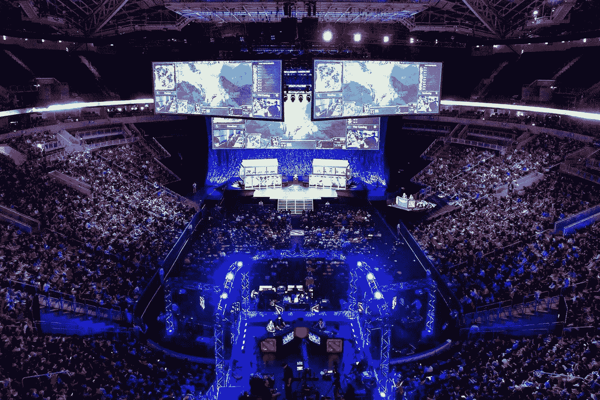

# 校际电子竞技的案例

> 原文：<https://medium.com/hackernoon/a-case-for-interscholastic-esports-a6824b6dcbd4>

The International 5 Dota 2 Tournament — Credit to Valve

我一直在思考电子竞技的发展及其对高中教育和日益数字化的经济中 T2 未来工作的潜在影响。我坚信，在未来十年内，世界各地数百万人将从与视频游戏和电子竞技相关的工作中谋生，使其成为增长最快的新行业之一。这为电子竞技的制度化创造了一个重要的机会，以加速该行业的发展，同时为下一代做好准备，并增加弱势群体对这些未来工作的经济参与。做到这一点的最佳方式是在初中、高中和大学采用校际电子竞技。在这篇文章中，我将通过与传统运动的比较来更详细地探讨这个概念。

**校际运动会**

我在俄亥俄州的一个小镇长大，在那里我度过了童年、初中和高中时光。我认为我成长过程中的这段经历对我的成长和快乐有着难以置信的价值，我相信许多其他学生运动员也会证明这一点。校际运动通常被教育工作者视为课堂的延伸，对于一些学生运动员来说，甚至是出现在课堂上的主要动机。

参加竞技体育可以教会学生领导力、纪律性、承诺、职业道德、团队合作、在压力下表现、处理批评、处理成功和失败，以及许多其他转化为劳动力的有价值的软技能。**体育还提供社会包容性，让学生有一个固定的朋友群体，以及他们社会身份的一个重要方面，这与他们在一项富有成效和著名的活动中的成功有关。**

然而，仍然有相当数量的学生要么没有体育能力，要么对参加传统体育运动不感兴趣。其他学校赞助的或课外活动，如音乐、戏剧和艺术，除了发展这些软技能之外，还为创造性表达提供了宝贵的途径。不幸的是，仍然有数以百万计的学生对这些活动不感兴趣，或者没有社会激励去参与。

人们普遍认为，当学生不参加任何课外活动时，他们的学习成绩会受到影响，他们很可能难以建立富有成效的社会关系。我会假设，当学生因为他们的行为方式而必须围绕“酷”或受欢迎来构建身份时，如果没有有形技能的基础，他们更有可能接受不健康的行为，如欺凌或吸毒和酗酒。如果学生不冒险失去参加他们热爱的运动或活动的机会，那么不健康的行为和糟糕的学习成绩也会带来更少的后果。

在这个国家的每所学校，都有许多学生梦想成为职业运动员。对他们中的许多人来说，这个梦想也被视为他们唯一的“出路”和打破代际贫困循环的机会。梦想为实践和提高提供了强大的动力，不应该被低估。然而，任何一个好的辅导员都会恳求学生在他们无法实现这个梦想的情况下有一个“B 计划”。

体育通过体育奖学金为成千上万的学生提供了获得免费大学教育的切实途径。然而，在像足球这样的流行运动中，以及在主要的强势学校中，体育是在上课之前的。严格的训练、电影和更类似于全职工作的练习时间表使这些运动员没有时间最大限度地利用课堂学习或通过其他大学课外活动或实习的机会。

**职业准备**

当一名学生运动员的职业生涯在大多数人高中毕业后和少数人大学毕业后结束时，他们依靠他们在职业生涯中结合正规教育培养的软技能来寻找职业。最常见的情况是，这种职业不得不在他们的运动之外，因为相对于工作需求而言，体育行业的工作相对较少。为了在运动生涯中获得最好的机会，个人只能从事教练职业。在大学和职业级别，这些角色通常由具有高水平比赛经验的个人来担任。

在学生运动员的职业生涯中，由于资格要求，他们也没有机会将自己的成功货币化。像 NCAA 这样的强大组织实际上拥有学生姓名的权利，为最高水平的学校创造了数十亿美元的收入，而运动员无法在奖学金之外获得任何这种价值。这极大地影响了黑人运动员，也阻碍了他们获得宝贵的创业和商业经验，如果他们被允许通过赞助、服务或商品将自己的名字货币化，他们就可以获得这些经验。顺便说一句，我很高兴看到更多的现任和前任学生运动员继续挑战这种结构，以及新的联盟和组织的出现，这些联盟和组织有更好的模式，如即将到来的 HBCU 联赛。

**性别含义**

承认传统体育运动的性别本质也很重要，在传统体育运动中，几乎总是有单独的男孩和女孩团队，以考虑身体大小和力量的差异。像 [Title IX](https://en.wikipedia.org/wiki/Title_IX#Equity_in_athletics) 这样的联邦法律通过要求学校提供同等数量的机会，在增加参与体育运动的女孩数量方面取得了重大进展。然而，女子队仍然经常不得不与男子队争夺设施和资源。男孩和女孩在课外时间的大量时间里被分开，这助长了现有性别陈规定型观念的复制，并有助于通常被称为无害的“更衣室谈话”的男性体育文化的正常化。

**所需资源**

对于提供传统体育项目的学校来说，需要在支持大多数体育项目所需的设备和设施方面进行大量投资。天气影响着体育运动的季节，对于没有昂贵室内设施的学校来说，与那些有能力全年练习的学校竞争是一个挑战。学生、家长和教练还需要花费时间前往对方学校参加可能在整个州甚至整个国家举办的比赛和锦标赛。虽然由于球队的规模，足球是影响最多学生的运动，但它也最有可能导致严重伤害，从而影响运动员职业生涯后多年的身体健康。

随着学校分配越来越紧张的预算，认识到以学生个人发展为形式的投资回报是很重要的。现在我们已经很好的了解了传统体育对于学校的成本和收益，下面我们来分析一下电子竞技作为对比。

**校际电子竞技**

我从小玩电子游戏，这是我在传统运动之外的主要爱好，并一直持续到我的大学时代和成年早期。它总是一小群朋友之间无组织的社交活动。我认为这是在建立关系方面对时间的有效利用，也是一种冥想的替代形式，在那里我可以通过利用竞争能量来释放压力，并专注于与密友的 NBA 2k 对抗赛。赢得比赛时的肾上腺素和喜悦，或者输掉比赛时的沮丧，类似于我在体育运动中感受到的情绪。更糟糕的是，最近一连串的成功或失败将成为人们经常谈论的话题。在此期间，我从未想过玩电子游戏会成为一个不断发展的行业中的一条职业道路。

在我上学的大部分时间里，我听说过的唯一合法的视频游戏职业是游戏设计师或开发者。这两个角色都需要高度专业化的技能，这些技能只能通过多年的训练来培养，而大多数普通的电子游戏玩家似乎都无法获得。虽然我赞赏从早期开始将计算机科学和 web 开发作为核心课程进行教学的努力，但我仍然认为，当编程被视为让学生在数字经济中找到职业生涯的唯一技能时，会有类似的挑战和担忧。如果一个学生没有强大的数学背景和早期接触编码，他们就越来越难有信心和能力赶上并学习这些重要但具有挑战性的技能。

我坚信教育工作者应该努力让孩子们对学校感到兴奋，提高学习兴趣，并帮助他们发展早期技能，为他们在现代劳动力中的工作做好准备。激励学生学习的最简单的方法是找到他们热爱的兴趣，并愿意投入工作来追求与他们相关的知识和技能。毫无疑问，有数以百万计的孩子对他们最喜欢的电子游戏充满热情，甚至痴迷。

与此同时，教育工作者应该考虑成长中的行业或职业以及它们各自的进入壁垒，因为这与教育和培训有关。电子竞技就是这样一个行业，它在全球范围内快速增长，进入和增长的门槛相对较低。我认为年轻人也有竞争优势，因为他们了解最新游戏的机制、文化和趋势，并作为他们的目标消费者有直接的经验。虽然医生和律师等传统的高声望职业需要多年的正规培训和经验，但电子竞技只需要理解和玩游戏的经验。很少有成年人能够每天花几个小时来跟上最新的流行游戏并在其中积累技能。这些游戏社区中的顶级玩家和领导者往往不到饮酒年龄，而许多在成长过程中没有玩过电子游戏的老年人甚至不理解电子游戏的吸引力。

**将电子竞技带入学校**

在这一点上，学生们将会花无数个小时玩电子游戏作为主要的社交活动。学校和家长可以选择回避或拥抱这种激情。通过拥抱电子竞技并创建一个正式的结构作为一项竞争性的校际活动，教师和教练将能够利用许多通过参与传统体育运动而建立的积极的软技能。这也有助于接触数百万目前不参与体育、艺术或音乐的孩子，为他们提供加入团队的机会，并因他们在流行网络游戏上的技能而受到称赞。

提供一个正式的校际团队结构也可以在网络游戏中教授和强化积极的习惯。例如，虽然非正式的游戏比赛可能导致长时间坐在屏幕前不健康，直接导致健康后果，但教练可以严格要求在休息后进行固定时间的练习。他们可以鼓励体育活动、睡眠和健康的饮食，以便在游戏中达到最佳的精神表现。随着游戏在未来变得更加沉浸于 VR 和 AR 等新技术，这些习惯对于保持身心健康将变得更加重要。

**性别含义**

这种正规化与教练的直接成人监督和指导相结合，也有助于改变游戏文化中一些最消极的方面。由于游戏一直是主要由男性主导的爱好和行业，它一直受到性别歧视意识形态的影响，这种意识形态在游戏本身以及游戏玩家之间的待遇和对话中都得到了强化，如 [GamerGate](https://en.wikipedia.org/wiki/Gamergate_controversy) 这样的事件就证明了这一点。这创造了一种不欢迎女性游戏玩家的敌对文化，以及男性游戏玩家习以为常的性别歧视行为，并扩展到他们的非游戏生活和关系中。**提高女性的参与度，增加潜在市场的总规模，符合整个游戏行业和社区的经济利益。**

教育者和教练可以通过几种方式直接解决和重新规划这种文化。

1.  他们可以着眼于扩大准入，并鼓励从中学队开始的女性游戏玩家的参与。
2.  他们可以提供一个安全的空间，让女孩可以在游戏中与男孩竞争，而不会被性别歧视的评论所吓倒，因为他们不会容忍这种行为，因为这种行为的后果是被踢出团队。

**我还认为，默认男女同校的一种新的流行和著名的校际活动的存在，可能会对十几岁男孩的性别社会化产生重大影响。在任何电子游戏中，男孩都没有先天的竞争优势。因此，随着女孩参与机会的增加和鼓励，以及男孩威胁的减少，将出现一种竞争平衡，其中最有才华、具有最佳职业道德的游戏玩家将升至顶端，无论性别如何。男女同校的团队将允许青少年男孩和女孩花数百个小时作为队友和平等地一起练习和比赛，这有助于发展尊重和积极的关系。女孩也将有机会在最高级别的比赛中建立宝贵的自信。**

不用说，这种效果不会在当今竞争游戏的非结构化环境中自行发展。如果电子竞技在目前的环境下继续增长，它将进一步强化这些负面规范，并仍然是一个男性主导的行业，控制权和经济价值将归男性所有。

**职业准备**

越来越多的全职职业游戏玩家通过赢得锦标赛、赞助和 twitch 观众赚钱来赚取收入。然而，这些机会的最高收入目前仅限于类似于职业体育的精英中的精英。[我在早先的一篇文章](https://hackernoon.com/nfts-and-the-future-of-digital-memorabilia-ad39dad6b7f3)中指出，随着公共区块链和承载真实世界价值的加密商品等新技术的发展，世界各地通过玩游戏谋生的人数将大幅增加。

此外，行业中其他角色的生态系统也在不断发展。正如克里斯·阿比莱斯老师最近[发现的](http://www.techedupteacher.com/why-we-need-to-embrace-esports-in-education/amp/?__twitter_impression=true)，对他的团队表现出兴趣的学生中有 25%的人想从事其他相关的工作。这些包括“开发网站，管理社交媒体账户，监督 Twitch 流，管理团队后勤，运行游戏中的摄像头，担任团队记者，并提供广播评论”。对结构化竞争游戏的兴趣可以激励学生学习这些关键技能。

与此同时，电子竞技可以避免传统高中和大学体育中围绕收入分配的问题。想象一个明星因接受游戏公司的免费装备而被学校球队停赛是很愚蠢的。学生游戏玩家应该被允许通过他们自己的 Twitch 流来赚钱，或者从他们的团队流收入中赚取一部分。这为教授企业家精神以及营销、商业和金融技能提供了机会，使学生能够找到赞助或其他创造性的赚钱方式。

参与和支持这些团队的经历也将让学生们深入了解不断增长的行业中的产品和服务机会。应该鼓励他们与作为顾问和导师的教师一起研究和追求这些目标。学生可以管理团队预算，以支付锦标赛的参赛费用，并赚取一定比例的奖金，而学生游戏玩家不必冒险在游戏上进行非正式赌博，以从他们的技能中赚取收入。

由于电子竞技的准入门槛低于传统体育，并且可以在 Twitch 和 YouTube 等平台上免费观看，因此在不久的将来，它可能会成为比传统体育更大的产业。流行游戏和游戏社区的多样性将导致数百个职业联赛，校际联赛最终可以培养人才。因此，在接下来的十年里，与那些从事传统运动的学生相比，有电子竞技经历的学生将会有更多直接相关的职业机会。

**所需资源**

从资源的角度来看，建立和维护竞技游戏空间的成本明显低于维护传统运动所使用的场地、体育馆和设备的成本。技术教室和计算机实验室可以很容易地在放学后被重新用作练习场地。现有的剧院或体育馆可以被配置为播放学生和更大的社区可以参加的游戏或竞技比赛，建立学校精神，并提供有趣和著名的环境，激励游戏团队取得成功。时间成本也降低了，因为团队可以在网上与州、国家甚至全球的学校竞争，而不必亲自前往。

**结论**

最终，校际电子竞技可以复制目前有组织的体育运动的许多好处，同时将它们扩展到更多的学生观众。它可以通过男女同校的团队在性别社会化方面提供新的好处，同时为学生在数字经济中的职业发展做好更好的准备。我非常兴奋最近像 [PlayVS](https://techcrunch.com/2018/06/04/playvs-bringing-esports-infrastructure-to-high-schools-picks-up-15-million/) 这样的初创公司获得了资金，为学校建设关键的基础设施，以支持校际电子竞技。今年秋天，他们开始通过与 NFHS 的[合作，在学区推出电子竞技比赛。](http://www.espn.com/esports/story/_/id/23239068/national-federation-state-high-school-associations-partners-playvs-high-school-esports-leagues)十大已经开始在[播放成员学校俱乐部之间的游戏比赛](https://www.landof10.com/big-ten/big-ten-esports-revolution-already-televised)并且超过 [50 所大学](http://www.espn.com/esports/story/_/id/21152905/college-esports-list-varsity-esports-programs-north-america)有奖学金赞助电子竞技团队。我希望这些试点可以提供验证和数据来支持这些假设，即电子竞技可以增加新学生群体的课外参与，并提高他们在学校的整体表现。学生、家长和教育工作者应该推动他们的学校通过拥抱这个新的竞争性游戏行业来实现这些好处。

*感谢*[*Tiffany Zhong*](https://twitter.com/TZhongg)*，*[*Mekka Okereke*](https://twitter.com/mekkaokereke)*，*[*Blake Henderson*](https://twitter.com/HendoVentures)*对本文提供反馈。*

我很乐意与任何对校际电子竞技感兴趣的投资者、企业家、教师或学生聊天。随时伸手或者关注我 [*推特*](https://twitter.com/csheffield3) *。*