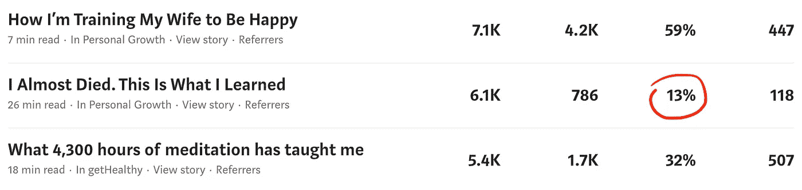
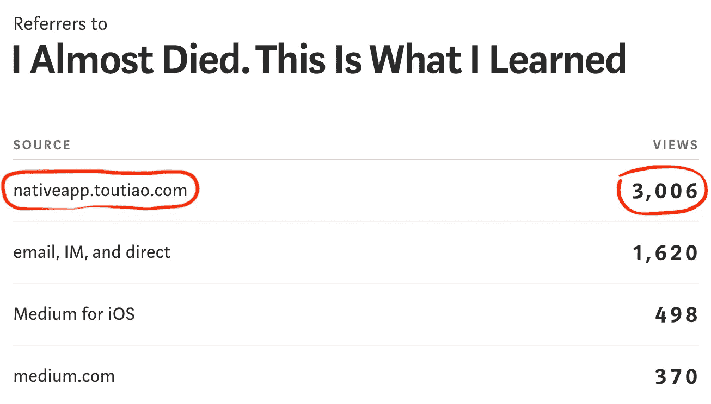
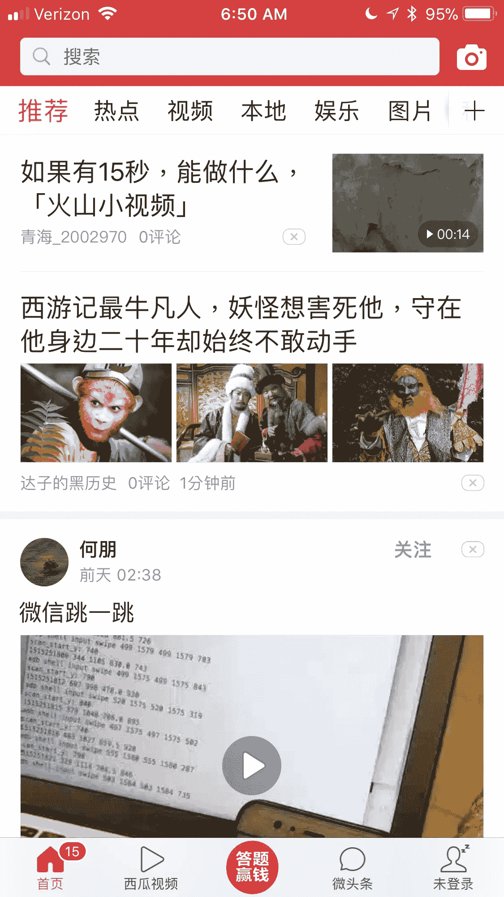
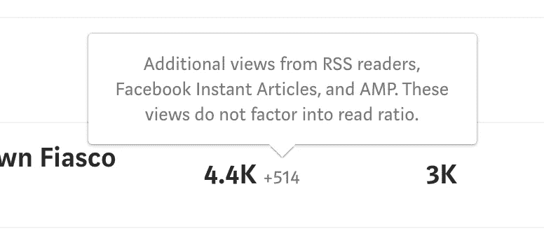

# 一只中国独角兽(无意中)降低了媒体的阅读率

> 原文：<https://medium.com/hackernoon/a-chinese-unicorn-takes-aim-at-mediums-read-ratio-4f250385673e>

Image from [Reddit](https://www.reddit.com/r/wallpapers/comments/2iqybe/cat_holding_a_gun_whilst_riding_a_unicorn_that_is/)

这开始于 2018 年 1 月 6 日星期六。当我在查看我的中等统计数据时，我注意到我的一篇名为 [*的报道的阅读率，我差点死掉。这是我所了解到的*](/personal-growth/i-almost-died-this-is-what-i-learned-5de48f8d012f) ，从曾经稳定的 60%直线下降。随着浏览量迅速增加，但阅读量没有增加，这个比例突然下降了。在写这篇文章的时候，这个故事已经被浏览了 61000 次，但是只有 786 次阅读，每次阅读率只有 13%。

Medium 依靠统计数据运行，而统计数据正是它区别于其他博客、写作和发布平台的地方。通过跟踪统计数据，如每次观看的阅读量(“阅读率”)，可能还有每次阅读的粉丝数、每次粉丝鼓掌数和总阅读分钟数，Medium 的算法能够估计在平台上发布的故事的相对质量。

这使得 Medium 的员工和算法能够识别和推广最高质量的内容。从长远来看，这可能会导致媒体在互联网上拥有最高质量的书面内容，从而获得最大份额的阅读眼球。由于它的成功，许多老牌印刷和在线出版物，如《金融时报》、《纽约时报》和《大西洋》[现在都在媒体上有了一席之地。](https://medium.com/collections/13723ea5906c)

我希望我的作品在媒体上可见，所以我尽职尽责地玩制作极高质量内容的游戏，这需要很多时间和精力。我非常认真地对待每视图阅读率，我最近写了关于匹配视图人口统计和阅读人口统计以最大化每视图阅读的重要性。正因为如此，当我看到每次浏览阅读量急剧下降时，我有点恐慌。最初，我不知道发生了什么，但后来我检查了媒体提供给我们的参考来源。

快速浏览一下 nativeapp.toutiao.com 就会发现它是“今日头条应用内推荐占位符”对于我的故事，前三个推荐位置通常由以下列表填充:

*   iOS 的介质
*   Android 媒体
*   电子邮件、即时消息、直接
*   medium.com
*   google.com
*   facebook.com
*   hackernoon.com

这些都有道理。所以我觉得突然收到来自 nativeapp.toutiao.com 的成千上万次浏览非常奇怪。我以为[头条](https://hackernoon.com/tagged/toutiao)是一家公司的名字，所以我在 [Crunchbase](https://www.crunchbase.com/organization/toutiao) 上搜索了一下。原来今日头条是一家[中国](https://hackernoon.com/tagged/chinese)非上市公司，成立于 2012 年，迄今已获得*31 亿美元*私募股权投资。

这是一笔巨大的私人股本。我在想，一些可能很小的、不知名的初创企业是如何获得这么多资金的。相比之下，家喻户晓的 Airbnb 已经筹集了 44 亿美元。(顺便说一下，我很惊讶 Airbnb 还没有公开交易。)

进一步调查后，我发现，根据[维基百科](https://en.wikipedia.org/wiki/Toutiao)的说法，今日头条是“中国最大的内容创建、聚合和分发移动平台，由机器学习技术支撑，截至 2017 年 9 月，拥有 1.2 亿日活跃用户。”

> 今日头条是一家总部位于北京的新闻和信息内容平台，采用人工智能技术。通过分析内容、用户和用户与内容的交互的特征，该公司的算法模型为每个用户生成量身定制的内容提要列表。—维基百科

Tóutiáo (头条) means “headline” in Chinese. According to [the economist](https://www.economist.com/news/business/21731416-remarkable-success-smartphone-app-claims-figure-users-out-within-24), those 120 million daily active users (DAUs) spend more time on the Toutiao app than users of other social media apps anywhere in the world, including Facebook.

Screenshot from the Toutiao iOS native app

在台式机或笔记本电脑上，中型故事通常通过网络浏览器浏览，如 Chrome、Edge 或 Safari。在智能手机上，故事通常在 Medium 的原生 iOS 或 Android 应用程序中观看，但有时也在移动网络浏览器中观看。在移动平台上，脸书也可以在一个网络浏览器软件组件中呈现媒体故事，该组件与脸书的应用程序相连接。

我认为，当通过 web 浏览器查看时，页面中的 Javascript 会跟踪读者与页面的交互，以便一旦有理由考虑用户阅读的故事，它就可以向媒体服务器发送故事的 read 事件(通过后台 AJAX 更新)。

另一方面，当读者在 Medium 的一个本地移动应用程序(适用于 iOS 或 Android)中查看一个故事时，本地代码会确定该故事何时被阅读，并将一个事件发送回 Medium 服务器以增加阅读计数。据我所知，向介质服务器报告读取事件的 API 并没有公开的文档。

从玩今日头条的过程来看，尽管大部分内容都是中文的，但它能够使用类似网络浏览器的界面从开放的网络中提取并呈现内容。今日头条似乎也在将部分或全部内容翻译成中文。这可能发生在他们的服务器上，或者应用程序中。

我对正在发生的事情的假设是，今日头条应用程序正在使用非标准的网络浏览器来查看页面，并且该网络浏览器没有将读取事件发送回介质服务器。

随着今日头条的持续增长，结果可能是越来越多的媒体上的最佳内容，即每次观看阅读率高的内容，将通过这款应用观看。这将会降低媒体的阅读率，导致媒体不能自动推广高质量的故事。

medium*目前是否统计 RSS 阅读器、脸书[即时文章](https://instantarticles.fb.com/)和谷歌[加速移动页面](https://www.ampproject.org/) (AMP)的浏览量，但是，据推测，因为这些浏览机制无法可靠地报告阅读量，将浏览量计入每次浏览的阅读量比率会人为地抑制该比率。因此，medium 不将这些视图包括在主视图计数中。*

**

*然而，我怀疑 Medium *正在将来自 nativeapp.toutiao.com 的故事的* HTML GET 请求计算为常规视图，即使该应用程序没有报告相应的读取事件。这导致了被今日头条应用收录的中型页面的阅读率被抑制，大概是在中型页面上的可见性降低了。*

*如果这都是真的，如果其他人在其他故事中遇到了这种情况，那么我希望 Medium 能够尽快改变统计机制，这样今日头条的浏览量就不会计入每次浏览量比率。*

*更新:*

*我收到了一位作家的报告，他的一个故事在一天之内从今日头条本地应用程序获得了 23，000 次观看。从那以后，这个故事大约每个月都会从今日头条获得 1K 的点击率。他最终删除了这篇报道，因为它对他的统计数据干扰太大。中型客户支持也告诉我，其他人现在也报告遇到了这个问题。*

*我担心增加文章阅读数的 API 的安全性。如果有人找到了一种人为增加故事阅读量的方法，那么他们就可以严肃而不公平地操纵媒体。我希望读取计数增量总是基于某种形式的身份验证。*

*如果你欣赏这个故事，请给它一些掌声👏。如果你想从我这里读到更多，那就在 Medium 上跟随我吧。我很乐意阅读其他有类似经历的人的技术见解或报告。请在下面回复。*