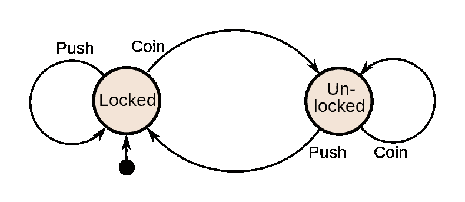
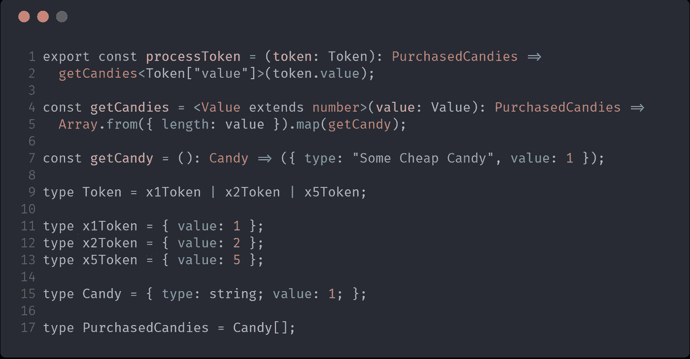
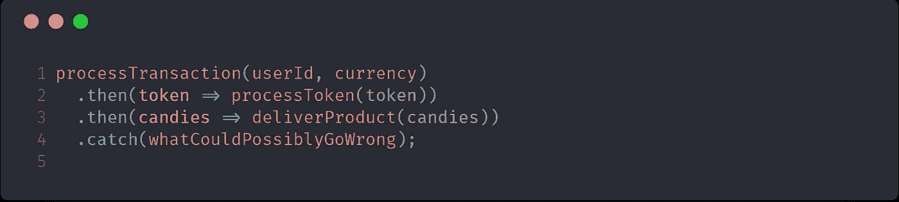
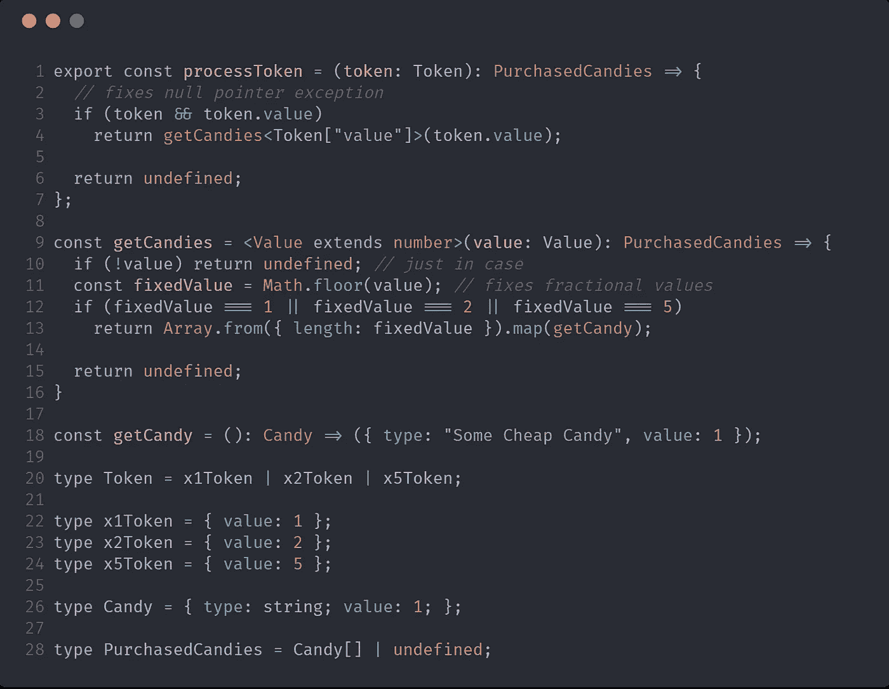
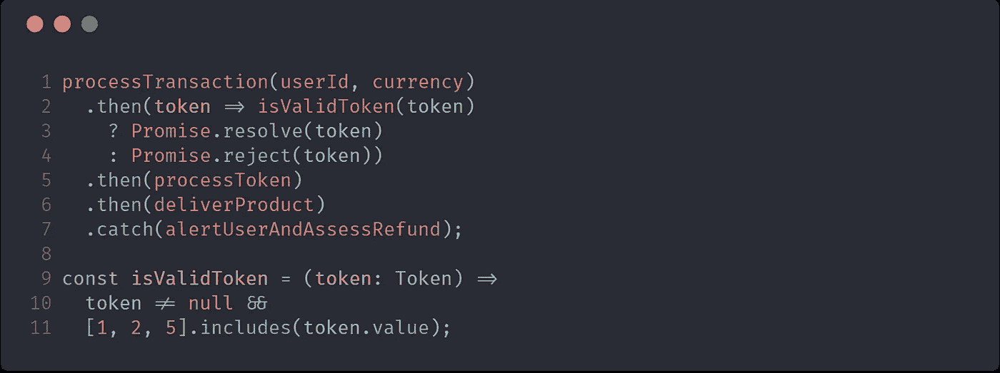

# 封闭的系统是快乐的系统

> 原文：<https://medium.com/hackernoon/a-closed-system-is-a-happy-system-8ecbea3cc3f3>

编写应用程序可能很难。编写没有 bug 的应用程序几乎是不可能的。显式类型会有所帮助，但是除非你是在谈论使用像 [Agda](http://learnyouanagda.liamoc.net/pages/introduction.html) 或其他[依赖类型语言](https://en.wikipedia.org/wiki/Dependent_type#Comparison_of_languages_with_dependent_types)这样的外来语言，否则拥有类型本身不足以保证我们的[系统](https://hackernoon.com/tagged/systems)在运行时不会出现异常。程序员需要付出一些努力来帮助编译器，因为会有一些盲点。也就是说，并非所有独立类型的语言都是平等的；Haskell 或 [PureScript](https://hackernoon.com/tagged/purescript) 或 Elm 在防止运行时错误方面比 C 做得更好，因为编译器和[开发者](https://hackernoon.com/tagged/developer)可以使用检查和[工具](https://hackernoon.com/tagged/tools)。

在这些更具异国情调的土地上，力量来自哪里？在为不太前沿的公司工作的日常生活中，我们如何利用一些更常见语言中的一些相同概念呢？

Elm 的作者和采用者声称它运行时没有错误，并且“如果它编译了，它可能会工作”，原因之一是因为生活在一个**封闭的系统**。

> 但这到底意味着什么呢？创伤链球菌

好时机，累叙述帮手！很高兴你问了。

A Finite State Machine representing a coin allowing a turnstile to unlock. Credit: Wikimedia Commons

这是一个有限状态机，描述了投币式十字转门的约束和行为。如果你眯着眼睛，你也可以把这个机器应用到口香糖贩卖机，或者便宜的自动贩卖机，或者其他很多东西上，通过涂写一些单词并替换它们。

这(希望)是一个**封闭系统**。我们知道所有的行为。我们知道所有的依赖关系。我们知道机器愿意接受的硬币或代币的形状、大小和价值。根据我们所处的位置和我们所拥有的东西，我们总是可以弄清楚我们应该处于什么状态，以及我们应该去哪里。这是游乐园和交通系统的风险。

如果我们添加更多的潜在状态，它会变得更加复杂，但只要你能清楚地定义所有状态之间的所有有效转换，它仍然可以是一个封闭的系统。现在，我将避免谈论通过 FSM 构建应用程序。相反，我想说的是，在我们的应用中，最容易出现问题的部分是**硬币**。

与其说是十字转门，不如让我试着用一个功能应该像口香糖贩卖机的应用程序来说明:投入一个代币，根据代币的价值，你会得到等价的糖果。

没什么大不了的。如果你给我一个价值 2 英镑的代币，我就给你两块糖。如果你给我一个价值 5 英镑的代币，我就给你 5 颗糖果。编译器很高兴，QAs 也很高兴桌面检查…剩下的就是把它连接到在线令牌服务上，它就可以投入使用了。

嗯……首先，有很多抱怨说系统吃了用户的钱，却没有交付任何东西。随后有报道称，人们可能会玩弄系统，带着不符合系统设计用量的糖果逃跑。

这两件事怎么可能发生呢？编译器说一切都很棒！
…但是编译器不是在运行时运行的，在编译的时候没有考虑整个互联网的类型安全(即:无)。

你稍微研究了一下`**processTransaction**`；事实证明，如果在处理支付时出现任何问题，令牌最终会以`**null**`的形式返回。根据一些过时的要求，似乎也有可能得到价值为 7 的令牌，以及价值为 10.2 的令牌，这是由于与汇率的逻辑存在奇怪的差距。

我们知道如何解决所有这些问题。

不再有例外！我们处理空值的情况，我们检查令牌值是否是一个整数…如果我们不能让它按照预期的方式工作，我们就返回`**undefined**` 并快速更改返回类型以支持没有值。搞定了。打包回家吧。

…但是，我们真的解决了问题吗？我们解决了服务中崩溃的代码。我们解决了人们可能欺骗系统的案例。但是我们*真的*解决了用户钱不见了没有糖果回报的问题吗？

没有。一点也不。事实上，之前购买 7 件商品的人将从我们的服务中收到 7 件商品。那些人还在交钱，但送的都是`**undefined**`。

那我们能做些什么呢？如果我们不能检查令牌在服务内部是否有效，我们如何确保它正常工作？

嗯，就是这样。服务是一个封闭的系统；或者曾经是。为了完美地完成工作，它希望收到一个有效的令牌，并返回一组有效的糖果。一旦您发送了一个可疑的令牌，整个代码库就有被检查和强制转换堵塞的风险，这只会增加混乱，并且返回的值只会打断下一个人，而没有您遇到的问题的上下文。如果这在 8 行代码中开始变得令人毛骨悚然，想想一个 140，000 行长的应用程序会有多可怕。为了关闭系统备份，您需要确定所有可能的路径，从一种状态转换到另一种状态。换句话说，你需要知道所有可能的循环和分支的所有可能的排列，这样你就可以确保你的状态的所有可能的出口都是已知的和有效的。

确保这一点的最简单方法是确保只有有效的数据进入您的系统。

让我再说一遍:
确保你在一个正确的系统中工作，或者甚至有能力确保它永远正确的最简单的方法是确保只有有效的数据进入你的系统，并且在你做任何其他事情之前拒绝所有无效的输入。

这几行代码在修复你的应用程序的行为方面做得比你想在内部添加的所有 if/else 检查更好。相反，在这里进行检查可以让您更好地了解在令牌丢失、格式错误或不适合工作的情况下应该做什么。

如果你玩过四分之一投币的街机，请注意，当你按下跳跃按钮或移动操纵杆时，他们不会检查四分之一的有效性(不管这种感觉有多强烈)；他们会在你按下开始键之前检查一下。如果它以一种可恢复的方式无效，他们会把你的错误输入扔出硬币，让你再试一次。流体管路中的气泡。封条上的缝隙。这些都是需要在边界上检查和预防的事情，因为一旦让坏的输入进入系统，就会造成严重的破坏，无论我们谈论的是血流还是制动线，混凝土还是宇航服。

为什么代码不同？

不是的；那个问题是反问句。下一次，我将概述一些边界上的坏输入的最大贡献者，并尝试提供安全有效的方法来处理它。