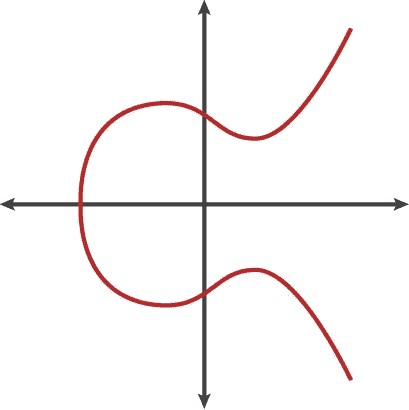
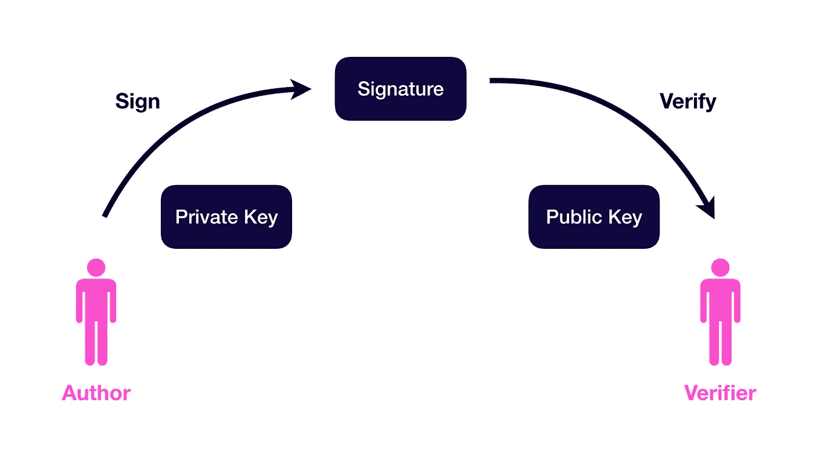

# 近距离观察以太坊签名

> 原文：<https://medium.com/hackernoon/a-closer-look-at-ethereum-signatures-5784c14abecc>

Photo by [Steve driscoll](https://unsplash.com/@ssdriscoll?utm_source=medium&utm_medium=referral) on [Unsplash](https://unsplash.com?utm_source=medium&utm_medium=referral)

非对称加密是上个世纪最重要的计算机科学发明之一。它也是区块链所有技术的核心。在本帖中，我们将深入了解以太坊如何使用[椭圆曲线数字签名算法(ECDSA)](https://en.wikipedia.org/wiki/Elliptic-curve_cryptography) 来验证消息的来源和完整性。

ECDSA 等加密技术对于安全扩展现有的区块链也是必不可少的。我们已经在[我过去分析分散式交流的帖子](https://hackernoon.com/understanding-decentralized-exchanges-51b70ed3fe67)中看到了这一点，其中 DEX 在它的链外通信中使用签名。随着区块链生态系统的成熟，我预计我们将会看到现有低级区块链基础设施的更多第 2 层和第 3 层扩展。

## **私钥和公钥**

像任何其他区块链系统一样，以太坊有一个私钥和一个公钥。这些密钥是在您创建新的区块链“帐户”时生成的。保持私钥的安全是非常重要的，因为它的任何副本都允许访问分类帐。安全存储私钥的硬件钱包已经成为一种基本的最佳实践。

账户的概念有点用词不当，因为在严格的技术术语中，只有密钥和与这些密钥对应的资金分类账。以太坊或[比特币](https://hackernoon.com/tagged/bitcoin)地址本质上是公钥的散列版本。

## **ECDSA**

椭圆曲线加密(ECC)和 ECDSA 是非对称加密的一种特殊形式。它们在区块链技术中被广泛使用有三个原因:

*   与许多其他算法相比，它们的计算性能是经济的
*   生成的密钥相对较短
*   比特币开创了它，所以大多数新的区块链项目都复制了它

ECDSA 使用有限域上椭圆曲线的代数结构。在不涉及数学的情况下，他们需要一组常数来定义这条曲线。大多数区块链使用的常数在 [secp256k1 标准](http://www.secg.org/sec2-v2.pdf)中设定。

Example shape of an Elliptic Curve

在区块链之前，这种椭圆曲线标准并不普遍。其实大部分[主流硬件厂商都不支持这个曲线](http://blog.enuma.io/update/2016/11/01/a-tale-of-two-curves-hardware-signing-for-ethereum.html)的硬件加密。据传，选择 secp256k1 是因为它最不可能被美国国家安全局植入[盗窃后门。](https://www.wired.com/2013/09/nsa-backdoor/)

## **如何签约**

在区块链系统中，任何密钥持有者都可以用他们的私钥对一段数据进行签名。这导致了签名。获得签名的任何人都可以使用它来:

1.  恢复作者的公钥(帐户地址)
2.  验证消息是否与作者签名的消息相同

让我们来看看以太坊中用于签名的确切函数:

第一行创建我们想要签名的消息的 SHA3 散列。这将产生以下 32 字节(256 位)的哈希:

*0x 592 fa 743889 fc 7 f 92 AC 3a 37 bb 1 f 5 ba 1 daf 2 a 5 c 84741 ca 0 e 0061d 243 a2 e 6707 ba*

然后，第 2 行使用以太坊的 JSON RPC 告诉以太坊钱包(它控制私钥)在给定的帐户上签署消息，产生一个签名。最后一行是对 JSON RPC 输出进行解码，这样我们就可以获得签名值 V、R 和 s(V 是为了应对某种攻击[而添加的)。](https://github.com/ethereum/EIPs/blob/master/EIPS/eip-155.md)

智能合约和以太坊客户端都能够验证 ECDSA 签名。智能合同中的 ECDSA 验证允许区块链之外的防篡改通信。有许多项目，例如$ZRX，依赖于此进行链外通信。

在[可靠性](http://solidity.readthedocs.io)中，可以使用以下代码验证签名的消息:

该代码将返回用于签署消息的以太坊地址(公钥)。对消息哈希或签名的任何更改都会导致与源地址不同的地址。

有时看一下这些函数的内部是很好的，这样我们可以更深入地理解。以下两个部分遵循流行的 Meta Mask 钱包中使用的代码和 Go-Ethereum 智能合约代码的内部内容。

## **附录 A:元掩码内的签名代码**

[Meta Mask](https://metamask.io/) 是一个 Chrome 扩展，创建了一个用户友好的交易体验。用户可以发送/接收以太网，签署信息，并与智能合同互动。它还配备了一个可怕的 3D 多边形狐狸，随着你的光标输入。

元掩码中的私钥存储在浏览器的本地存储中。Meta Mask 使用一个[外部库用密码加密私有密钥信息](https://github.com/danfinlay/browser-passworder)。(使用 AES-GCM)。

当我们使用元掩码对消息进行签名时，会弹出一个窗口，显示要签名的消息和帐户:

当我们检查底层代码时，我们会通过以下库——其中大部分由元掩码开发人员控制。

Some of the NPM packages used in signing a message

欢迎来到现代 Javascript 的奇妙世界！

与签名最相关的以太坊 JS 代码如下:

有很多数据结构转换正在进行，但在最后的函数中我们可以看到 R，S，V 签名是如何通过调用 *secp256k1.sign()* 函数获得的。这就引出了下面这段[椭圆库](https://github.com/indutny/elliptic)中的基本代码:

## **附录 B:智能合约/ Go-Ethereum 内的签名代码**

让我们仔细看看前面提到的从签名中恢复公钥的契约代码:

Solidity 提供的 *ecrecover()* 函数其实有点特别。这是智能合约中为数不多的“原生合约”之一。这些是可以调用的内部代码智能协定。下面是在 [Solidity EVM 汇编器](http://solidity.readthedocs.io/en/develop/assembly.html)中调用 *ecrecover()* 的另一种方法:

*call()* 函数在固定地址 *3000* 执行契约。然后，它执行以下代码(在 go-ethereum 实现的情况下):

这最终调用下面的 C 代码来恢复公钥(使用 *pubkey* 指针):