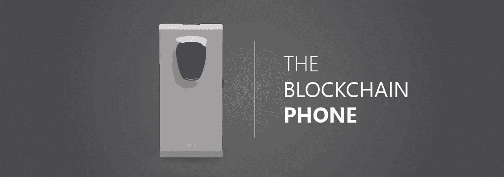
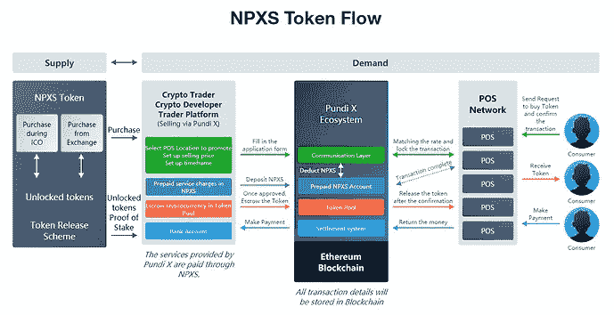

# 近距离观察三款区块链手机

> 原文：<https://medium.com/hackernoon/a-closer-look-at-three-blockchain-smartphones-28b746976d22>

Yes, blockchain phones are a thing ([source](https://coinfrenzy.io/blockchain-phone-reality-soon/))

因此，已经有几个公司生产“区块链就绪”手机的例子。为了更好地理解这意味着什么，**本文旨在讨论在智能手机中实现区块链技术的可能性**。

让我们从三个例子开始:

# 庞迪 XPhone

这家公司为其位于区块链的支付生态系统提供了一款手机。Pundi X 的主要重点是**让商店接受加密支付**，因此他们为顾客提供[零售销售点(POS)设备](https://twitter.com/CryptoShillNye/status/1021954408785924098)和支付选择。除了通过电信提供商的正常连接选项之外，这款手机还可以在名为 function X 的区块链上工作，并作为商店 POS 基础设施的本地支付设备。

1.  通过 X 区块链功能打电话、发短信和进行 P2P 文件传输。
2.  手机是一个安全的钱包，你必须在第一次启动手机时设置它。
3.  *每部手机都是网络上的一个节点*，**选择性地绕过集中的电信运营商**。数据分组和连接是以分布式 P2P 方式组织的。
4.  NPXS 令牌在生态系统中充当实用令牌:
    –首先，要"*在 Pundi XPOS 应用程序商店上发布应用程序*需要 NPXS 令牌，NPXS 是在应用程序内结算支付的默认令牌。根据不同类型的开发者，我们在 NPXS 中收取高达 30%的手续费。Pundi X 合约会烧这种 NPXS 代币。”
    –第二，Pundi X NPXS 代币也可用作*忠诚度奖励*，用于扣除交易金额。这将鼓励消费者使用 Pundi X 进行购买。它还帮助店主增加收入和客户满意度，并进一步扩大 Pundi X 的业务网络。
    –第三，*广告可能性*。“广告商、开发商和广告网络可以通过 Pundi X 广告平台投放广告。广告内容和位置可以是 Pundi XPOS 侧屏幕上的消费者广告、收据上的广告、店主通知广告、会员系统上的广告、Pundi XPASS 卡上的广告、成功支付通知上的广告。”([来源](https://pundix.com/npxs))

**Tokenomics of Pundi X’s NPXS token** [**(hi-res)**](https://discourse-cdn-sjc2.com/standard14/uploads/x1000x/original/1X/4477edd9bd803aa7fe24c5f57088082f693c8658.jpeg)

**注释**

*   迪拜是第一批实施 Pundi X 支付生态系统的国家之一([来源](https://www.prnewswire.com/news-releases/dubai-to-offer-digital-payments-on-pundi-x-technology-300726736.html))。该公司目前每月部署 5000 台([来源](https://twitter.com/CryptoShillNye/status/1021954408785924098))。
*   区块链技术的实施集中在支付选项上，对于支付选项来说，手机是一个物理和数字钱包。
*   DApp 商店应该是连锁的，并允许与以太坊、EOS、NEO 和其他平台上构建的应用程序兼容。
*   XPhone 目前似乎还没有准备好大规模生产，但开发者和早期采用者肯定会感兴趣。

# 塞林实验室芬尼

1.  芬尼手机为数字资产提供了一个安全的移动环境*，这就是基于安卓系统的 Sirin 操作系统。该软件提供了几个好处:*集成冷存储钱包*，安全交换访问，加密通信，P2P 资源共享(如数据，连接)，以及计算能力。网上交易是免费的。Sirin OS 可以被其他 OEM 厂商用来将这些功能集成到他们自己的产品中([来源](https://www.theverge.com/circuitbreaker/2018/7/10/17552344/blockchain-phone-sirin-labs-finney-lionel-messi-specs-price))。
    ——“芬尼附带的一些安全措施包括基于行为的入侵防御系统、用于钱包保护的硬件开关、加密的 VoIP/文本/电子邮件以及*三因素认证*(生物特征+锁定模式+行为)”([来源](https://www.notebookcheck.net/World-s-first-blockchain-connected-smartphone-Finney-from-SIRIN-Labs-gets-detailed-specs.303094.0.html))。*
2.  *它为用户提供了他们的“专有代币转换服务，实现了支持的代币和硬币之间的*无缝自动交换*，无需访问外部交换”。*
3.  *SIRIN 令牌(SRN)是一个*实用令牌*，其目的是用作 SIRIN LABS 生态系统的基石，该生态系统目前由 SIRIN OS、FINNEY smartphone、SIRIN 分散式应用程序(DApp)商店和 SIRIN LABS 实体商店组成。
    ( [来源](https://sirinlabs.com/sirin-os/))*

***注释***

*   *DApp 商店应该是连锁的，并允许与以太坊、EOS、NEO 和其他平台上构建的应用程序兼容。*
*   *一些额外的安全选项相当漂亮；多生物识别，如指纹+人脸解锁+语音(？)，是一个引人入胜的发展。*
*   *这款手机售价 1000 美元，因此肯定不会被大量采用。*
*   *你买了带 SRN 的手机，限制了可访问性。*
*   *让 Sirin OS 开放/授权(？)对其他手机制造商来说是一个聪明的商业举措，据传华为已经表示出了兴趣。*
*   *营销做得好，承诺高。该公司的 ICO 超过 1.2 亿，但智能手机市场变得非常拥挤，创建一家新的手机公司非常困难。我对公司能否兑现他们所有美好的承诺持谨慎态度。*

# *HTC Exodus*

*这款手机旨在为区块链交易和钱包提供一个*安全的移动环境*，通过引入一个独立于主要 Android 操作系统的安全、加密的数字空间。通过整合 HTC 的 Zion wallet，这款手机可以充当硬件钱包。*

*“Exodus 使用 ARM 芯片的安全飞地来建立一个加密的信任区，并与主要的 Android 操作系统分离。这款手机将带有配置为存储比特币、莱特币和以太币等货币的钱包。这应该比使用 Android 应用程序在你的普通手机上存储钱包安全得多”([来源](https://www.extremetech.com/mobile/279400-htc-exodus-blockchain-phone-up-for-pre-order-but-only-with-cryptocurrency))。*

***注释***

*   *这种模式看起来和感觉起来更像是 HTC 的营销努力。*
*   *你只能用加密货币购买这部手机。价格很高，因为预购价格为 0.15 BTC 或 4.78 埃特=约 1000 美元(2018 年 10 月)*
*   *区块链技术在手机中的有限应用。*

# *结论*

*基于这三个例子，可以说区块链智能手机为数字钱包和交易、**加密通信、**以及云存储等**附加分散服务**提供了**安全的移动环境。使用可选的分布式网络进行通信允许用户绕过集中式电信提供商。***

***简而言之:***

*   *Pundi X 正在制造面向零售的硬件*
*   *Sirin 实验室专注于消费者采用的软件*
*   *HTC 已经用钱包尝试了区块链技术*

*通过专注于移动优先，插图公司正在利用几乎每个人都随身携带的设备(是的，智能手机使我们成为电子人)。*

***我希望将来能看到的一些功能:***

*   *多步生物识别验证(如指纹+面部解锁+语音识别)*
*   *全面的数字身份支持(例如与 Civic、TheKey、Life-ID 和其他数字身份解决方案的集成)*
*   *通过洋葱路由混合网络匿名发送所有电话连接的能力*
*   *与可选的隐私工具包集成*

*讨论的发展**改善了区块链科技**的用户体验，这可能会导致更广泛的**采用这一创新**。*

**你对这些发展有什么看法？**

**你认为哪些地方错失了机会？**

**要采用区块链技术，我们能做些什么来提供更方便用户的(移动)体验？**

*喜欢听你的想法！*

*感谢您阅读本文！我是否忘记了某些信息或发展？或者你在我的故事和推理中发现了缺陷或偏见？请告诉我，我欢迎讨论、反馈和批评。*