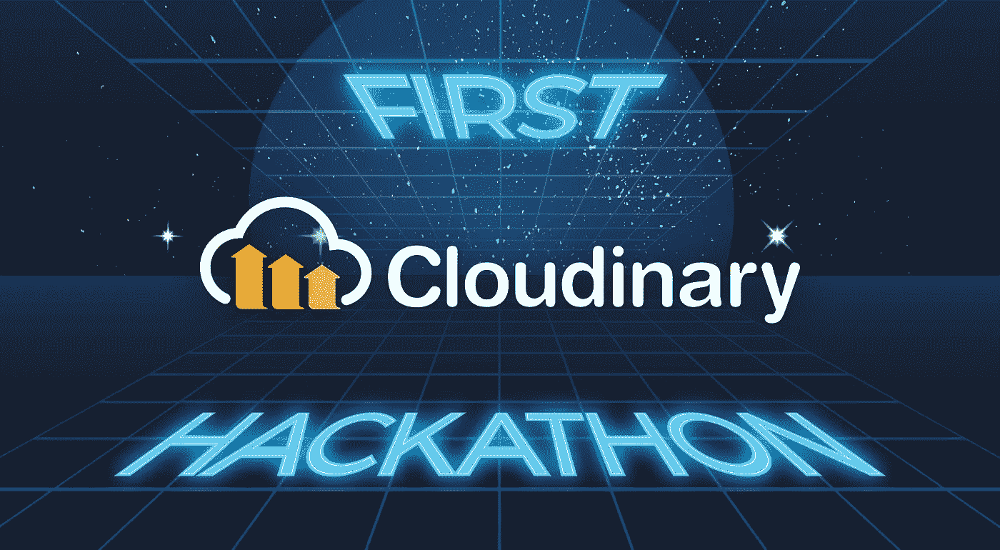
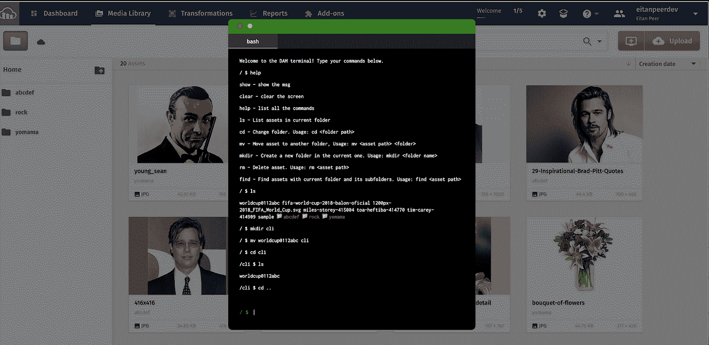

# 一个云里雾里的新手的第一印象和第一次黑客马拉松

> 原文：<https://medium.com/hackernoon/a-cloudinary-newbies-first-impressions-and-first-hackathon-2ae9577e0967>

今年早些时候，我决定辞职。在探索新的机会时，我遇到了一家专门从事数字资产管理(DAM)的公司，名为 Cloudinary，并对此产生了兴趣。令人高兴的是，经过几轮技术性和非技术性的面试后，我收到了一份工作邀请，并于 6 月份加入了该公司，成为一名全职的开发人员宣传员。

我的加速计划很简单:在以色列特拉维夫的 Cloudinary 办公室呆上两周，与那里的团队见面:工程师、产品经理、高管。出于纯粹的运气，在我访问的第一天，Cloudinary 举办了一次内部[黑客马拉松](https://hackernoon.com/tagged/hackathon)、[黑客外作物](/cloudinary-engineering-blog/hack-outside-the-crop-3994bfd86f83)，我也参加了。结果证明这是一次宝贵的经历。

在特拉维夫办公室呆了一段时间后，我突然想到两件事。第一，每个人都很友好，真诚地好奇我是谁，我知道些什么。我没想到第一天会有这么多拥抱，但是，嘿，我没有抱怨。那些热情的姿态适合我的个性，我喜欢那种融洽的工作环境。第二，我印象深刻的是看到高管们经常在办公室里随意走动，这让我们有很多机会和他们交谈。很明显，如果它们是免费的，它们是绝对可以获得的。

第一天在办公室被介绍和参观后，我加入了[黑客马拉松](/cloudinary-engineering-blog/hack-outside-the-crop-3994bfd86f83)。从组织的角度来看，黑客马拉松非常标准，从提出想法和组建团队开始。主要标准是创建能够增强、扩展或提高 Cloudinary 核心产品的黑客。

我和另一个开发者福音传道者合作，这样我们也可以利用在一起的时间来交流知识。这对我非常有益，因为我对 Cloudinary 采用的技术还很陌生，有很多东西需要学习。尽管如此，我发现刚开始时甚至连基本原理都很难掌握。感谢我的团队成员和工程师们的慷慨帮助，他们都在办公室的一个部门，我在短时间内取得了显著的进步。获取知识从未如此容易！

我们团队从事的项目是一个基于 Vue.js 的视频编辑器，它将使营销人员和博客作者能够以 Cloudinary 为后端在线拼接和编辑视频。目标是创建一个易于使用的界面，而不是一个胖客户端应用程序，为网络浏览器缩小视频。尽管这是我第一次使用 [Vue.js](https://hackernoon.com/tagged/vuejs) ，但我发现它很有吸引力，并在多个项目中使用过。

总而言之，我非常喜欢这次黑客马拉松。这给了我一个非常宝贵的机会——

*与几个云计算团队会面并一起工作。

*从福音传道者那里获得深入的知识。

*学习新技术，包括 Vue.js 和 Cloudinary 的技术。

在做这些的时候，我吃了很多美味的食物。

在仅仅几个小时的时间里，所有的黑客马拉松团队都成功地做出了优秀的黑客作品。最后，每个团队都展示了他们的技术，我对一些解决方案的技术含量感到惊讶。查看由团队创建的所有[项目。](/cloudinary-engineering-blog/hack-outside-the-crop-3994bfd86f83)

**第一名:**水疗加 a +1 的乐趣日。

**第二名:**在一家厨师餐厅与 a +1 共进晚餐。

获胜团队构建了一个数字资产管理(DAM)终端。DAM 是一种新的 Cloudinary 产品，允许营销、创意和开发团队自由使用富媒体来推动客户或用户在不同用例中的参与。使用 DAM 终端，您可以方便地在浏览器中执行文件系统文本命令和操作，就像在 UNIX 终端中一样。

**结论**

总而言之，我发现在黑客马拉松的时候加入 Cloudinary 既有挑战性又令人兴奋。具有挑战性，因为我必须快速掌握技术细节；令人兴奋，因为我被扔进了深水区，可以这么说，但我这样学得最好。最重要的是，从所有那些知识渊博、经验丰富的同事那里学习是令人满意的。