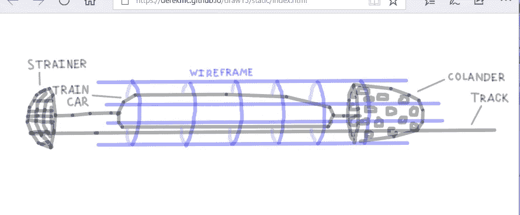

# 漏勺超回路 FTW

> 原文：<https://medium.com/hackernoon/a-colander-hyperloop-ftw-760a304a0c91>

## 我的厨房用具激发了地铁运输的灵感

你可能已经听说过，亿万富翁埃隆·马斯克启动了一个名为 [Hyperloop](https://hackernoon.com/tagged/hyperloop) 的地铁项目/竞赛/项目。

这是我的想法。

声学和气流是复杂的工程和数学建模问题，所以我不能告诉你这是否可行，或者是否是最好的变化，但我认为它有很大的潜力。

# 隧道控制气流

一些 hyperloop 的提议是利用前面的真空和后面的气垫来推动火车。其他人使用磁悬浮和推进，隧道保持较低的气压或真空，这增加了稳定性，减少了阻力。

# 如果你随身带着隧道呢？

拥有一辆运送乘客的火车和一个协调运行的外部结构来管理气流，这听起来可能有些多余，但我认为这可能会为工程师提供更多选择来稳定。

不稳定是高速地面运输的最大限制之一。你在飞机上遇到过气流吗？现在想象一下，如果这发生在磁悬浮轨道上！一旦你的速度足够快，你就不需要风中的气流来造成不稳定，你可以自己制造气流。声学也会显著地导致这种不稳定性。

# 如果隧道只是一个线框呢？。。用厨房用具？

A colander and a strainer may be the secret “sauce” that hyperloop needs

在这张图中，我有一个轨道，一个围绕轨道的线框结构，它贯穿整个轨道长度，一个领先的“滤器”，和一个落后的“过滤器”。

漏勺创造了领先的气流，让火车牵引，就像骑自行车的人比赛时一样。它是轻量级的，并由外部线框被动或动态地稳定。(噪音消除有人吗？)

漏勺可以由轨道或框架独立推动，或者由从火车伸出的导杆推动。与实心结构相比，漏勺的孔可能有助于稳定气流。

在火车后面，我添加了另一个厨房用具:一个过滤器。其目是减少尾部湍流并打破涡流和气流不稳定性。可以只有一个或几个连续的过滤器。它们可以是固定或旋转的。像漏勺一样，它可以通过火车上的连接点拉动，也可以独立推进。它还可以使用噪声消除或其他稳定策略。

同样，我不知道这是否可行，但这是一次想象力和创造力的有趣练习。如果你能对所涉及的工程学或物理学发表评论，我将不胜感激。我很乐意听听你自己的创造性的交通想法！