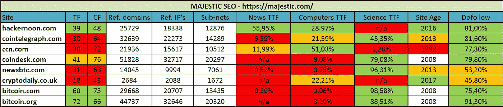
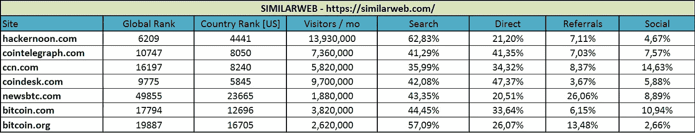

# 黑客月 vs 加密网站比较！

> 原文：<https://medium.com/hackernoon/a-comparison-of-hackernoon-vs-crypto-news-sites-93f4c307a1c>

我很好奇 Hackernoon 目前与大多数加密新闻网站相比如何，考虑到越来越多的人最终会在 Hackernoon 上发布与加密货币和一般的[区块链](https://hackernoon.com/tagged/blockchain) [技术](https://hackernoon.com/tagged/technology)相关的文章。

为了进行比较，我们使用了 Majestic 的最新指数，因为它向我们展示了最新的数据。

# 让我们开始吧

我们注意到的第一件事是，大多数加密新闻网站在 TF/CF 比率方面得分很低，而 Hackernoon 做得非常好，bitcoin.com 和 bitcoin.org 也是如此。在涉及域名、IP 和子网方面，他们得分都很高。

大多数网站都有大量的 Dofollow 链接，正如你所期望的那样，这些网站拥有大量的流量。另一方面，较小的网站得分较低，这并不奇怪，由于预算限制，这使得他们更难获得可信的链接。

你可以清楚地看到 Hackernoon 做得非常好，特别是对于一个两年前几乎不存在的网站来说，这是值得称赞的。

关于这种比较，有一件事让我感到困扰，那就是 TTF 类别:根据 Majestic 的说法，科学或更好的说法是“社会科学”。

怎么可能 Coindesk、NewsBTC、CoinTelegraph 和这两个比特币域名在那里得分极高，而同类型网站 CCN 在这里得分极低？是有一个前网站之间的阴谋正在进行，还是因为 CCN 正在使用一个重新利用的领域与一个更老的预先存在的反向链接配置文件？

你告诉我！

另一件有趣的事情是，几乎所有的加密网站都与新闻无关。此外，大多数合法的新闻网站不想与他们有任何关系…这令人惊讶。

尽管如此，谷歌还是把它们列在新闻类别中，所以它们清楚地知道这些网站是关于什么的。当我们谈论合法网站时，你可以说 Hackernoon 在常规新闻世界中更合法。

# 让我们看看 SimilarWeb 是怎么说的:

Traffic stats provided by SimilarWeb.com

Hackernoon 显然在各个方面都击败了它的加密竞争对手。你可以说这不是一个公平的比较，因为 Hackernoon 不仅仅是加密货币和区块链技术，这对这样一个年轻的网站来说是惊人的。

这个比较也清楚地表明，TF 排名并不代表流量，考虑到 bitcoin.com 和。org 在链接强度方面更强。

至于流量，在过去的六个月里，所有的加密网站的流量几乎减少了一半，而 Hackernoon 则相当稳定。我不得不承认 SimilarWeb 在报告流量方面并不总是 100%可靠，但对于这样的比较，它已经足够好了。

干得好，哈克农！

# 词汇表

## 信任流和引用流

TF 和 CF 是分析链接强度和数量的指标。理想情况下，您希望这些比例为 1:1。如果 CF 是 TF 的两倍，则表明与合法流量相比，该域正在接收大量垃圾邮件。

## 引用域、IP 和子网

参考域名是链接到你的网站的数量。您还需要查看链接所在的 IP 地址和子网。一些网站喜欢利用这一点，在同一个服务器上托管 1000 个网站。

## 话题信任流

这是衡量你与 Majestic 引用的近一千个类别中最受信任的网站的接近程度。

## 关注链接

当一个链接被放在一个网站上时，它会被自动命名为 Dofollow 链接，这意味着 Google 会传递来自这个反向链接的能量。垃圾邮件域往往有大量的无后续链接；这类链接通常会被谷歌忽略。

# **参考文献:**

 [## 如何在谷歌上排名-终极指南

### 首先，谷歌不对网站进行排名，它对网页进行排名，网页排名的首要因素是…

www.contenthourlies.com](https://www.contenthourlies.com/blog/how-to-improve-your-rankings-in-google/)  [## 使用 Majestic 引用流和信任流来检查您的链接前景的质量-

### 这篇文章主要是针对代理世界，那里有外联或链接建设团队全职工作…

blog.majestic.com](https://blog.majestic.com/case-studies/using-majestic-citation-flow-trust-flow-check-quality-link-prospects/)  [## 任何网站的桌面和移动网络流量

### 随着越来越多的人通过桌面和移动设备消费数字内容，通过这两种方式分析网站…

www.similarweb.com](https://www.similarweb.com/blog/total-traffic-for-any-website-and-fresh-mobile-web-data)