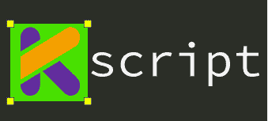

# 一个完整的后端，只有 Kotlin 和你最喜欢的文本编辑器！

> 原文：<https://medium.com/hackernoon/a-complete-backend-only-with-kotlin-and-your-favourite-text-editor-582b4528688>


什么？！！好吧，让我澄清一下。让我们只用 Kotlin 和你最喜欢的文本编辑器来构建一个完整的后端/网络应用程序。不，不需要安装 IntellJ IDEA，不需要处理 Gradle 文件的东西..说真的，没有！你所需要的只是一个简单的文本编辑器和 Kotlin。那么……该怎么做呢？

对于这个食谱，我们需要两种成分(除了文本编辑器和 Kotlin)。
我假设你已经安装了 [**科特林**](https://kotlinlang.org) 并且设置了 Atom 或者 Sublime 或者 Vim。

# 安装[k 脚本](https://github.com/holgerbrandl/kscript)和[k 用于](https://ktor.io/)



A made GIF ;-)

> 什么是 [**KTor**](https://ktor.io/) ？Ktor 是一个使用强大的 Kotlin 编程语言在连接系统中构建异步服务器和客户端的框架。

KTor 是一个用 Kotlin 构建的 web 框架，用于开发强大的 web 应用程序。这是我们将要使用的框架。Ktor 是一个可以轻松构建互联应用的框架——web 应用、HTTP 服务、移动和浏览器应用。现代的连接应用程序需要异步来为用户提供最好的体验，而 Kotlin 协同例程提供了强大的工具来以简单明了的方式做到这一点。
如果你想阅读更多关于 Ktor 的描述请查看 [**这里**](https://ktor.io/quickstart/index.html) **。**

> 什么是 [**Kscript**](https://github.com/holgerbrandl/kscript) ？在基于*nix 的系统上，增强了对 [Kotlin](https://kotlinlang.org/) 的脚本支持。

这是有趣的部分。它是一个由[*@ HolgerBrandl*](https://twitter.com/holgerbrandl)*维护的 [**库**](https://github.com/holgerbrandl/kscript) ，为 Kotlin 提供了增强的、牛逼的脚本支持。您甚至可以使用该工具进行数据/文本处理，也可以运行 Kotlin.kt 文件。观看 [**这篇演讲**](https://www.youtube.com/watch?v=cOJPKhlRa8c) 了解更多细节和 Kscript 能做什么。*

*要安装 Kscript，请遵循以下步骤:
如果您已经安装了[**sdkman**](http://sdkman.io)**，您可以直接跳到步骤 **2。**
**1。**安装[**sdkman**](http://sdkman.io)你可以在这里按照说明[](https://sdkman.io/install)**。或者运行:*****

```
*****$ curl -s “[https://get.sdkman.io](https://get.sdkman.io)" | bash*****
```

*****然后按照终端屏幕上的指示运行如下内容*****

```
*****$ source "$HOME/.sdkman/bin/sdkman-init.sh"*****
```

*******2。**安装 **Kscript** 一旦你安装了 **sdkman，**你就可以运行这个来安装 Kscript。(但是 Kscript 的先决条件是 Kotlin 和 Maven，所以要确保您的机器上有 Kotlin。简单来说，运行`$ sdk install kotlin`和`$ sdk install maven`。现在运行以下命令:*****

```
*****$ sdk install kscript*****
```

*****它将下载 Kscript 并将其添加到您的路径中。*****

*****让我给你一个 Kscript 的快速概述，这样你就会对它有一个概念。要开始使用 Kscript 并获得完整的参考资料，请访问 [**本报告**](https://github.com/holgerbrandl/kscript) **。** 文件的扩展名是`.kts`或者可以使用`.kt`。将这一行添加到您的文件`#!/usr/bin/env kscript`的顶部(在 shebang 行中指向它)。在这个文件中，你可以编写任何 kotlin 代码。检查下面简单的`hello_world.kts`。*****

```
*****#!/usr/bin/env kscriptimport java.util.*println("Belllloooo!!")
//Rest of the code below***** 
```

*****您可以使用下面的命令来运行它。它有一些编译开销，所以需要一些时间。*****

```
*****$ kscript hello_world.kts*****
```

*****请浏览 kscript repo 以获得更多关于如何包含库依赖、另一个文件、Kotlin-opts、JVM-args 等的细节。*****

# *****运行 KTor 服务器*****

*****现在我们来看看 KTor。要使用 KTor，我们需要依赖
`compile "io.ktor:ktor-server-netty:0.9.4"`来和 gradle 一起使用。但是，正如我所说，我们根本没有维护任何 gradle 文件的东西。Kscript 最好的特性之一是，你可以在你正在处理的同一个文件中声明库依赖。让我告诉你我修改同一个`hello_world.kts`文件的意思。*****

*****这里的`@file:MavenRepository(...)`与你 IntellJ IDEA 中的`build.gradle`文件中的`repositor{}`相同。KTor 所需的存储库是 maven repos。另外，`@file:DependsOnMaven(...)`指定了 Netty 基本用法所需的工件。*****

*****当您第一次尝试运行上述文件时，将下载并缓存依赖项。要清除缓存，你可以运行`kscript --clear-cache`。*****

*****通过进一步修改上面的文件，让我们看看如何启动服务器。我再次修改同一个 hello_world.kts 文件。*****

*****你就完了。运行命令`$ kscript hello_world.kts`即可。它将首次下载依赖项(编译和下载依赖项需要一些时间)。您可以忽略警告(类似 SL4J 等)。
在浏览器上访问 url `http://localhost:8080`。希望你可能会看到一些东西*****

*****我们刚刚创建了一个带有文本编辑器和 kotlin 的简单服务器。为了进一步完善，你可以在 [**文档**](http://ktor.io/servers/index.html) **中查看服务器支持的 KTor 开发。**关于客户端 HTML 模板和请求处理，请查看 KTor 的本 [**文档**](http://ktor.io/clients/index.html) 。*****

*****KTor 是异步服务器框架。我将在本系列的下一部分讨论这些主题。所以，敬请关注下期帖子。*****

*****第二部分即将到来。敬请期待！如果你喜欢这个故事，请为我鼓掌，并跟随我获得像这样的精彩食谱。更多内容请访问[**http://nikhya . me**](http://www.nikhya.me)**。*******