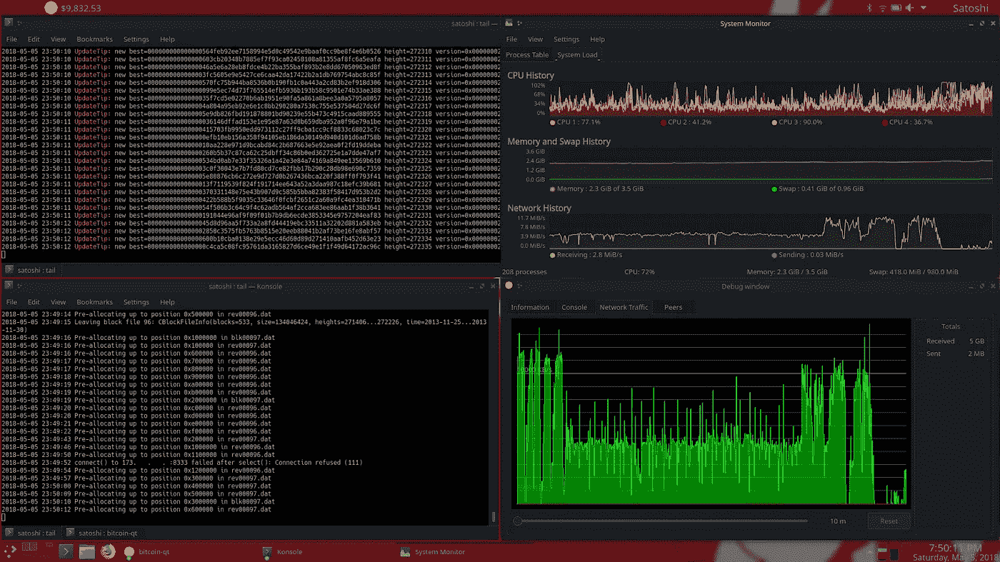
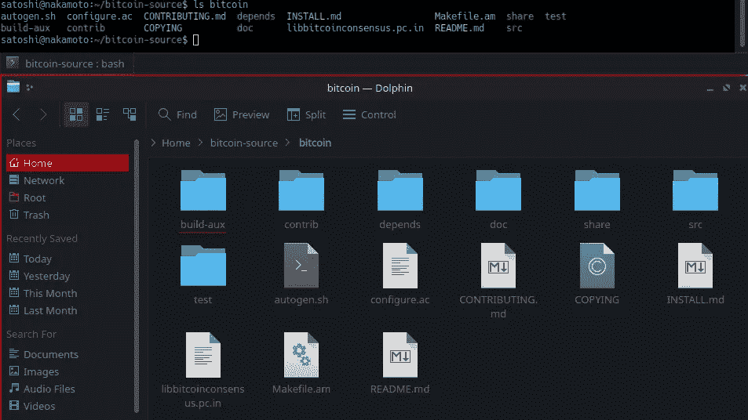

# Linux 上安装比特币全节点的完全初学者指南(2018 版)

> 原文：<https://medium.com/hackernoon/a-complete-beginners-guide-to-installing-a-bitcoin-full-node-on-linux-2018-edition-cb8e384479ea>

## 如何在没有任何 Linux 经验的情况下，在全新安装的 Kubuntu 18.04 上编译比特币全节点？



# 介绍

我最近安装了一个新的 SSD，这样我就不用在我的笔记本电脑上修剪了，我想我应该试着创建一个教程。

没用过 Linux？不知道“李子”是什么意思？*完美。*这是给你的。我要你学 Linux，我要比特币激励你转行。这既是一本“傻瓜 Linux”指南，也是一本设置比特币节点的指南。

如果你已经略知一二，想跳过所有没用的*词:*

`Just copy and paste the commands at the bottom of this article.`

大多数教程只是给你一些步骤，虽然有些实际上非常擅长于阐述一些细节，但这一个是 [*字面上的*](https://www.google.com/search?q=figuratively) 将向你提供你可能有的所有问题，直到每个命令做什么。我假设你唯一的预备知识是能够[弄清楚](http://www.lmfgtfy.com)如何下载&挂载下面的 [ISO 镜像](https://en.wikipedia.org/wiki/ISO_image) I 链接，[引导它](https://www.google.com/search?q=how+to+boot+to+usb)，并遵循默认安装说明。除了加密我的整个驱动器和导入我的桌面首选项和主题之外，我不会对默认安装配置进行任何重大更改。我们希望避免复杂化，这就是为什么我不会先安装任何其他东西，只是比特币和屏幕捕捉软件，所以任何[依赖](https://www.google.com/search?q=dependency+linux)的问题，我们都应该有。如果你遇到任何其他问题，在某个地方感到困惑，或者认为我应该包括一些东西，只要在下面评论或者在 Twitter 上联系我，我会尽力帮助或者修改这篇文章。

本教程的部分灵感来自 [Grubles 闪电网络教程](https://hackernoon.com/harnessing-lightning-for-instant-bitcoin-transacting-a-tutorial-3b9dcdc00552)。

# 第一部分—设置

*如果你已经在 Linux 上，完全跳过这一节。*

## 下载 Kubuntu ISO 映像

[Kubuntu](https://en.wikipedia.org/wiki/Kubuntu) 是 [Ubuntu](https://en.wikipedia.org/wiki/Ubuntu_(operating_system)) ，*但是* [*闪亮*](https://en.wikipedia.org/wiki/KDE_Plasma_5) *。*最新的 [LTS](https://en.wikipedia.org/wiki/Long-term_support) 版本是 [18.04](https://kubuntu.org/getkubuntu/) 。

## 将 ISO 映像安装到 USB 或 CD

关注 Ubuntu 的官方教程 [Windows](https://tutorials.ubuntu.com/tutorial/tutorial-create-a-usb-stick-on-windows) 或 [macOS](https://tutorials.ubuntu.com/tutorial/tutorial-create-a-usb-stick-on-macos) 。

## 安装操作系统

您将设置计算机名称、用户和密码。我这个教程的用户名会是 **satoshi** ，电脑名会是 **nakamoto** 。

## 登录

安装并成功登录后，你的桌面应该看起来像下面的截图。您可以随意体验，慢慢习惯，但是在某个时候，您需要导航到应用程序启动器并运行终端 *(Konsole)* 。


我们将在本教程的大部分时间里在这个窗口中工作，直到我们结束，但我将打开文件管理器，称为 Dolphin，并导入我的主题和桌面首选项。


在我们向终端输入任何内容之前，让我们看一下我们已经看到的内容。在终端窗口的顶部写着“Konsole”。这只是特定于该桌面环境的软件的名称。有时你会看到它被称为终端，命令行，或只是外壳。

`**satoshi**`是用户名。`**nakamoto**`是计算机的[主机名](https://en.wikipedia.org/wiki/Hostname)，它会显示在您可能连接的任何网络上。您的将是您在安装过程中选择的任何内容。

在`**:**`和`**$**`之间，你会看到一个`**~**`。这是你的 **/home/ <用户名>** 目录的缩写。 **/home/ <用户名>** 就像 Windows 中的“我的文档”。

这两个意思是一样的，但是当你在那里的时候，你总是会看到`**~**`:

`**satoshi@nakamoto:~$**`

`**satoshi@nakamoto:/home/satoshi$**`

# 第二部分—先决条件和依赖关系

如果你已经在 Linux 上，浏览这一部分的命令。对于那些不需要解释的人，我甚至将它们都浓缩在本文的底部。

我们在终端中要做的第一件事是检查更新。键入以下内容并按 enter *(在此过程中，系统会提示您键入“y”表示是，并输入您的密码)*:

`**satoshi@nakamoto:~$** sudo apt-get update`

[**sudo**](https://en.wikipedia.org/wiki/Sudo) 有时被称为“超级用户 do”。这有点像在 Windows 中使用“以管理员身份运行”，但更好。这在整个教程中都是必要的，因为后面的命令会尝试做一些需要超级用户权限的事情。

[**apt-get**](https://en.wikipedia.org/wiki/APT_(Debian)) 允许您与可用的软件库连接，以便您可以直接从终端下载软件。

**update** 是使用 **apt-get** 必须遵循的几个命令之一，它将检查您已经安装的任何软件包的更新并安装它们。

接下来我们将安装 [Git](https://git-scm.com) 。它是广泛使用的开源软件，用于处理其他开源项目。我们将使用 Git 访问比特币储存库并下载其代码。

`**satoshi@nakamoto:~$** sudo apt-get install git`

**安装**应该是不言自明的，就像**更新**一样，但是是在你第一次安装一个特定的包的时候。它需要一个包名。

**git** 是 git 包的名称，并且被[源列表](https://en.wikipedia.org/wiki/APT_(Debian)#Sources)识别为 **apt-get** 命令所引用的。安装后，它也将作为一个命令。

现在，我们将在主目录中创建一个文件夹，然后转到该目录，这样我们就可以将需要的文件复制到其中。我们*可以*将它克隆到任何我们想要的文件夹中，这只是我选择在主文件夹中创建的路径。

首先，输入下面一行:

`**satoshi@nakamoto:~$** mkdir -p bitcoin-source && cd bitcoin-source`

现在看起来应该是这样的:

`**satoshi@nakamoto:/home/satoshi/bitcoin-source$**`

**mkdir** 制作目录。这就像右击桌面或窗口并选择“新建>文件夹”。

**-p** 是一面旗帜。标志是[命令行选项](https://en.wikipedia.org/wiki/Command-line_interface#Command-line_option)，将以`**—**` 开头。每个命令*(像****mkdir****)*都有自己的一套选项，所以 **-p** 可能会为另一个命令做些别的事情。在这种情况下， **-p** 会覆盖您在尝试创建目录时可能会遇到的一些错误，并且实际上首先会做您可能希望 **mkdir** 做的事情。如果你想创建目录 **/test1/abc123/haha** ，而没有 **-p** ，它认为你只是想要 **/haha** ，你会得到[一个错误](https://stackoverflow.com/questions/22737933/mkdirs-p-option)，说 **/test1** 和 **/abc123** 不存在。使用 **-p** 可以忽略这些错误，同时创建“不存在”的两个父目录。

**比特币来源**只是我们将要创建的目录/文件夹名。

**& &** 允许您在同一行上执行另一个命令，但只有在第一个命令没有出错的情况下才会执行第二个命令。

**cd** 会将当前目录更改为您指定的目录。在这种情况下，它将更改为我们刚刚创建的**/比特币来源**目录。

然后输入:

`**$** git clone [https://github.com/bitcoin/bitcoin.git](https://github.com/bitcoin/bitcoin.git)`

当你输入命令时，git clone 会将比特币储存库从 Github.com 复制到你所在的目录中。由于我们在 **~/bitcoin-source** 中，这将创建目录**~/bitcoin-source/bitcoin**并将所有必要的文件放在那里。

您可以通过使用`ls`命令来检查文件是否已安装，或者您可以在文件管理器中浏览到该目录。

`**$** ls bitcoin`

ls 将输出你当前所在目录中所有非隐藏文件夹。

**ls 比特币**会在你所在的目录下寻找一个**/比特币**文件夹，然后输出该目录下所有非隐藏文件夹。

**ls -a** 将输出所有文件夹，包括隐藏文件夹(如果有的话)。隐藏文件夹以一个`**.**`开头，看起来像这样:/home/satoshi **/.abc123**



Navigate to this folder and stay here, you’ll see files get created later when we run some other commands.

现在我们需要安装一些[库](https://en.wikipedia.org/wiki/Library_(computing))，以及[伯克利数据库](https://en.wikipedia.org/wiki/Berkeley_DB)。安装库时，有时可以在一个命令中列出多个库，并用一个空格分隔它们。在本教程中，我根据 Github for Ubuntu 上的[构建文档](https://github.com/bitcoin/bitcoin/blob/master/doc/build-unix.md)将它们分成不同的组，因为我以前尝试过将它们组合在一起，但出现了错误:

图书馆:

```
**$** sudo apt-get install build-essential libtool autotools-dev automake pkg-config libssl-dev libevent-dev bsdmainutils python3**$** sudo apt-get install libboost-all-dev
```

Videos I took longer than 60’s are getting cut by the host site, not much of an issue here though.

这将下载并验证伯克利数据库是合法的:

```
**$** wget [http://download.oracle.com/berkeley-db/db-4.8.30.NC.tar.gz](http://download.oracle.com/berkeley-db/db-4.8.30.NC.tar.gz)
**$** echo '12edc0df75bf9abd7f82f821795bcee50f42cb2e5f76a6a281b85732798364ef  db-4.8.30.NC.tar.gz' | sha256sum -c
```

输入 echo 命令后，您应该得到以下响应:

`db-4.8.30.NC.tar.gz: O`K`

I cut the video during the download here, it took about 6 minutes for me.

以下命令将提取(`tar -xvf`)我们刚刚下载并检查的 Berkley 数据库，然后构建并安装它。它还将设置一个路径快捷方式，因此在引用依赖项时只需要键入`BDB_PREFIX`。通常，当输入一个命令时，如果你已经到了路径的一半，你只需要引用剩下的路径，但是当你编译时，你想要确保引用完整的路径:

```
**$** tar -xvf db-4.8.30.NC.tar.gz
**$** cd db-4.8.30.NC/build_unix
**$** mkdir -p build
**$** BDB_PREFIX=$(pwd)/build
**$** ../dist/configure --disable-shared --enable-cxx --with-pic --prefix=$BDB_PREFIX
**$** sudo make install
**$** cd ../..
```

The database took about 2 minutes during **sudo make install**. I cut that out.

更多库:

```
**$** sudo apt-get install libminiupnpc-dev
**$** sudo apt-get install libzmq3-dev
**$** sudo apt-get install libqt5gui5 libqt5core5a libqt5dbus5 qttools5-dev qttools5-dev-tools libprotobuf-dev protobuf-compiler
**$** sudo apt-get install libqrencode-dev
```

先决条件到此结束，现在开始实际安装比特币。

# 第三部分—编译比特币核心 0.16.3

*(这本来是为 0.16.0 写的，但是在 0.16.3 检测到了一个关键性的 bug 并打了补丁。否则应该没有安装的复杂性。)*

我们仍然在**/home/Satoshi/bit coin-source**中，所以让我们进入 **/bitcoin** 目录，编译并安装:

```
**$** cd bitcoin
**$** git checkout tags/v0.16.3
**$** ./autogen.sh
**$** ./configure CPPFLAGS="-I${BDB_PREFIX}/include/ -O2" LDFLAGS="-L${BDB_PREFIX}/lib/" --with-gui**$** make
**$** sudo make install
```

**git checkout tags/v0.16.3** 将引用 git 历史中的特定“提交”。“分支”会随着更新的发生而改变，因此引用分支可能会使该命令在将来不起作用。

**。/autgen.sh** 将简单地为安装准备编译文件。

The video cut short before the **make** & **sudo make install** commands, but ittook about 25 minutes to complete.

一旦完成，你就安装了比特币核心。

# 第四部分—配置并熟悉您的新节点

运行软件不需要这一部分的大部分内容。在未来，你可能只是在后台运行它，让它顺其自然。同样，这只是为了帮助您了解幕后发生的事情，而不仅仅是相信后台进程能够工作。

我要你做的第一件事是在我们第一次运行比特币之前设置几个窗口。我们将首先运行名为 **bitcoin-qt** 、**和**的 GUI 版本，然后退出并运行名为 **bitcoind** 的非 GUI 版本，然后返回到 **bitcoin-qt、**，中间有一些步骤和配置，这样您就可以了解实际情况，并在需要时轻松启动和停止软件。

关闭所有打开的窗口，打开两个全新的终端窗口和文件管理器。在文件管理器中导航到 **/home/satoshi/。你只需点击侧边栏上的**主页**。然后从顶部的菜单栏中选择**控制**并勾选**隐藏文件**的复选框。在其中一个终端窗口中，输入以下内容:**

```
**$** mkdir ~/.bitcoin **$** cd ~/.bitcoin
```

你现在应该会看到一个名为**的文件夹。比特币**也出现在文件管理器中。导航到那个文件夹，我们现在在终端和文件管理器中都冗余地在这个目录中，但是有一个原因。

现在我们将创建一个名为 **debug.log** 的文件。当你第一次启动比特币时，这个隐藏的文件夹和 debug.log 文件都是自动创建的，但你马上就会明白我为什么要提前这么做:

`**$** touch ~/.bitcoin/debug.log`

现在我们将**尾**到 **debug.log** 文件。当程序记录它的操作时，日志文件会不断更新新的信息行。 **tail** 命令显示该文件中最近的条目，但只显示一次。使用 **-f** 标志将会给你一个持续运行的更新流。当您输入以下命令时，您将什么也看不到，因为比特币还没有运行，但我们现在就让它这样:

`**$** tail -f ~/.bitcoin/debug.log`

在我们打开的*其他*终端窗口中，通过输入以下内容运行比特币:

`**$** bitcoin-qt`

您将看到加载图像，然后是显示同步状态消息的 GUI。如果我们没有创造出那个**。比特币**文件夹你还可以看到设置屏幕，在这里你可以选择你想要存储区块链数据和其他文件的位置。默认位置是我们刚刚创建的文件夹 ***(/home/satoshi/)。比特币)*** 所以它不会问，只是假设。

您将开始在您跟踪了 **debug.log** 文件的终端中看到活动。以上所有内容在您的屏幕上应该是这样的:

I had to record over the recording here to block out my IP address, so you’ll see another taskbar pop up.

你可以想看多久就看多久，因为这将需要很长时间来同步，但在某个时候，在终端窗口中输入**比特币-qt** on，按 **CONTROL+C** 。您将看到 GUI 关闭，日志文件也将停止。您可以阅读日志中的退出消息，并且可以向上滚动阅读发生的所有不同事件。现在它已经停止了，在你运行 **bitcoin-qt** 的同一个终端中，键入以下内容:

`**$** bitcoind`

您应该会再次看到日志尾部，但是这次您不会看到 GUI。比特币在后台运行。再次按下 **CONTROL+C** ，让它停止。

我们现在需要创建一个配置文件，所以在文件浏览器中创建一个名为 bitcoin.conf 的文件。打开它，键入以下内容并保存文件:

`debug=net`

默认情况下，日志文件中并不包含所有的调试信息。设置为`**1**`将包括所有的信息，但是有太多的信息太快了。所有可以设置的选项有:net、tor、mempool、http、bench、zmq、db、rpc、estimatefee、addrman、selectcoins、reindex、cmpctblock、rand、prune、proxy、mempoolrej、libevent、coindb、qt、leveldb。

**免责声明:不要无限期地将 debug 设置为 1，否则您的日志文件将变得比整个区块链还要大，并会填满您的硬盘。**

这也是你可以选择将你的节点设置为**的地方，在区块链运行的时候进行修剪**。目前，整个区块链的大小约为 160 GB。如果你没有足够的存储空间，你可以在此时将数据减少到 5 GB 以下。我不建议这样做，除非你*需要*这样做，但这是你将在它自己的行中输入的内容，以将其降低到 10 GB:

```
debug=net
**prune=10000**
```

您的配置文件可以设置许多选项，它们的顺序并不重要，因此，如果您假设要将节点内存池限制为 100 MB 的事务量，它也可能是这样的:

```
maxmempool=100
prune=10000
debug=net
```

或者像这样，如果您想*(并且应该)*强制您的节点检查每个签名的有效性。 **full** 节点是已经完全验证了整个区块链的节点，因此配置文件中的“假定有效”设置是必要的。将它设置为 **0** 告诉你的节点**不要**做任何假设。如果没有此设置，您的节点将跳过验证旧的区块链数据:

```
prune=10000
debug=net
**assumevalid=0**
```

现在只需保存 bitcoin.conf 文件，将 **debug** 设置为 **net** ，如果需要的话进行修剪，同时将 **assumevalid** 设置为 **0** 。

最初，当我为教程记录这些内容时，我犯了一些错误，并将 debug 设置为 1，但是步骤是相同的:

打开第三个终端*并输入以下内容:*

`**$** tail -f ~/.bitcoin/debug.log | grep "UpdateTip:"`

同样，因为它是一个尾巴，你将什么也看不到，直到你重新运行 **bitcoin-qt** 或 **bitcoind。**

**grep** 是一个具有一些功能的命令，但是在这个上下文中，它将从第一个命令中获取输出，并对其进行过滤，以便只显示包含引号内文本的行。**更新提示:**是仅在添加新块时出现的特定措辞。`|`通常被称为“管道”，它真正的意思是“获取第一个命令的输出，并通过第二个命令发送出去”。你会听到人们说“把它送给 **grep** ”或“把它送给 **more** ”之类的话，这就是他们的意思。

在另一个终端中，输入以下内容:

`**$** tail -f ~/.bitcoin/debug.log | grep -v "UpdateTip:\|Requesting block\|sending getdata\|recieved block\|received: block"`

这是同一个命令，但是带有 **-v** 标志，并且将执行与前一个命令相反的操作，过滤掉任何带有我们指定的文本的行。

**更新提示:**首先包含在内，因为我们已经将该特定信息放入不同的窗口。接下来你会看到两个符号`**\|**`，它们告诉 **grep** 命令“过滤掉 x **和** y **和** z **和** …”

现在，我们已经有效地将单个日志文件拆分为两个输出，这样我们可以更准确地观察发生了什么，并过滤掉一些我选择的冗余信息，这样您就可以获得较慢的滚动输出。这样，您可以直接跟踪第二个 tail 命令传入的数据块，而不会将其他信息挤出去。您可以随意试验您想要包含和排除的内容，直到您能够熟练地使用该命令。

现在你有两个终端，尾部命令为“waiting ”,继续运行 **bitcoin-qt** ,这一次让它运行，这样它实际上开始同步进程:

就是这样！就让它同步吧。根据您的硬件/带宽，这可能需要几个小时到几周的时间*(不太可能)。*

当它最终同步时，块将开始平均每大约 10 分钟进入一次，并且 debug.log 文件将开始显示更多的活动，包括直到 IBD *(初始块下载)*期之后才开始的事务中继信息。

# 第 0 部分—对于那些只需要命令的人:

```
sudo apt-get update;
sudo apt-get install git;
mkdir -p bitcoin-source && cd bitcoin-source
git clone [https://github.com/bitcoin/bitcoin.git](https://github.com/bitcoin/bitcoin.git);
sudo apt-get install build-essential libtool autotools-dev automake pkg-config libssl-dev libevent-dev bsdmainutils python3;
sudo apt-get install libboost-all-dev;
wget [http://download.oracle.com/berkeley-db/db-4.8.30.NC.tar.gz](http://download.oracle.com/berkeley-db/db-4.8.30.NC.tar.gz);
echo '12edc0df75bf9abd7f82f821795bcee50f42cb2e5f76a6a281b85732798364ef  db-4.8.30.NC.tar.gz' | sha256sum -c;
tar -xvf db-4.8.30.NC.tar.gz;
cd db-4.8.30.NC/build_unix;
mkdir -p build;
BDB_PREFIX=$(pwd)/build;
../dist/configure --disable-shared --enable-cxx --with-pic --prefix=$BDB_PREFIX;
sudo make install;
cd ../..;
sudo apt-get install libminiupnpc-dev;
sudo apt-get install libzmq3-dev;
sudo apt-get install libqt5gui5 libqt5core5a libqt5dbus5 qttools5-dev qttools5-dev-tools libprotobuf-dev protobuf-compiler;
sudo apt-get install libqrencode-dev;
cd bitcoin;
git checkout tags/v0.16.3;
./autogen.sh;
./configure CPPFLAGS="-I${BDB_PREFIX}/include/ -O2" LDFLAGS="-L${BDB_PREFIX}/lib/" --with-gui;
make;
sudo make install;bitcoin-qt
```

# 更新:从 0.16.0 升级到 0.16.3

如果你通过本教程安装了比特币，下面将解释如何升级到 0.16.3。如果你想从头开始安装 0.16.3，请从头开始遵循上面的教程，不要担心这些步骤，如下所示:

*   确保比特币核心不再运行
*   重命名安装文件夹
*   下载并安装新客户端

有一些具体的细节你也需要注意，但除此之外就很简单了。首先…

**请勿删除:** /home/【用户】/。比特币

让我们弄清楚这一点，以防你在回顾这篇文章时需要复习。

有两个目录:

*   **/首页/[用户]/。比特币**——这是你的主目录中的隐藏文件夹*(b 之前的句点)*，其中**保存你的钱包**和配置文件，以及你想要**保存的其他数据**。
*   **/home/[user]/bit coin-source/bit coin**—这是安装 0.16.0 的普通文件夹。**这是我们想重命名为**的版本，这样我们可以在它的位置安装 0.16.3。

您可以在文件管理器中执行此操作:


或者你可以在 shell 中运行下面的命令，我还是建议这样做，因为我们需要重新下载比特币二进制文件。**不要新建一个名为“比特币”**的文件夹，这将通过克隆命令自动完成:

```
**$** cd ~/bitcoin-source
**$** mv bitcoin bitcoin-old-16.0
**$** git clone [https://github.com/bitcoin/bitcoin.git](https://github.com/bitcoin/bitcoin.git)
```

接下来我们将重新创建一个前缀*(目录快捷方式)*，它是我们在原始教程中设置的。这与*和*不一样，但为了简单起见，我们将这样做。请注意，这个前缀只是临时的，如果您在此之后关闭 shell，您将不得不再次执行这个步骤:

```
**$** cd ~/bitcoin-source/db-4.8.30.NC/build_unix
**$** BDB_PREFIX=$(pwd)/build
```

现在我们将像往常一样从第三部分开始:

```
**$** cd ~/bitcoin-source/bitcoin
**$** git checkout tags/**v0.16.3**
**$** ./autogen.sh
**$** ./configure CPPFLAGS="-I${BDB_PREFIX}/include/ -O2" LDFLAGS="-L${BDB_PREFIX}/lib/" --with-gui**$** make
**$** sudo make install
```

那应该是你需要做的全部。如果您有任何问题，请在 Twitter 或 Reddit 上联系我。

[](https://twitter.com/StopAndDecrypt) [## 🅂🅃🄾🄿 (@StopAndDecrypt) |推特

### 来自🅂🅃🄾🄿的最新消息(@StopAndDecrypt)。全栈社会工程师:10% FUD，20%迷因，15%集中…

twitter.com](https://twitter.com/StopAndDecrypt)