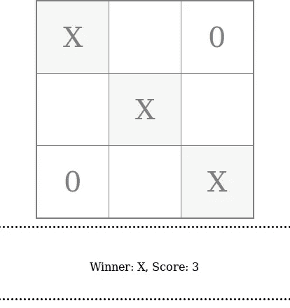
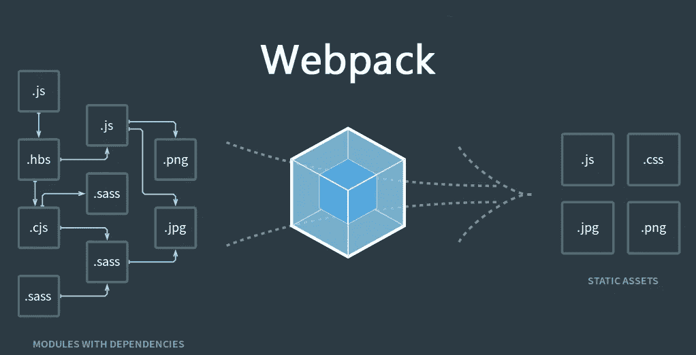
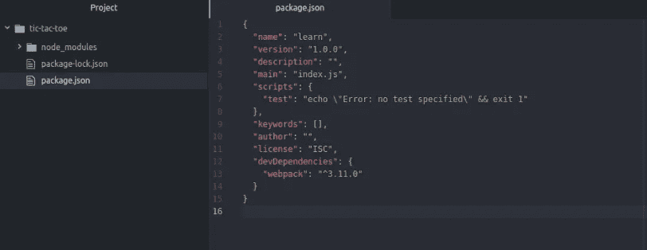
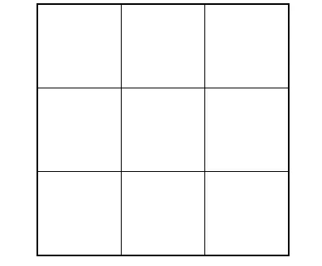
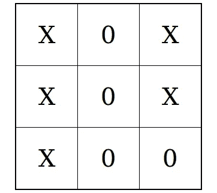

# 如何使用 ES6 和 Webpack 构建一个完整的 JavaScript 库

> 原文：<https://medium.com/hackernoon/a-complete-workshop-build-your-es6-code-into-a-library-using-webpack-80295faeb833>

大家好。我们将逐步开发一个 [JavaScript](https://hackernoon.com/tagged/javascript) 插件/库。在文章的最后，我们将完成构建一个 Js 插件，它将生成一个玩井字游戏的 UI。此外，在本课程结束后，您将有效掌握以下知识:

*   最常用的 [ES6(es2015)](https://en.wikipedia.org/wiki/ECMAScript) 核心特性
*   如何将你的 [ES6 代码](https://hackernoon.com/tagged/es6-code)转换成一个可以通过脚本标签使用的库
*   构建系统宽度 npm 和 webpack
*   使用下一代 JavaScript 和[单例设计模式](https://www.dofactory.com/javascript/design-patterns)构建任何 Js 插件的知识

> 你可以在 https://github.com/debabrata100/tic-tac-toe.git[找到本次研讨会的代码库](https://github.com/debabrata100/tic-tac-toe.git)

让我们看看最终版本:



我们的库将能够生成一个在 web 服务器上玩井字游戏的用户界面。

建成后，我们将按如下方式使用我们的库:

在上面的`**index.html**`文件中，一个外部脚本`***game-lib.js***` (我们最终要生成)会暴露一个全局对象**游戏**。

`index.html`文件中的以下代码片段将使用**游戏**对象初始化游戏:

```
Game.init({ container:"game_container", cellHeight: 100, cellWidth: 100});
```

*   **容器** : 取 html 元素的 css id 选择器的名称，该元素将包含游戏库提供的游戏 UI。
*   **cellHeight** :以像素为单位获取游戏中每个单元格的高度
*   **单元格宽度**:这是游戏中每个单元格的宽度，以像素为单位

要遵循的步骤:

*   项目目录结构
*   安装 webpack
*   开发库

# 目录结构:

我们将使用以下目录结构创建我们的项目

```
+ -- app
|    +-- index.js
| -- build
|    +-- game-lib.js
|    +-- game-lib.min.js
|    +-- index.html
```

**app** 文件夹包含生成库所需的源文件/模块。**构建**文件夹包含我们上面讨论过的**index.html**和两个库文件 lib.js 和 lib.min.js，这两个库文件是在捆绑源文件后生成的。

# 安装 Webpack

在 ES6(2015)之前，有如此多的模块系统来实现 JavaScript 的模块化。让我们看看 JavaScript 模块性的[演变。为了实现原生 JavaScript 的模块化，我相信 ES6 模块系统是迄今为止最辉煌的发现。但是它的大部分功能只被](https://github.com/myshov/history-of-javascript/tree/master/4_evolution_of_js_modularity)[少数现代浏览器](https://developer.mozilla.org/en-US/docs/Web/JavaScript/Reference/Statements/import#Browser_compatibility)支持。最流行的工具 [**webpack**](https://webpack.js.org/) **，**一个 javascript 模块捆绑器，它将具有依赖关系的模块作为输入，解析所有依赖关系并生成一个静态 Javascript 文件，在本例中为 game-lib.js/game-lib.min.js.



Webpack module bundler

还有一个痛点。ES6 的大多数特性，特别是箭头函数表达式、扩展操作符、析构函数并不被所有的浏览器支持。因此，我们需要一个 transpiler 将我们的 ES6 代码转换成所有浏览器都支持的较低版本。巴贝尔以最有效的方式完成了这项工作。它是 webpack 的扩展，也称为 [**加载器**](https://webpack.js.org/concepts/loaders/#using-loaders) **。【babel 和 Webpack 都被流行的 JavaScript 框架共同使用，如 [Angular](https://angular.io/) 、 [React](https://reactjs.org/) 、 [Vue js](https://vuejs.org/) 。**

# 开发库

**入门**

Webpack 约定:

*   Webpack 最适合 NPM
*   使用模块系统(ES6、[普通](http://www.commonjs.org/)、[和](http://requirejs.org/docs/whyamd.html#amd))

在继续之前，请确保您已经在系统中安装了 node 和 npm。如果没有，检查这个[连杆](https://nodejs.org/en/)。

检查节点和 npm 是否已安装

```
$ node -v
$ npm -v
```

让我们开始我们的工作，将项目目录创建为“井字游戏”并初始化 npm

```
$ mkdir tic-tac-toe
$ cd tic-tac-toe
$ npm init -y
{
  "name": "learn",
  "version": "1.0.0",
  "description": "",
  "main": "index.js",
  "scripts": {
    "test": "echo \"Error: no test specified\" && exit 1"
  },
  "keywords": [],
  "author": "",
  "license": "ISC"
}
```

$ **npm init -y** 命令使用默认配置的 package.json 文件创建一个节点项目。这个文件是一个 json 对象。我们将安装映射到这个 json 对象的依赖项。

安装 Webpack

```
$ npm install webpack --save-dev
```

现在在编辑器中打开您的项目。它看起来会像这样



project opened in atom editor

现在在根文件夹中创建一个名为 **build** 的文件夹。在 build 中创建我们的第一个名为 index.html 的文件。快速插入 html 标签。为标题标签提供标题井字符号。在头部分包含一个脚本标签，并提到一个相对于 src 属性的路径，如 *game-lib.js.* 并为游戏提供一个容器(game_container)，如下所示

```
<!DOCTYPE html>
<html>
  <head>
    <meta charset="utf-8">
    <title>Tic Tac Toe</title>
    <script src="game-lib.js" type="text/javascript"></script>
  </head>
  <body>
    <div id="game_container"> </div>
  </body>
</html>
```

在根目录下再创建一个文件夹 **app** 。在 app 内创建一个名为 **index.js** 的文件，并编写我们的第一个 JavaScript 代码，如下所示

```
let fun = ()=> {
  console.log("We are ready for Tic-Tac-Toe");
}
fun();
```

现在，在设置 webpack 之前，让我们在这里安装一些东西

```
$ npm install babel-core babel-loader babel-preset-es2015 webpack-dev-server babel-polyfill --save-dev
```

这里 **babel-loader** 将实际转换 ES6 代码， **babel-preset-es2015** 允许我们指定一个允许 ES6 转换的预设， **webpack-dev-server** 允许我们进行自动实时代码更新。要了解 [**巴别塔-聚宝盆**](https://babeljs.io/docs/usage/polyfill/) ，看看这些伟大的文章[什么是聚宝盆](https://remysharp.com/2010/10/08/what-is-a-polyfill)和[垫片](https://stackoverflow.com/questions/6599815/what-is-the-difference-between-a-shim-and-a-polyfill)，你就会对这些有具体的了解。

现在，为了让 webpack 工作，我们需要在根目录中添加一个名为 **webpack.config.js** 的特定文件。将以下代码添加到该文件中

在上面的配置文件中有一个名为 **config** 的对象。它拥有 5 个属性。让我们逐一讨论

**条目**:'。/path/to/my/entry/file.js。在我们的例子中，条目文件是 index.js，因为我们已经提到了相对路径。/app/index.js '

**输出**:这里我们需要提到与 webpack 如何发出结果相关的选项。我们提到的最终编译文件(游戏库)的名称为 ***文件名*** 属性，文件的位置在 ***路径*** 属性。该值应该是一个**绝对路径**。这里 *__dirname* 是当前模块范围内的全局变量，提供当前模块的父目录的绝对路径。

**模块**:这里需要提一下关于模块的配置。我们已经给出了装载机的配置。我们已经使用 babel-loader 来移植我们的代码。 ***测试*** 属性采用一个正则表达式来告诉哪种文件将通过这个加载程序运行，而 ***排除*** 是模块应该排除的文件。我们添加了要排除的 node_modules。

**预设**:这让我们可以使用 es2015(ES6)。如果我们想解析 jsx 代码，我们可以提到 [react](https://reactjs.org/) 。

**devserver** :用于创建 webpack 开发服务器，允许我们在 [http://localhost:3000](http://localhost:3000) 运行 web 服务器。 **inline** 属性为 true 允许我们运行自动实时代码更新。

现在我们已经准备好了 webpack。运行下面的命令，看看神奇之处

```
$ webpack
```

你将能够在 build 文件夹下看到一个名为 **game-lib.js** 的新文件，这是我们在 app 文件夹下的 index.js 文件中编写的代码的编译版本

上面的代码不是一个缩小的版本，我们将在研讨会结束时通过引入一个 webpack-production-config.js 文件来创建一个缩小的版本。

> 如果您想了解更多关于 webpack 的信息，[请点击此处](https://webpack.js.org/configuration/)了解最新的 webpack-4.0 功能和配置

现在让我们运行下面的代码

```
$ webpack-dev-server
```

这将生成一个开发服务器。导航到 [http://localhost:3000/](http://localhost:3000/) 并打开浏览器控制台。您将能够在浏览器控制台中看到消息“*我们准备好玩井字游戏了*”。

> 如果您正在使用我的 git 库，那么运行下面的代码来查看到目前为止我们已经达到的代码版本
> 
> $ git 克隆[https://github.com/debabrata100/tic-tac-toe.git](https://github.com/debabrata100/tic-tac-toe.git)$ CD 井字游戏
> $ git 结帐 b350603

## 添加库模板

现在在编辑器中打开 index.js 文件。我们应该创建一个**游戏**对象，并为其添加一个**初始化**方法

```
(function(window){
let _init = ()=>{};
    window.Game = {
       init:_init
    }
})(window)
```

在上面的代码中，我们使用了 IIFE(立即调用的函数表达式)。当试图避免污染全局名称空间时，经常使用这种模式，因为在 life 中使用的所有变量(像在任何其他普通函数中一样)在其作用域之外是不可见的。因此我们将*游戏对象*存储到**窗口**变量中，因为窗口变量是全局可用的。

如果你对**让**感到困惑，请访问此[链接](https://developer.mozilla.org/en-US/docs/Web/JavaScript/Reference/Statements/let)了解 ES6 魔法关键词*让*对抗 *var*

所以我们给 init 添加了一个 Window 对象和 init 方法。但是我们应该在游戏初始化时收到一些参数。让我们以 ES6 的方式在 init 方法中接收容器参数

```
(function(window){ const _init = ({container = ''})=>{
    let gameBody = document.getElementById(container);
    if(gameBody === undefined)
      gameBody = document.getElementsByTagName("body")[0];
      console.log("Game Initialised");
  }
  window.Game = {
    init:_init
  }
})(window)
```

您可能想知道在对象内接收 param container= ' '而不是 like container:' '。这就是 Es6 语法，又名 [**析构**](https://developer.mozilla.org/en-US/docs/Web/JavaScript/Reference/Operators/Destructuring_assignment) ，它接受 param 作为变量。这里，我们将默认值指定为空字符串。

我们将这个元素的 DOM 引用作为 *gameBody* 并且我们也检查了在这个未定义的情况下，我们将 document body 作为我们可以推送游戏 UI 的引用。用上面的代码更新 index.js。

## 初始化游戏

打开 index.html，在主体部分初始化游戏

```
<script type="text/javascript">
        Game.init({
            container:"game_container"
        });
</script>
```

那就跑

```
$ webpack-dev-server
```

导航到 [http://localhost:3000](http://localhost:3000) ，你会在控制台看到一条消息“游戏已初始化”

> 此时，您的代码应该与 my repository＄git check out 74c 3d AC 的以下提交相匹配

## 准备一个带有 html 表格的游戏板

我们将使用 document.createElement()方法创建一个 html 表格元素，并使用普通 javascript 向其添加 tbody、行和列

```
const _init = ({container = '',cellHeight = 50, cellWidth = 50})=>{
    let gameBody = document.getElementById(container);
      if(gameBody === undefined) // check whether element exist
        gameBody = document.getElementsByTagName("body")[0]; const tbl = document.createElement("table");
          const tblBody = document.createElement("tbody");
          for (let i = 0; i < 3; i++) {
              var row = document.createElement("tr");
              for (let j = 0; j < 3; j++) {
               let cell = document.createElement("td");
                cell.setAttribute("width",cellHeight+"px");
                cell.setAttribute("height",cellWidth+"px"); //setting styles for table cells
                cell.style.textAlign = "center";
                cell.style.cursor = "pointer";
                cell.style.fontSize = (cellHeight*0.4) + 'px'; row.appendChild(cell); // insert each cell to row
              }
              tblBody.appendChild(row);
          } tbl.appendChild(tblBody);
        gameBody.appendChild(tbl); // insert table to dom
        tbl.setAttribute("border", "1"); // setting styles for table
        tbl.style.borderCollapse = 'collapse';
        tbl.style.border = '2px solid #000';
        tbl.style.height = "auto";
        tbl.style.width = "auto";
        tbl.style.margin = "0 auto";
  }
```

在上面的代码中，我们创建了 9 列，并对其应用了一些样式。我们在 cellHeight 和 cellWidth 变量中添加了每个单元格的高度和宽度，这是我们在游戏初始化过程中收到的另外两个参数。我们将字体大小设置为单元格高度的 40%。

打开 index.html 文件并更新初始化

```
 Game.init({
         container:"game_container",
         cellHeight: 100,
         cellWidth: 100
  });
```

现在运行$ `webpack-dev-server `在浏览器窗口中，您会注意到创建了一个表



table for tic-tac-toe game created by the game library

> 此时，您的代码应该与 my repository＄git check out 0 FDE BC 2 的以下提交相匹配

## 使用 npm 创建 webpack 构建和开发服务器

NPM 提供了一个优秀的工具来执行脚本。我们可以同时运行$ webpack 和$ webpack-dev-server 命令，用一个命令代替

打开 package.json，在脚本属性下编写以下命令

```
"scripts": {
    "start": "webpack && webpack-dev-server"
 }
```

现在快跑

```
$ npm start
```

您会注意到我们的构建已经创建好了，并且在 [http://localhost:3000](http://localhost:3000) 启动了一个 web 服务器

要了解更多关于 npm 脚本的信息，请访问[https://docs.npmjs.com/misc/scripts](https://docs.npmjs.com/misc/scripts)

> 此时，您的代码应该与 my repository＄git check out c 7 D5 ca 7 的以下提交相匹配

## 点击事件时更新纸板

让我们初始化三个变量

```
// Put this code above outer for loop
let gameState = 0;
let cellIndex = 0;
let inputArray = [];
```

每点击一次单元格，gameState 就会增加，这可以给我们关于哪个玩家(‘X’或‘0’)点击的信息。

```
// Put this code inside inner 'for' loop
cell.setAttribute("index",(cellIndex++));
cell.addEventListener("click",()=>{
          let inputState = gameState % 2? 0: 1;
          let cellText = inputState == 1? 'X':'0';
          cell.innerHTML = cellText;
          inputArray[index] = inputState;
          gameState++;
})
```

在每个单元格中，我们存储每个单元格的索引作为属性，它等于当前单元格的游戏状态。 **inputArray** 用于存储每个单元格被点击时的状态。 **cellIndex** 和 **inputArray** 都将用于确定获胜者。

运行$ npm start，此时您应该能够在板上输入 0 或 X



接下来我们将决定获胜者。

> 此时，您的代码应该与 my repository＄git check out 5c 944 a 0 的以下提交相匹配

## 宣布获胜者

在 app 文件夹下新建一个名为 winner.js 的文件。这将是一个新的 ES6 模块。我们在这个模块中计算获胜者。我们将导出这个模块，以便在 index.js 中使用它，在这里我们可以创建这个模块的实例，并使用它来确定获胜者。

我们将利用 ES6 的另一个优秀特性，即类。

> 为了在 ES6 中展示类的概念，我在这里使用了类，否则为了维护单例设计模式，我们应该避免使用类。这是一篇很好的文章。

让我们创建赢家类

```
class Winner {
    constructor(){
      this._name = null;
      this._score = 0;
    }
}
export default Winner
```

在上面的代码中，我们创建了一个名为 Winner 的类，并添加了两个属性 _name 和 _score，它们最终将存储获胜者的名字(0 或 X)和分数

ES6 中有两种类型的导出

*   默认导出
*   命名出口

> 如果你想了解更多关于 ES6 导入，导出[这里](https://developer.mozilla.org/en-US/docs/web/javascript/reference/statements/export)是一篇[很棒的文章](https://hackernoon.com/import-export-default-require-commandjs-javascript-nodejs-es6-vs-cheatsheet-different-tutorial-example-5a321738b50f)

添加 getters 以访问名称和分数

```
get name(){
    return this._name;
}
get score(){
    return this._score;
}
```

现在转到 index.js 文件，编写代码来声明 winner

按如下方式导入顶部的模块**获胜者**

```
import Winner from './winner';
```

现在创建一个 winner 模块的实例

```
(function(window){let W = new Winner();---
--- 
---cell.addEventListener("click",()=>{
    let index = cell.getAttribute("index");
    if(inputArray[index] !== undefined || W.name)
      return;
    let inputState = gameState % 2? 0: 1;
    let cellText = inputState == 1? 'X':'0';
    cell.innerHTML = cellText;
    inputArray[index] = inputState;
    gameState++;
    let winner = W.findWinner(inputArray);
    if(winner.state == 0 || winner.state == 1){
        console.log("Winner",W.name);
    }
})
```

我们正在决定这份声明的赢家

let winner = w . find winner(input array)；

这意味着，我们需要在 Winner 类中定义一个 *findWinner* 方法，该方法将 inputArray 作为参数

```
findWinner(inputLines){
      const winningLines = [
        [0, 1, 2],
        [3, 4, 5],
        [6, 7, 8],
        [0, 3, 6],
        [1, 4, 7],
        [2, 5, 8],
        [0, 4, 8],
        [2, 4, 6],
      ];
      for (let i = 0; i < winningLines.length; i++) {
        const [a, b, c] = winningLines[i];
        // console.log(inputLines);
        if (inputLines[a] !== undefined && inputLines[a] ===      inputLines[b] && inputLines[a] === inputLines[c]) {
          this._name = inputLines[a] == 1 ? 'X': '0';
          this.calculateScore(inputLines,inputLines[a]);
          return {state:inputLines[a],lines:[a, b, c]};
        }
      }
      return {state:null,lines:[]};
    }
    calculateScore(inputLines,player){
      for(let i=0;i<inputLines.length;i++){
        if(inputLines[i] == player){
          this._score++;
        }
      }
    }
```

在上面的代码中，winningLines 存储了所有 8 种获胜单元格的组合。

我们已经遍历了赢线数组。对于每一次迭代，我们通过应用析构将每三个优胜行存储到 a、b、c 变量中

```
const [a, b, c] = winningLines[i];
```

我们已经定义了 calculateScore()方法，该方法采用两个参数“inputLines”和“player ”,并在下面一行中更新玩家的分数

```
this._score++;
```

findWinner()方法将在下面一行中更新获胜者的名字

```
this._name = inputLines[a] == 1 ? 'X': '0';
```

并返回获胜线的状态(0 或 1)和作为对象的获胜线，如下所示

```
return {state:inputLines[a],lines:[a, b, c]};
```

现在运行$ npm start 并玩游戏。您可以在控制台上看到获胜者

> 理想情况下，你不应该在入口模块**index.html**中放任何涉及游戏的代码。这个模块应该只包含公开游戏 Api 的代码(Game.init)。尝试将这段代码分离到一个名为 **GameBoard** 的独立模块中，该模块最终将被导入用于确定获胜者的获胜者模块中。在这种情况下，不需要将**输入数组**参数传递给 **findWinner** 方法，因为这可以通过 **GameBoard** 模块获得。我把这项工作留给你。

我们现在只剩下一个任务，那就是更新分数板，因为我们应该在网页上看到分数，而不是在浏览器控制台上

## 更新评分板

创建一个名为 score-board.js 的新文件，并在其中编写一个**记分牌**模块，如下所示

```
const ScoreBoard = {
      drawScore: ()=> {

      },
      declareWinner: ()=> {

      }
};
export default ScoreBoard;
```

这将有两个方法 drawScore 和 declareWinner。人们应该告诉哪些细胞是优胜线，后者应该打印一个网页的分数

检查以下代码中的方法定义

```
drawScore: (table, inputArray, winner)=>{
        table.style.opacity = "0.5";
        let cells = table.getElementsByTagName("td");
        let cellIndex;
        for(let c = 0;c < cells.length;c++){
            cellIndex = parseInt(cells[c].getAttribute("index"));
            if(inputArray[cellIndex] == winner.state && winner.lines.indexOf(cellIndex)!=-1 ){
                cells[c].style.backgroundColor = "#eee";
            }
        }
      },
      declareWinner: (W)=>{
        let scoreboard = document.createElement("div");
        scoreboard.style.margin = "auto";
        scoreboard.style.height = '100px';
        scoreboard.style.lineHeight = '110px';
        scoreboard.style.border = 'dotted';
        scoreboard.style.marginTop = '10px';
        scoreboard.style.width = (window.innerWidth-window.innerWidth*0.02)+'px';
        scoreboard.style.backgroundColor = "transparent";
        scoreboard.style.textAlign = "center";
        scoreboard.innerHTML = "Winner: "+W.name +", Score: "+W.score;
        document.body.appendChild(scoreboard);
      }
```

上面的代码不言自明。在 index.js 模块中导入此模块，并更新评分板，如下所示

```
let winner = W.findWinner(inputArray);
if(winner.state == 0 || winner.state == 1){
 ScoreBoard.declareWinner(W);
 ScoreBoard.drawScore(tbl, inputArray, winner);
}
```

至此，我们已经成功创建了井字游戏库。还剩一个任务。我们需要创建一个缩小版的图书馆。让我们创造它。

## 创建一个小型库

打开您的终端并安装这两个依赖项

```
$ npm install yargs strip-loader --save-dev
```

**Yargs** 通过解析参数和生成优雅的用户界面，帮助您构建交互式命令行工具。

**strip-loader** 是一个 webpack 加载器，可以帮助你剥离定制函数或调试语句

现在，在名为 webpack-production.config.js 的根文件夹中创建一个新文件，并添加以下代码

```
var WebpackStripLoader = require('strip-loader');
var devConfig = require('./webpack.config.js');
var stripLoader = {
 test: [/\.js$/, /\.es6$/],
 exclude: /node_modules/,
 loader: WebpackStripLoader.loader('console.log')
}
devConfig.module.loaders.push(stripLoader);
module.exports = devConfig;
```

在上面的代码中，我们已经编写了如何使用 webpack strip loader 从库中剥离 console.log 语句。

```
devConfig = require('./webpack.config.js');
```

上述语句在 production-config 中包含 webpack.config，这意味着在生产模式下，我们将使用 webpack-production.config

打开 webpack.config.js 文件，添加以下内容

在上面的代码中，uglify 插件帮助确定当前是否在生产模式下执行，如果是，那么 uglify 在 webpack 编译和捆绑期间负责缩小。

让我们更新 package.json 以接受生产配置，如下所示

```
"scripts": {
    "build": "webpack --config webpack-production.config.js --env dev && webpack --config webpack-production.config.js --env build",
    "serve": "webpack --env dev && webpack --env build",
    "start": "webpack-dev-server"
  },
```

我们添加了另外两个脚本命令

*   **构建**:在生产模式下运行
*   **服务**:以开发模式运行

我们可以按以下方式运行新的 npm 命令

```
$ npm run build
$ npm run serve
```

我希望现在，你已经准备好编写一个标准的 javaScript 插件了。

您可以克隆我的存储库来查看最终版本。

```
$ git clone [https://github.com/debabrata100/tic-tac-toe.git](https://github.com/debabrata100/tic-tac-toe.git)
```

谢谢:)