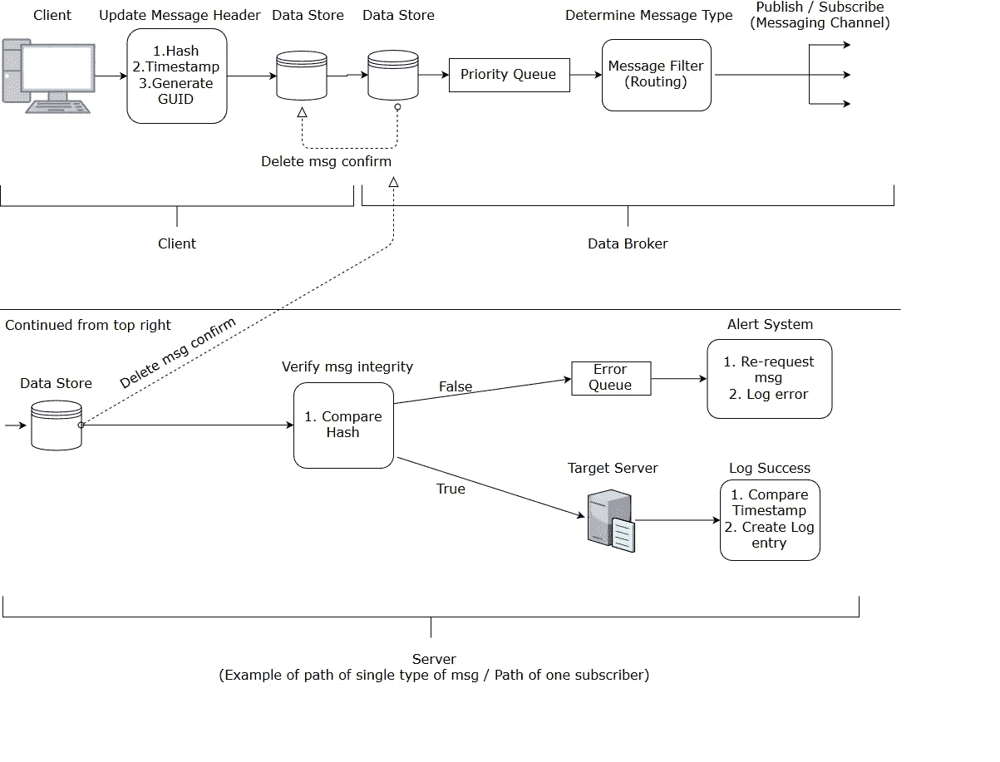

# 对编写 Bootcamp 后的生活的全面检查

> 原文：<https://medium.com/hackernoon/a-comprehensive-examination-of-life-after-coding-bootcamp-199e3d783c82>

I finally did it! I achieved my goal!

大约 10 个月前，我在没有任何技术经验的情况下开始了我的冒险之旅，并且刚刚获得了我的第一份工作，软件开发员。

我是如何做到的，我给别人的建议是什么？

这里有一些我会提醒其他人避免的陷阱和一些我鼓励你尝试的技巧。

# 返老还童！=放松

由于我在训练营期间工作非常努力，每个工作日持续学习 12-15 个小时，我说服自己毕业后有权休息一段时间。这个“假期”并不是一个有成效的假期，只是由糟糕的睡眠时间表和额外的媒体消费组成。

这件事对我影响如此之大的原因是因为我刚刚获得的编程技能变得迟钝。当我最终回到电脑前时，我用剩下的时间去申请工作和与招聘人员交谈。这没有给我留下太多的时间和精力来练习软件开发，结果我的技能大受影响。

虽然我肯定会鼓励训练营的毕业生通过做一些美好有趣的事情来奖励自己的英勇努力，但这种奖励需要有一个具体明确的开始和结束日期。理想情况下，这种奖励应该是有建设性的，能让你的思想、身体和灵魂恢复活力。滑雪或徒步旅行都是不错的主意，去热带海滩玩一周也不错。睡懒觉、吃披萨、看办公室就不那么理想了。

记住，这个奖励的目的不是变成一只树懒，你不是在奖励你自己，因为你“值得”。谨慎明智地奖励自己，让自己变得年轻、充满活力，这样你就可以带着生活的乐趣进入职业生涯的下一步。

# 专注！

一毕业，我就接了很多我无法应付的项目。首先，我想回到过去，巩固所有我不太有信心的技术。由于我们学习了 Python、Javascript 和 C#，这是一个不可能的顺序。除了重新学习 JavaScript 和 Python，我还想学习或参加 Git、公共演讲和手写方面的课程(以提高我的白板技能，使我的算法看起来不像猴子涂鸦)。除此之外，我还要整理和部署旧的任务，申请工作，为工作申请做编码挑战，做面试准备，参加社交活动，做新的个人项目。

很明显，这很荒谬。如此大的工作量，尤其是对于一个相对来说的新人来说(那时我只有 4 个月的软件经验！)是不可能的。再加上我的工作日长达 4 个小时，这是因为我“应该休息一下”而导致的可怕的睡眠时间表，你就会得到一个完美的灾难食谱。

我草率行事的结果是可以预料的。我没能掌握任何我希望掌握的新技能，而且我忘记了很多我最近学过的东西(C#/。网栈)。经过一两个月的这种倒退和破坏性的状态，我已经有效地将我的技能和能力恢复到非常原始的水平，尽管我仍然理解我所学的许多编程概念，并且可以阅读其他人的代码，但我几乎不能编写新的代码。

这个问题的答案就是专注！这也许是我学到的最重要的一课，也是我给出的最常见的一条建议。当你毕业时，不要试图学习一切！选择一个技术平台，把你的时间分配在申请工作和在这个平台上工作上。不要忽略这一堆中的任何一件物品太久，以免忘记。

由于你更加专注，你应该给自己机会更深入地钻研那些技术。比如，几个月后我下定决心选择 C#/。Net 作为我的重点领域，这意味着我将研究 ASP.NET MVC，Razor 视图，实体框架，SQL Server，就是这样！我早上花了一个小时用 JavaScript 做算法，并做了一点 jQuery 来使我的工作更具交互性，但我主要关注。网络堆栈。我现在有机会真正深入研究这些技术，了解它们的工作原理以及它们包含的一些更强大的工具。

记住，只关注一个堆栈，并深入研究它。不要从一种技术跳到另一种技术。

# 对求职的期望要合理

我将在这里谈几个因素。

## 我应该申请哪些职位？

当我毕业时，我感到非常困惑。我已经学了三大堆(Python、JavaScript 和 C#)，为什么我不能申请这三个领域的工作呢？好吧，你可以，但是就像我上面讨论的，你一定要专注于一个领域。

如果你正在申请工作，或者有招聘人员打电话给你，告诉你你决定不关注的技术方面的潜在工作机会，不管怎样，你都会忍不住去申请(“也许我会得到这份工作！”).当你开始在这些不相关的领域做面试准备或编码挑战时，问题就来了，因为这完全分散了你的注意力。我的建议是根本不要申请这些工作，或者如果你想申请，申请并在面试中让他们知道你没有专注于这些领域，但可以在展示你专注领域的能力时很快重新获得它们。我有几个朋友通过展示他们的 C#技能，找到了 Java 或其他语言的工作。一个好的公司要的是你思考和快速学习的能力，而不是你背了多少方法。

想象一下激光，如果你把光扩散到一个很大的区域，它不会穿透任何东西，但是，如果你把它集中到一个很小的区域，它会穿透得很好。这是我对申请哪些工作和如何学习的看法。

## 我需要多长时间才能找到工作？

我真的以为我会在毕业后一周内找到一份工作，最多两周。显然，这是一个疯狂的预测(我开始在这里看到一个模式……)。为此，我拒绝了申请开放的编码道场助教职位的机会，事后看来这是一个巨大的错误。我的那些一开始就成为助教的朋友们保持着他们的时间表，并且极大地增加了他们的知识和经验，此外还作为兼职员工赚取薪水。

正如 [@kale](http://twitter.com/kale) .miller96 在下面的评论中指出的，如果你加入一个非营利团队，或者只是为一家公司免费工作，它可能会对你有很大的好处。拥有这样的简历和实践经验真的可以让你在招聘人员和招聘经理的眼中变得合法。

我花了六个多月才得到这份工作。然而，我的经历可能不能最好地反映你的经历，因为由于我的完美主义，我也有很长一段时间几乎没有申请(“如果我不是世界历史上最好的开发人员，那么申请也没有意义……”)以及花几个月的时间重新学习 C#。

总之，我建议为你找到第一份工作做至少三个月的预算，包括经济上和情感上。

## 不仅仅是“一切照旧”。

我认为帮助我找到新工作的一个因素是，我愿意学习标准课程之外的东西(尽管这只是基于我的想法，还没有得到我的新雇主的证实)。我喜欢学习更多的理论和更高层次的概念，而不是简单地一遍又一遍地学习相同的基本算法。我花时间阅读了一些 Git 文档，学习了坚实的原理，并花了两天时间使用技术图表为一次工作面试设计了一个消息传递系统。

Messaging System designed using Enterprise Integration Patterns ([http://enterpriseintegrationpatterns.com/](http://enterpriseintegrationpatterns.com/))

虽然关注简单的编码行为可能很容易，但有时学习理论也很重要，尤其是我们这些新兵训练营的人没有大学教育背景。知道 JavaScript 通过值复制原始值，但是通过引用复制对象可能非常有用。

然而，在你求职的范围内，你可以提出你已经获得的更深入的知识，并以积极的方式让自己与众不同。这表明你对全面学习概念感兴趣，这可能会激起面试官对你的兴趣。

然而，小心不要掉进这个兔子洞太深。确保你在实际编码的同时学习更多的理论概念，这对你的软件开发生涯是非常宝贵的。

# 有一个时间表

我毕业后花了半年时间才找到工作。六个月！那是很长的时间！我的一些朋友也很难找到开发人员的工作，他们求助于其他与技术相关的职位，或者干脆放弃并转行。我不会指责任何人的选择，毕竟，每个人都有自己的个人情况，这可能有利于或可能不利于狭隘的长期求职。然而，如果你想坐在那里几个月，用你的头去撞求职的墙，你需要一个时间表和地方来实现它。

编码 Dojo 与校友有一个为期六个月的访问协议，我充分利用了这一点。每天早上我醒来，来到我坐着、学习、工作和修行的道场。道场的工作人员非常随和，只要我不打扰或打扰当前的学生，就允许我使用他们的空间。我甚至被允许重考 C#堆栈，并有条款禁止我干扰第一次学习 C #的学生。

能够置身于一个周围都是学习技术的人并且有时间表的环境中，真的帮助我坚持下来。

我的一些朋友觉得他们毕业后没有必要回到道场，最终失去了热情，花了很多时间玩电子游戏。因为我知道自己不够强壮，无法在家里工作而不分心，所以我知道有一个工作的地方，一个要求我穿成人服装的地方，对我的长期成功是不可或缺的。

我保持着正常的作息时间，就好像我在做一份正常的工作。我准时醒来(早上 5:30！)，学习，祈祷，然后去“工作”。下午 5-7 点，我要么去参加社交活动，去健身房，要么回家。在我学习和找工作的时候，建立和保持这种结构对帮助我防止精疲力尽是至关重要的。

# 包裹

这里有一个你从训练营毕业后应该做什么和不应该做什么的概要。

*   给自己一个有时间限制的奖励来完成你的计划。
*   确定你想关注的技术领域和你想申请的工作。
*   创建一个可维护的计划。
*   花一些时间学习高层次的概念。
*   每天找一个你可以工作的地方(不是在家里)。
*   预计找工作至少要花 3 个月的时间。
*   继续工作！

请记住，如果你感到气馁，不称职，或像一个骗子，不要！你已经取得了很大的进步，你的技能可能远远超出你的想象。不要期望自己完美，因为没有人是完美的。尽你所能努力工作，你一定会成功的！

祝你好运！