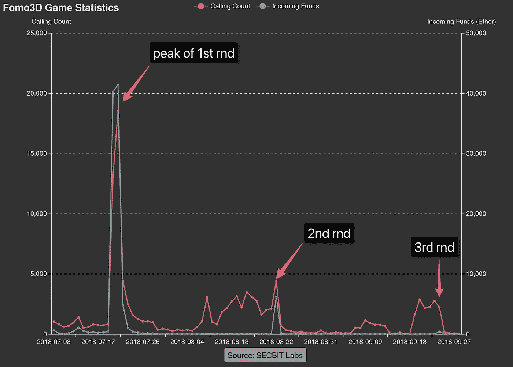
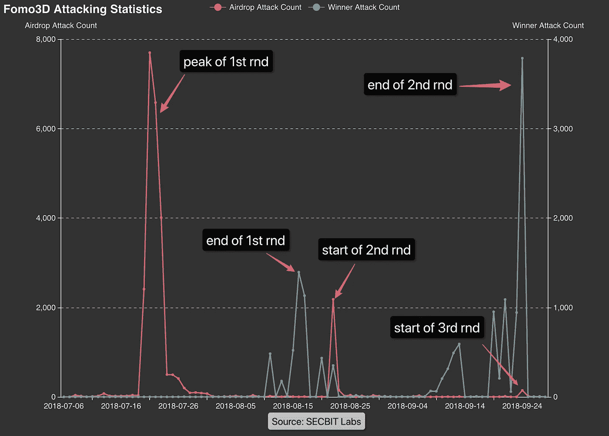

# Fomo3D 类游戏 bug 综合解决方案

> 原文：<https://medium.com/hackernoon/a-comprehensive-solution-to-bugs-in-fomo3d-like-games-ab3b054f3cc5>


Photo by [gustavo centurion](https://unsplash.com/photos/O6fs4ablxw8?utm_source=unsplash&utm_medium=referral&utm_content=creditCopyText) on [Unsplash](https://unsplash.com/@guustimutant?utm_source=unsplash&utm_medium=referral&utm_content=creditCopyText)

> *摘要:Fomo3D 及其追随者的失败与其智能合约设计中的 bug 高度相关。这里我们从*[](https://hackernoon.com/tagged/security)**的安全角度出发，对 Fomo3D 类游戏中的两个问题进行了详细的分析，并给出了几个实用的解决方案供大家参考。我们欢迎任何感兴趣的人加入我们的社区进行进一步的讨论。**

# *黑客攻击导致的 Fomo3D 类游戏的没落*

*Fomo3D 已经进入第三轮了。根据 10 月 9 日格林威治时间 2:00 的数据，这个池子只抽取了 103.4482 乙醚。总量不到 800 个乙醚加上上一轮的 680 个乙醚，与前几轮相比，这是一个巨大的衰退。*

*SECBIT Labs 曾经发表过一篇文章，分析了 Fomo3D 类游戏的情况，供大家参考[【1】](#96ca)。*

**

**Pic 1: Fomo3D player participation and funds statistics**

*上图是 Fomo3D 玩家参与比例和资金比例。红线代表参与人数，蓝线代表进入游戏合约的资金总和。高峰在左侧，准确的说是 7 月 20 日和 21 日。这段时间无数媒体报道了 Fomo3D。许多人跟随其他人加入游戏，参与者人数和资金达到最高峰，超过 18，000 人和 40，000 人。在峰值之后，Fomo3D 急剧渐变，于 8 月 22 日结束了第一轮，进入第二轮，而热度再也无法恢复。*

*然而，黑客们并没有就此罢休。*

**

**Pic 2: Attacking statistics on Fomo3D**

*上图是对 Fomo3D 的攻击汇总。一些黑客利用**空投 bug** 攻击游戏，在第一轮巅峰和第二轮开始时收获颇丰[【2】](#53b6)。此外，在第一轮和第二轮即将结束时，黑客们正在利用交易**阻止**攻击，以获得赢得最终大奖的机会[【3】](#7cb6)。*

*Fomo3D 并不孤单——其他模仿者也是黑客的目标。*

*Fomo3D-like games*

*Fomo3D 的设计是通过用乙醚购买钥匙来参与，最后购买者赢得**最终大奖**，同时，参与者还有机会不时赢得**空投奖励**。这两种奖励是对参与者的激励，通过随机性和竞争性使游戏更有趣，吸引更多的参与者和以太来延长游戏长度。*

*然而事情并没有像预期的那样发展。由于合同代码中的漏洞，黑客可以应用特殊技术不断获得高可能性的**空投奖励**，而**最终奖励**会被黑客窃取。普通参与者很难赢得奖品，并希望提前进入可以从追随者那里受益。然而,**两个基本机制已经失效,**游戏无法持续吸引更多资金。恶性循环开始存在。*

*那么黑客是如何利用这两个 bug 的呢？发展团队有出路吗？*

# *空投臭虫*

*先看看空投奖励。*

*进入游戏的所有醚的 1%将被引导到次要池。赢得空投的可能性从 0 开始，每下一个价值不低于 0.1 以太的订单，增加 0.1%。此外，空投数量与订单有关，例如，购买 0.1–1 乙醚可能会赢得 25%的乙醚。付出越多，回报比例越大。游戏用户界面将显示当前获胜的可能性和未成年人池的数量。*

*Fomo3D airdrop 实现有两个 bug:*

1.  *合同随机数是可预测的*
2.  *确定呼叫者是否是合同地址的方法不可靠*

*空投依赖于由合同代码中的`airdrop()`控制的智能合同内部生成的随机数。*

```
*/**
    * @dev generates a random number between 0-99 and checks to see if thats
    * resulted in an airdrop win
    * @return do we have a winner?
    */
function airdrop()
    private 
    view 
    returns(bool)
{
    uint256 seed = uint256(keccak256(abi.encodePacked(

        (block.timestamp).add
        (block.difficulty).add
        ((uint256(keccak256(abi.encodePacked(block.coinbase)))) / (now)).add
        (block.gaslimit).add
        ((uint256(keccak256(abi.encodePacked(msg.sender)))) / (now)).add
        (block.number)

    )));
    if((seed - ((seed / 1000) * 1000)) < airDropTracker_)
        return(true);
    else
        return(false);
}*
```

*`airdrop()`中的随机数`seed`是由块信息和交易调用者地址计算出来的，很容易预测[【4】](#1ac4)。*

*Fomo3D 开发团队还应用`isHuman()`阻止契约加入 Fomo3D 游戏自动攻击，并预测有契约的随机数。*

```
*/**
    * @dev prevents contracts from interacting with fomo3d 
    */
modifier isHuman() {
    address _addr = msg.sender;
    uint256 _codeLength;

    assembly {_codeLength := extcodesize(_addr)}
    require(_codeLength == 0, "sorry humans only");
    _;
}*
```

*这里我们可以看到另一个常见的错误。`extcodesize`运算符用于获取目标地址的代码大小。已部署合同的地址与特定代码相关联，因此`extcodesize`大于 0。许多人使用这种方法来确定目标地址是否是契约，Fomo3D 依靠它来防止契约调用某些函数，但这是一种不可靠的方法——在构造函数中调用函数可以绕过这种限制。构造合同时，地址不与任何代码关联，并且`extcodesize`为 0[【5】](#b9b7)。*

*通过结合这两个漏洞，黑客获得了建立攻击合同和预测随机数的权限，从而大大增加了他们获胜的机会。*

# *如何修补空投 Bug*

*那么应该怎么做才能解决 Fomo3D 空投 bug 呢？*

*只有利用前面陈述的两个 bug，黑客才能攻击成功。因此，我们只需要实现两个补丁中的一个:*

1.  *防止智能合约中的随机数预测*
2.  *用更安全的方法确定调用方是否是一个协定*

# *补丁一:防止智能合约中的随机数预测*

*先从随机数预测开始。*

*智能合约中的随机数很容易预测，因为任何人都可以访问随机种子。**攻击者可以构建一个恶意契约**，在完全相同的环境中执行随机数生成公式，以获得随机数来进行下一步操作。*

*智能合约的几乎每个变量都是公开的，生成公式要求每个节点的结果之间保持一致。因此，很难找到一种简单的方法来生成不可预测的随机数。*

*尽管如此，还有其他实用但复杂的解决方案。开发人员可以提交和揭示，或推迟几个块。此外，我们可以引入外部 oracles，比如 Oraclize 和 BTCRelay[【6】](#59dc)。*

*结合 Fomo3D 机制，SECBIT Labs 这里介绍一种利用当前/未来块[【7】](#c2e3)的**哈希值的方法。***

*以太坊智能合约可以调用`block.blockhash()`来获取特定块的哈希值。接受的参数是除当前块之外的最近 256 个块的块高度之一。如果传递其他值，则返回 0。*

*常见的不可靠随机数计算将读取先前块`block.blockhash(block.number-1)`的散列作为随机种子。在约定内调用`block.blockhash(block.number)`将返回 0。我们无法在约定中获取当前块哈希，因为在矿工打包和执行事务之前，尚未计算该值。**因此，可以有把握地说，当前块散列是未来的，不可预测的**。*

*当玩家第一次购买钥匙并获得唯一 id 时，我们可以将地址和**当前块高 N** 保存到一个数组中(如下面的`_purchase()`所示)。*

```
*function _purchase(address user) internal {
    Purchase memory p = Purchase({
        user: user,
        commit: uint64(block.number),
        randomness: 0
    }); uint id = purchases.push(p) - 1; emit KeysPurchased(id, user, packCount);
}*
```

*玩家可以在接下来的 255 个区块中使用他们的 id，并且高度为 N 的区块的哈希值可用于随机数生成，以确定是否有一个玩家赢得奖励(如下面的`_airdrop()`所示)。*

```
*function _airdrop(uint id) internal returns(bool) {
    Purchase storage p = purchases[id]; require(p.randomness == 0);
    require(block.number - 256 < p.commit);
    require(uint64(block.number) != p.commit);
    require(p.user == msg.sender); bytes32 bhash = blockhash(p.commit);
    uint seed = uint(keccak256(abi.encodePacked(bhash, p.user, id)));
    p.randomness = seed; if((seed - ((seed / 1000) * 1000)) < airDropTracker_)
        return(true);
    else
        return(false);
}*
```

*玩家加入游戏时产生的区块散列在 255 个区块后不再可用。所以一定要通知玩家在一个时间范围内查奖，及时领奖。当然，如果球员错过了，我们可以再给一次机会。更多技术细节可在我们的技术社区获得。*

*这种方法在著名的[区块链](https://hackernoon.com/tagged/blockchain)卡牌游戏《被解放的神》中也被应用，用来控制玩家购买的稀有卡牌。当然，根据相同的原理[【8】](#9402)，我们可以在当前高度之后使用给定数量的块哈希值(例如 5)作为随机种子。*

# *补丁二:用更安全的方法确定调用者是否是契约*

*另一个问题是如何确定来电者是否为合同地址。*

*我们可以用简单有效的方法解决这个问题。*

```
*modifier isHuman() {
    require(tx.origin == msg.sender, "sorry humans only");
    _;
}*
```

*以太坊开发最佳安全实践建议不要使用`tx.origin`，因为许多开发人员不知道`tx.orign`和`msg.sender`之间的区别。`tx.orign`代表一个事务的调用方，`msg.sender`代表每个合同调用的调用方。*

```
*A -> B -> C*
```

*例如，用户 A 调用合同 B and B 调用合同 C。合同 C 中的`msg.sender`是 B，而`tx.origin`是 A。`msg.sender`可能是合同，而`tx.origin`永远不会是合同。因此，上述方法可以有效地限制合同调用合同。*

# *事务阻塞错误*

*是时候检查最后的奖品了。*

*类似 Fomo3D 的游戏有倒计时——每轮结束前最后一个购买钥匙的人将赢得泳池中近一半的醚，因此许多玩家会在接近结束时购买钥匙，希望成为最后一秒被矿工打包的幸运儿。*

*普通人在回合结束时采用类似的策略:检查倒计时，提高油价，买钥匙，闭上眼睛祈祷获胜；然而，这种策略不太可能给你带来回报。*

***根据 SECBIT Labs 的分析，前两轮 Fomo3D 的获胜者采用了相同的攻击技术——在接近尾声时进行攻击交易。***

*胜利者(黑客)调用部署的攻击契约中的`getCurrentRoundInfo()`并检查**回合结束**和**当前玩家的线索地址**。当剩余时间达到一个阈值并且最后一个买家是黑客本身时，那么合同将调用`assert()`以使交易失败并消耗所有气体；否则，它将什么也不做，消耗很少的气体。*

*赢家(黑客)正是使用了这种方法，触发了大量易变的神秘交易:**当黑客极有可能成为赢家**时，抽取矿池，用高气价包装黑客的交易，并占领后续区块，导致其他购买钥匙的交易无法正常打包，**加速游戏结束**，提高获胜几率。*

*接近回合结束时，普通玩家可以手动或通过脚本购买高油价的钥匙。黑客方法比这些常规策略高明得多。*

# *如何解决事务阻塞*

*实际上，这个问题不仅威胁着 Fomo3D 类游戏。所有要求玩家在一定时间范围内竞争的游戏也会受到威胁。在游戏中总会有黑客使用前面描述的方法，只要游戏奖金高并且**奖励比成本**多得多。*

# *补丁一:提高攻击成本*

*为了摆脱这个问题，SECBIT Labs 建议游戏开发者不要把游戏获胜和倒计时联系起来，尽量减少**通过攻击**获得奖励的机会和**攻击**的欲望。*

*例如，我们可以修改规则，因为最后一个买家赢得奖品的概率相对较低，比如 5%。当时间结束时，由于概率原因，奖品没有显示，合同将增加倒计时时间。因此，黑客并不一定能通过拦截赢得奖金，而交易**拦截攻击会耗费太多的汽油，使黑客无法继续攻击**。*

```
*function buyCore(...)
    private
{
    ...
    // check to see if end round needs to be ran
    if (_now > round_[_rID].end && round_[_rID].ended == false) 
    {
        // check to see whether or not this round should end
        if shouldRndEnd(lastCommitId) (
            // end the round (distributes pot) & start new round
            round_[_rID].ended = true;
            _eventData_ = endRound(_eventData_);
            ...
        ) else {
            ...
            updateTimer(_keys, _rID);
            ...
        }
    }
    ...
}*
```

*下面是一个代码示例。`shouldRndEnd()`控制结束时的概率来决定游戏结束时间，这是依靠不可预测的随机数，参考**控制空投的先验码**。*

# *补丁二:禁止调用信息查询接口的合同*

*Fomo3D 攻击的另一个原因是游戏契约的信息查询接口，它可以被任何地址调用。黑客们现在可以不断地查询游戏，并选择不同的策略以最小化成本和最大化获胜机会。*

```
*modifier isHuman() {
    require(tx.origin == msg.sender, "sorry humans only");
    _;
}function getCurrentRoundInfo()
    isHuman()
    public
    view
    returns(...)
{
    ...
}*
```

*相应的，Fomo3D 的另一个补丁就是把上面说的 safe `isHuman()`应用到`getCurrentRoundInfo()`上，防止契约自动攻击。*

# *结论*

*由于安全和公平方面的问题，Fomo3D 及其模仿者更有可能成为黑客的金矿，而不是吸引更多的普通玩家。玩家的数量会一轮接一轮地减少，衰退还在继续。*

*SECBIT Labs 建议后来者借鉴，避免抄袭代码，避免只靠 PR 吸引人。做一些改变，智能合同安全性将大幅上升，为未来的分散游戏开发。*

# *参考*

*   *[1]黑客再次获得 Fomo3D 大奖——机制漏洞导致的降级(中文)，[https://zhuanlan.zhihu.com/p/45330743](https://zhuanlan.zhihu.com/p/45330743)，2018/09/25*
*   *[2]区块链史上最大智能合约攻击曝光— Part 1，[https://medium . com/@ anchain . ai/Largest-Smart-Contract-Attacks-in-区块链-History-Exposed-Part-1-93b 975 a 374d 0](/@anchain.ai/largest-smart-contract-attacks-in-blockchain-history-exposed-part-1-93b975a374d0)，2018/08/22*
*   *[3]中奖者如何获得 Fomo3D 大奖—详解，[https://medium . com/coin monks/How-the-winner-get-fomo 3d-prize-A-Detailed-explain-b 30a 69 b 7813 f](/coinmonks/how-the-winner-got-fomo3d-prize-a-detailed-explanation-b30a69b7813f)，2018/08/23*
*   *[4]如何 PWN FoMo3D，初学者指南，[https://www . Reddit . com/r/ether eum/comments/916 xni/How _ to _ PWN _ fomo 3d _ a _ 初学者指南](https://www.reddit.com/r/ethereum/comments/916xni/how_to_pwn_fomo3d_a_beginners_guide)，2018/07/23*
*   *[5]使用 EVM 汇编获取地址'码大小，[https://ether eum . stack exchange . com/questions/14015/Using-EVM-assembly-to-get-the-address-code-size](https://ethereum.stackexchange.com/questions/14015/using-evm-assembly-to-get-the-address-code-size)，2017/04/07*
*   *[6]预测以太坊智能合约中的随机数，[https://blog . positive . com/Predicting-Random-Numbers-in-ether eum-Smart-Contracts-e 5358 c6b 8620](https://blog.positive.com/predicting-random-numbers-in-ethereum-smart-contracts-e5358c6b8620)，2018/02/01*
*   *[7]在 winsome . io-Future block hashes 上生成随机数，[https://blog . winsome . io/Random-Number-Generation-on-winsome-io-Future-block hashes-Fe 44 B1 c 61d 35](https://blog.winsome.io/random-number-generation-on-winsome-io-future-blockhashes-fe44b1c61d35)，2017/05/07*
*   *[8]诸神被解放，[https://ethers can . io/address/0x 482 cf 6a 9 d6b 23452 c 81d 4d 0 f 0f 139 c 1414963 f 89 #代码](https://etherscan.io/address/0x482cf6a9d6b23452c81d4d0f0f139c1414963f89#code)，2018/07/16*

*[***sec bit***](https://secbit.io)*由一群加密货币爱好者创立。我们正在研究智能合同安全、智能合同形式验证、加密协议、编译、合同分析、博弈论和加密经济学。**