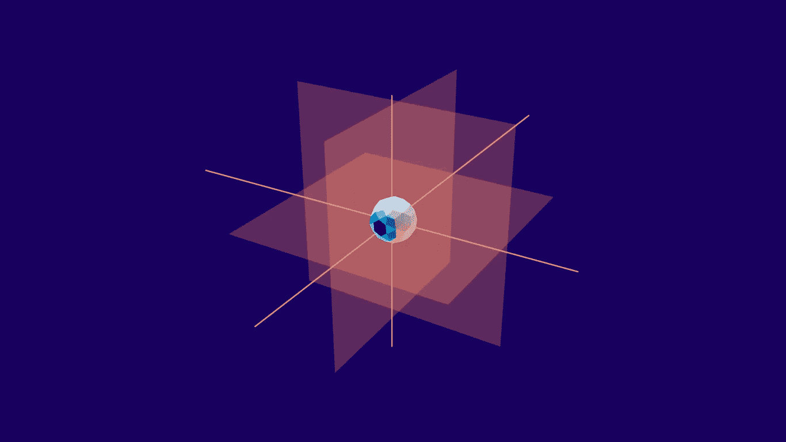
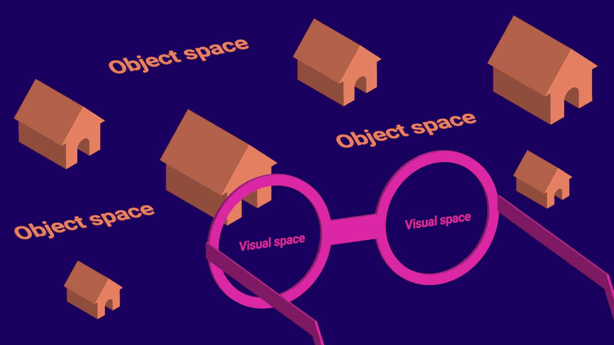
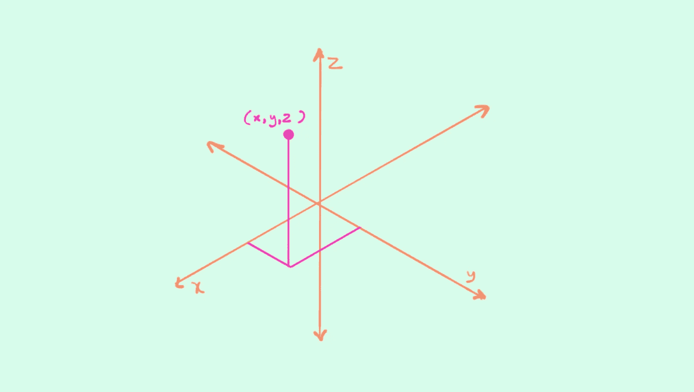
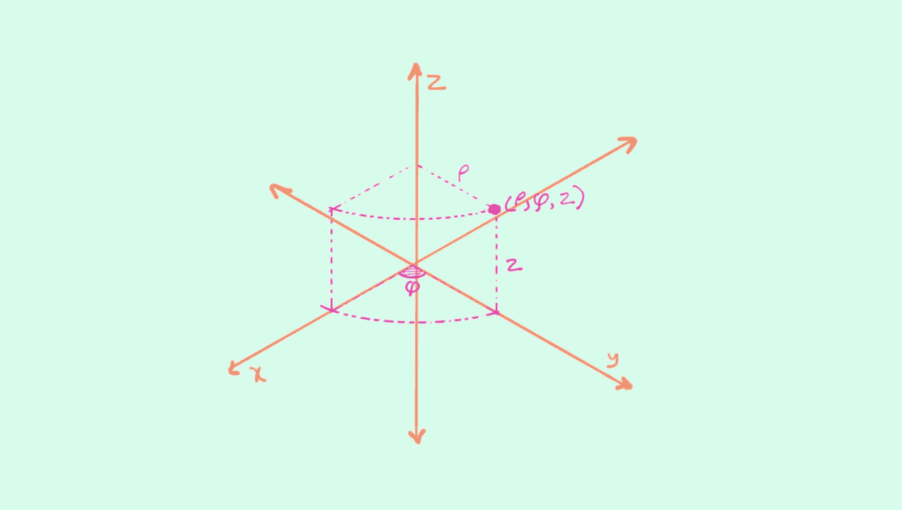

# 计算机对增强现实空间的理解

> 原文：<https://medium.com/hackernoon/a-computers-understanding-of-space-for-augmented-reality-c0fd40a52900>

增强现实的目标是将计算机对空间的感知与人类对空间的理解相叠加。在计算机科学中，空间仅仅是一个隐喻，是对空间、时间和物质的普遍认同和科学验证的概念。计算机对空间的理解只不过是物体、位置和物质的数学定义的 3D 表示。它可以简单地通过坐标系统来理解，而不需要像超现实或交替宇宙这样令人困惑的术语。虽然这些绝对是有趣的思想实验。虚拟空间只不过是计算机对人类提供的真实世界的理解。

人类是空间生物。我们与大部分三维现实互动并理解它们。随着增强现实试图将虚拟世界模拟到人类现实中，理解虚拟 3D 空间的基本方面是很重要的。

# **视觉空间和物体空间**

我们所感知的物体在环境中的位置是视网膜上光模式的重建。计算机图形学中的视觉空间可以被定义为参与者正在体验的 3D 虚拟空间的感知空间或视觉场景。

物体存在的虚拟空间被称为**物体空间**。它是视觉空间的直接对应物。

每只眼睛看到的视觉空间不同。对于双目虚拟设备或智能眼镜来说，这是计算机图形学的一个关键挑战。为了设计虚拟世界，对虚拟物体在现实世界中的位置和方向有一个共同的理解是很重要的。通用坐标和定向系统在这方面很有帮助。

# **位置和坐标**

三种类型的坐标系用于虚拟和增强现实应用的布局和编程:

## **笛卡尔坐标**

笛卡尔坐标系主要是因为它的简单和熟悉而被使用，并且大多数虚拟空间都是由它定义的。基于 x-y-z 的坐标系对于在虚拟空间中指定 3D 对象的位置是精确的。三个坐标平面相互垂直。距离和位置从原点指定，原点是三个平面彼此相交的点。该系统主要用于定义三维物体的视觉坐标。

Cartesian Coordinates

## **球面极坐标**

笛卡尔系统通常相对于原点来定义 3D 对象的位置。当相对于用户的位置定位物体和特征时，使用球形极坐标系统。该系统主要用于虚拟声源的映射，或者在基于第一人称的沉浸式 VR 的情况下用于球形视频的映射。球面坐标系基于平分球体的垂直平面，由三个元素组成:方位角、仰角和距离。方位角是水平面/地平面中与原点的角度，而仰角是垂直面中的角度。距离是距离原点的大小或范围。

Spherical Polar Coordinates

## **圆柱坐标**

该系统主要用于观看 360 度全景的 VR 应用。圆柱形系统允许静态图像的精确映射和对齐，以重叠全景图中的边缘拼接。该系统由带原点(O)的中心参考轴(L)组成。径向距离( *ρ* )由原点(O)定义。角度坐标( *φ* )定义为径向距离( *ρ* )和高度(z)。虽然这个系统对于需要旋转对称的场景是很好的，但是它在垂直视图方面是有限的。

Cylindrical Coordinates

# **定义方向和旋转**

有必要定义用户视点和对象的方向和旋转以及它们在虚拟空间中的位置。当跟踪用户正在看哪里或者知道虚拟物体相对于视觉空间的方向时，知道该信息尤其重要。

## **六个自由度**

在虚拟和增强现实中，通常用三个独立的值来定义方向和旋转。这些被称为滚转(x)、俯仰(y)和偏航(z ),并且是已知的方位角。位置(x-y-z)和方向(滚动-俯仰-偏航)的组合被称为六个自由度(6 DOF)。

Orientation and Rotation

# **导航**

导航和寻路是虚拟空间中最复杂的两个概念，尤其是对于 VR 和 AR。它可以通过用户在真实空间中的物理移动来处理，或者通过使用控制台来穿越更大的距离。例如，物理运动可能指的是在像使命召唤这样的游戏中射击时的手和腿的运动，而虚拟运动则指的是玩家前往敌人的基地。有大量的设备可以实现从键盘、游戏控制器到多方向跑步机的虚拟运动。一个单一的通用界面来导航虚拟和物理空间可能是导航控制器设计的圣杯。

**参考文献:**
1。[增强人类——海伦·帕帕吉安尼斯](https://amzn.to/2C7k3c3)2。[实用的增强现实——史蒂夫·奥克斯塔卡尼斯](https://amzn.to/2C6XDHR)

**相关文章:**
1。[人眼对增强现实空间的理解](/@akshaykore/human-eyes-understanding-of-space-for-augmented-reality-d5ce4d9fa37b)
2。[增强现实中的一台机器和人类对世界的感知](https://hackernoon.com/a-machine-and-humans-perception-of-the-world-in-augmented-reality-2342f4a6750)
3。[增强与虚拟现实显示技术基础](https://hackernoon.com/fundamentals-of-display-technologies-for-augmented-and-virtual-reality-c88e4b9b0895)
4。[AR 装置的种类](https://uxplanet.org/augmented-reality-device-types-a7668b15bf7a)
5。[增强视觉的积木](https://uxplanet.org/building-blocks-for-augmented-vision-cc9b6172b461)
6。我们增强世界的未来。[计算机对增强现实空间的理解](https://uxplanet.org/a-computers-understanding-of-space-for-augmented-reality-c0fd40a52900)

**如果您喜欢这篇文章，请点击👏按钮(一次、两次或更多次)。
分享帮别人找！**