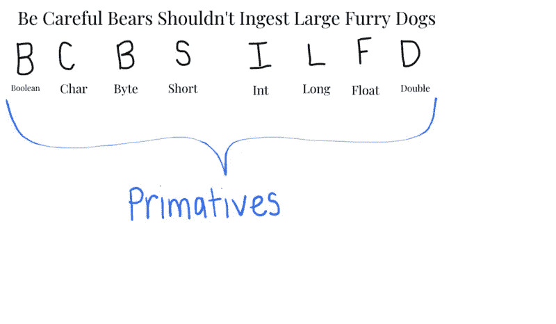
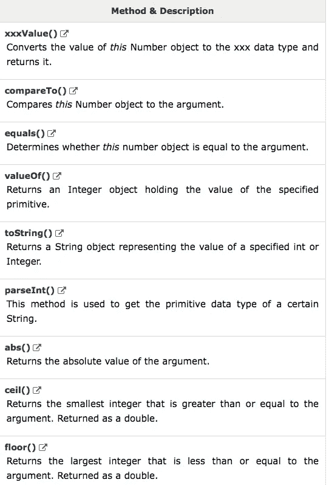
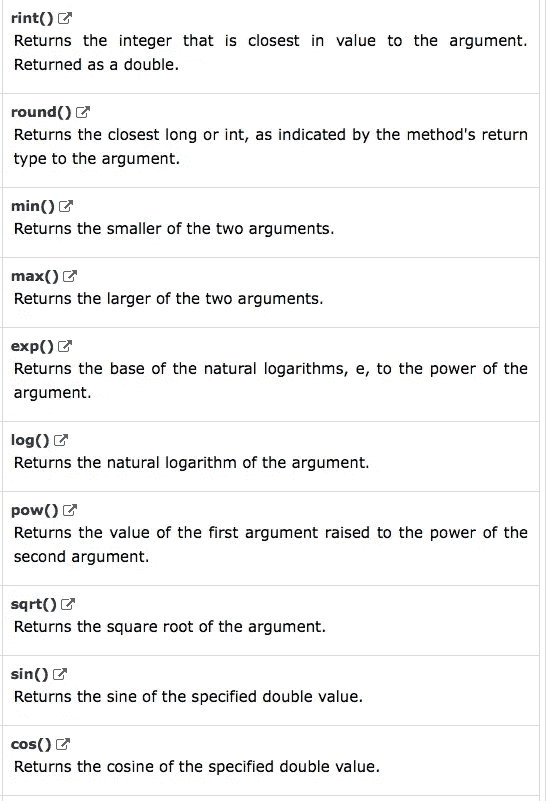
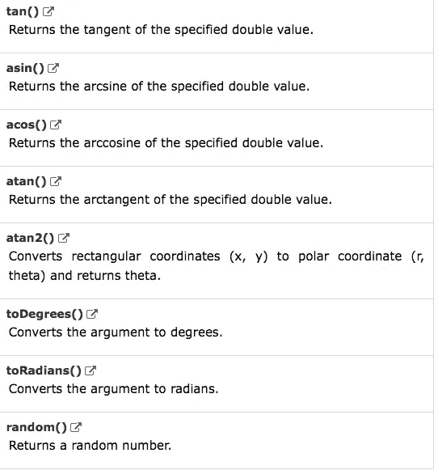

# 一个比穴居人更原始的概念

> 原文：<https://medium.com/hackernoon/a-concept-more-primitive-than-the-cavemen-b167acd9e4e>


**标题是骗人的。**

然而，这个概念在 [Java](https://hackernoon.com/tagged/java) 中是一个[原始概念](https://hackernoon.com/tagged/primitive-concept)。在我们深入研究原始数据类型的概念之前，先喝杯 Java 吧。



Boolean、char、byte、short、int、long、float 和 double 都是 Java 中的基本数据类型。这些都是 Java 知道的词。这些值存储在[堆栈](https://dzone.com/articles/stack-vs-heap-understanding-java-memory-allocation)中，而不是[堆](https://dzone.com/articles/stack-vs-heap-understanding-java-memory-allocation)中。堆栈上的变量可以直接从内存中访问，运行速度非常快。对象在堆上，需要更多的时间来访问。

Java 中的每个基本类型都有一个包装类。

*   `short`有`Short`
*   `int`有`Integer`
*   `long`有`Long`
*   `boolean`有`Boolean`
*   `char`有`Character`
*   `float`有`Float`
*   `double`有`Double`
*   `byte`有`Byte`

包装器附加了一些基本类型没有的方法。这些包括…



Image from tutorialspoint.com



Image from tutorialspoint.com



Image from tutorialspoint.com

包装类是原语，在内存中的存储方式也不同。包装类存储在[堆栈](https://dzone.com/articles/stack-vs-heap-understanding-java-memory-allocation)中，作为对[堆](https://dzone.com/articles/stack-vs-heap-understanding-java-memory-allocation)中对象的引用。

```
class PrimitivePost
{
 public static void main(String args[]) 
 {
 //declearing a boolean, this returns true or false
 boolean t = true;
 // declaring character
 char a = ‘G’;
 // declaring byte
 byte b = 4;
 // declaring short
 short s = 56; // declaring int 
 int i=89;
 //declaring a long
 long l = 244843984;
 // declaring a float — for float use ‘f’ as suffix
 float f = 4.7333434f;

 // declaring a double — default fraction value is double in java
 double d = 4.355453532;

 System.out.println(“boolean: “ + t);
 System.out.println(“char: “ + a); 
 System.out.println(“byte: “ + b); 
 System.out.println(“short: “ + s); 
 System.out.println(“int: “ + i);
 System.out.println(“long: “ + l);
 System.out.println(“float: “ + f); 
 System.out.println(“double: “ + d); 
 } 
}
```