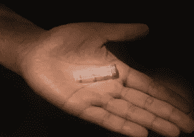

# 存储密码的好方法

> 原文：<https://medium.com/hackernoon/a-cool-way-to-store-crypto-ccfcf6eb380>

## …尤其是长期而言

And that’s how your cryptocurrency is stored

所有人最终都同意，区块链和加密货币将继续存在。渐渐地，我们开始对那些说‘我喜欢区块链，但不喜欢加密货币’的人一笑置之。新体系不仅挑战了传统的金融理念，也挑战了治理理念。

随着加密市场逐渐复苏，生态系统的真正信徒不仅应该是 hodl，还应该在加密货币的全球采用中发挥作用。我为什么要做评论？这是为了给区块链生态系统中即将到来的项目一个繁荣和成功的机会。因此，当我遇到一些人(我可以理解)试图做一些有目的的负责任的事情时，我非常乐意给他们一点曝光率，只要我证实并看到风险是有目的的、负责任的和相关的。

自从比特币被发明以来，加密货币的存储就已经是一件事情了。几乎每个月都会有关于生态系统中黑客或骗局的新闻。人们以不同的方式保护自己，然而，也有损失或死亡的问题。**想象一下，一个拥有大量密码的人死了，没有人知道他的私钥。**这可能会很烦人。但是有一个解决存储问题的创新方案。

该公司名为[卡弗](https://www.carverr.com/)，由维沙尔·布扬创建并领导。他们所做的是将你的代码(可能是私人密钥、密码短语、通行码等)从数字信息转换成生物信息。你的代码将被储存在合成 DNA 链中。你发送给他们的任何代码都不会被他们验证。他们不在乎是什么。出于安全考虑，他们要求通过加密电子邮件向他们发送数据。他们所做的就是把数字代码转换成一串碱基(由 A，C，T 和 G 组成)。检查代码的准确性，然后为其制造 DNA 链。就这么酷。

基本上，这对于拥有大量密码并且可能想要长期保存的人来说是很重要的。服务器将被淘汰，硬件钱包将需要更新，但 **DNA 链将保持原样，只要它被正确存储**。这似乎是迄今为止最安全的冷藏方法。

There are a quadrillion copies of the code in this tube

公司可以为您储存试管，您也可以选择自己接收并储存。**您可以随时要求取回您从 DNA 链发送的代码，公司将在 48-72 小时内完成此事**。如果合成 DNA 和你在一起，显然需要更长的时间。试管必须储存在 4°c 的温度下。一种不需要特殊温度要求的试管正在开发中。这就像是为孙子和曾孙储存加密货币的一种方式。

参与该项目的团队由资产经理和生物技术专家组成。该公司在美国纽约市经营。他们有著名的生物学家 Ellen Jorgensen 博士，还有 Giphy 的首席执行官 Alex Chung 作为顾问。

> 这不是一个财务或投资建议，它只是信息。如果你感兴趣并想了解更多，请访问他们的网站。