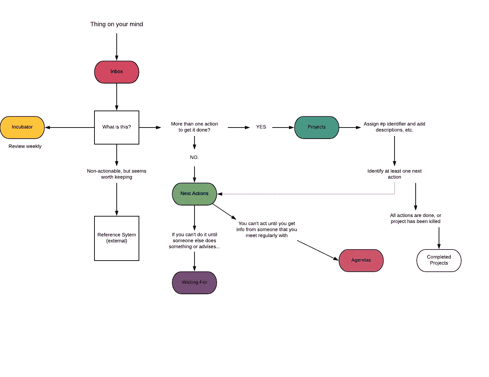

# 如何在谷歌表单中运行 GTD

> 原文：<https://medium.com/hackernoon/a-course-on-running-gtd-in-google-sheets-fa42fddd65df>

## 用一个(相当)简单但功能强大的基于网络的电子表格来管理你的生活的在线指南

多年来，我一直是大卫·艾伦的《把事情做好》的粉丝。它不仅改变了我对待工作的方式，也改变了我对待生活的方式。将事情分解成项目、下一步行动或参考——将事情分解成我现在承诺要做的事情或我以后可以做的事情，这是我取得今天成就的关键。

但是我总是纠结于如何从软件的角度实现它。你看，一个软件就是一个工具。正如大多数开发人员可以告诉你的，如果你不*喜欢*你用来做 *X* 的应用程序，你继续参与完成 *X* 的机会就会大大降低。从这个意义上来说，合适的工具(或者在这里，合适的应用程序)可以改变一切。

我在生活中尝试了许多应用程序作为运行 GTD 的工具，我总是在它们的机制中发现一些让我无法真正*爱上*它们的东西。所以我不太关注我的个人生产力系统——这是一个大问题。

我在日常工作中使用电子表格已经有一段时间了，并且非常得心应手。但直到最近，我才把我对电子表格的热爱和精通，以及我对 GTD 和个人生产力的热爱结合起来。结果是，它可能足够强大(因为它足够简单)以最少的缺陷在云中跨平台运行 GTD 实现。

对于那些努力在各种个人生产力应用中实现 GTD 的人来说，这可能是你的解决方案。我知道这是为了我。我现在有了一个我有信心的工作流程和工具。对于任何试图提高工作效率的人来说，你知道这是成功的一半以上。

The workflow using my GTD Google Sheet

我已经和 Skillshare 的酷人们联手，在谷歌表单中创建了一个关于运行 GTD 的课程。它附带了一个强大的模板，你可以用它来运行你自己的 GTD 系统。

只需点击[此链接](http://skl.sh/2n30RCj)即可开始使用。它将允许你试用 Skillshare 个月，只需 0.99 美元——这让你可以访问他们的所有课程。我已经在 Skillshare 上学习了一些课程，包括学习编码、接受区块链技术教育和时间限制。这可能是我所得到的最好的投资回报。

本课程由 12 节视频课程组成(包括截屏、模板和工作流程文档)，我精心制作，旨在为您提供 GTD 方法论和在电子表格中有效运行该方法的最佳速成课程。看看吧，有什么想法告诉我(info@mikesturm.net)！