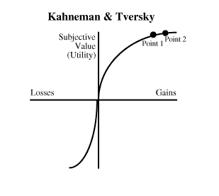
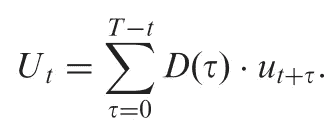
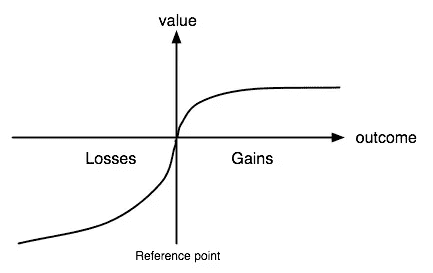
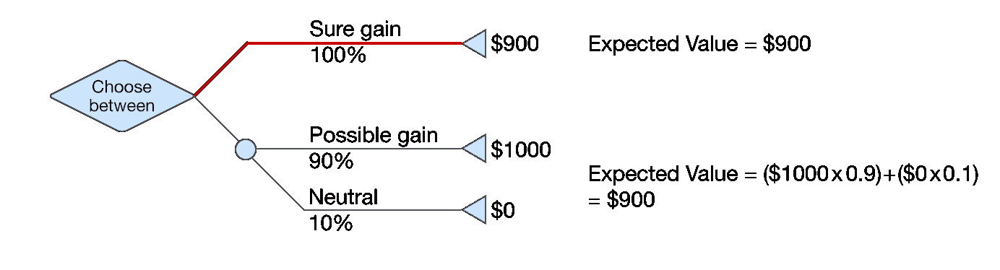
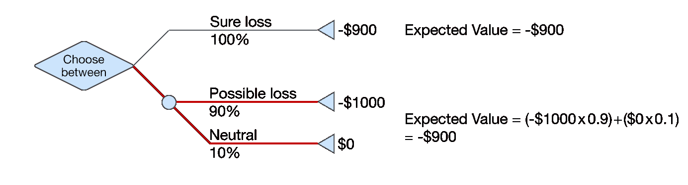

# 加密货币行为经济学术语速成班

> 原文：<https://medium.com/hackernoon/a-crash-course-in-behavioral-economics-terms-for-cryptocurrencies-8b8b910ef487>

我把这个列表放在一起，因为我在加密货币领域还没有看到足够多的围绕行为经济学的讨论。有许多论点，甚至整个系统，都是建立在人们以冷酷的经济理性行事的假设之上的。这种假设是不正确的。

人们以奇怪的方式做决定。我们被努力、进化的古怪、我们无法集中注意力和时间所限制。因此，正如丹·艾瑞里所言，我们是可预见的非理性。我试图概述行为经济学领域的一些关键术语，并举例说明它们如何适用于加密货币。我的例子并不详尽，其中一些术语有整本书都在讨论，而且这些概念有很多不同的应用方式。我鼓励你在阅读时想想自己的例子！有些概念与投资更相关，有些与机制设计更相关。如果你有什么要补充的，请随时评论或联系我们。

## 锚定

启动的一种特殊形式，最初接触一个数字作为参考点，影响随后对价值的判断。

*加密示例*

ICO 发布时加密货币的价格可以作为锚。期货价格经常与 ICO 的价格联系在一起讨论，就好像这不仅仅是一个任意的数字。

或者，一个人进入市场的价格点可以作为他们如何考虑未来走势的参考。如果你以 100 美元、1000 美元、10000 美元或 19000 美元的价格入场，你会以非常不同的方式看待比特币。

*延伸阅读*

[Tutor2u 的主播视频](https://www.youtube.com/watch?v=K58_3fVf0fc)

斯科特，P. J .，&利泽里，C. (2012 年)。消费者房价判断:锚定和任意一致性的新证据。《房地产研究杂志》，第 29 卷第 49-68 页。

Tversky，a .，& Kahneman，D. (1974)。不确定性下的判断:试探法和偏见。*科学(新系列)*，185，1124–1131。

Wansink，b .，Kent，R. J .，& Hoch，S. J. (1998 年)。采购量决策的锚定与调整模型。*市场研究杂志，35* (1)，71–81。

## 基本速率偏差

如果呈现相关的*基本比率信息*(一般)和*特定信息*，思维倾向于忽略前者而关注后者。

*加密示例*

我认为，既然加密市场普遍上涨，你的专项投资也必须上涨。

或者，想象一下一种加密货币，它有很多良好的“基础”，比如强大的开发人员社区、团队和令牌用例。你会想象这种加密货币会跑赢市场。基本利率偏差将会加重特定信息的权重，例如某个功能发布的延迟，并将加密货币视为糟糕的投资，而特定信息可能只是向上道路上的一个颠簸。

*延伸阅读*

卡内曼博士和特沃斯基(1973 年)。论预测心理学。*《心理评论》，第 80 期* (4)，第 237–251 页。

## 有限理性

在决策过程中，个人的理性受到他们所拥有的信息、他们头脑的认知局限性以及他们做出决策的有限时间的限制。

*密码示例*

用户可能会错误地验证令牌管理的注册中心的错误提交，因为他们不知道如何评估它，这需要花费很多精力，或者他们没有时间正确地做出决定。

*延伸阅读*

西蒙，H. A. (1955)。理性选择的行为模型。*《经济学季刊》*， *69* (1)，第 99–118 页。

## 承诺机制

用来抵消人们缺乏意志力和改变他们行为的工具。违背承诺的代价越大，效果越好。承诺机制与时间不一致性紧密相关。

经常用于节食、锻炼或储蓄。例子包括购买长期健身会员资格，剪碎信用卡以避免使用它们，或者不把酒放在家里以避免饮用。

*加密示例*

智能合约锁定你的乙醚一年，以便你 HODL，不要恐慌出售。

*延伸阅读*

Strecher，V. J .、Seijts，G. H .、Kok，G. J .、Latham，G. P .、Glasgow，r .、DeVellis，b .、……和 Bulger，D. W. (1995 年)。作为健康行为改变策略的目标设定。*健康教育季刊*， *22* (2)，190–200。

## 证实性偏倚

以符合他们现有信念的方式寻找或评估信息。

*密码示例*

用比特币狂热分子填充你的电子邮件和 Twitter feed，从/r/bitcoin 获取你的其他新闻。

## 内在激励的挤出

金钱激励或惩罚会破坏内在动机的观点。

*加密示例*

人们可能出于意识形态的原因或为集体利益做贡献而在开源项目上免费工作，但如果提供报酬，他们可能不会做同样的工作。

*进一步阅读*

 [## 我们合作的原因

### 在这一个小时里，TED 演讲者揭开了集体协作建立一个更美好世界的秘密背后的想法。

www.npr.org](https://www.npr.org/2013/07/13/197986218/why-we-collaborate) 

## 诱饵效应

当人们对一个选项的偏好因增加第三个选项而改变时，诱饵效应就出现了。

例如，《经济学人》曾经以 59 美元的价格提供他们所有的网络内容，以 125 美元的价格订阅印刷版，或者以 125 美元的价格订阅印刷版和网络版。行为经济学家丹·艾瑞里调查了他的学生对这种定价结构的看法；84%的人选择了组合交易，16%的人选择了网络订阅。然而，当他在没有不受欢迎的仅打印选项的情况下重复民意调查时，32%的人选择了打印和网络选项，68%的人选择了仅网络选项。

*密码示例*

公用事业代币可以以类似于《经济学人》的方式利用诱饵效应，将人们推向更昂贵的选择。

## 命名效应

与较小面值的等值货币相比，人们不太可能花较大面值的货币。

*密码示例*

人们更可能花小面额的钱，比如 100 张 10 瑞普的分期付款，而不是大面额的，比如 1000 瑞普的一次性付款。

*延伸阅读*

Raghubir，p .和 Srivastava，J. (2009 年)。面额效应。*消费者研究杂志*， *36* (4)，701–713。

## 独裁者游戏

一个两人游戏，其中一个玩家“独裁者”决定如何在他们和第二个玩家之间分配捐赠的钱。第二个玩家对游戏的结果没有影响。理论上，独裁者出于自身利益应该拿走全部捐赠，然而，大量文献表明，独裁者经常将钱分配给第二个玩家。

*加密示例*

独裁者游戏没有直接的含义，但它告诉我们的是，除了自身利益之外，人们的行为还有其他动机。潜在的解释是，人们关心他人(利他主义)或反对不公平的结果(不平等厌恶)。

## 边际敏感性递减

人们对接近现状的变化比对远离现状的变化更敏感。这个概念是*前景理论*的核心。

在下图中，对现状的小收益提供了巨大的效用，但是在某个阈值之后，它们急剧下降。第 1 点和第 2 点之间的收益是显著的，但是获得的额外效用很少。

*加密示例*

与 1 美元回报和 10 万美元回报之间的效用差异相比，10 万美元回报和 20 万美元回报之间的效用差异就相形见绌了。

类似地，最初损失 100，000 美元的痛苦大于再损失 100，000 美元的额外痛苦。

## 折扣效用模型

贴现效用模型是分析长期选择最常用的框架。他们抓住了一个简单的想法，即(大多数)经济主体更喜欢当前的回报，而不是类似幅度的延迟回报。最广泛使用的贴现模型假设总效用可以分解为一段时间内效用流的加权和。从数学上来说，这等于…

*加密示例*

用户更喜欢现在获得奖励，而不是以后。你让用户等待奖励的时间越长，你给他们的奖励就越多。此外，应该从一系列未来公用事业的角度来看待正在做出的决策，而不是一个开关决策。

## 禀赋效应

我们高估了自己拥有的东西，而不考虑它们的客观市场价值。这可以简单地用两个例子来说明:人们变得不愿意为了现金等价物而放弃他们所拥有的商品，当人们愿意为一件商品支付比他们出售时愿意接受的价格更低的价格时。

禀赋效应是现状偏差的一个例证，可以用损失厌恶和前景理论来解释。

*密码示例*

只要拥有一种加密货币，你就会比其他情况下更看重它。众所周知，在传统金融领域，交易员会坚守自己拥有的资产，即使这些资产变得无利可图，只是因为他们对这些资产的情感依恋。

*进一步阅读*

卡内曼博士，克内奇，j .，&泰勒，R. (1991 年)。异常现象:禀赋效应、损失厌恶和现状偏差。*经济透视杂志*，5(1)，193–206。

## 框架

一种认知偏差，人们对特定选择的反应因呈现方式而异；例如作为损失或收益。当一个积极的框架出现时，人们会回避风险，但是当一个消极的框架出现时，人们会寻求风险。

框架也可以用损失厌恶和前景理论来解释。

*加密示例*

你描述一个决定的方式，比如是否要冒险，会极大地影响结果。

同样，信息如何显示给你将会影响你如何看待这些信息。后退一步，重新组织信息，从不同的角度审视它的感觉。

*进一步阅读*

卡内曼博士和特沃斯基(1979 年)。风险下的决策分析。*计量经济学，47* ，263–291。

莱文，I. P .，施耐德，S. L .，，盖斯，G. J. (1998)。并非所有的框架都是平等的:框架效应的类型学和批判性分析。*组织行为和人类决策过程，76，*149–188。

## 赌徒谬误

一种信念，认为在给定先前事件或一系列事件的情况下，某一随机事件发生的可能性或多或少。

例如，如果你正在抛一枚硬币，它连续 10 次正面朝上，那么它接下来正面朝下的概率*仍然是 50%* 。相信其他任何东西是赌徒谬误的一个例子。

*密码示例*

相信既然你在过去的 15 次交易中亏损了，你就一定会盈利。

## 难易效应

高估自己在认为困难的任务中成功的可能性，低估自己在认为容易的任务中成功的可能性。

*密码示例*

高估了你战胜市场的可能性，但低估了你找到如何购买另类硬币的可能性。

## 快乐编辑

快乐编辑是结合事件来影响他们的看法。前景理论告诉我们，人们有高度的损失厌恶，以及对收益和损失的边际敏感性递减。通过将损失组合在一起，我们可以*最大限度地降低总的负效用感受*，通过分离收益，我们可以最大限度地提高效用感受。

以下列得失为例:

增加

10

10

损耗

10

10

和相应的效用，注意边际敏感性和损失厌恶的递减。
U(20) = 35

U(10)= 20

U(-10) = -60

U(-20) = -95

你展示这些得失的可能方式是…

增益为 10 和 10 → U(10) + U(10) = 40

增益为 20 → U(20) = 35

10 和 10 的损耗→ U(-10) + U(-10) = -120

损失 20 → U(-20) = -95

在所有这些组合中，最大化效用的方法是呈现 20 的联合损失和 10 和 10 的单独收益，总共为-55。另一方面，最糟糕的显示方式是总收益为 20 英镑，分别损失 10 英镑和 10 英镑，总计为-85 英镑。

*加密示例*

上述概念很容易适用于投资的损失和回报。

## 马后炮偏差

倾向于相信一个事件比实际情况更容易预测。反过来，这可能导致原因过于简单化。

*加密示例*

在比特币经历了漫长的上涨后，回顾过去，将其归因于简单的原因，或者在事后将其标记为可预测的。

## 双曲线贴现

人们越来越倾向于选择较小的奖励，而不是较大的奖励，因为延迟发生得更早而不是更晚。当人们在等待一定时间后得到更大的回报时，他们更愿意等待，因为回报会在未来进一步发生。换句话说，当等待接近现在时，人们会避免更多的等待。也称为时间不一致。

*加密示例*

想想你是愿意现在拥有 10 个 BTC 还是 6 个月后拥有 12 个 BTC。现在，考虑一下你是愿意三个月内 12 个 BTC 还是九个月内 12 个 BTC。这些是在不同距离的相同选项对，如果你在两种情况下没有选择相同的选项，你会显示出*时间不一致*和*双曲线贴现。*

## 宜家效应

消费者对自己组装或制作的产品给予了过高的评价。

*密码示例*

人们帮助制造的东西，无论是软件还是数字资产，他们都有一定程度的所有权。

*延伸阅读*

医学博士诺顿、医学博士莫琼和医学博士艾瑞里(2012 年)。宜家效应:当劳动带来爱。*《消费者心理学杂志》，第 22 期，*453–460 页。

## 不平等厌恶

人们抵制不平等的倾向。

*加密示例*

人们可能愿意在你通常认为他们只是出于自身利益的机制中出于自身利益而行动。

*延伸阅读*

费尔和施密特(1999 年)。公平、竞争和合作的理论。*《经济学季刊》，114 期*，817–868 页。

## 小数定律

倾向于选取一个小样本来代表整个人口。

*加密示例*

如果一位基金经理连续三年高于平均水平，许多人会得出该基金经理优于平均水平的结论，尽管这一结论并不是从如此少量的数据中得出的。

## 自由家长主义

认为私人和公共机构在尊重选择自由的同时影响行为是合法和可能的。通常，这与特定的 UI 设计选择有关，比如默认设置是什么，或者提示用户做出特定的重要决定。

你设计界面的方式很重要，因为它们会影响人们的选择。此外，迫使人们做出选择也可以将他们推向社会最优结果。

*加密示例*

在未来，当我们拥有一个由加密货币驱动的真正开放的金融系统时，将会有用户界面与我们的“银行账户”(钱包)进行交互。在这些系统中，将会有类似于我们今天所拥有的某种储蓄或投资组合。自由家长主义的一个例子是促使人们决定是否要留出一部分收入用于储蓄。用户仍然对他们的选择保留完全的自主权，但是提示导致更多的人选择储蓄。

一个更具父爱色彩的替代方案是设计这样一个系统，用户在默认情况下会储蓄一部分收入，但可以选择退出。

*延伸阅读*

泰勒和桑斯坦(2003 年)。自由家长主义。*《美国经济评论》*， *93* (2)，175–179 页。

## 损失厌恶

失去的痛苦比得到的快乐更有力量。对其威力的估计各不相同，但一般认为超过 2 倍。

*密码示例*

失去 10 万美元比获得 10 万美元要痛苦得多。

*延伸阅读*

卡内曼博士和特沃斯基(1979 年)。风险下的决策分析。*计量经济学，47* ，263–291。

## 心理会计

人们倾向于根据各种主观标准，例如钱的来源和每个账户的意图，将他们的钱分成不同的心理账户。

例如，人们更可能轻率地花掉他们在赌场赢来的钱，而不是他们工作挣来的钱。

*加密示例*

从 ICO 赚来的钱和其他来源的钱被放在一个独立的心理账户中。因为感觉不像时薪那么真实，你可能更倾向于不假思索地花掉它。

## 金钱幻觉

倾向于用名义价值而不是实际价值来看待货币。

*加密示例*

不承认过去几十年美元购买力的贬值。

## 天真与世故

天真的决策者(“Naifs”)不知道他们的期望，也不知道这如何影响他们的效用。老练的人知道他们的期望和行为偏差，并相应地调整他们的行动。

例如，一个 naif 允许他们自己为每年的圣诞礼物变得极度兴奋，不管他们期望得到什么。一个老练的人缓和了他们的兴奋，并期望什么也得不到，因为他知道他们从得到任何东西中得到的效用会大得多。

## 叙事谬误

我们观察事实而不加以叙述的有限能力。

*加密示例*

从一系列随机的运动中挑选出一个“市场趋势”。

## 窄边框

不考虑整体投资组合背景而做出投资决策的倾向。

*加密示例*

在不考虑你的投资组合的情况下投资一个新的分散交易所，已经过度暴露于分散交易所。

## 遗漏/委托偏差

遗漏偏差是判断有害行为比同样有害的遗漏更糟糕的倾向。例如，如果你建议一个患有过敏症的朋友吃一种他们不知道的含有特定过敏原的食物，这将被视为比被动地看着他们选择和吃同样的食物更糟糕。

*密码示例*

考虑一下某人欠你乙醚的情况。遗漏/委托偏见会因为某人把乙醚送错了钱包而比他们根本没有送乙醚更生气。

## 选择的悖论

在一个特定的决策中有过多的选择会导致更糟糕的结果。选择过多会让你在做出决定之前就质疑自己的决定，让你有不切实际的高期望，让你为所有的失败自责。

*加密示例*

为用户提供太多的商品和服务选择来换取实用工具令牌可能会导致他们做出错误的选择。

## 底漆

让人们参与一项任务或让他们接触刺激来激活相关的记忆，目的是影响他们在后续任务中的表现。

*密码示例*

接触某些信息会影响你对加密货币的估价。

*延伸阅读*

Chartrand，T. L .，Huber，j .，Shiv，b .，& Tanner，R. (2008 年)。无意识目标和消费者选择。《消费者研究杂志》，35 年，189–201 页。

## 委托代理问题

当一个人或实体(“代理人”)能够代表另一个人或实体作出决定和/或采取行动，或影响另一个人或实体时，称为“委托人”。当代理人和委托人有不同的利益时，这经常会成为问题。

*加密示例*

在你设计的任何机制中，都有多方参与，每一方都有自己的动机、不同的期望和可以采取的不同行动。要设计健壮和可持续的机制，你应该把所有这些东西都列出来，并试着为你的系统建模。

## 投影偏差

人们认为他们的偏好会随着时间的推移保持不变。

*加密示例*

假设你的投资组合风险偏好会随着时间的推移保持不变。或者，假设在你的机制内行动的代理人将随着时间的推移具有相同的偏好。

## 前景理论

一种理论，描述了人们在涉及风险的概率选项之间进行选择的方式，其中结果的概率是未知的。前景理论指出，人们基于相对收益和损失而不是绝对收益和损失来做决定。此外，人们使用试探法来评估这些得失，本文中包括了其中的几种方法。最后，它规定人们有*损失厌恶*，或者说他们对损失的感受比等价的收益更深。

*加密示例*

失去一个 BTC 比得到一个 BTC 感觉更强烈。此外，收益和损失显示出边际敏感性递减，或者在初始阈值之后感觉不那么强烈。

前景理论也告诉我们人们如何做出关于风险的决定。我们厌恶收益的风险，但当涉及损失时，我们寻求风险。考虑下面的情况，你有两个选择。要么是 900 美元的确定收益，要么是 1000 美元的 90%几率和 0 的 10%几率。

两种选择的预期结果是一样的。大多数人会规避风险，接受 900 美元。然而，请考虑同样的亏损情况。

Diagrams and examples from [https://www.nngroup.com/articles/prospect-theory/](https://www.nngroup.com/articles/prospect-theory/)

大多数人会选择风险更大的第二种选择，希望避免损失。我们以损失寻求风险，以收益规避风险。请注意这些偏见，并据此进行投资。

## 代表性启发式

人们通过查看 A 与 B 的相似程度来判断一个对象或事件 A 属于某个 B 类的概率，这样做，我们忽略了关于 B 发生的一般概率(其基本率)的信息(Kahneman & Tversky，1972)。

请考虑以下情况:

鲍勃是个歌剧迷，喜欢在假期参观艺术博物馆。在成长过程中，他喜欢与家人和朋友下棋。哪种情况可能性更大？

A.鲍勃为一个大型交响乐团演奏小号

很大一部分人会在上述问题中选择 A，因为鲍勃的描述符合我们可能持有的关于古典音乐家而不是农民的刻板印象。实际上，B 为真的可能性要大得多，因为农民占人口的比例要大得多。

*密码示例*

判断一种新的加密货币产生回报的概率是基于它是否类似于以前有利可图的加密货币。

更具体地说，你可以通过投资一个新硬币来使用代表性启发法，因为它是一个智能合约平台，因为智能合约平台是最近成功的投资。

*延伸阅读*

卡内曼博士和特沃斯基(1972 年)。代表性的判断。*认知心理学，3，*430–454。

## 风险主导战略(最小最大)

代理人的目标不是最大化效用，而是最小化最大损失情景。一个微小的变化是最大增益最小增益(马希民)。最初适用于双人游戏中的策略，但广泛适用，尤其是在高度不确定的情况下。

*加密示例*

不要试图最大化你投资组合的收益，你可以寻求最小化你最大可能的损失。

或者，用户可以在你设计的游戏/机制中使用同样的策略。

## 满意解决（法）

人们倾向于通过*满足*或者满足和满意的结合来做决定，而不是优化。令人满意的个体可以被认为有一些基本的可接受的标准来衡量选项，并选择一个满足这些标准的选项，而不是“最好”的选项。

*加密示例*

当构建你的投资组合时，你可能不会去寻找最优的交易，而是找到一个满足一系列标准的交易，比如给定波动性的预期回报的最小阈值。

## 自我归因偏差

倾向于将成功归因于先天因素，如天赋或远见，而将失败归咎于外部影响。

*加密示例*

将投资组合的成功归因于你的天才，而将失败归咎于外部力量。在最近的时间里，这将是以太网从约 300 美元反弹的时间，但错过了顶部，并归因于“FUD”或内部人士。

## 现状偏差

对事物现状的偏好。与锚定和前景理论密切相关。当需要改变的交易成本和沉没成本很小时，现状偏差就不那么突出了。

*密码示例*

不想调整投资组合的非理性倾向。

## 规划谬误

人们通常低估完成未来任务所需时间的偏差。

*密码示例*

低估对一项新投资进行尽职调查所需的时间。

低估了用户完成一个动作所需的时间。

## 时间不一致

随着时间的推移，人们的偏好会发生变化，可能会变得与以前或将来的偏好不一致。例如，你可能会毫不犹豫地使用你的信用卡，债台高筑，享受新事物带来的即时满足感。以后当你必须开始偿还债务时，你可能会感到后悔。由于这些偏好的改变，你可能不会做出最大化你的效用的决定。

*加密示例*

决定 HODL，并通过发送你的以太到一个聪明的合同，今天锁定它，但明天后悔那个决定的机会成本。

## 最后通牒游戏

一种有两个玩家的游戏，其中一个玩家得到一笔钱，并被分配给另一个玩家。拥有这笔钱的玩家必须向另一个玩家提出分成。另一个玩家可能接受提议的分割，也可能拒绝。如果他们拒绝了提议的分成，双方都将一无所获。

当在一个共享的社会群体的成员之间进行时，人们会提供公平的(即 50:50)分割，通常会拒绝低于 30%的报价。

*加密示例*

与独裁者游戏相似，独裁者游戏没有直接的含义，但它告诉我们的是，除了自身利益之外，人们的行为还有其他动机。潜在的解释是，人们关心他人(利他主义)或反对不公平的结果(不平等厌恶)。

# 与我联系

特别要感谢阿什利·霍奇森向我介绍了很多这样的话题。也感谢 Travis Kling 对本文的看法。

如果你喜欢我的文章，你可以在这里或者推特上关注我。请随意联系，我非常感谢您的反馈！