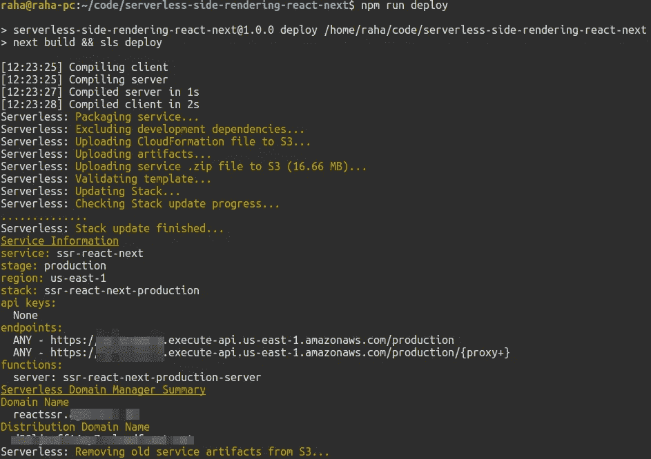

# React.js、Next.js 和 AWS Lambda 的无服务器端渲染速成班

> 原文：<https://medium.com/hackernoon/a-crash-course-on-serverless-side-rendering-with-react-js-next-js-and-aws-lambda-30e0ba967849>


不久前，我开始探索服务器端呈现的单页面应用程序。是的，试着快速说三遍。为初创公司打造产品教会了我，如果你想在网上立足，搜索引擎优化是必不可少的。但是，你也想要水疗所能提供的性能。

我们希望两全其美。SEO boost 服务器端呈现提供了单个页面应用程序的速度。今天，我将在 AWS Lambda 上的一个无服务器环境中向您展示这一切，并且基本上是免费的。

# TL；速度三角形定位法(dead reckoning)

让我们浏览一下本教程将涵盖的内容。你可以浏览并跳到你感兴趣的部分。或者，做个书呆子，继续读书。
**耳语*请做个书呆子。*

*   我们在建造什么？
*   配置和安装依赖项
*   用[无服务器框架](https://serverless.com/)和 [Next.js](https://nextjs.org/) 构建 app
*   将应用程序部署到 [AWS Lambda](https://aws.amazon.com/lambda/)

***注意*** *:我们要写的* [*代码已经在 GitHub*](https://github.com/adnanrahic/serverless-side-rendering-react-next) *上了，如果需要进一步参考或者遗漏了什么步骤，可以随时查看。在我开始写这个教程之前，*[*cube . js*](https://statsbot.co/cubejs/)*的家伙们给了我一个快速的 React 概要。他们有一个* [*无服务器分析框架*](https://github.com/statsbotco/cubejs-client) *，可以很好地插入 React。请随意尝试一下。*

# 我们在建造什么？

当然是反应极快的应用程序！虽然每个水疗中心的成本是糟糕的搜索引擎优化能力。因此，我们需要以一种整合服务器端渲染的方式构建应用程序。听起来很简单。我们可以使用 [Next.js](https://nextjs.org/) ，一个用于静态和服务器渲染 [React.js](https://reactjs.org/) 应用的轻量级框架。

为此，我们需要启动一个简单的 Express 服务器，并配置下一个应用程序通过 Express 提供文件服务。这比听起来简单多了。

然而，从标题中，你可以假设我们不喜欢我家附近的*服务器*这个词。解决方案是将整个应用程序部署到 [AWS Lambda](https://aws.amazon.com/lambda/) ！它毕竟是一个很小的 Node.js 实例。

准备好了吗？让我们开始吧！

# 配置和安装依赖项

和往常一样，我们从枯燥的部分开始，设置项目并安装依赖项。

## 1.安装无服务器框架

为了让无服务器开发**不**成为绝对的折磨，继续安装[无服务器框架](https://serverless.com/)。

```
$ npm i -g serverless
```

**注意:** *如果您使用的是 Linux 或 Mac，您可能需要以* `*sudo*` *的身份运行该命令。*

一旦全局安装到您的机器上，您就可以在终端的任何地方使用这些命令。但是为了让它与您的 AWS 帐户通信，您需要配置一个 IAM 用户。跳过[这里的解释](https://docs.aws.amazon.com/IAM/latest/UserGuide/id_users_create.html)，然后返回并使用提供的键运行下面的命令。

```
$ serverless config credentials \  
    --provider aws \  
    --key xxxxxxxxxxxxxx \  
    --secret xxxxxxxxxxxxxx
```

现在，当您运行任何终端命令时，您的无服务器安装知道要连接到哪个帐户。让我们来看看它是如何工作的。

## 2.创建服务

创建一个新目录来存放您的无服务器应用程序服务。在那里启动一个终端。现在您已经准备好创建一个新的服务了。

你问的服务是什么？将其视为一个项目。但也不尽然。在这里定义 AWS Lambda 函数、触发它们的事件以及它们需要的任何 AWS 基础设施资源，所有这些都在一个名为 **serverless.yml** 的文件中。

回到您的终端，键入:

```
$ serverless create --template aws-nodejs --path ssr-react-next
```

create 命令将创建一个新的**服务**。修卡！但有趣的部分来了。我们需要为函数选择一个运行时。这被称为**模板**。传入`aws-nodejs`会将运行时设置为 Node.js .这正是我们想要的。**路径**将为服务创建一个文件夹。

## 3.安装 npm 模块

在您的终端中切换到 **ssr-react-next** 文件夹。这里应该有三个文件，但是现在，让我们首先初始化 npm。

```
$ npm init -y
```

在创建了`package.json`文件之后，您可以安装一些依赖项。

```
$ npm i \
    axios \
    express \
    serverless-http \
    serverless-apigw-binary \
    next \
    react \
    react-dom \
    path-match \
    url \
    serverless-domain-manager
```

这些是我们的生产依赖项，我将更详细地解释它们的作用。最后一个叫做`serverless-domain-manager`，它将让我们把一个域绑定到我们的端点。太棒了。

现在，你的`package.json`应该看起来像这样。

我们还需要添加两个脚本，一个用于构建，一个用于部署应用程序。你可以在`package.json`的`scripts`区看到它们。

## 4.配置 serverless.yml 文件

接下来，让我们最终在代码编辑器中打开项目。检查 **serverless.yml** 文件，它包含此服务的所有配置设置。您可以在这里指定常规配置设置和每个功能的设置。您的 **serverless.yml** 将充满样板代码和注释。请随意删除它，并粘贴这个。

`functions`属性列出了服务中的所有函数。我们只需要一个函数，因为它将运行下一个应用程序并呈现 React 页面。它的工作原理是旋转一个微型 Express 服务器，在 Express 路由器旁边运行下一个渲染器，并将服务器传递给**无服务器 http** 模块。

反过来，这将把整个 Express 应用捆绑到一个 lambda 函数中，并将其绑定到一个 API 网关端点。在 functions 属性下，您可以看到一个**服务器**函数，它在`index.js`文件中有一个名为`server`的处理程序。API Gateway 会将所有请求代理到内部的 Express 路由器，然后它会告诉 Next 呈现 React.js 页面。哇，听起来很复杂！但其实真的不是。一旦我们开始写代码，你会看到它是多么简单。

我们还添加了两个插件，一个是让更多 mime 类型通过 API 网关的`serverless-apigw-binary`,另一个是让我们毫不费力地将域名连接到端点的`serverless-domain-manager`。

我们在底部还有一个`custom`部分。属性充当了一种将环境变量安全加载到我们的服务中的方式。稍后通过使用`${self:custom.secrets.<environment_var>}`来引用它们，实际值保存在一个名为`secrets.json`的简单文件中。

除此之外，我们还让 API 网关二进制插件知道我们想让所有类型通过，并为我们的端点设置一个自定义域。

配置到此为止，下面添加`secrets.json`文件。

## 5.添加机密文件

添加一个`secrets.json`文件并将其粘贴进去。这将阻止我们向 GitHub 推送秘密密钥。

现在，只有通过更改这些值，您才能将不同的环境部署到不同的阶段和域。相当酷。

# 使用无服务器框架和 Next.js 构建应用程序

为了构建服务器端呈现的 React.js 应用程序，我们将使用 Next.js 框架。它让你专注于编写应用程序，而不是担心搜索引擎优化。它的工作原理是在将 JavaScript 发送给客户端之前对其进行渲染。一旦它被加载到客户端，它将缓存它并从那里提供服务。你必须喜欢它的速度！

让我们从编写服务器上的 Next.js 设置开始。

## 1.设置 Next.js 服务器端渲染

创建一个名为 **server.js** 的文件。很直观，我知道。

这很简单。我们获取了 Express 和 Next，用`express.static`创建了一个静态路由，并将 Next 将要创建的捆绑 JavaScript 的目录传递给它。路径是`/_next`，它指向`.next`文件夹。

我们还将设置服务器端路由，并为客户端呈现器添加一个*总括*路由。

现在，应用程序需要连接到`serverless-http`，并作为 lambda 函数导出。创建一个`index.js`文件并粘贴进去。

如您所见，我们还需要创建`binaryMimeTypes.js`文件来保存我们想要启用的所有 mime 类型。这只是一个简单的数组，我们将它传递给`serverless-http`模块。

太好了，这就是关于 Next.js 的设置。让我们跳进客户端代码！

## 2.编写客户端 React.js

在项目的根目录下创建三个文件夹，分别命名为`components`、`layouts`、`pages`。进入`layouts`文件夹后，创建一个名为`default.js`的新文件，并将其粘贴进去。

默认视图将有一个用于动态设置元标记的`<Meta />`组件和一个`<Navbar />`组件。`{ children }`将从使用该布局的组件中呈现。

现在再添加两个文件。`components`文件夹中的一个`navbar.js`和一个`meta.js`文件。

这是一个非常简单的导航工具，可以用来在一些可爱的狗狗之间导航。一旦我们在`pages`文件夹中添加了一些东西，这就有意义了。

`meta.js`将使我们更容易向 meta 标签中注入值。现在你可以在`pages`文件夹中创建一个`index.js`文件。粘贴下面的代码。

`index.js`文件将呈现在我们的应用程序的根路径上。它调用一个狗 API，会显示一个可爱的狗的图片。

让我们创建更多的路线。创建一个名为`dogs`的子文件夹，并在其中创建一个`index.js`文件和一个`_breed.js`文件。`index.js`将在`/dogs`路线渲染，而`_breed.js`将在`/dogs/:breed`渲染，其中`:breed`代表路线参数。

将其添加到`dogs`目录中的`index.js`中。

还有，`dogs`文件夹中的`_breed.js`文件中的另一个片段。

正如你在`Default`组件中看到的，我们正在注入定制的元标签。它将在你的页面的`<head>`中添加自定义字段，给它适当的 SEO 支持！

***注意*** *:如果你卡住了，* [*下面是回购*](https://github.com/adnanrahic/serverless-side-rendering-react-next) *中代码的样子。*

让我们部署它，看看它是否有效。

# 将应用程序部署到 AWS Lambda

在最开始的时候，我们给我们的`package.json`添加了一个叫做`deploy`的脚本。它将构建下一个应用程序，并部署我们在`serverless.yml`中指定的无服务器服务。

你需要做的就是跑:

```
$ npm run deploy
```

终端将为您的应用程序返回带有端点的输出。我们还需要添加域以使其正常工作。我们已经在`serverless.yml`中添加了配置，但是我们还需要运行一个命令。

```
$ sls create_domain
```

这将创建一个 CloudFront 发行版，并将其连接到您的域。确保您已将证书添加到 AWS 帐户。AWS 通常需要大约 20 分钟来提供一个新的发行版。让你的眼睛休息一会儿。

一旦你回来了，继续部署它。

```
$ npm run deploy
```

现在它应该被绑定到您的域。它应该是这样的。



不错！该应用程序已启动并运行。去试试吧。

# 包扎

这个演练是情感的过山车！它给你一个新的视角来创建快速和高性能的单页应用程序，同时保持服务器端应用程序的 SEO 功能。然而，有了一个条件。没有你需要担心的服务器。这一切都运行在 AWS Lambda 的无服务器环境中。它易于部署和自动扩展。不会变得更好。

如果你在某个地方卡住了，看看 [GitHub repo](https://github.com/adnanrahic/serverless-side-rendering-react-next) 做进一步参考，如果你想让更多人在 GitHub 上看到它，请随意给它打个星。

如果你想阅读我以前的一些无服务器沉思，请前往[我的简介](/@adnanrahic)或[加入我的时事通讯！](https://upscri.be/b6f3d5/)

或者，马上看看我的几篇文章:

*   [AWS 无服务器速成班——用 Lambda 和 Aurora 无服务器构建 APIs】](https://hackernoon.com/a-crash-course-on-serverless-with-aws-building-apis-with-lambda-and-aurora-serverless-49885c46e37a)
*   [AWS 无服务器速成班——使用 Lambda 和 S3 动态调整图像大小](https://hackernoon.com/a-crash-course-on-serverless-with-aws-image-resize-on-the-fly-with-lambda-and-s3-850be95d5833)
*   [AWS 无服务器速成班 SNS 消息触发 Lambda](https://hackernoon.com/a-crash-course-on-serverless-with-aws-triggering-lambda-with-sns-messaging-bc17d9f81ca2)
*   [关于使用 Vue.js、Nuxt.js 和 AWS Lambda 进行无服务器端渲染的速成课程](https://hackernoon.com/a-crash-course-on-serverless-side-rendering-with-vue-js-nuxt-js-and-aws-lambda-fbfaad80aa25)
*   [使用 AWS Lambda 和 AWS SES 构建无服务器联系表单](https://hackernoon.com/building-a-serverless-contact-form-with-aws-lambda-and-aws-ses-fbf01d523678)
*   [Express 和 MongoDB 的无服务器 API 速成班](https://hackernoon.com/a-crash-course-on-serverless-apis-with-express-and-mongodb-77774f7730fe)
*   [使用 Serverless 和 MongoDB 解决不可见的伸缩问题](https://hackernoon.com/solving-invisible-scaling-issues-with-serverless-and-mongodb-1a065b5a6465)
*   [如何使用无服务器将 Node.js 应用程序部署到 AWS Lambda](https://dev.to/adnanrahic/how-to-deploy-a-nodejs-application-to-aws-lambda-using-serverless-2nc7)
*   [AWS Lambda 和 Node.js 入门](https://hackernoon.com/getting-started-with-aws-lambda-and-node-js-4ce3259c6dfd)
*   [用 JSON web 令牌保护无服务器 API 的速成班](https://medium.freecodecamp.org/a-crash-course-on-securing-serverless-apis-with-json-web-tokens-ff657ab2f5a5)
*   [将 Node.js REST API 迁移到无服务器](https://hackernoon.com/migrating-your-node-js-rest-api-to-serverless-d2a170e0856c)
*   [用 Node.js 和 MongoDB 构建无服务器 REST API](https://hackernoon.com/building-a-serverless-rest-api-with-node-js-and-mongodb-2e0ed0638f47)
*   [node . js 无服务器速成班](https://hackernoon.com/a-crash-course-on-serverless-with-node-js-632b37d58b44)

我也强烈推荐查看[这篇关于 Next.js 的文章](https://blog.logrocket.com/how-to-build-a-server-rendered-react-app-with-next-express-d5a389e7ab2f)，以及[这篇关于无服务器域管理器的教程](https://serverless.com/blog/serverless-api-gateway-domain/)。

希望你们喜欢读这篇文章，就像我喜欢写这篇文章一样。如果你喜欢，拍一下那个小小的拍手，这样 HackerNoon 上的更多人会看到这个教程。下次见，保持好奇，玩得开心。

*原载于*[*dev . to*](https://dev.to/adnanrahic/a-crash-course-on-serverless-side-rendering-with-reactjs-nextjs-and-aws-lambda-13ed)*。*