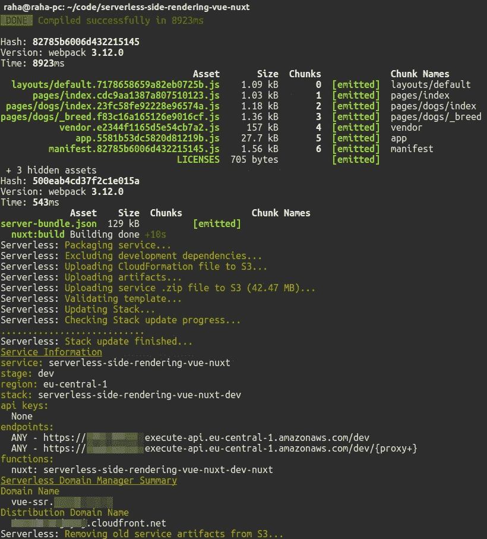
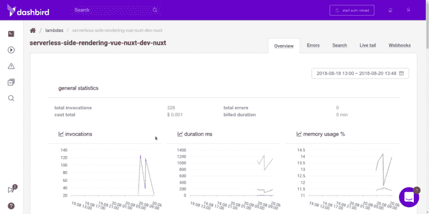

# 使用 Vue.js、Nuxt.js 和 AWS Lambda 进行无服务器端渲染的速成课程

> 原文：<https://medium.com/hackernoon/a-crash-course-on-serverless-side-rendering-with-vue-js-nuxt-js-and-aws-lambda-fbfaad80aa25>


这是一个很拗口的标题。不要让它吓跑你。归结起来很简单。

我们希望两全其美。SEO boost 服务器端呈现提供了单个页面应用程序的速度。所有这些基本上都是免费托管在 AWS Lambda 的无服务器环境中。

# TL；速度三角形定位法(dead reckoning)

这是我们将为您快速构建的内容的一个快速概述。随意跳到你最感兴趣的那一步。不要介意我内疚地让你读完整本书……**内疚地盯着* *😐

*   我们在建造什么？
*   配置和安装依赖项
*   用[无服务器框架](https://serverless.com/)和 [Nuxt.js](https://nuxtjs.org/) 构建 app
*   将应用程序部署到 [AWS Lambda](https://aws.amazon.com/lambda/)
*   用 [Dashbird](https://dashbird.io/) 测试应用

***注意*** *:我们要写的* [*代码已经在 GitHub*](https://github.com/adnanrahic/serverless-side-rendering-vue-nuxt) *上了，如果需要进一步参考或者遗漏了什么步骤，可以随时查看。*

# 我们在建造什么？

首先要做的是。我们想要一个超快的单页应用程序。但是，这通常是有代价的。糟糕的搜索引擎优化能力。这不行，这意味着我们也希望应用程序有服务器端的渲染。好吧，听起来很简单。我们将获取 [Nuxt.js](https://nuxtjs.org/guide) ，这是一个用于创建通用 [Vue.js](https://vuejs.org/) 应用程序的框架，并将其配置为在服务器端呈现我们的页面。

为此，我们需要启动一个简单的 Express 服务器，并配置 Nuxt 渲染器通过 Express 提供文件服务。这比听起来简单多了。

然而，这里关键的要点是*服务器*这个词。呃，我们不喜欢提那个词。那么，我们需要做什么？嗯，将整个应用程序部署到 AWS Lambda 上！它毕竟是一个很小的 Node.js 实例。

但这引发了一个担忧。如果一切都出了可怕的问题，如何监控和调试它？我通常让 [Dashbird](https://dashbird.io/) 在一个单独的标签中打开，以实时监控我所有的无服务器资源。

唷，有了它，让我们开始吧！

# 配置和安装依赖项

和往常一样，我们从枯燥的部分开始，设置项目并安装依赖项。

## 1.安装无服务器框架

为了让无服务器开发**不**成为绝对的折磨，继续安装[无服务器框架](https://serverless.com/)。

```
$ npm i -g serverless
```

**注意:** *如果您使用的是 Linux 或 Mac，您可能需要以* `*sudo*` *的身份运行该命令。*

一旦全局安装到您的机器上，您就可以在终端的任何地方使用这些命令。但是为了让它与您的 AWS 帐户通信，您需要配置一个 IAM 用户。跳过[这里的解释](https://docs.aws.amazon.com/IAM/latest/UserGuide/id_users_create.html)，然后返回并使用提供的键运行下面的命令。

```
$ serverless config credentials \ 
    --provider aws \ 
    --key xxxxxxxxxxxxxx \ 
    --secret xxxxxxxxxxxxxx
```

现在，当您运行任何终端命令时，您的无服务器安装知道要连接到哪个帐户。让我们来看看它是如何工作的。

## 2.创建服务

创建一个新目录来存放您的无服务器应用程序服务。在那里启动一个终端。现在您已经准备好创建一个新的服务了。

你问的服务是什么？把它当成一个项目。但也不尽然。在这里定义 AWS Lambda 函数、触发它们的事件以及它们需要的任何 AWS 基础设施资源，所有这些都在一个名为 **serverless.yml** 的文件中。

回到您的终端，键入:

```
$ serverless create \
    --template aws-nodejs \
    --path serverless-side-rendering-vue-nuxt
```

create 命令将创建一个新的**服务**。修卡！但有趣的部分来了。我们需要为函数选择一个运行时。这被称为**模板**。传入`aws-nodejs`会将运行时设置为 Node.js .这正是我们想要的。路径将为服务创建一个文件夹。

## 3.安装 npm 模块

在您的终端中切换到**无服务器端渲染 vue-nuxt** 文件夹。这里应该有三个文件，但是现在，让我们首先初始化 npm。

在创建了`package.json`文件之后，您可以安装一些依赖项。

```
$ npm i axios nuxt express serverless-http serverless-apigw-binary
```

这些是我们的生产依赖项，我将更详细地解释它们的作用。除了它们，我们还需要一个作为开发依赖。这将让我们把一个域与我们的端点联系起来。太棒了。

```
$ npm i --save-dev serverless-domain-manager
```

现在，你的`package.json`应该是这样的。

我们还需要添加两个脚本，一个用于在本地开发机器上运行`nuxt`，另一个用于构建和部署应用程序。你可以在`package.json`的`scripts`部分看到它们。

## 4.配置 serverless.yml 文件

接下来，让我们最终在代码编辑器中打开项目。检查 **serverless.yml** 文件，它包含此服务的所有配置设置。您可以在这里指定常规配置设置和每个功能的设置。您的 **serverless.yml** 将充满样板代码和注释。请随意删除它，并粘贴这个。

属性列出了服务中的所有函数。我们只需要一个函数，因为它将运行 Nuxt 渲染。它的工作原理是旋转一个微小的 Express 应用程序，将 Nuxt 渲染器中间件连接到 Express 路由器，并将应用程序传递给**无服务器 http** 模块。反过来，这将把整个 Express 应用捆绑到一个 lambda 函数中，并将其绑定到一个 API 网关端点。在 functions 属性下，您可以看到一个 **nuxt** 函数，它在`index.js`文件中有一个名为`nuxt`的处理程序。API Gateway 会将所有请求代理到内部 Express 路由器，后者会告诉 Nuxt 渲染器渲染我们的 Vue.js 页面。哇，听起来很复杂！但其实真的不是。一旦我们开始写代码，你会看到它是多么简单。

我们还添加了两个插件，一个是让更多 mime 类型通过 API 网关的`serverless-apigw-binary`，另一个是让我们毫不费力地将域名连接到端点的`serverless-domain-manager`。

我们在底部还有一个`custom`部分。属性充当了一种将环境变量安全加载到我们的服务中的方式。稍后通过使用`${self:custom.secrets.<environment_var>}`引用它们，实际值保存在一个名为`secrets.json`的简单文件中。

除此之外，我们还让 API 网关二进制插件知道我们想让所有类型通过，并为我们的端点设置一个自定义域。

配置到此为止，下面添加`secrets.json`文件。

## 5.添加机密文件

我们都知道把私钥推给 GitHub 会害死小企鹅。我们不要那样做。用无服务器框架处理这个问题很简单。添加一个`secrets.json`文件并粘贴进去。

现在，只有通过更改这些值，您才能将不同的环境部署到不同的阶段和域。相当酷。

# 使用无服务器框架和 Nuxt.js 构建应用程序

我们将使用 Nuxt.js 来构建我们的通用 Vue.js 应用程序。这是什么意思？好吧，让我们保持简单，它只是一个服务器端渲染的单页应用程序。这意味着您不需要担心 SEO，因为它会在将 JavaScript 发送给客户端之前对其进行渲染。但是，一旦它被加载到客户端，它就不会再次请求文件，而是缓存它。更快！我喜欢它。

让我们跳进来。

## 1.设置 Nuxt.js 服务器端渲染

为了让 Nuxt 工作，我们需要一个`nuxt.config.js`文件来添加我们的构建配置。

您可以看到我们需要 **secrets.js** 文件，以便在静态文件的`publicPath` URL 中加载我们的阶段。一旦我们在下面的快速路由器中添加了路由，您就会明白为什么这很重要。另外，检查`srcDir`，它指定了我们的客户端文件所在的文件夹的名称。

一旦添加完毕，创建另一个名为 **nuxt.js** 的文件。很直观，我知道。

这很简单。我们获取了 Express 和 Nuxt，用`express.static`创建了一个静态路由，并将 Nuxt 将要创建的捆绑 JavaScript 的目录传递给它。这里的路径是`/_nuxt`，但是因为 API Gateway 添加了 stage 作为后缀，我们需要在上面提到的`nuxt.config.js`文件的`publicPath`中指定它。

一旦加载了配置，除了将`nuxt.render`中间件传递给 Express 应用程序之外，没有什么要做的了。

现在，应用程序需要连接到`serverless-http`并作为 lambda 函数导出。创建一个`index.js`文件并将其粘贴进去。

如您所见，我们还需要创建`binaryMimeTypes.js`文件来保存我们想要启用的所有 mime 类型。这只是一个简单的数组，我们将它传递给`serverless-http`模块。

太好了，这就是 Nuxt 的设置。让我们跳进客户端代码！

## 2.编写客户端 Vue.js

在项目的根目录下创建一个新文件夹，并将其命名为`client`。如果你向上滚动，我们在`nuxt.config.js`文件中设置`srcDir`指向一个名为`client`的目录。

在这个`client`文件夹中，再创建三个名为`components`、`layouts`、`pages`的文件夹。进入`layouts`文件夹后，创建一个名为`default.vue`的新文件，并粘贴进去。

默认视图将拥有包含来自 Nuxt 的渲染内容的`<navbar/>`组件和`<nuxt/>`组件。

现在将`navbar.vue`文件添加到`components`文件夹中。

这是一个非常简单的导航工具，可以用来在一些可爱的狗狗之间导航。一旦我们在`pages`文件夹中添加了一些东西，这就有意义了。

在`pages`文件夹中创建一个`index.vue`文件，并添加下面的代码。

`index.vue`文件将呈现在我们的应用程序的根路径上。它调用一个狗 API，会显示一个可爱的狗的图片。要创建更多的路线，创建一个名为`dogs`的子文件夹，并在其中创建一个`index.vue`文件和一个`_breed.vue`文件。`index.vue`将在`/dogs`路线渲染，`_breed.vue`将在`/dogs/:breed`渲染，`:breed`代表路线参数。

将其添加到`dogs`目录的`index.vue`中。

还有，`dogs`文件夹中的`_breed.vue`文件中的另一个片段。

正如你在这些文件中看到的，有一个`head()`函数。它会在你的页面的`<head>`中添加自定义字段，给它适当的 SEO 支持！

***注意*** *:如果你卡住了，* [*下面是回购*](https://github.com/adnanrahic/serverless-side-rendering-vue-nuxt) *中代码的样子。*

让我们部署它，看看它是否有效。

# 将应用程序部署到 AWS Lambda

在最开始的时候，我们给我们的`package.json`添加了一个叫做`deploy`的脚本。它将构建 Nuxt 应用程序，并按照我们在`serverless.yml`中指定的方式部署无服务器服务。

你需要做的就是跑:

```
$ npm run deploy
```

您将看到终端为您的应用程序返回一些带有端点的输出。但是，我们还有一件事要做。我们需要添加域。我们已经在`serverless.yml`中添加了配置，但是我们还需要运行一个命令。

```
$ sls create_domain
```

这将创建一个 CloudFront 发行版，并将其连接到您的域。确保您已将证书添加到 AWS 帐户。AWS 通常需要大约 20 分钟来提供一个新的发行版。去喝杯咖啡吧。

```
$ npm run deploy
```

回来了？好的，继续，再部署一次。

您仍然可以使用默认端点，但是现在您也将它绑定到了您的域。它应该是这样的。



太好了，你的应用已经运行了。去试试吧。

# 用 Dashbird 测试应用程序

在测试应用程序时，我通常会查看我的 Dashbird 指标，以确保它一切正常。如果是这样，浏览器控制台和 Dashbird 应用程序都不应该有任何错误。酷的是 [Dashbird](https://dashbird.io/features/) 是[免费的，不需要信用卡](https://dashbird.io/pricing/)到[报名](https://dashbird.io/register/)。依我看，这是双赢。



我这边的日志显示都是绿色的，所以它工作得很好！就这样，应用程序完成了。您已经使用 Nuxt.js 创建了一个服务器端渲染的 Vue.js 应用程序，在 AWS Lambda 上的无服务器环境中托管它，并在用户开始抱怨之前添加了一种监控和调试应用程序的方法。没有比这更好的了。

# 包扎

这是一种全新的创建快速响应网站的思维方式。绝对没有你需要担心的服务器。只需部署代码，并保证它会工作。如果有什么东西坏了，你会有仪表板鸟在背后看着你，如果有什么不对劲，它会提醒你。该死，我喜欢松散的集成。

如果你在某个地方卡住了，看看 GitHub repo 以获得进一步的参考，如果你想让更多人在 GitHub 上看到它，请随意给它打个星。

如果你想阅读我以前的一些无服务器思考，请前往[我的简介](/@adnanrahic)或[加入我的时事通讯！](https://upscri.be/b6f3d5/)

或者，马上看看我的几篇文章:

*   [使用 AWS Lambda 和 AWS SES 构建无服务器联系表单](https://hackernoon.com/building-a-serverless-contact-form-with-aws-lambda-and-aws-ses-fbf01d523678)
*   【Express 和 MongoDB 的无服务器 API 速成班
*   [使用无服务器和 MongoDB 解决不可见的伸缩问题](https://hackernoon.com/solving-invisible-scaling-issues-with-serverless-and-mongodb-1a065b5a6465)
*   [如何使用无服务器将 Node.js 应用程序部署到 AWS Lambda](https://dev.to/adnanrahic/how-to-deploy-a-nodejs-application-to-aws-lambda-using-serverless-2nc7)
*   [AWS Lambda 和 Node.js 入门](https://hackernoon.com/getting-started-with-aws-lambda-and-node-js-4ce3259c6dfd)
*   [用 JSON web 令牌保护无服务器 API 的速成班](https://medium.freecodecamp.org/a-crash-course-on-securing-serverless-apis-with-json-web-tokens-ff657ab2f5a5)
*   [将 Node.js REST API 迁移到无服务器](https://hackernoon.com/migrating-your-node-js-rest-api-to-serverless-d2a170e0856c)
*   [用 Node.js 和 MongoDB 构建无服务器 REST API](https://hackernoon.com/building-a-serverless-rest-api-with-node-js-and-mongodb-2e0ed0638f47)
*   [node . js 无服务器速成班](https://hackernoon.com/a-crash-course-on-serverless-with-node-js-632b37d58b44)

我也强烈推荐查看[这篇关于 Nuxt.js 的文章](https://css-tricks.com/routing-route-protection-server-rendered-vue-apps-using-nuxt-js/)，以及[这篇关于无服务器域管理器的教程](https://serverless.com/blog/serverless-api-gateway-domain/)。

希望你们喜欢读这篇文章，就像我喜欢写这篇文章一样。如果你喜欢，拍一下那个小心脏，这样更多的人会看到这个教程。直到下次，保持好奇，玩得开心。

*原载于*[*dev . to*](https://dev.to/adnanrahic/a-crash-course-on-serverless-side-rendering-with-vuejs-nuxtjs-and-aws-lambda-1nk4)*。*