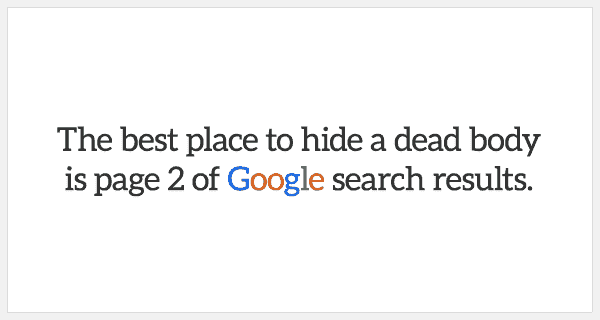
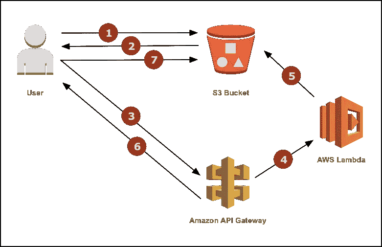
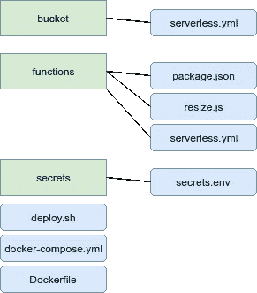
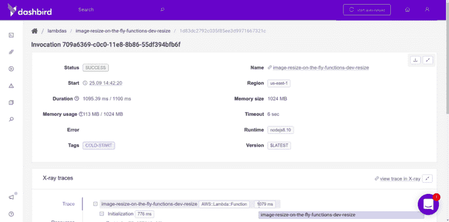
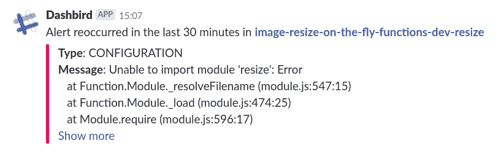
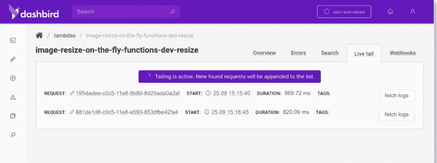

# AWS 无服务器速成班——使用 Lambda 和 S3 动态调整图像大小

> 原文：<https://medium.com/hackernoon/a-crash-course-on-serverless-with-aws-image-resize-on-the-fly-with-lambda-and-s3-850be95d5833>


自从我开始写代码以来，处理大型图像一直是我的一大苦恼。最近，它开始对页面速度和 SEO 排名产生巨大影响。如果你的网站的图片优化的很差，它在谷歌灯塔上的得分不会很高。如果评分不好，就上不了谷歌首页。太糟糕了。



# TL；速度三角形定位法(dead reckoning)

我已经构建并开源了一段代码，用一个简单的命令就可以自动创建和部署一个图像大小调整函数和一个 S3 桶。在这里查看[的代码](https://github.com/adnanrahic/serverless-docker-image-resize)。

但是如果你想跟随并学习如何自己做，继续阅读。

# 我们从哪里开始？

幸运的是，有一种方法可以毫不费力地解决糟糕的图像优化问题。今天我们将构建一个 [AWS Lambda](https://aws.amazon.com/lambda/) 函数来动态调整图像大小。

这些图像将被存储在一个 [S3](https://aws.amazon.com/s3/) 桶中，一旦被请求，就会从桶中被提供。如果您需要调整大小的版本，您将请求图像并提供高度和宽度。这将触发一个函数。它将获取现有的图像，调整其大小，将其返回到桶中，然后从桶中提供它。

这种情况下，对于给定的一组尺寸，将只调整一次图像的大小。对该大小的图像的每个后续请求都将从桶中得到服务。很酷吧？这里有个图，因为谁不爱图。



因为我已经假设你知道如何使用[无服务器框架](https://serverless.com/framework/)，并且已经了解了[无服务器](https://martinfowler.com/articles/serverless.html)、 [Docker](https://www.docker.com/) 和 [AWS](https://aws.amazon.com/) 的基础知识，所以我将立即切入要点。这是我们将要做的事情的概述。

*   创建项目结构
*   创建机密文件
*   编写 AWS Lambda 函数配置
*   写 AWS Lambda 函数源代码
*   写入 S3 存储桶配置
*   使用 Docker 部署
*   用[仪表板进行测试](https://dashbird.io/)

***注意*** *:请安装*[*Docker*](https://docs.docker.com/install/)*和* [*Docker 撰写*](https://docs.docker.com/compose/install/) *后再继续本教程。*

这里有趣的是，由于 [Sharp](https://github.com/lovell/sharp) ，我们需要使用 Docker 来部署这个服务。这个 image-resize 模块有二进制文件，需要在运行它的同一操作系统上构建。因为 AWS Lambda 运行在 Amazon Linux 上，所以在运行`sls deploy`之前，我们需要在 Amazon Linux 实例上运行`npm install`包。

有了这些，让我们来建造一些东西。

# 创建项目结构

解释这种复杂结构的最佳方式是用图像。



绿色的文件夹和蓝色的文件。查看[回购](https://github.com/adnanrahic/serverless-docker-image-resize)了解更多信息。

# 创建机密文件

我们将在 **secrets** 文件夹中创建一个`secrets.env`文件来保存我们的秘密，并在 Docker 容器启动后将它们注入其中。

```
SLS_KEY=XXX # replace with your IAM User key 
SLS_SECRET=YYY # replace with your IAM User secret 
STAGE=dev 
REGION=us-east-1 
BUCKET=images.yourdomain.com
```

***注意****:*`*deploy.sh*`*脚本将创建一个二级* `*secrets.json*` *文件，仅保存我们的 API 网关端点的域名。*

# 编写 AWS Lambda 函数配置

打开**功能**文件夹，开始创建`package.json`文件。把这个贴进去。

不需要运行任何安装，因为我们需要先运行 Docker 容器。请注意，我们正在添加一个跟踪插件来启用 [X 射线](https://aws.amazon.com/xray/)，因为它太棒了。

继续，让我们创建`serverless.yml`文件来配置我们的功能。

如你所见，我们从`env`中获取了一堆值，并允许该函数访问我们指定的`BUCKET`和一些 X 射线遥测数据。

# 写 AWS Lambda 函数源代码

现在只剩下代码了。这是我们要做的。因为图像可能会变得非常大，我们不想冒险将几兆字节加载到 lambda 函数的内存中，所以我将向您展示如何使用 [Node.js streams](https://nodejs.org/dist/latest-v8.x/docs/api/stream.html) 从 S3 流中读取图像，将其通过管道传输到 Sharp，然后再一次作为流写回 S3。

准备好了吗？让我们分两步做。首先，定义创建流所需的助手函数，然后创建 lambda 将调用的处理函数本身。

这里我们为我们的流定义常量和构造函数。值得注意的是，S3 并没有一个默认的用流写入存储的方法。所以你需要创建一个。使用`stream.PassThrough()`助手是可行的。上面的抽象将用一个流写数据，并在完成后解析一个承诺。

继续，让我们检查一下处理程序。就在上面的代码下面，把这个粘贴进去。

查询字符串参数将类似于这个`/1280x720/image.jpg`。这意味着我们通过使用正则表达式匹配从参数中获取图像尺寸。`newKey`值设置为尺寸，后跟一个`/`和图像的原始名称。这将创建一个名为`1280x720`的新文件夹，里面有图片`image.jpg`。相当酷。

一旦我们触发了流并等待解决的承诺，我们就可以注销数据并返回一个 301 重定向到桶中图像的位置。请注意，我们将在下一段中在我们的桶上启用静态网站托管。

# 写入 S3 存储桶配置

bucket 配置主要由默认的 [CloudFormation](https://aws.amazon.com/cloudformation/) 模板组成，所以如果你有点生疏，我建议你稍微复习一下。但是，它的要点很容易理解。打开**桶**文件夹，创建一个`serverless.yml`文件。

一旦我们在我们的桶上启用静态网站托管选项，它将像任何网站一样运行。这让我们可以从它提供图像，并利用 404 错误重定向规则。

如果没有找到图像，桶将触发 404，它重定向到我们的 lambda 函数。然后将原始图像的大小调整到请求的尺寸，并将其放回桶中请求它的确切路径。

就像魔法一样！

# 使用 Docker 部署

有趣的部分来了！我们将创建一个`Dockerfile`和`docker-compose.yml`文件来创建我们的 Amazon Linux 容器，并用`.env`值加载它。那很简单。困难的部分将是编写 bash 脚本来运行所有命令并部署我们的函数和 bucket。

从`Dockerfile`开始，这里是你需要添加的。

因为 Amazon Linux 相当基础，所以我们需要一开始就安装 gcc 和 Node.js。那么它就像你见过的任何 Dockerfile 文件一样简单。全局安装无服务器框架，复制源代码，在 **functions** 目录下安装 npm 模块，运行`deploy.sh`脚本。

`docker-compose.yml`文件实际上仅用于加载`.env`值。

就是这样。码头部分完成了。让我们写一些狂欢。

从简单开始，我们将定义初始变量，配置我们的无服务器安装并部署我们的功能。

一旦我们部署了它，我们需要获取 API 网关端点的域名，并将其放入一个`secrets.json`文件中，该文件将从 **bucket** 目录加载到我们的`serverless.yml`文件中。为了做到这一点，我只是做了一些正则表达式的魔术。把这个加在你`deploy.sh`的底部。

现在您在 **secrets** 目录中有了一个`secrets.json`文件。剩下的工作就是运行铲斗部署。将这个最后的片段粘贴到`deploy.sh`脚本的底部。

我们做到了！编码部分做好了。你相信我吗？我们现在只需要运行一个命令。在项目的根目录下打开一个终端窗口并运行:

```
$ docker-compose up --build
```

让它发挥它的魔力，你会看到一切都是自动创造的！请注意，终端将向您显示用于访问图像的 bucket 端点。

# 用 Dashbird 测试

最后一步是检查是否一切正常。让我们上传一张图片到桶中，这样我们就有东西可以调整大小了。去找一张你喜欢并想调整大小的图片，或者就拿这张。

它相当大，大约 6 MB。下面是您想要运行来上传它的命令。

```
$ aws s3 cp --acl public-read IMAGE s3://BUCKET
```

因此，如果您的 bucket 名称是 **images** 并且您的映像名称是**the-earth.jpg**，那么如果您从映像所在的目录运行该命令，它应该是这样的。

```
$ aws s3 cp --acl public-read the-earth.jpg s3://images
```

请记住，您需要在您的机器上安装 [AWS CLI](https://aws.amazon.com/cli/) ，或者通过 AWS 控制台上传图像。

现在，尝试通过桶请求图像。在你的浏览器中输入 S3 桶网址。

```
[http://BUCKET.s3-website.REGION.amazonaws.com/the-earth.jpg](http://BUCKET.s3-website.REGION.amazonaws.com/the-earth.jpg)
```

您将看到原始图像出现。但是，现在向 URL 添加维度。

```
[http://BUCKET.s3-website.REGION.amazonaws.com/400x400/the-earth.jpg](http://BUCKET.s3-website.REGION.amazonaws.com/400x400/the-earth.jpg)
```

这将触发 resize 函数并创建一个 400x400 像素版本的图像。创建需要几百毫秒，一旦完成，浏览器会将你重定向到新创建的图像。当您尝试刷新 URL 时，您会看到它现在正在获取新图像，而没有调用 resize 函数。

让我们检查一下[仪表盘](https://dashbird.io/features/)的日志，确保引擎盖下一切正常。



看起来不错，但是当我第一次尝试设置这个功能时，我犯了一些初学者的错误。其中之一是忘记在使用模块之前需要它。幸运的是，我立即得到了一个警报，解释了什么是错的。[懈怠警报](https://dashbird.io/docs/user-guide/alerting/)是救命稻草。



我解决这个问题的方法是使用[实时跟踪](https://dashbird.io/docs/user-guide/debugging/#live-tailing)功能。它让我在几秒钟的延迟后检查调用日志，这样我就可以调试这个问题。相当酷。



# 包扎

在结束这个简短的*show dev*会议之前，我想指出使用无服务器作为助手来支持您现有的基础设施是不可思议的。它与语言无关，并且易于使用。

[我们在 Dashbird](https://dashbird.io/team/) 使用容器集群作为我们的核心功能，这些核心功能与我们的数据库有大量交互，同时将所有其他功能卸载到 lambda 函数、队列、流和 AWS 上的其他无服务器服务。

当然，[这里是回购](https://github.com/adnanrahic/serverless-docker-image-resize)再一次，如果你想让更多人在 GitHub 上看到它，给它一颗星。如果您按照那里的说明操作，您将能够让这个映像即时调整大小微服务立即启动并运行。

如果你想阅读我以前的一些无服务器思考，请前往[我的简介](https://dev.to/adnanrahic)或[加入我的无服务器时事通讯！](https://upscri.be/b6f3d5/)

写这段开源代码片段让我兴奋不已。写文章也没那么差！希望你们喜欢读它，就像我喜欢写它一样。如果你喜欢它，拍一下那个小独角兽，这样 dev.to 上会有更多的人看到这篇文章。直到下次，保持好奇，玩得开心。

*原载于* [*dev.to*](https://dev.to/adnanrahic/a-crash-course-on-serverless-with-aws---image-resize-on-the-fly-with-lambda-and-s3-4foo) *。*